

# Formulários

 

## Formulários Hotjar

Vamos continuar com as melhorias da página da MusicDot. Abaixo, vemos todos os emails de contatos que recebemos no MusicDot.

 

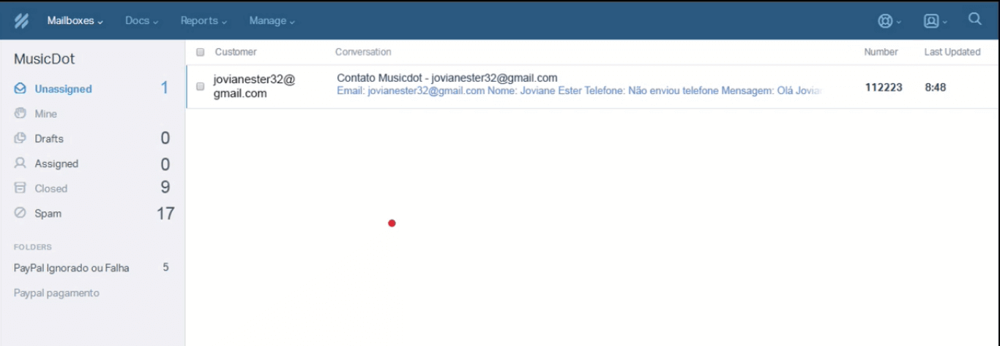

 

Os endereços de email foram fornecidos no formulário da página de contato:

 

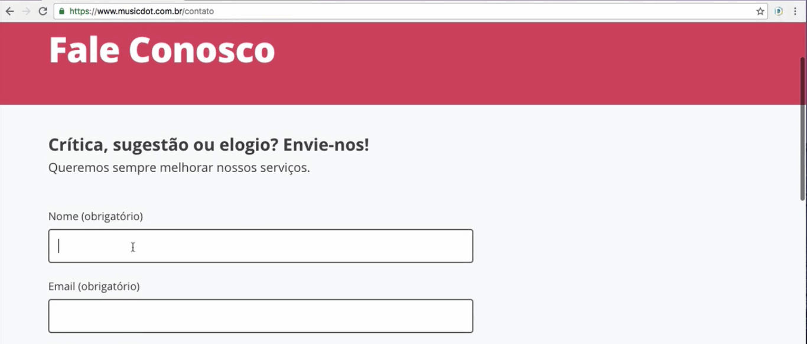

 

As mensagens enviadas são recebidas na outra plataforma. Mas observe que estão chegando poucas mensagens e várias delas foram marcadas como spam. Será que está acontecendo algo com o formulário? Ele pode estar muito extenso ou o site tem algum erro. Vamos resolver a questão com o Hotjar, que nos oferece a opção de monitorar formulários.

vamos acessar a seção "Forms" no menu lateral e depois, criaremos um novo formulário clicando no botão verde "New Form". Em seguida, selecionaremso novamente o plano "Basic" e concluiremos preenchendo os campos com dados da página que será analisada.

 

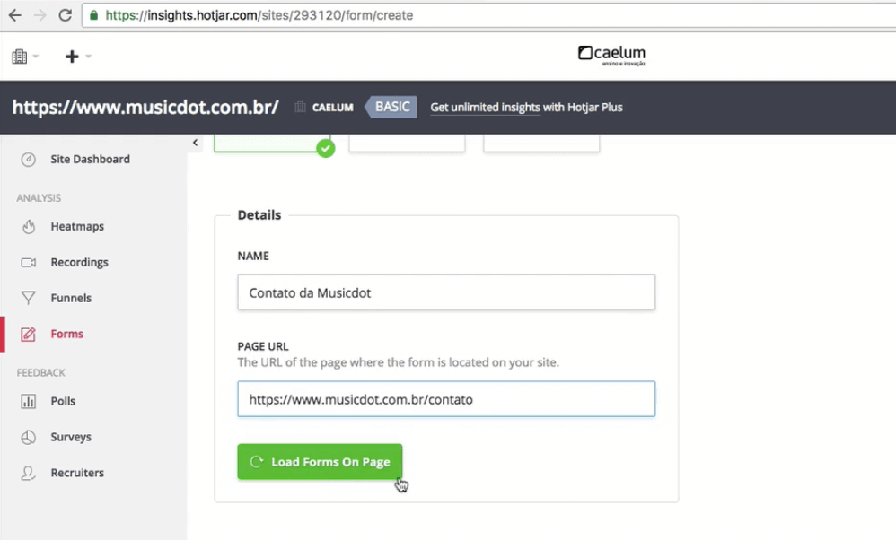

 

Após clicarmos no botão "Load forms on page", ele carregará os campos de formulário.

 

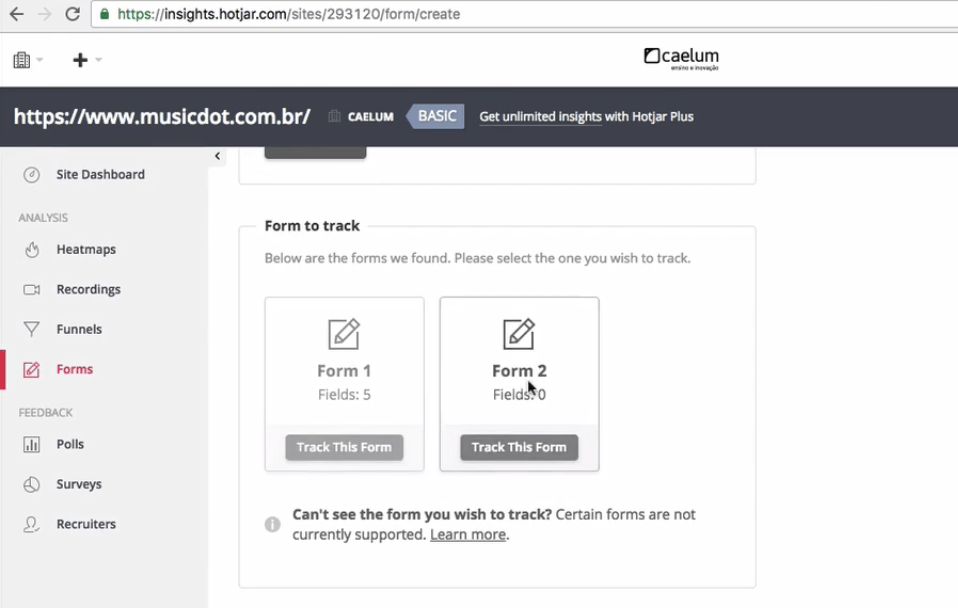

 

Ele encontrará dois formulários. Mas observe que o segundo, nos informa que tem 0 campos, deve ter ocorrido algum erro. No entanto, vemos que o primeiro formulário contem 5 campos - a quantidade de campos existentes no formulários. Iremos selecionar o primeiro, então.

Temos a opção de editar o nome dos campos à direita da página:

 

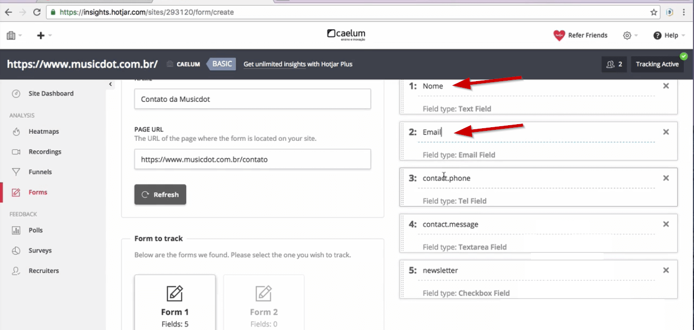

 

Com as alterações ficamos com os seguintes campos: "Nome", "Email", "Tel", "Mensagem" e "Newsletter". Agora o Hotjar começará a trackear o formulário. Para finalizar, clicaremos no botão "Create Form".

 

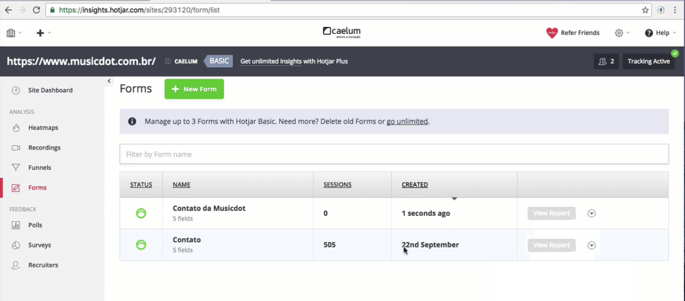

 

Temos um formulário criado no dia 22 de setembro de 2016. Mais adiante, vamos ver os dados que ele apresenta.

 

## Analisando Form Hotjar

Vemos no painel que `500` pessoas acessaram o formulário.

 

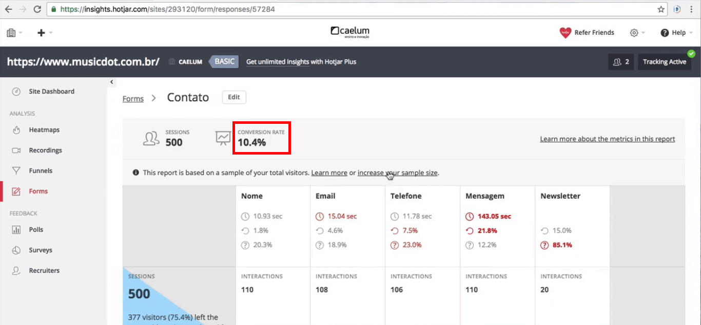

 

Tivemos uma taxa de conversão de `10%`- um número bem elevado. Mas em compensação, quando rolamos a página, descobrimos que 75% dos usuários não interagem com os campos do formulário.

 

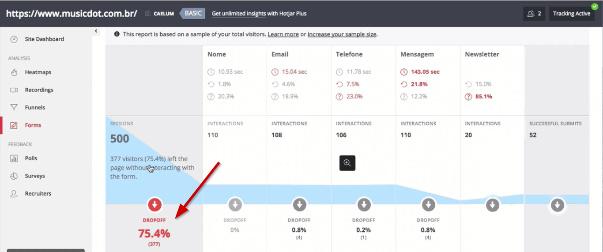

 

A razão para que as pessoas não preencham o formulários podem ser diversas. Às vezes ele caiu sem querer na página ou pode ter mudado de ideia. Vamos analisar os dados e tentar descobrir o motivo.

O Hotjar é uma ferramenta tão completa que nos mostra até quanto tempo os usuários demoram preenchendo cada campo. No campo "Nome", as pessoas demoraram em média `11` segundos preenchendo, `2%` tiveram que repreencher o dado e `20%` deixaram em branco.

 

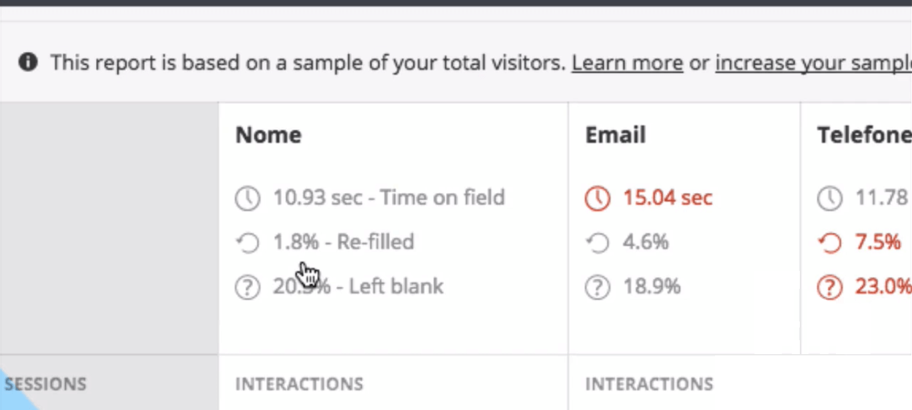

 

No campo "Email", os usuários demoraram `15` segundos para digitarem o e-mail, quase `5%` redigitaram e `20%` resolveram deixar em branco. No entanto, precisamos do e-mail para responder a mensagem (ou pelo menos, um telefone...). E mesmo assim, temos a porcentagem `23%` dos usuários que não informaram o telefone. Sem o endereço de e-mail ou telefone, como faremos para responder a mensagem?

Continuaremos com a nossa análise. O Hotjar nos mostra um gráfico que se afunila à direita, nos sinalizando quais campos o usuário está deixando de preencher. As pessoas demoram mais de `140` segundos para preencher a mensagem e `12,2%` deixam o campo em branco. Mas é a Newsletter que tem a maior desistência, provavelmente por medo de receber spam. Vemos também aqui a falha de submits: cerca de `30%`. Verificamos com a equipe de Dev o que poderia estar acontecendo e ele disseram que o site não tem problemas.

Vamos testar preencher o formulário.

 

 

Observe que quando tentamos submeter o formulário, mas deixamos um campo obrigatório em branco, não exibe a mensagem `Please fill out this field`. E se o seu usuário não souber falar inglês? A validação do e-mail é feita no sistema operacional. Mas e se não estivermos usando o nosso computador e o sistema operacional for em inglês? Se traduzirmos a mensagem para o português, ela nos pede para preenchermos o campo. Tentaremos melhorar o microtexto, porque não apela para as esferas emocionais. Vamos incluir uma mensagem mais carinhosa: `Precisamos do seu e-mail para responder sua mensagem`.

 

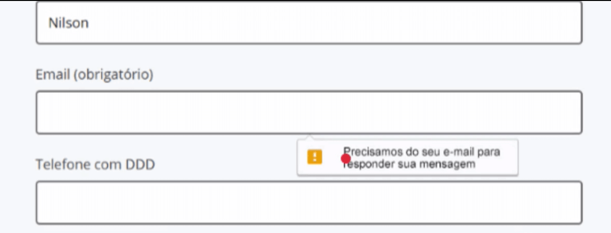

 

Às vezes o seu usuário não quer um vínculo com a empresa, mas não pensa que é necessário informar um e-mail para a mensagem ser respondida.

Esta é a parte de formulários do Hotjar.

 

## Uxtools performance

Existem outras ferramentas de monitoramento além do Hotjar. O [Inspectlet](https://www.inspectlet.com/?gclid=CKOysoCc6NICFQ8FkQodUxUJiA).

 

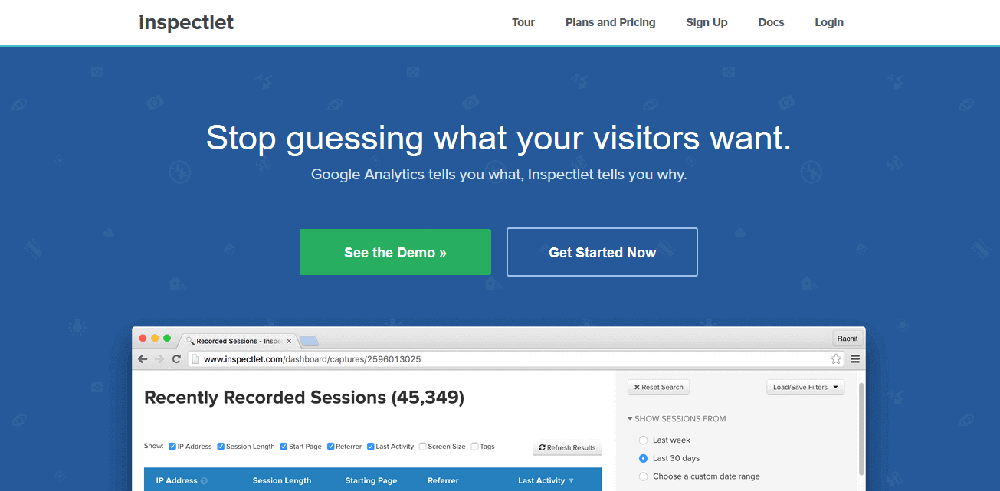

 

Existe também o [Crazyegg](https://www.inspectlet.com/?gclid=CKOysoCc6NICFQ8FkQodUxUJiA).

 

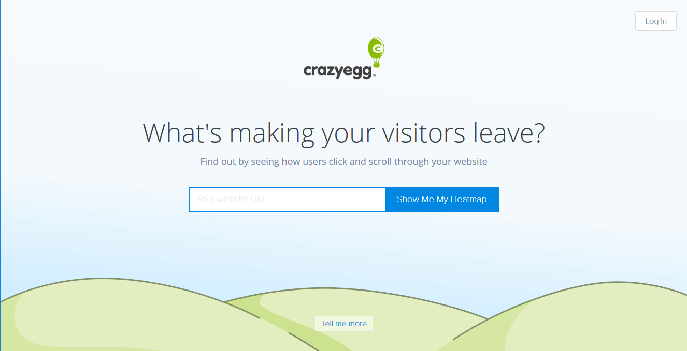

 

Os dois são bem fáceis de instalar, mas não precisamos instalar todas as ferramentas. Será que precisamos memorizar os benefícios de cada ferramenta para compará-las? Não, para isto acessaremos o [UX Tools](https://uxtools.co/tools).

 

 

Nós acessaremos a seção de [monitoramento](https://uxtools.co/tools/design/#/monitoring).

 

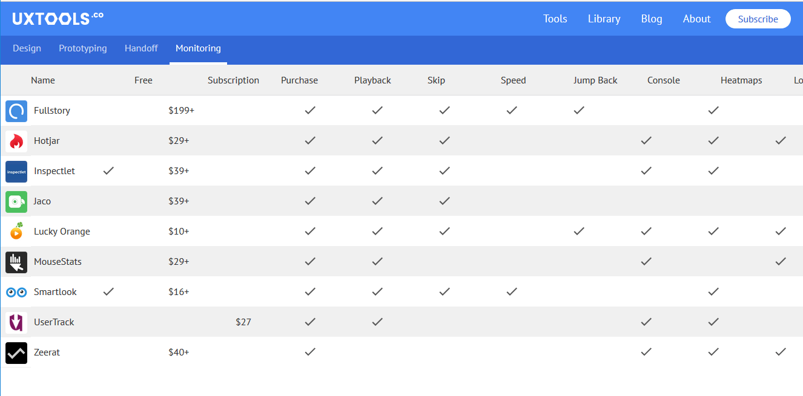

 

Ele faz comparações de preço e funcionalidade oferecidas por cada ferramenta, como gravação de tela, mapas de calor e a parte de formulários. O Crazy Eggs não está listado aqui, mas eles disponibilizaram outras ferramentas.

No entanto, como falamos anteriormente, não vale a pena adicionar todas elas na sua página. Ao adicionarmos o código JavaScript de cada uma delas, podemos comprometer a performance do nosso site. Se utilizarmos o "Inspect" e acessarmos a aba "Network" da página, descobriremos que rodam três scripts do Hotjar no código e isso impacta quase 1 segundo na performance do site.

 

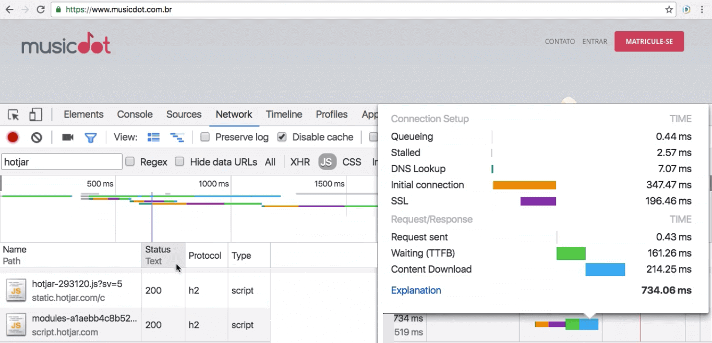

 

Se adicionamos as outras ferramentas, podemos comprometer ainda mais a performance. E a performance influi na percepção do usuário. Se o carregamento da página é lento, o usuário vai achar o site ruim. Isto pode atrapalhar na análise da UX.

> Se achar que existem melhores opções, você tem a liberdade de testar outras ferramentas de monitoramento. O Hotjar foi recomendado por oferecer vários recursos em sua versão gratuita, mas você pode utilizar outras ferramentas que melhor se adaptem as suas necessidades.

 

## [Exercício] Formulários 

Monitorar como anda o envio dos formulários da sua empresa é interessante para:

- [x] A) ver quais campos o usuário está deixando em branco 
    > Interessante para analisar a possibilidade de se retirar um campo que os usuários não querem preencher. Desde que isso não prejudique alguma regra de negócio

- [x] B) saber quais campos estão sendo corrigidos demasiadamente 
    > Muitas incertezas podem levar o usuário a repreencher o campo diversas vezes, como um campo de “mensagem”

- [ ] C) ver quanto estamos ganhando financeiramente 
    > Não necessariamente o envio de um formulário está ligado ao retorno financeiro.

- [x] D) analisar a taxa de conversão 
    > Das pessoas que caem na página, quantas estão preenchendo o formulário

- [x] E) saber quais campos estão levando muito tempo para serem preenchidos
    > Interessante para dar uma ideia do motivo do usuário levar tanto tempo para preencher um campo, por exemplo

 

## [Exercício] Várias ferramentas

O Hotjar é uma excelente ferramenta, mas ele não possui alguns recursos, mesmo básicos como retroceder a gravação das telas em alguns segundos.

Nessa situação poderíamos instalar diversas ferramentas para complementar o Hotjar.

Qual o problema disso?

- [ ] A) Todas ferramentas são incompatíveis entre si 
    > São apenas alguns códigos JavaScripts colocados na página

- [x] B) Há um impacto de performance 
    > Vários scripts, mais requisições, mais tempo para carregar o site por completo

- [ ] C) O custo é muito alto 
    > Muitas dessas ferramentas possuem versões de avaliação

- [ ] D) É impossível colocar várias no mesmo site 
    > Da mesma forma que podemos chamar vários scripts na mesma página, também podemos colocar várias dessas ferramentas na mesma página também

Como vimos em vídeo, há impacto na velocidade do site, o que poderia fazer com que o usuário abandone o site caso perceba essa queda na velocidade.

 

## [Artigo] Projetando formulários melhores

Há diversos artigos que dão dicas de como melhorar o aspecto estético e funcional de formulários. Um que se destaca é o do [uxdesign.cc](https://uxdesign.cc):

[Design Better Forms - Common mistakes designers make and how to fix them](https://uxdesign.cc/design-better-forms-96fadca0f49c#.wif089p51)