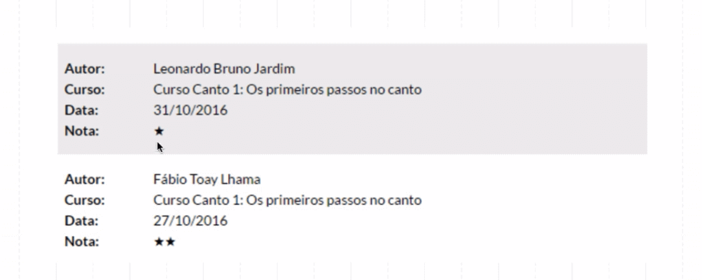
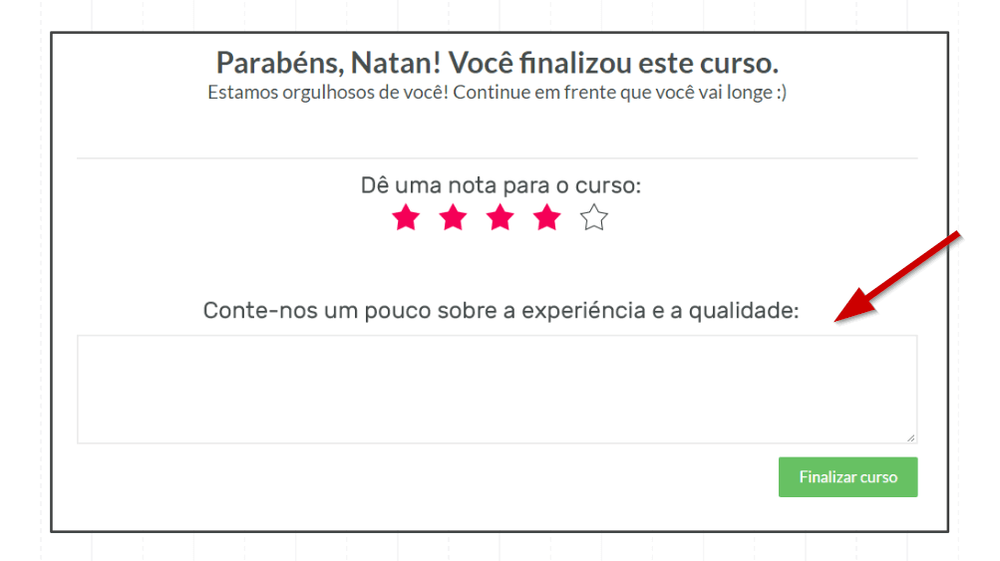
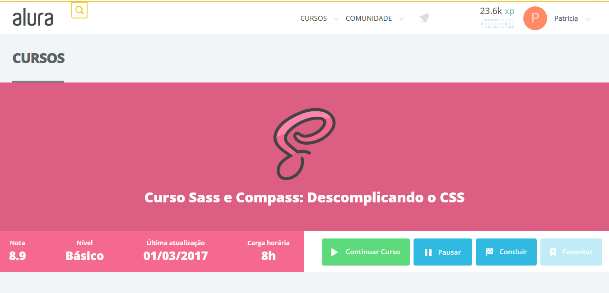
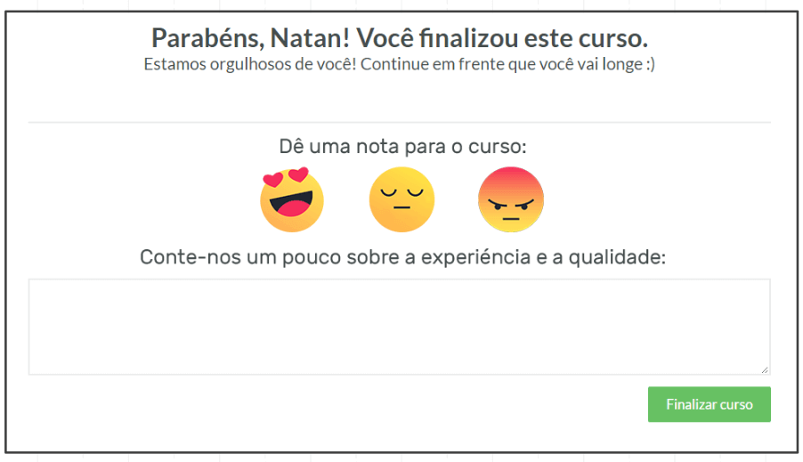
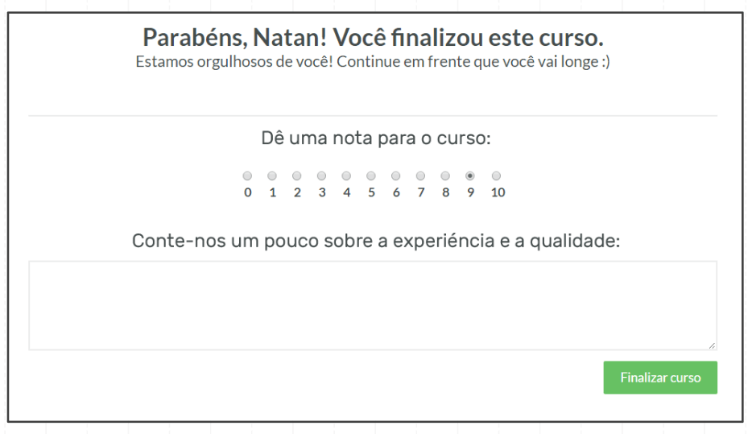
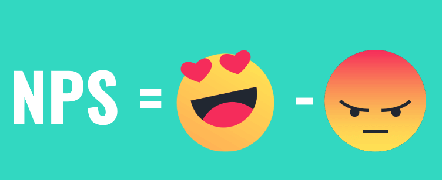
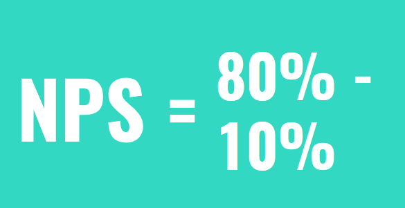

# Feedback

 

## Nota para os cursos

Você deve ser bastante cuidadoso para que o seu site não tenha um carregamento lento, devido à instalação de diversas ferramentas. Em seguida, continuaremos melhorando a experiência da plataforma MusicDot. Acessaremos a página do [Curso de Canto](https://www.musicdot.com.br/curso-online-canto-iniciante-primeiros-passos).

 

 

Veremos se as pessoas estão gostando do curso - lembrando que estamos fazendo design pensando no usuário. Vamos considerar a viabilidade do negócio, mas nosso foco com UXer é o usuário. E como saberemos se o curso está indo bem ou mal? Uma forma simples é termos o feedback do usuário.

 

 

Após o aluno avaliar o curso, selecionando a quantidade de "estrelinhas", basta clicar no botão "Finalizar curso". Depois, faremos uma média do resultado obtido das avaliações. Porém, temos formas de analisar avaliações com resultados particulares que não correspondem a média.

 

 

Vemos que o aluno "Leonardo" avaliou o curso com `1` estrela e o "Fábio" com `2`. Mas como entender se o curso tem algum problemas com estas pontuações baixas, considerando que o nosso objetivo é melhorar a qualidade do curso.

Uma opção mais trabalhosa é ligar para os alunos e perguntar pessoalmente qual é a opinião deles. No entanto, esta pode ser uma escolha um pouco invasiva. Uma opção mais sutil é enviarmos uma e-mail, mas uma solução mais rápida seria adicionarmos um `<textarea>`, incluindo um espaço para o aluno comentar sobre a experiência com o curso.

 

 

Em casos como uma avaliação de `1` estrela, o aluno terá espaço para explicar se algo o desagradou. Ainda veremos vários pontos para melhorar a experiência do usuário, mas já vimos um ponto importante. Não adianta considerarmos a média do curso e ignorarmos o porquê de alguém dar uma nota baixa. Este é um recurso interessante para obtermos o feedback do usuário. Porém, não é válido tornar o campo de texto obrigatório. Se forçarmos o aluno a dar a sua opinião, ele poderá nos fornecer apenas informações irrelevantes. Se o usuário responder só "bom" ou "Ok", não será de grande ajuda.

 

## NPS (Net Promoter Score)

Para continuarmos com as melhorias da experiência do usuário, usaremos outro exemplo: a plataforma da Alura. Vamos ver como está o curso de [Sass](https://cursos.alura.com.br/course/sass).

 

 

Nós vimos anteriormente que é interessante perguntar para o usuário o que ele achou do curso ou da plataforma. No caso do curso de Sass, a média das notas é `8,9`. Mas será que está nota nos dará ideias novas de como melhorar o produto? Vimos a situação em que várias pessoas deram `10`, mas uma pessoa avaliou como `0`... O que fez um aluno não gostar nada do curso? É este tipo de informação que queremos levantar. Mesmo que a maior parte dos alunos elogiem e recomendem o curso, se uma pessoa não gostou, ele pode denegrir a imagem do produto.

Temos que ser cautelosos com os usuários que tem opiniões ruins sobre a marca - conhecidos como **detratores**. Um exemplo são os sites de buscas por hotéis, que nos permitem ver a opinião dos usuários, tanto boas como as ruins. Quando vemos algum usuário fazendo um comentário negativo sobre os hotéis, já ficamos desconfiados.

Da mesma forma, precisamos conhecer a opinião das pessoas que falam bem sobre a nossa marca - os **promotores**. Serão estes usuários que defenderão o produto quando escutarem alguém difamá-lo. Mas existem diferentes níveis de satisfação da marca. Existem também as pessoas que estão num ponto neutro de satisfação... Eles até gostaram do produto, mas não a ponto de defendê-lo.

Vamos encontrar os diferente perfis de usuário: haverá o que odeia, o que ficou neutro e o que amou o **profundamente** o curso. Então, é uma boa opção criarmos uma avaliação que nos ajude a identificar em qual dos perfis o nosso usuário se encaixa?

 

 

Isto acaba tornando muito subjetiva a avaliação. Talvez, uma opção melhor seria adotarmos uma nota numérica.

 

 

O nosso objetivo com a métrica é conseguir identificar quem são os promotores.

 

 

O termo em inglês usado para fazer referência a esses indivíduos é *Net Promoter Score*, conhecida pela famosa sigla **NPS**. Trata-se de uma métrica com que medimos a satisfação dos nossos clientes e identificamos se eles estão do nosso produto ou serviço. Para fazermos este cálculo, não precisamos ser especialistas. Nós precisamos saber a porcentagem dos usuários que são os *promoters* e descontar a diferença com a porcentagem daqueles que estão falando mal.

 

 

> Net Promoter Score = % CLIENTES 
> PROMOTORES – % CLIENTES 
> DETRATORES = %NPS.

Vamos subtrair a quantidade de detratores, das pessoas que falam bem do seu produto. Porém, precisamos definir o que consideramos "falar bem"...Quando a métrica do NPS foi criada, eles imaginaram que quem gostou do produto avaliará a experiência com a nota `10` ou `9`. Já uma nota `8` ou `7`, foi considerada uma nota de quem não achou o produto insubstituível. E as demais notas, de `0` a `6`, seria a avaliação daqueles que não gostaram do nosso produto e podem compartilhar uma opinião negativa a respeito dele.

Vamos ver um teste com valores hipotéticos. Imagine que o curso de canto teve `80%` de promoters e `10%` de detratores.

 

 

No caso, o nosso NPS foi de **70%**. Mas devemos ressaltar que o NPS é uma métrica interessante para fazer comparações internas na sua empresa, mas é complicado usá-la para fazer comparações entre empresas. Por exemplo, no caso das empresas de telefonia, algumas têm o NPS negativo. Ou seja, tem mais usuários falando mal do que bem. Temos a opção de fazer este tipo de comparação entre empresas do mesmo setor, mas não é recomendável porque elas podem considerar critérios diferentes.

De qualquer forma, é interessante acompanhar a métrica de tempos em tempos. É válido para identificarmos se novos problemas não surgirão com o tempo. Assim como não podemos confiar que o NPS continuará com a porcentagem de 70%, por exemplo. E nos casos em que o produto tem um NPS baixo, o que a sua empresa deve fazer? Com o acompanhamento dos valores do NPS, tente identificar os pontos que precisam ser melhorados, e planeje ações como agilizar a performance do seu site, ou focar na usabilidade do aplicativo e observe se a porcentagem começará a subir. Com um NPS de `70%``, você consegue divulgar melhor o produto ao mostrar que houve um aumento na quantidade de promotores.

 

## [Exercício] Feedback

Há diversas formas para saber como o usuário está se sentindo com relação ao nosso produto/serviço, como entrar em contato ou mesmo pedindo para ele dar um feedback.

Por qual(is) motivo(s) é interessante ter essa informação?

- [ ] A) Continuar fazendo o que acertamos 
    Isso é mais alternativos

- [ ] B) Saber quais que eram suas expectativas 
    Isso é mais alternativos

- [x] C) Todas as alternativas 
    Correto

- [ ] D) Entender o que deu errado 
    Isso é mais alternativos

O feedback do usuário é a principal fonte de informações que temos sobre seu comportamento e expectativas.

Podemos ver onde estamos errando e pensar em ações para corrigir esses erros. E claro, continuar acertando o que está dando certo.

 

## NPS - Net Promoter Score

Por qual(is) motivo(s) o NPS é mais interessante frente a média normal, quando pensamos em lealdade e satisfação do usuário?

- [x] A) Conseguimos medir os usuários detractor 
    Ou detratores

- [x] B) Conseguimos medir os usuários promoters 
    Ou promovedores

- [x] C) Conseguimos medir os usuários neutros 
    Aqueles que são indiferentes quanto ao produto/serviço

- [ ] D) Conseguirmos medir a usabilidade 
    Para isso deveríamos fazer um teste de usabilidade.

- [x] E) Conseguirmos medir a usabilidade 
    NPS é interessante como métrica, mas os insights vem desse campo

Outro ponto, porém com um aspecto mais cultural, é que a empresa pode ter a cultura centrada no usuário.

Tanto empresa quanto usuário podem ganhar muito com isso.

 

## Promoters

Quais notas, segundo a métrica NPS, são as que os promovedores (promoters) dão para a pergunta de “Qual é a chance de que você recomendar este produto/serviço a um amigo ou parente?”

- [ ] A) 0 a 6 
    Essas notas são os detratores

- [ ] B) 7 a 10 
    Não existe esse range no NPS

- [x] C) 9 e 10 
    Segundo a métrica, somente usuários promovedores dão essas notas

- [ ] D) 7 e 8 
    Segundo a métrica, essas notas são os neutros

Mesmo com um alto NPS, é recomendável se atentar aos feedbacks dos usuários, principalmente dos detratores, para melhorar cada vez mais seu produto/serviço.
