

  
  # Features
  

 

## Pensando nas funcionalidades

Vimos que existe o MVP e o MLP. Quais as *features* que devemos realizar, e como priorizá-las? Uma funcionalidade bacana que existe no site da Alura, por exemplo, é o campo de busca:

 

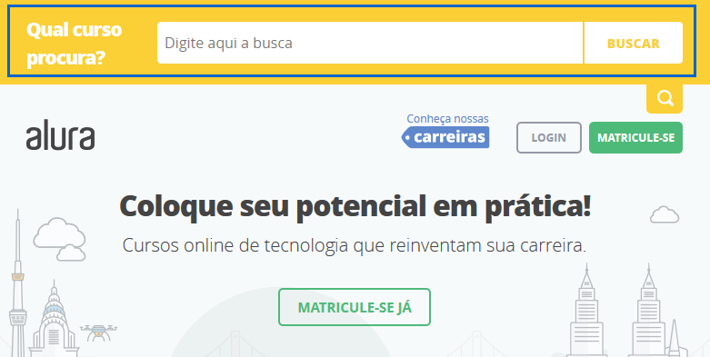

 

As *features* estão diretamente relacionadas ao usuário, e as funcionalidades deveriam estar ligadas a algum objetivo ou necessidade das pessoas que utilizarão nosso aplicativo. Como já materializamos a persona, já temos os objetivos do usuário, mas se você não criou isso pode explorar a narrativa que construímos para obter essas informações.

Separamos três objetivos daqueles que tínhamos construído para a persona: arrumar companhia para viajar, economizar dinheiro e conhecer lugares diferentes. Nosso produto deve ter alguma funcionalidade (ou um conjunto de deles) que atenda a cada um desses objetivos.

A descrição das funcionalidades devem ser breves e simples, como "achar grupos". E para que nosso usuário os encontre, é preciso inicialmente, criá-los. Sendo assim, "criar grupos" também é feature! Teremos o seguinte:

 

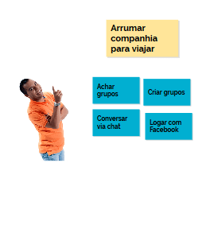

 

Outros exemplos seriam "Conversar via chat" e "Logar com Facebook".

Por que conversar via chat? Faz sentido para o nosso usuário, Fabiano Gusmão? Lembra-se da ideia de segurança? Às vezes o Fabiano pode não confiar em conectar-se usando o login do Facebook, conclusão a que chegamos através de pesquisas realizadas.

Outro objetivo consiste em economizar dinheiro! Como fazemos isso? Por meio da funcionalidade de pesquisa de hotéis baratos e filtrar pelo preço, ou "localizar restaurantes próximos" e "pesquisar passeios que não estejam muito longe". Outras opções são "alerta de passagens com descontos" e "localizar lugares para comprar lembrancinhas legais e baratas".

Vamos partir para o terceiro objetivo, de conhecer lugares diferentes. Você consegue pensar em algo que possa auxiliar Fabiano Gusmão a alcançar esse objetivo? Podem haver sugestões de destinos quando a pessoa abre o aplicativo, a possibilidade de fazer tour pela cidade. Outras funcionalidades seriam *Reviews, Ranking*, recomendações de agências de turismo confiáveis e lista de roteiros.

É possível montar esse **Kanban** utilizando a foto do nosso usuário.

 

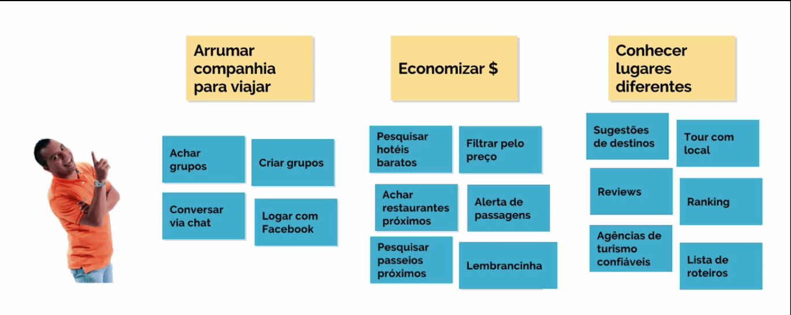

 

Seu projeto tem diversas personas e *proto-personas*? Você pode usar a mesma construção do *Kanban*, relacionando os objetivos com as funcionalidades específicas para elas. Porém, se as pessoas não têm objetivos em comum, não tem jeito mesmo - será necessário traçar objetivos separados. Neste caso, simplificaremos o esquema:

 

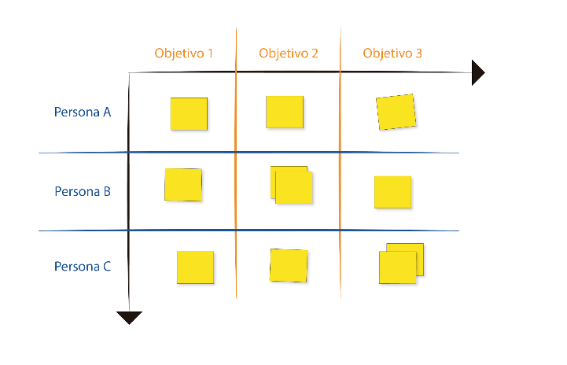

 

Na primeira coluna há as distintas personas, e na primeira linha os diferentes objetivos. E nos lugares onde estão os post its, preencheremos com as funcionalidades pensadas coletivamente. Uma dica é colocar de 3 a 4 objetivos, e a mesma quantidade para personas, caso contrário acabam sendo informações demais, tornando o esquema confuso.

Feito isto, dentre as features que colocamos, qual será a mais importante, a ser priorizada para o usuário? Lembra-se que o problema principal era "Arrumar companhia para viajar"? Dessa maneira, priorizaremos esse objetivo, relacionando-o a três funcionalidades.

Para auxiliar na tomada de decisões, utilizaremos a técnica que vimos em Fundamentos da Experiência do Usuário, a **Zen voting**. Para essa estratégia cada membro do time ganha três etiquetas, a serem distribuídas em cima das funcionalidades que julga que devam ser priorizadas.

Além disto, você pode utilizar etiquetas de cores diferentes para indicar o que achamos que não é importante para o usuário. Colocar um adesivo de uma segunda cor com essa estratégia é algo opcional.

 

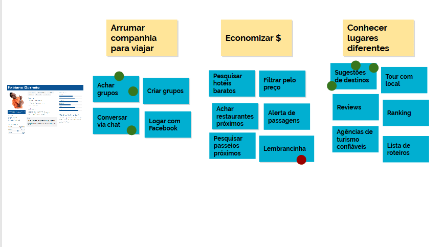

 

Agora, para praticar, vamos pensar nas features do negócio:

+ Tempo: máximo de 20 minutos.
+ Ambiente: flip-chart, canetas, post its, personas e etiquetas.
+ Objetivo: organizar as features de acordo com as personas e seus objetivos.

 

## Esforço e valor

Já vimos como decidir as prioridades de *features*. Agora, imagine a situação do cliente observando o que fizemos e dizendo que a prioridade deveria ser a lembrancinha, justamente o que contém a etiqueta que sinaliza quando algo não é bom para o usuário.

Por que será que o cliente pede que justamente essa funcionalidade seja priorizada? O cliente possui uma visão que é diferente da nossa, normalmente mais voltada para os negócios em si. Podemos questionar o cliente de uma maneira diferente, dizendo por exemplo: "Entre a funcionalidade, criar grupos ou pesquisar hotéis, qual é a mais importante?"

Dessa maneira vamos nos aproximando de um denominador comum junto ao cliente, o qual pode achar que "criar grupos" e "achar restaurantes próximos" são as funcionalidades mais importantes. Diante disso, qual será a prioridade, pensando nos negócios?

Podemos propor ao cliente que ele pense nas features em termos de alta, muito alta e altíssima prioridade. Deste modo, o cliente deverá pensar nesses termos de prioridade para gerar valor ao produto.

O ideal é que pensemos em termos de experiência do usuário, e nesse momento de priorização, precisaremos defender o usuário e o que é importante para ele. Além do usuário, também levaremos em conta os custos e a capacidade de realizar determinadas tarefas. Lembrou-se de algo?

Tem a ver com o **360 View** e o **Triângulo de Keeley** - precisaremos pensar no usuário em termos de desejabilidade, na economia que será gerada pelas features e, ainda, no tempo despendido para elaborar cada item priorizado. O tempo gasto deve ser decidido em time, bem como a definição do esforço técnico de cada funcionalidade.

Pensamos em tudo isso para desenvolver o MVP.

 

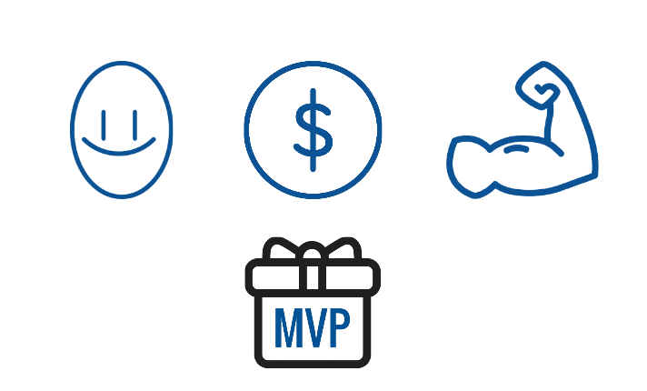

 

Ou, se preferirmos, o MLP.

 

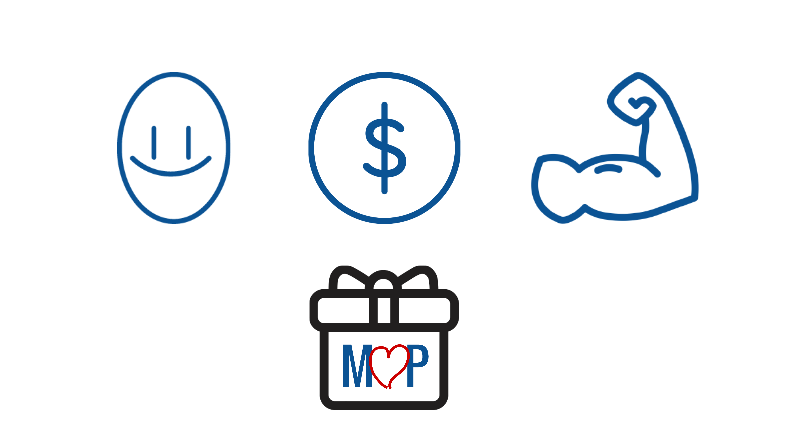

 

Com isso o usuário ficará feliz, nós ganharemos dinheiro e tudo será feito no menor espaço de tempo possível. Então, é preciso priorizar o que for feito de acordo com os desejos do usuário, em relação ao negócio e também com o esforço técnico. E já que para essa etapa não é necessário pensar nos objetivos, podemos retirá-los.

Vamos nos preocupar primeiramente com o negócio: qual é a importância dessas features em relação a ele?

Podemos colocar uma escala de importância das *features* para o negócio, e outra para o esforço técnico. Montaremos um gráfico e distribuiremos as *features* nele, de acordo com a prioridade:

 

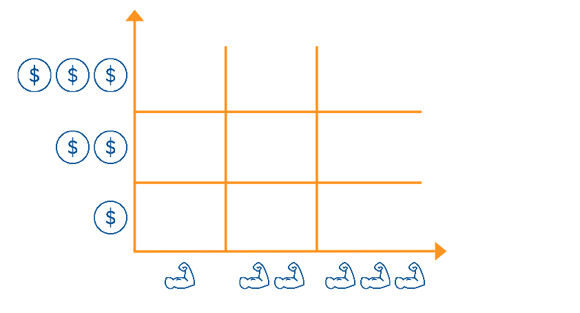

 

Caso esteja realizando essa dinâmica em grupo, uma pessoa pegará uma feature, posicionando-a onde achar mais adequado. Feito isso pode ocorrer uma discussão para ver se este será seu lugar definitivo.

Tendo estabelecida a relação prática entre usuário, o valor do negócio e a capacidade, lembra-se de que tínhamos sugerido o gráfico como mecanismo de priorização? Neste gráfico nossa equipe colocou diversos post its:

 

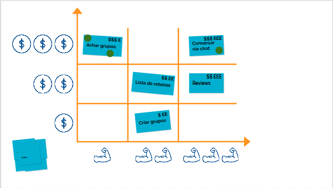

 

E pensando no valor do negócio, bem como do esforço técnico, vamos fazer um gamestorming:

+ Tempo: 30 minutos.
+ Ambiente: flip-chart, canetas, features criadas anteriormente.
+ Objetivo: categorizar features levando em consideração o esforço técnico e valor para negócio.

 

## Canvas MVP

Para sabermos qual destas funcionalidades deve ser priorizada, vamos separá-las tentando focar no maior objetivo do usuário, que em nosso caso é "arrumar companhia para viajar". Encontrar grupos, portanto, é primordial! Mas como o usuário encontrará um grupo se eles ainda não existem? Assim, definimos que é essencial criarmos os grupos.

 

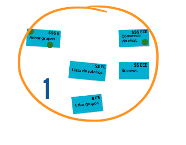

 

Essa será a primeira versão do MVP, sendo que o restante das funcionalidade poderiam ser um segundo MVP, entretanto, o esforço técnico concentrado nas demais tarefas soma oito "E"s. Isto é, demoraremos cerca de 50% de tempo a mais para finalizar este MVP.

Diante disso, é melhor separarmos as funcionalidades - o "Conversar via chat" ficará de fora desse segundo MVP, em que teremos apenas o "Lista roteiros" e os "Reviews". Dessa forma, o "Conversar via chat" será o terceiro MVP.

E se quisermos incluir as demais funcionalidades que tínhamos? Como não podemos colocá-las dentro de um terceiro círculo, teremos que criar outros. Portanto, podemos pensar, na verdade, em outra maneira de representação, que é utilizando o Canvas como se fossem ondas:

 

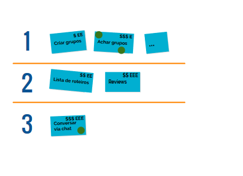

 

Na primeira versão que lançaremos para aumentar o foco do MVP criamos uma regra: nessa etapa devem existir no **máximo** 3 funcionalidades que conversem entre si. Por exemplo, de nada adianta colocar "achar grupos" na primeira MVP e o "criar grupos" na segunda, pois essas funcionalidades são dependentes.

Caso deseje, pode-se colocar um valor mínimo. Na primeira onda, somando-se as funcionalidades, há 4 cifrões, então quando for colocado um valor mínimo será difícil que uma MVP tenha valor baixo para o negócio. Desse modo evitamos criar versões do aplicativo que não gerem valor ao negócio.

Outra possibilidade é colocarmos um máximo de esforço técnico, pois se tivermos um esforço técnico muito grande envolvido, demorará muito para essa versão ser desenvolvida, e isso talvez não valha a pena. Esse Canvas com o formato em ondas é o que denominamos ***Canvas MVP***. Repare que é possível criar sua versão das regras. Por ser uma ferramenta, ela é moldável ao seu negócio.

Chegou o momento de fazer o último gamestorming desse curso:

+ Tempo: máximo de 15 minutos.
+ Ambiente: flip-chart, canetas, features.
+ Objetivo: organizar as funcionalidades baseando-se nas versões do MVP.

 

## Mapa geral do curso / resumo

Vamos fazer um breve apanhado das ferramentas e passos realizados:

 

## Triângulo de Keeley e 360 View

São ferramentas que auxiliam na criação e organização das ideias, sendo possível separá-las entre desejabilidade, capacidade e viabilidade. A desejabilidade envolve o que é bom ou não para o usuário, a capacidade implica em conseguirmos fazer algo efetivamente, e a viabilidade tem a ver com isto tudo gerar algum tipo de economia.

Lembrando que sempre devemos pensar na experiência do usuário.

 

## Proto-persona

É um protótipo do usuário, e serve para torná-lo mais próximo da nossa equipe.

 

## Pesquisa

Nos ajuda a validar a proto-persona que criamos, e um dos métodos abordados foi a entrevista. Nesse momento é importante termos empatia e nos colocarmos no lugar do outro, o que é diferente de simpatia.

 

## Persona

Também é um protótipo do usuário, com diversas informações: objetivos de vida, frases motivacionais, marcas, traços de personalidade, foto, entre outros. A ideia da *persona* e da *proto-persona* é realmente deixar você e sua equipe o mais próximo do usuário.

Adquirir empatia não é fácil, e talvez ajude se tentarmos desenvolvê-la usando uma ficha de papel, com as seguintes ferramentas:

+ O mapa de empatia

+ *Value Proposition Canvas*: essa ideia quer deixar claro o valor 
que está sendo gerado em cada funcionalidade que elaboramos.

 

## Cenário

É uma espécie de protótipo textual tendo em mente o modelo mental do usuário, a forma como ele enxerga o mundo.

 

## Histórias de Usuário

São muito utilizadas, basicamente, em equipes de desenvolvimento que usam os princípios de agilidade para desenvolver um software.

 

## MVP ou MLP

O MVP, Produto Mínimo Viável, é o que possibilita que nosso aplicativo comece a nos dar retornos o mais rápido possível. Uma variável do MVP é o MLP, o Produto Mínimo Adorável, através do qual buscamos causar impacto na vida das pessoas. Exemplos: Uber, Waze.

 

## UX Canvas

Depois do MVP é preciso encontrar uma forma de balancearmos os requisitos do cliente com as necessidades do usuário, e por isso usamos essa ferramenta que visa unir os objetivos de ambos os lados.

 

## Como surgem as ideias?

Lidando com os objetivos do usuário e os destrinchando em diversas funcionalidades que talvez ajudem a cumprir tais objetivos, ou pelo menos a chegar próximo deles.

 

## Categorizando as features

Feito isso, acabamos categorizando as funcionalidades de acordo com o usuário e o valor para o negócio, o que implica não apenas no ganho monetário, mas também no impedimento da saída do mesmo.

 

## Canvas MVP

Como separamos as funcionalidades no que diz respeito às suas prioridades? Utilizando essa ferramenta que é a Canvas MVP, com a qual podemos determinar alguns mínimos e máximos em relação ao esforço físico e valor do negócio.

Observe a quantidade de informações e ferramentas que aprendemos ao longo desse curso. Claro que não é obrigatório passar por todos estes passos para lançar um aplicativo. No fim das contas, cabe a você e sua equipe decidir o que é melhor para o aplicativo em desenvolvimento. Essa parte de estratégias e requisitos é realmente uma parte mais abstrata da UX, pois não vemos nem desenhos ou telas...

 

## Objetivos do usuário

Quando usamos um aplicativo como o Waze temos sempre um objetivo por trás disso. Nesse caso fugir do trânsito, por exemplo.

Em nossos projetos, os objetivos podem ser tirados da persona ou proto-persona.

Os objetivos podem ser os mesmos objetivos citados na persona, podendo estes serem usados como base para idealização de outros objetivos relacionados.

É importante que antes dessa etapa, tenhamos validado a persona, a fim de não tomar decisões erradas.

 

## [Exercício] Detalhes da funcionalidade

Materializamos o usuário com a proto-persona, validamos suas informações com potenciais usuários de nosso projeto, agora temos que pensar nas features do app.

Pensando no detalhamento das features, qual alternativa abaixo muitas vezes **não é uma boa opção**, nessa etapa?

Alternativa correta

- [ ] Rápida
- [ ] Direta
- [ ] Breve
- [ ] Simples
- [x] Bem detalhada e complexa

Features muito complexas muitas vezes acabam tendo outras features como dependências, dificultando a estimativa de prazo de entrega e valor para o negócio. Outro caso possível é que ao detalhar muito, acabamos tendo uma feature com muita responsabilidade, que poderia ter sido quebrada em outras features.

Nessa etapa, tente ser breve. Uma boa meta é mostrar a ideia para alguém que não está a par do projeto, e esse alguém ter uma ideia do que quer dizer aquilo.

 

## [Exercício] Importância para o negócio

Em uma reunião com seu cliente, você pede para ele priorizar as funcionalidades que no entendimento **dele**, são mais importantes.

Qual das alternativas abaixo é uma maneira **não muito interessante** para essa priorização com relação ao grau de importância?

- [x] Baixa, média, alta
- [ ] Muito alta, altíssima, extremamente alta
- [ ] Importante, muito importante, importantíssima
- [ ] Alta, muito alta, altíssima

Seu cliente provavelmente não dirá que uma funcionalidade do projeto tem baixa importãncia para o negócio.

Só de mudar a abordagem você pode ter resultados diferentes nessa etapa.

Não esqueça também de analisar junto com o time qual o esforço técnico de cada funcionalidade, a fim de ajudar na estimativa de prazos.

 

## Canvas valor e esforço

Em aula foi visto esse canvas para organizar as features, considerando o valor gerado para o negócio e o esforço técnico.

 

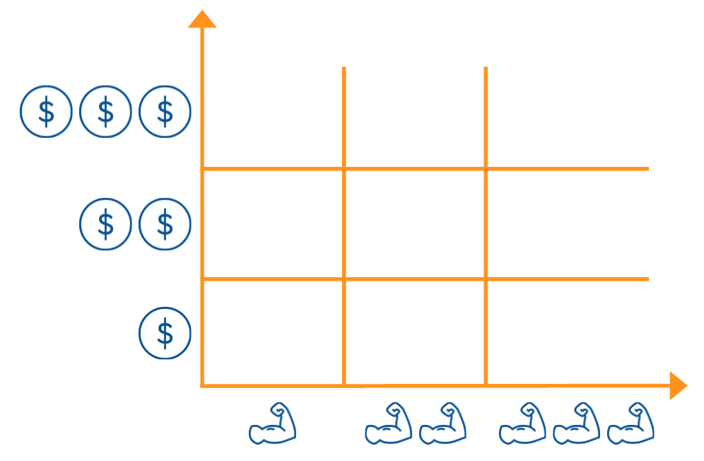

 

Depois de preenchido, não se esqueça de tirar uma foto do canvas antes de mover os post-its.

 

## [Livros] Leitura Complementar

[UX Strategy](https://www.amazon.com/UX-Strategy-Innovative-Digital-Products-ebook/dp/B00XZF0J26/ref=mt_kindle?_encoding=UTF8&me=) - Jaime Levy

[Direto ao Ponto](https://www.casadocodigo.com.br/products/livro-direto-ao-ponto) - Paulo Caroli

 

## [Ferramenta] Mural.co

_"(...) uma ferramenta super potente para a UX Strategy, visto que fornece um quadro branco muito customizável, templates de diversas ferramentas estratégicas conhecidas e relevantes, possibilidade de criar e organizar post-its muito bem, e também tem timer para Gamestormings e adesivos para Zen Voting! E ela também sincroniza tudo isso em nuvem."_

[Ferramenta Mural.co](https://mural.co/)

Dica do aluno [Gabriel Fitarelli](https://cursos.alura.com.br/user/gafitta), lá no [fórum de UX](https://cursos.alura.com.br/forum/subcategoria-ux/todos/0) na Alura.