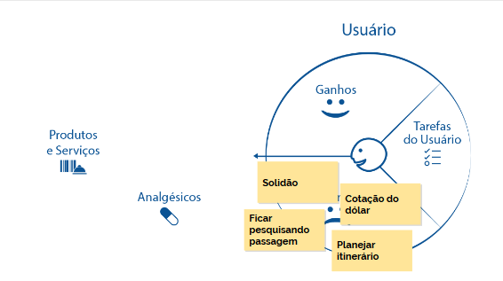

  
  # Mais Empatia e mais valor
  

 

## Empatia

Será que utilizar personas é o suficiente para criarmos empatia na equipe?

Às vezes, não, e existem outras ferramentas que podem nos auxiliar na indução de empatia. Para criar esse vínculo é preciso levar em conta o que a pessoa pensa, escuta, vê, fala, faz, suas dores e necessidades. Uma ferramenta que faz exatamente isso para nós é o **Mapa de Empatia**, que possui o seguinte aspecto:

 

 

É como se realmente estivéssemos mapeando tudo o que está relacionado aos sentimentos desse usuário. Porém, já fizemos algo bastante similar quando construímos a proto-persona, e depois a persona. Então, por que seria necessário utilizar essa ferramenta? Depende do caso - se a persona é o suficiente para você, não é necessário construir o Mapa de Empatia.

> Quem criou esta ferramenta foi a Xtension, e ela é bem fácil de se entender e manusear, tanto é que pessoas da área de UX passaram a utilizá-la bastante.

As informações necessárias para o preenchimento desses espaços vêm da proto-persona ou persona. Em "Vejo", completamos com o que o usuário utiliza diariamente:

**Vejo**

+ Amigos viajando com suas esposas
+ Review no Booking
+ Instagram com dicas de viagens
+ Promoções de passagem

 

Em "Penso" incluímos os sonhos e esperanças do usuário e, nesse momento, você começa a se colocar no lugar da outra pessoa, gerando a empatia.

**Penso**

+ "Odeio viajar sozinho"
+ "A Tunísia deve ser um lugar fantástico"
+ "Passagem de avião é muito caro"

 

No "Escuto" cabe aquilo que influencia o usuário:

**Escuto**

+ Opiniões de youtubers
+ "Nunca foi pra Machu Picchu?!"
+ Opiniões de amigos e parentes
+ Redes sociais

 

Outra parte bastante importante é o "Falo e faço", em que deve constar seu comportamento com pessoas de seu círculo social:

**Falo e faço**

+ "Desisto de chamar alguém para viajar"
+ "Mais um mês sem juntar $"
+ SkyScanner para achar passagens

 

Em "Dores", devem ser inscritos os obstáculos que o usuário encontra para ser feliz.

**Dores**

+ Ficar muito tempo sem viajar
+ Gastar muito
+ Ficar perdido
+ Depender do wifi público

 

Bom, se falta algo para ele ser feliz é porque ele possui uma necessidade...

**Necessidades**

+ Conhecer grupo antes de viajar
+ Sugestão de destinos
+ 4G decente

 

E este é o Mapa de Empatia pronto:

 

 

Tudo isso é feito para deixar o perfil hipotético do Fabiano o mais próximo de algo real. Entretanto, é difícil entender se a ausência de Wi-fi público é realmente uma dor para esse usuário, às vezes não é o caso. Novamente, retomaremos a ideia de empatia, de nos colocarmos no lugar de alguém, permitindo que as ideias acabem vindo espontaneamente.

É algo que pode condizer com a realidade ou não. E para que possamos preencher o Mapa de Empatia, é preciso entrar no **Modelo Mental** do usuário, e realizar o exercício de colocar-se no lugar da outra pessoa.

O **gamestorming** abaixo serve para para elaborarmos um Mapa de Empatia:

+ Tempo: 25 minutos

+ Ambiente: folhas, canetas e post its

+ Objetivo: sentir mais empatia pelo usuário

 

## Tarefas de usuários

Muitas vezes, enquanto indivíduos que executam determinada tarefa para o nosso próprio time, acabamos nos perguntando: qual é o valor gerado a partir dessa atividade? Esse desconhecimento acaba causando desmotivação no colaborador, resultando em um rendimento menor, um deadline apertado, perda de prazos de entrega, o chefe fica desapontado, e o usuário triste. Dessa maneira, todos perdem!

> Quais tarefas o usuário executa no dia a dia, que estão relacionadas ao aplicativo?

Essas atividades são as **Tarefas do usuário**, sejam elas felizes ou tristes.

Se o usuário gosta de viajar, uma de suas tarefas provavelmente é montar um roteiro, assim como conhecer um grupo e juntar dinheiro para viajar. Tais tarefas não estão em um formato de lista ou tópicos, e sim mais relacionadas a **esferas emocionais**.

Exemplificando: uma pessoa gosta de se vestir de determinada maneira pelo status, e isso é uma tarefa mais social. Outra quer se vestir para simplesmente não andar pelado, isso está na esfera funcional. E por fim, alguém que se veste para sentir-se bonito vincula essa tarefa a uma esfera emocional. Portanto, dentro das tarefas dos usuários pode-se incluir esses três eixos.

No nosso caso, o usuário possui as seguintes tarefas de usuário:

+ Bolar roteiro de viagem
+ Conhecer grupo interessado em viajar junto
+ Juntar dinheiro

Vamos explorar os obstáculos que nosso usuário enfrenta. Como Fabiano Gusmão quer conhecer um grupo, uma de suas "dores" seria a solidão, assim como a cotação do dólar que, quanto maior estiver, mais caro custará a viagem. Uma terceira dor seria pesquisar passagens, o que pode acabar sendo uma atividade monótona. Da mesma forma, a quarta seria planejar o itinerário.

Os ganhos, aquilo que é positivo e que acaba por amenizar um pouco essa situação, seriam:

+ Conhecer lugares novos
 
+ Processo simples, sem burocracia

+ Chat

+ Economia de tempo

 

Você ainda pode priorizar as anotações dos post its usando etiquetas diferentes, ou pode-se acrescentar um símbolo de + para demonstrar prioridade:

 

 

O que acabamos de fazer serve para reunirmos visualmente as características do usuário:

 

 

O que faremos na sequência é buscar minimizar as dores do nosso usuário.

 

## Value Proposition Canvas

Vimos um framework para entendermos melhor o usuário, e no modelo exposto pela imagem abaixo, acrescentamos uma flecha que antes não constava no desenho. A flecha apontará para o que desejamos oferecer ao usuário, no caso, os produtos e serviços.

 

 

Nessa parte de "Produtos e Serviços", relacionada a "Tarefas do usuário", podemos colocar palavras-chave a respeito de uma situação mais macro, como um post it com a palavra "Aplicativo". Além disso, podemos adicionar outros com várias funcionalidades. E para colocarmos post its relacionados a "Serviços", é possível ser mais intangível, com "oferecer mais segurança para o usuário", por exemplo.

Outro ponto interessante de deixarmos visível são as "Dores" do usuário, os quais se resolvem por meio de "Analgésicos", cujo espaço encheremos de post its com as soluções para as dores do usuário. Não necessariamente existirá uma pílula para cada uma das dores, digamos assim, e pode ser que tenhamos um analgésico que elimine mais de uma dor, sendo que também não é necessário curarmos essa dor, às vezes isto está fora de nosso alcance. Mas se você puder amenizá-la, já é ótimo!

Para diminuirmos a solidão, podemos implementar o chat, e para o problema da cotação do dólar, é possível criarmos um sistema em que nosso usuário seja avisado quando o dólar baixar. Em relação ao problema de pesquisa de passagens, podemos utilizar um alerta que nos avise quando a passagem que desejamos entrar em promoção. Quanto ao planejamento de itinerário, pode-se disponibilizar alguns itinerários prontos, rotas que outros usuário fizeram.

É justamente nestes pontos que o usuário valoriza o aplicativo, pois ele pode ser capaz de resolver algumas das suas dores:

 

 

Vamos pensar nos ganhos do usuário - temos que mostrar quais os benefícios do aplicativo, as vantagens, os quais são denominados "Criadores de ganhos". Tudo isso que pensamos, os produtos e serviços, criadores de ganhos e soluções, são como se fossem um presente para nosso usuário, algo que agrega valor na vida de alguém. Denominamos esse conjunto de "Proposta de valor":

 

 

Essa ferramenta, que ajuda na visualização para o usuário, é denominada **Canvas de Proposta de Valor** ou, em inglês, **Value Proposition Canvas** ou **Value Proposition Design**. Seu objetivo é tornar o valor do produto visível, exibindo-se o porquê do usuário preferir baixar o nosso aplicativo em vez do da concorrência. E quando falamos em "valor", ele não tem uma conotação financeira; são as suas vantagens.

O Value Proposition Canvas é algo muito interessante para a parte de descobrimento, da fase de idealização do projeto. Podemos utilizá-la também na etapa de estruturação do processo de venda, pois quanto melhor entendermos o usuário, mais provável será o sucesso da venda.

Assim, a ideia central dessa ferramenta é responder duas perguntas básicas:

+ O que estamos fazendo?

+ Por que estamos fazendo?

Por que precisamos pensar no layout? Por que estamos construindo determinada página? Por que estamos inserindo determinada funcionalidade?

> Fazer coisas legais para as pessoas > fazer as pessoas gostarem de coisas

A ferramenta "Proposta de Valor" é do mesmo criador do Business Model Canvas, o Alexander Osterwalder.

 

### Mais dicas

Você pode notar que em um mesmo perfil de usuário podem existir outros, então a dica é separá-los. Por exemplo, a Alura tem como usuário o Fabiano Gusmão, os próprios funcionários e uma pessoa da área da administração. Nesse caso temos dois perfis distintos do Fabiano Gusmão, e o mais adequado seria separá-los.

Vamos praticar? Faremos um **gamestorming** com o tema da proposta de valor.

+ Tempo: 30 minutos
+ Ambiente: folhas, canetas, post-its
+ Objetivo: mapear o produto, entendendo o valor gerado para o usuário

 

## Mapa de empatia

Uma forma de estender o poder da persona é através do **Mapa de Empatia**, uma excelente ferramenta para ajudar o time a entender quem é o usuário e o porquê dele ser como é, além de conhecer quais são suas motivações e como ele interage com o mundo.

Colocando nossa persona em um contexto mais humano, o time que projeta para essa persona pode acabar aumentando a empatia por ela. Isso se potencializa muito caso o time tenha ajudado a montar o Mapa de Empatia dessa persona. É importante lembrar que cada persona criada deve ter um Mapa de Empatia próprio.

Uma vez feito, tire uma foto do Mapa e use-o como ajuda na hora de argumentar as decisões do projeto.

 

## [Exercício] Informações do Mapa de Empatia

De onde tirar as informações-base para preencher o Mapa da Empatia?

Apesar do Mapa de Empatia ser preenchido, idealmente, pelo time inteiro, a base das informações colocadas nele são tiradas normalmente das personas e/ou proto-personas criadas previamente.

 

## [Exercício] Na pele do usuário

Viajar e ficar perdido numa cidade em que você mal fala o idioma é algo frustrante.

Qual a parte do Mapa de Empatia que colocamos os obstáculos cotidianos que a persona enfrenta?

**Dores**

A parte de **dores** é uma das partes mais importantes do Mapa, pois é nele que podemos refletir quais os desafios e preocupações que a persona pode ter em seu dia-a-dia.

Quando entendemos essas dores, fica muito mais fácil de se pensar em uma solução para eliminá-las ou ao menos amenizá-las.

 

## [Exercício] Proposta de Valor

Além do Mapa de Empatia, existem outras ferramentas complementares ao uso da persona. Uma delas, visto em aula, é o **Canvas de Proposta de Valor**.

O que o Canvas de Proposta de Valor propõe?

> Deixar claro para todos do time o valor que está sendo gerado

Interessante em fases iniciais onde o projeto está sendo idealizado, o Canvas de Proposta de Valor tenta **deixar claro qual o valor que está sendo gerado**, respondendo duas simples perguntas: “o quê?” e “por quê?”.