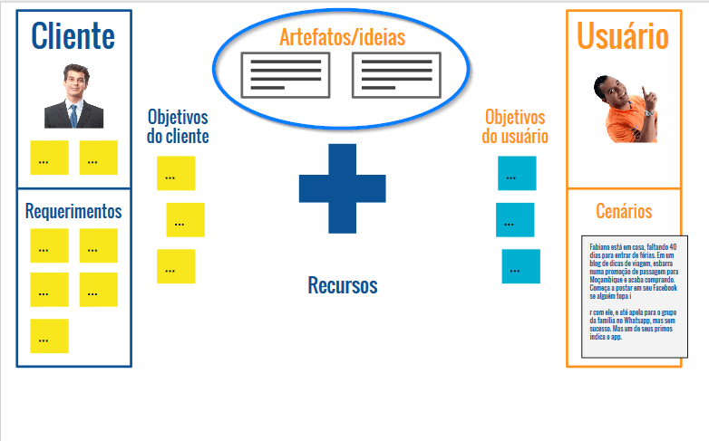

  
  # UX Canvas
  

 

## Uma Nova Ferramenta

Imagine que durante o processo de desenvolvimento da História do usuário tenhamos recebido um e-mail do investidor da nossa start up:

> Natan, sobre o app, a feature principal que preciso ver o quanto antes é que ele tenha uma aba com reviews dos viajantes.
>
> Ah, não se esqueça de que a linguagem que escolhi foi o Ruby, e faça de tudo para que o aplicativo custe de USD 2,00 para cima
>
> []

Esse e-mail contêm diversos pedidos - como estamos trabalhando com UX, estamos pensando na experiência do usuário, no Design voltado para ele. Isto é, toda tomada de decisão deve ser feita com o foco no usuário. Diante disso, o que fazemos com esse e-mail?

Claro que é preciso ouvir o nosso cliente, pois é ele que investe dinheiro em nossa start up para que o negócio se mantenha. Porém, nosso cliente geralmente trata a questão da perspectiva de business, do negócio e, portanto, tem um ponto de vista diferente do nosso. Não adianta ignorar o cliente, ou nos centrarmos apenas no usuário, pois se falhamos na parte de negócios e viabilidade, acaba-se o projeto.

Pensando nisto, vamos exemplificar nosso investidor por meio de uma imagem do hipotético Leo Silveira, cujas características colocaremos em um post it em volta da imagem. Essa pessoa é um "investidor anjo", pois ele deu o aporte inicial para nossa empresa, sendo também o "dono de agência", e podemos seguir acrescentando demais informações, como seu cargo, personalidade, entre outros.

Muitas vezes o cliente faz solicitações que não estão nem um pouco relacionadas ao usuário. Nesse caso, é preciso saber como negociar, e esse é, talvez, o papel mais humano de UX: conversar com as pessoas buscando um acordo entre elas. Nessa situação, a equipe de UX estará se posicionando "pelo cliente", e o investidor defenderá o lado do negócio.

Fazer um aplicativo totalmente voltado ao cliente pode fazer com que nosso negócio falhe. Portanto, o que vamos fazer é juntar o que o investidor pede com o que o usuário deseja. Quais são os problemas relacionadas ao usuário que buscamos solucionar? Quais são as necessidades desse indivíduo?

Vamos simplificar isso organizando visualmente a palavra "cliente" dentro de um retângulo do lado esquerdo, e "usuário" no lado direito. A lista de desejos do investidor é a seguinte:

+ Parceria com CVC
+ App pago
+ Fórum
+ Reviews
+ Ruby
+ 3D e VR (Virtual reality, ou Realidade Virtual)

Tais requerimentos do cliente serão somados aos desejos do usuário, sobre o qual temos tudo pronto, pois já pensamos nisso ao construirmos o seu cenário. Em nosso esquema, teremos quatro retângulos: "Cliente", e abaixo disso "Requerimentos"; "Usuário", e abaixo, "Cenários".

Para lembrarmos melhor do nosso cliente, poderemos adicionar uma foto do Leo Silveira no espaço de "Cliente". Além disso, colocaremos diversas informações a respeito do seu perfil. E, embaixo disso, colocaremos os requisitos desse cliente, isto é, todos os requerimentos coletados:

 

 

No espaço destinado ao usuário, também acrescentaremos a foto da proto-persona, persona, ou então sua ficha. Embaixo da foto pode ser incluído o cenário que também construímos anteriormente:

 

 

Observando os requerimentos do cliente, poderemos nos perguntar o porquê dele desejá-las, ou para quê. Por que motivos é realmente necessário construir um aplicativo com realidade virtual se é difícil encontrarmos pessoas que detenham essas tecnologias?

Talvez nosso cliente possua um objetivo por trás desse requisito, portanto outro item para acrescentarmos na ferramenta é a de **Objetivos do cliente** em relação ao projeto. Estes podem ser: divulgar a empresa, retorno financeiro em menos de 3 meses, e 1 milhão de registros em 6 meses.

Da mesma forma, podemos verificar os **Objetivos do Usuário**, algo que já fizemos na parte da persona e proto-persona. Essa parte é importantíssima, é a parte do usuário, e da desejabilidade que nós utilizaremos no projeto. A ideia é reaproveitarmos as informações da proto-persona. Se você não tiver feito isso pense nos objetivos levando em consideração o Modelo Mental do Usuário.

 

 

Nosso modelo ficará da seguinte maneira:

 

 

É interessante separarmos por cores, porém isso não é essencial. O primordial é tornar todas as informações úteis visualmente organizadas.

 

## UX Canvas

Já pensamos no cliente e também no usuário - agora, o que de fato nosso time irá fazer no próximo dia útil de trabalho? Lembra-se que fizemos as histórias do usuário?

**Destinos**

> Para... decidir para onde vou
> 
> Eu, como... um cara sem ideias de destinos
> 
> Quero... que o app me sugira lugares baseados no meu perfil

Você pode adicioná-la na parte de "Artefatos/Ideias":

 

 

"Artefatos/Ideias" corresponde às atividades que desenvolveremos e que, para serem realizadas, serão necessários alguns recursos. Precisaremos de um Analista de Seguranças, pois não queremos que as senhas de nossos clientes acabem vazando na internet. Um Pacote Adobe para trabalharmos, um fotógrafo, e devices (dispositivos), pois queremos que o aplicativo seja multiplataforma!

Todos estes recursos serão encaixados no espaço "Recursos":

 

 

Algo que precisamos ter em mente é que recursos e pessoas não são sinônimos. Se preferir, pode-se demarcar com um traço a divisão entre esses itens.

Observando nosso esquema até o momento, veremos que ele está um tanto desorganizado, e por tratar-se de um Canvas e estarmos organizando tudo em cartões, podemos pensar em uma divisória. De um lado colocaremos o que o cliente quer, seus objetivos, requerimentos e recursos, e do outro incluiremos os artefatos, ideias, objetivos do usuário e cenários.

O objetivo desse Canvas é justamente somar os interesses do cliente com os do usuário.

 

 

E é no centro do nosso esquema que consta a solução, cujo nome técnico é Proposta de Experiência. Neste caso, a nossa solução é "Conectar viajantes".

Nós fomos bastante sucintos, portanto se você achar mais adequado, pode escrever na "Proposta de Experiência" uma frase curta. A ideia é preenchermos isto levando em conta, preferencialmente, a percepção do usuário, e encarnando seu modelo mental.

Perceba que a proposta de experiência - que é o centro e o coração do Canvas - é algo bastante subjetivo e também muito estratégico. Imagine uma situação em que um funcionário novo chegue em sua empresa e observe o quadro. Pelo destaque no centro, ele já compreende o objetivo.

Essa ferramenta que criamos tem um nome, é a UX Canvas, uma ferramenta brasileira, fruto do Trabalho de Conclusão de uma dupla de Curitiba. Infelizmente, o site saiu do ar, mas nos links a seguir, há uma [apresentação da ferramenta](https://pt.slideshare.net/fernandaparisi/apresentacao-ux-canvas) — feita pelas pessoas que a criaram — e uma [versão antiga do site](https://web.archive.org/web/20161005095504/http://uxcanvas.com:80/).

Após essa explicação, vamos propor um gamestorming!

+ Tempo: no máximo 45 minutos (é mais interessante fazer essa atividade com várias pessoas, no mínimo duas ou três).

+ Ambiente: flip-chart, canetas, post its, personas, cenários e histórias de usuários.

+ Objetivo: juntar a visão do cliente e do usuário. Mesmo que as visões sejam muito distintas umas das outras, é preciso saber negociar.

 

## [Exercício] Objetivo do UX Canvas

Qual das alternativas melhor define o objetivo principal do UX Canvas?

**Juntar as necessidades do usuário com os requerimentos do cliente**

Todas as alternativas estão certas:

+ Identificar o cliente
+ Mostrar os objetivos do cliente
+ Deixar visível o usuário e seus objetivos
+ Juntar as necessidades do usuário com os requerimentos do cliente

O UX Canvas possui partes para mostrar o cliente e seus objetivos, tal como o usuário e seus objetivos, **mas o foco da ferramenta é somar o que o cliente pede com o que o usuário precisa**.

Criado para melhorar a compreensão dos stakeholders acerca das necessidades do usuário e dos rumos do projeto, e também da própria equipe envolvida no desenvolvimento (designers, desenvolvedores, etc)

O diferencial dessa ferramenta é o seu foco no conceito de experiência do uso do projeto, podendo ser aplicado a qualquer momento do projeto. Cabendo o time decidir o nível de detalhamento de cada bloco.

 

## [Exercício] O cliente

Muitas vezes o cliente é uma figura mística que surge de tempos em tempos em nosso time apenas para pedir coisas e depois some, como que por encanto, lembrando o Mestre dos Magos em Caverna do Dragão.

Quando entra um integrante novo no time, ele mal sabe quem é o cliente.

Como o UX Canvas ajuda nisso?

Em vez de uma apresentação formal, o UX Canvas pode deixar claro para todo o time quem é(são) o(s) indivíduo(s) que demandam as tarefas, seja nosso chefe ou as partes interessadas (stakeholders).

Ele tenta responder as informações relevantes ao cliente ou sobre o solicitante do projeto, tais como o nome dos solicitantes, a listagem dos stakeholders, seus cargos e suas influências no resultado e as características sobre a cultura da empresa solicitante. Estas informações podem ser obtidas através de um diagnóstico realizado junto ao cliente, ou através de uma entrevista com o mesmo.

 

## [Exercício] Proposta de Experiência

No UX Canvas, existe o bloco “Proposta de Experiência”.

É correto afirmar que esse bloco deve…

- [] estar alinhada com os objetivos de uso tanto do cliente quando do usuário

- [x] todas as citadas

- [] considerado o coração da ferramenta

- [] informar qual experiÊncia que o projeto deve proporcionar

De todos os blocos da ferramenta, a proposta de experiência é de fato o coração de tudo. Estratégico e subjetivo, pode ser o alinhamento de uso das expectativas do cliente e do usuário. Até mesmo a necessidade que o projeto está solucionando.

Uma dica é tentar deixá-lo curto e claro.