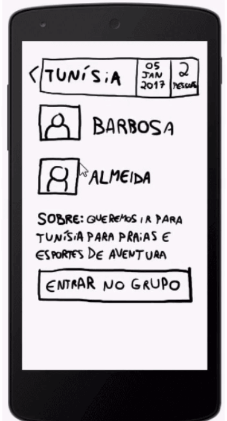
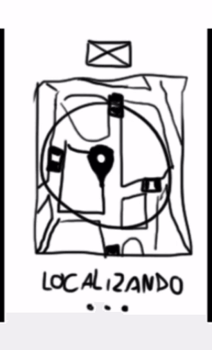
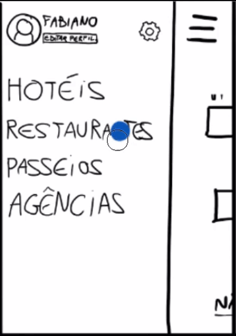
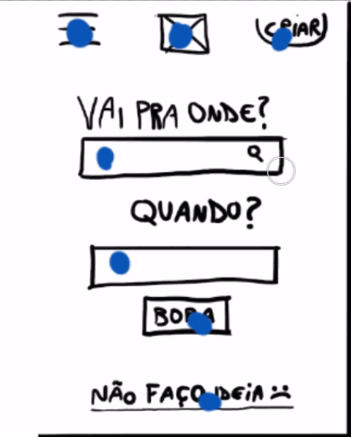
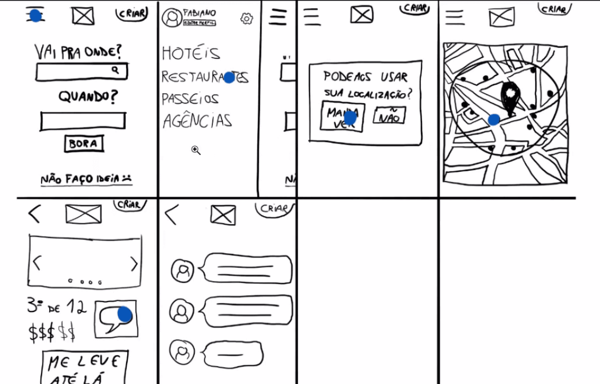
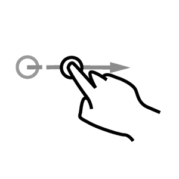
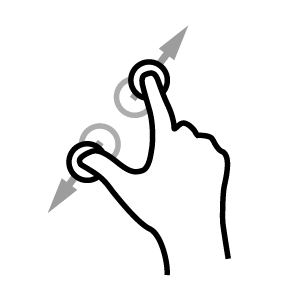
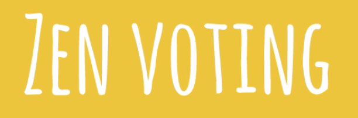

# Ideias: da cabeça ao papel

 

## Crazy eights

Usabilidade é a facilidade de uso. Às vezes, os conceitos de UX e Usabilidade são considerados idênticos, mas na verdade a usabilidade está dentro da Experiência de Usuário.

O objetivo do nosso curso é mostrar como começamos a desenhar telas, quando já tivermos realizado a etapa de pensá-las e elaborado os conceitos no papel. Mas precisamos começaremos fazendo rascunhos à mão.

 

 

Escrevemos algumas funcionalidades que separamos pelos números 1,2 e 3. São versões de um produto mínimo que conseguimos lançar. Essa divisão das funcionalidades de cada versão tem a intenção de indicar que se elas estiverem presentes em um produto, ele pode ser lançado o mais breve possível.

O usuário ficará satisfeito, nós conseguiremos ter um retorno financeiro inicial e nós teremos capacidade técnica para realizá-lo. Isso é o que mercado chama de **MVP**, que significa produto mínimo viável.

O produto que criaremos irá resolver o problema de **encontrar uma companhia para viajar**. No fim do curso, queremos aproveitar todas essas funcionalidades.

 

 

Observe que as telas não foram desenhadas de forma impecável. As linhas não estão retas... No entanto, não é necessário saber desenhar para realizar este curso. Não são necessárias várias horas de desenho para conseguir concluir o projeto. A ideia de rabiscar com lápis em um papel permitirá que qualquer um possa fazer isso - incluindo o seu cliente, chefe ou stakeholder do projeto.

Ainda temos diversas funcionalidades que gostaríamos de adicionar.

 

 

Temos várias opções: criar ou achar grupos de viagem, encontrar lista de roteiros, ler reviews, um chat para conversa entre os usuários. Vamos começar.

 

 

Observe que eu criei um monte de pequenas telas. Gastei um bom tempo, desenhando vários detalhes, inserindo ícones... Mas nesta fase de coletar ideias e colocá-las no papel, seria mais interessante elaborar um desenho rápido. Como o que fiz e segue abaixo:

 

 

Na segunda tela, queria criar uma funcionalidade de chat.

 

 

Quanto tempo será que eu levei para criar estas telas? Eu levei exatamente **cinco minutos**. Perceba que não existe um fluxo de navegação entre as telas. Eu desenhei a lista de roteiros na primeira tela, depois o chat, e na terceira, criei a função para imputar os dados com voz.

Na quarta tela, vemos uma funcionalidade para encontrar lugares específicos que estejam perto do usuário, como restaurantes e hotéis.

 

 

Temos também uma tela de review, em que você pode indicar se gostou ou não de um lugar.

 

 

Eu desenhei uma tela exclusiva para restaurante, onde vemos que um restaurante foi avaliado como o terceiro melhor de 75 outros locais.

 

 

O usuário tem uma tela para encontrar grupos de viagem para o mesmo destino que queremos ir.

 

 

Veja que criei sete telas. Será que este número é o ideal? Não seria melhor criar um número muito maior, 20 ou 50 telas? A resposta é não. Seria difícil você parar várias pessoas de um time por um período de duas horas para ficar desenhando tela. O ideal é que esta parte do processo seja realizada rapidamente pelo time, sendo que cada membro irá rascunhar algumas telas.

Vamos ver outro exemplo: telas do Uber. Em que momentos solicitamos um motorista do Uber?

 

 

Na primeira tela, vemos dois campos. No de cima você coloca onde você está e no de baixo, coloca aonde quer ir.

 

 

Na segunda tela, fazemos a estimativa de preço.

 

 

Depois que você concordou com o preço, você chama o Uber e ele começará a localizar motoristas próximos de você.

 

 

Então, começará a aparecer os dados do motorista, incluindo tempo de chegada até a sua localização inicial.

 

 

Se você já usou o Uber, sabe que existem outras telas, como a parte de ajuda para o usuário, histórico e outras. Não precisamos pensar nisto agora. Por enquanto, focaremos nos momentos-chave do aplicativo.

 

 

Observe que no primeiro exemplo nós trabalhamos com uma grid de **oito** partes. O **Google Ventures** (GV), uma pequena empresa dentro do Google, é o responsável por definir o número **8** como o valor ideal. Para o GV, oito passos seriam o limite para o usuário realizar alguma tarefa.

Mas não quero que você pense em fluxo agora. Pense nos momentos-chave do aplicativo. Se você se sentir travado na criação, pode trabalhar em versões diferentes da mesma tela. Se nem isso você conseguir, pense em como será a interação do usuário - vale desenhar um boneco de palitinho usando a sua aplicação. Isso pode te ajudar a destravar.

Esta técnica para colocar a sua ideia em oito parte recebeu o nome de **Crazy Eights**, que traduzido para o português seria os "oito loucos".

 

 

O termo "louco" faz referência à ideia de que o processo elaboração deve ser feito na "doideira" e deve ser finalizado em cinco minutos, ou seja, você terá **40 segundos** para gastar com cada tela. Você não terá tempo para pensar se a linha que você desenhou está reta ou apagar e refazer algo. Com isto, você estará perdendo tempo.

 

## Segundo crazy eights

Como eu precisava criar um exemplo de Crazy Eight para o curso, usei o tablet e fiz meus desenhos diretamente no Photoshop.

 

 

O que desenhamos no tablet Wacom, sai diretamente na tela.

 

 

Fiz isso, para criar a apresentação do curso, mas você pode usar um papel e uma caneta para fazer os desenhos.

 

 

No nosso exemplo, eu criei possíveis telas de momentos-chave para a aplicação. Agora, que você teve tempo para pensar e colocar no papel as ideias mais óbvias, terá que fazer novamente o mesmo exercício. Acredite, isso não é uma brincadeira!

A inovação, a criatividade, é como um **pote de Nutella**. É fácil pegar pegar uma colher quando o pote está cheio. No entanto, fica mais difícil quando tentamos raspar o pote para pegar o que sobrou no pote. Fica parecendo que a parte mais gostosa ficou no fundo...

A ideia é que você refaça o Crazy eights, mas dessa vez, podendo usar mais tempo se quiser, como 10 ou 15 minutos. E pode inclusive, pode começar a pensar no fluxo. Aproveite para colocar no papel uma ideia que você teve há muito tempo, mas que não elaborou muito.

Eu aproveitei para desenhar telas mais detalhadas do que as primeiras.

 

 

Observe que eu comecei a pensar no fluxo que o usuário seguiria para encontrar os restaurantes mais próximos. Eu pensei desde o momento em que a pessoa adiciona a localização até a ação do review, em que estarão disponíveis as avaliações dos clientes.

Comece a estudar o conteúdo na prática!

 

## Interações e ícones

De acordo com o Crazy Eights feito por mim, como o usuário irá da primeira tela para a segunda?

 

 

Ele precisará clicar no ícone de menu "hambúrguer". Então, ele chegará a segunda tela.

 

 

Mas será que é intuitivo para o usuário a necessidade de clicar no ícone hambúrguer para que surja o menu? Será que as pessoas conseguirão entender onde deve ser clicado na tela do mapa para irmos para os restaurantes?

 

 

No caso, é preciso clicar nos pontinhos pretos.

Às vezes, o usuário pode não achar uma tela tão intuitiva. Por isso, é necessário deixar claro como o usuário irá navegar nestas telas.

Pensando nisso, apresentaremos algumas técnicas que consistem em mostrar alguns pontinhos a forma como o seu usuário irá interagir com a sua tela.

Eu usarei o Photoshop para demonstrar a técnica, mas você poderá utilizar a caneta e o papel.

Preferencialmente, para criar as marcações, use uma cor diferente da que foi utilizada no desenho. Eu vou usar a cor azul. Na primeira tela, adicionaremos uma bolinha azul no ícone do menu, representando o *touch*.

 

 

Este é o lugar que deverá ser clicado para o usuário chegar a segunda tela. Para irmos da segunda para terceira tela, teremos que clicar no link de "Restaurantes". Adicionaremos a marcação azul sobre ele.

 

 

Lembrando que o objetivo não é indicar quais pontos são "clicáveis". Caso contrário, a primeira poderia ter ficado assim:

 

 

Nosso objetivo ao adicionar as bolinhas azuis será indicar qual será o fluxo ideal de usuário.

Então, a partir de "Restaurantes", nos iremos para a terceira tela.

 

 

Após clicarmos em "manda ver", seguiremos para a tela de localização dos restaurantes. Marcaremos um dos restaurantes com a bolinha.

 

 

> Pensando num fluxo desenhado no papel, você poderia utilizar as etiquetas coloridas com formato de bolinha, que já usamos em outros cursos, para fazer Zen voting.

 

Com as marcações adicionadas, o fluxo das nossas telas ficaram assim:

 

 

Agora, o time sabe como o usuário irá interagir com as telas. Faça este processo com seu Crazy Eights.

Mas será que a única forma do usuário interagir com a tela é o touch? Não, ele também pode arrastar o menu com o dedo, uma ação que chamamos de **swipe**.

 

 

Poderíamos deixar claro que a única opção para abrir o menu é com o swipe. Para indicar que o usuário deve clicar na tela e arrastar o dedo para cima, podemos adicionar uma imagem como essa no nosso desenho:

 

 

Seria um movimento de scroll...

Com a setinha adicionado ao desenho, a tela ficará assim:

 

 

Pense nas formas como o seu usuário irá interagir com o seu aplicativo. Outra forma por exemplo, é o movimento de pinça que fazemos quando usamos o Google Maps e queremos ampliar uma parte da imagem.

 

 

Você pode fazer o desenho que quiser para representar o movimento de pinça, desde que ele seja compreensível para o seu time.

 

 

Quais outras formas que os usuários podem interagir com a tela? Por exemplo, se o fluxo da aplicação começasse pelo preenchimento do campo "Vai para onde?" do início, você poderia adicionar um ícone para representar o teclado. Atualmente, o usuário também pode inputar uma informação com a voz, então poderíamos utilizar uma representação para o microfone.

 

 

Existe ainda outra forma de interação. Se o seu celular toca, ele emite um som. Você pode indicar isso com um ícone também.

 

 

Às vezes, o seu celular emite sinais luminosos com o led. Você também poderá representá-lo.

 

 

Você pode trabalhar com outras ideias de ícones: para vibração e para notificação.

Basta você acordar com seu time a iconografia.

Na aula, criamos ícones para formas como o usuário interage com o celular e como o celular interage com o usuário *(feedback)*.

 

 

Nesta tela, por exemplo, representamos que quando clicarmos em "manda ver", o celular irá vibrar.

Vou deixar você com cinco minutos para adicionar esses ícones nas suas telas.

Mãos à obra!

 

## Decidindo telas com Zen Voting

Você já pensou em como o usuário irá interagir com o aplicativo em determinado momentos do fluxo da navegação. Pensou também em algumas mensagens de feedbacks que o celular deverá dar para o usuário.

Mas agora, cada membro do seu time fez o seu próprio Crazy Eight e vocês tiveram diversas ideias. Como será feita a escolha das telas que serão levadas para o protótipo do seu aplicativo? O melhor será fazer uma votação com as pessoas do time.

Porém, existem casos em que algumas delas são mais comunicativas e podem ter maior poder de convencimento. Por isso, é utilizada a técnica do zen voting.

 

 

Trata-se de uma "votação zen", em que cada membro receberá três etiquetas de cor verde e uma de cor vermelha. Cada um poderá votar nas telas que gostou, usando a etiqueta verde. Por exemplo, a tela de grupo criado recebeu três votos verdes.

 

 

Outra tela ganhou um voto vermelho.

 

 

Mas o voto vermelho é opcional.

O ideal é que essa votação seja feita silenciosamente, sem campanhas à favor ou contra. Esta é uma maneira prática e justa para escolher as telas que irão para o projeto final do seu aplicativo.

Tente experimentar o Zen voting. Se você estiver desenvolvendo um projeto com um time, será uma prática interessante.

 

## [Exercício - Situação] Reunião com o cliente

Você está em uma reunião com um cliente para pegar o briefing (o quê precisa ser feito) e não está ficando claro para você o que ele pretende.

Como o crazy eights poderia te ajudar?

- [x] Materializar as ideas no papel
- [ ] Definir a paleta de cores que será utilizada
- [ ] Organizar qual infraestrutura será necessária
- [ ] Pensar no design visual

A ideia de ter algo mais concreto e não só de ideias anotadas em um bloco de notas poderia ajudar bastante nessa situação. E é justamente aí que o *crazy eights* entra.

Uma característica interessante dele é que qualquer pessoa pode arriscar e fazer alguns desenhos, mesmo sem habilidades de desenho ou com programas de edição de imagens.

## 

Posts para leitura complementar:

[Crazy Eights – Uma técnica rápida e visual para explorar ideias com seu time](https://blog.caelum.com.br/crazy-eights-uma-tecnica-rapida-e-visual-para-explorar-ideias-com-seu-time/)

[The product design sprint: diverge (day 2) - item 4](https://library.gv.com/the-product-design-sprint-diverge-day-2-c7a5df8e7cd0)

 

## [Exercício] Crazy eights em 5 minutos

Pense em momentos chaves do seu aplicativo e desenho-os utilizando o Crazy Eights.

Lembrando que essa atividade deve durar apenas cinco minutos.

Importante não pensar em fluxo neste momento.

 

## [Exercício] Crazy eights em 15 minutos

Livrando-se das ideias mais óbvias, que normalmente são as primeiras que fazemos, faça novamente outro Crazy Eights, mas desta vez com um tempo limite de quinze minutos.

A ideia é tentar forçar-nos a pensar mais/melhor, uma vez que já foram materializadas as ideias mais óbvias.

Quando feito em time, essa atividade deve ser feita individualmente, para não sair desenhos muito semelhantes.

 

## [Exercício] Iconografia de interação e feedback

Para deixar mais evidente o fluxo de navegação, desenhe os ícones que representarão como o usuário interagirá com o aplicativo. E qual feedback o dispositivo dará em determinados momentos desse fluxo.

Lembrando que a ideia não é mostrar tudo que é tocável na tela, mas sim, o fluxo.

Uma dica é tentar entrar no modelo mental do seu usuário, seja ela materializado numa persona ou não, e ir vendo se faz sentido.

Tente pensar como seu usuário, o que faria mais sentido para ele, no contexto atual dele?

Um single tap em um botão, ou um swipe para aparecer opções escondidas?