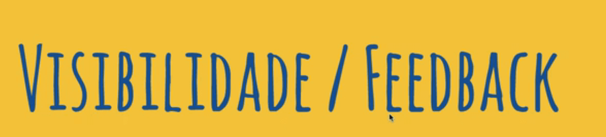
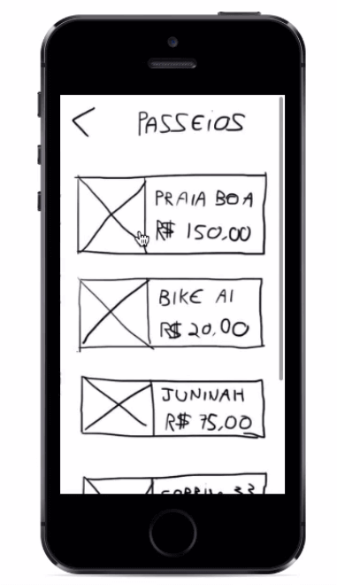
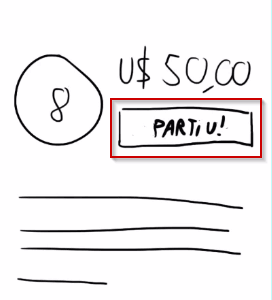
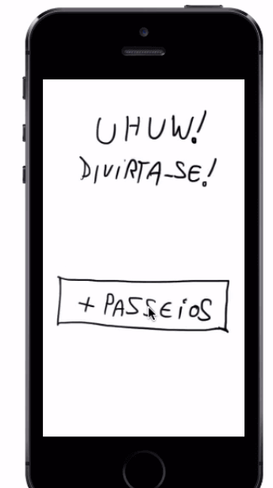
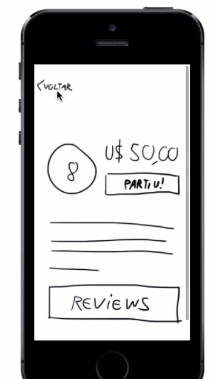
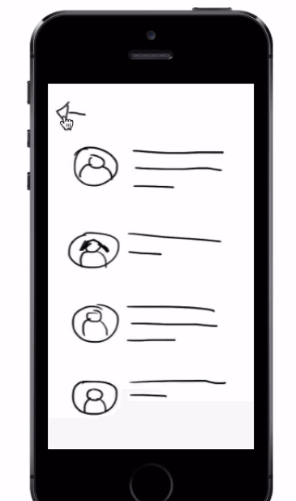
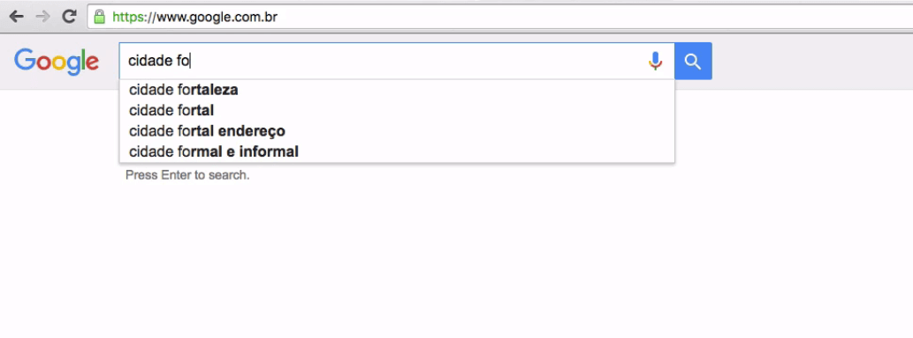
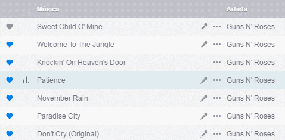

# Primeiras heurísticas de Nielsen

 

## Feedback

Agora, vamos focar um pouco mais em **Usabilidade**. O termo é bastante abrangente e mas possui algumas regras para que pudéssemos definir melhor o seu uso. **Jakob Nielsen** é considerado o "pai" da usabilidade, por ter começado na década de 1990 a se especializar em levantar dados de seus clientes e, com isso, propor melhorias para os produtos.

Ele criou boas-práticas sobre recomendações de usabilidade, que ficaram conhecidas como as "10 heurísticas de Nielsen".

Veremos as 10 heurísticas já em prática no prototipo do Bora.

Para criarmos um grupo, clicaremos no botão "Criar".

 

 

Depois, especificarei para onde eu vou:

 

 

E a data... Depois pressionaremos "Criar Grupo".

 

 

Seguiremos para a tela de compartilhar.

 

 

Mas senti falta que o app enviasse uma mensagem de "Foi" ou "Grupo criado com sucesso". Porque no caso, eu não sei "se não foi", o sistema precisa me informar sobre status. Temos que nos preocupar com a visualidade do sistema.

Essa é uma das heurísticas de Nielsen:

 

 

Temos um artigo publicado pela "Nielsen Norman Group",

 

 

Como resolver a questão do feedback na nossa tela.

Agora, ao clicar no botão de "Criar Grupo", adicionaremos uma tela de transição em que o usuário receberá a mensagem "Criando Grupo".

 

 

E depois, verá "Grupo Criado".

 

 

A ideia do feedback é muito importante quando pensamos em usabilidade.

Digamos que a pessoa não saiba para onde ela quer ir e qual grupo de viagem ela deva entrar em contato.

 

 

O usuário pode receber algumas opções de locais.

 

 

Selecionaremos a Tunísia. Poderemos entrar na página do grupo.

 

 

Depois, os botões vão mudar:

 

 

Nós que entendemos de tecnologia, sabemos que a pessoa entrou no grupo. Mas será que um usuário mais leigo compreenderia também? Para acabar com a dúvida, podemos adicionar uma notificação informando que o usuário entrou no grupo. O Marvel nos oferece a opção de que uma tela seja trocada sem que o usuário precise clicar em algum ponto do protótipo. Com o "Timer", é possível determinar por quanto tempo queremos que uma tela seja visualizada e qual será a próxima.

 

 

Trabalhamos com a ideia de dar um feedback para o usuário para que ele não fique perdido durante a navegação.

 

## Linguagem do Usuário

Vamos para um outro caso. Quero encontrar um grupo que fará um passeio próximo da minha localização.

 

 

Na segunda tela, clicaria em "Passeios".

 

 

Depois, selecionaremos "Praia Boa".

 

 

A nota do passeio é 8 e vale U$50.

 

 

E onde temos que clicar para entrar no grupo. Talvez, seja em "IR". Será que leva para o Google Maps ou vou entrar no passeio. O texto não se comunica com clareza. Entramos em outra heurística de Nielsen: **falar a linguagem do usuário**.

 

 

Não basta escrever em chinês para falar com um usuário da China. Não é apenas sobre usar o mesmo idioma. É preciso fazer analogia ao mundo real. Falaremos mais sobre o assunto.

A versão antiga do ibook ios era basicamente um aplicativo para registrar seus ebooks e tê-los disponíveis para leitura. Porém, como a Apple fez para reforçar a ideia de que o ibook era uma estante de livro? Foi assim, que eles pensaram nessa interface:

 

 

Parece um estante de madeira, com prateleiras e tudo. Fazendo esta analogia com o mundo real, fica mais simples para a compreensão de um usuário que não lida com interfaces. Mas hoje o layout segue a tendência do *flat*. Vejo abaixo a comparação entre a versão antiga e atual:

 

 

Gerações que nasceram interagindo com computadores têm mais facilidade para se adaptar ao design flat. No entanto, o layout de estante era mais simples para usuários não habituados com interfaces mais recentes. A analogia com o mundo real, funciona como uma dica para o usuário.

Voltando à tela do nosso aplicativo, poderíamos substituir o "Ir" por "Participar" ou, "Partiu!".

 

 

Elaborei meu texto pensando na linguagem do meu usuário. Meu público-alvo é mais jovem, informal, o que me permite adicionar uma !. Para um público diferente, por exemplo, em um aplicativo de banco, talvez eu não pudesse usar a mesma mensagem.

 

 

Fazendo desta forma, eu aumento as chances de me comunicar com meu usuário.

Esses pequenos textos que adicionamos em um label recebem o nome de micro *copy*. São textos que apelam para esferas emocionais do usuário.

Vimos que ao utilizarmos a heurística sobre a linguagem do usuários, fará com que o seu usuário seja mais ambientado e se sinta mais identificado com a interface.

 

## Liberdade do usuário

Ainda na parte de "Passeio", selecionamos a "Praia Boa" e adicionamos o botão "Partiu". Após escolher o passeio, o usuário chegará na tela de "Uhuw! Divirta-se!"

 

 

Usamos uma linguagem próxima a do usuário. Mas o que ele fará se quiser cancelar o passeio?

Tenho uma lembrança muito ruim de quando eu estava na sétima série e estava fazendo um a prova de Excel. Sem querer, apaguei tudo o que tinha feito muito próximo do tempo limite e não tive tempo para refazer o teste. No fim, acabei tirando zero. Provavelmente, você no meu lugar simplesmente teria usado o "Control + Z" ou clicado no botão "Desfazer". Nós também precisamos oferecer para o usuário a opção de desfazer uma ação. Ele precisa ter a **liberdade** de fazer o quiser, no momento em que preferir - desde que isso não interfira na regra de negócio.

Caso ele queira desistir do passeio após clicar em "Partiu!", o usuário poderá clicar no botão "deixá pra lá!" que irá substituir a mensagem antiga.

 

 

Pensando em uma comunicação visual, poderíamos fazer o botão "partiu!" ser da cor **verde**, enquanto o "deixa pra lá!" seria vermelho.

Falamos então de outra Heurística de Nielsen:

 

 

O usuário faz o que quer, quando quiser.

Vemos no **Inbox** que ele te oferece a opção de quando enviamos um e-mail, ou realizamos uma ação, aparece a mensagem "send" e também oferece a opção de "undo".

 

 

O usuário tem a chance de desfazer uma ação da qual se arrepende.

Outro exemplo no aplicativo "Bora", seria no momento de criação de grupos. Se por algum motivo, a pessoa desistir do grupo que criou. Por exemplo, se ele tiver escolhido a data errada ou quiser desfazer outra ação, o usuário também precisará ter a opção de ***undo***. Seja em formato de link ou botão, essa opção não poderá faltar.

 

## Padrões 

Vamos para outra heurística.

Na parte de passeios, em que selecionamos a "Praia Boa", se quisermos voltar para o menu clicaremos na setinha do canto superior.

 

 

Quando selecionamos a praia e mudamos de tela, fomos levados para uma próxima que também oferece a opção de voltar:

 

 

Se entrarmos na parte de Review dos passeio, encontraremos outra setinha.

 

 

Mas observe que usamos três tipos de setas para as telas. Ou seja, a cada tela, precisamos reaprender como voltar. Seria mais interessante que seguíssemos um padrão. A seta mais utilizada no sistema foi essa:

 

 

Então, seria apropriada adotá-la como padrão. Entraremos em outra heurística, na qual falaremos sobre padrões.

 

 

Você precisa ter um consistência visual e de texto em toda a aplicação.

Vamos mostrar um exemplo aplicado no site da Alura, em que os cursos foram divididos em categorias. Na categoria "Design e UX", foi adicionada a cor de fundo roxa.

 

 

Exatamente a mesma cor será usada no cabeçalho ao clicarmos na categoria.

 

 

Ao utilizarmos padrões, não exigimos que o usuário precise a todo momento reaprender o seu sistema. E não devemos pensar apenas em padrões visuais, mas também em funcionalidades. Por exemplo, se clicamos no ícone de lupa, esperamos que surja um campo de busca.

 

 

Pense no caso do Google e outros de seus produtos, como o Google Maps, Gmail, Inbox. Imagine se tivéssemos que reaprender o significados de todos os ícones. Por isso, você deve tentar implementar padrões, a reutilização de componentes.

Outro exemplo, é o site [booking.com](https://booking.com).

 

 

A página está em inglês. Mas por ela seguir padrões que já conhecemos, mesmo que eu não saiba inglês, podemos deduzir para que serve cada campo. Por exemplo, é possível imaginar que se clicarmos no ícone de calendário poderemos definir uma data. Se acessarmos o site da [Gol](https://gol.com.br), encontraremos também o uso do calendário.

 

 

Usar consistências e padrões que o usuário já está acostumado a usar.

O ícone de salvar por exemplo, ainda é comum encontrarmos com a imagem de um disquete.

 

 

Mas e o usuário que nunca viu um disquete de perto? Apesar dos disquetes terem caído em desuso, ainda utilizamos o ícone de disquete.

Um exemplo de costuma utilizar um padrão é o ícone de editar. Geralmente, encontramos a imagem de um lápis sendo utilizada.

 

 

Se eu precisar adicionar um botão de "Editar" por que eu utilizaria um ícone "E" se o usuário costuma usar o "lápis".

Voltaremos ao exemplo do site do **Booking**. Mesmo se alterarmos o idioma para uma opção em que dificilmente compreenderíamos, como árabe, ainda conseguiríamos identificar os possíveis campos que precisariam ser preenchidos.

 

 

Nós podemos usar o site em qualquer idioma e ainda conseguir deduzir o que precisamos fazer.

Comece a procurar outros padrões já existentes e tente usá-los na solução dos seus problemas. Por exemplo, já foi convencionado que um menu de navegação fique em cima no site. Se você decidir colocá-lo embaixo no seu site, pode causar muita estranheza para o seu usuário. O logo da empresa costuma estar no canto superior esquerdo da tela, porque o olhar de que acessa um site percorre um caminho em "Z". Pelo menos, no ocidente, estamos acostumado a ler da esquerda para direita, de cima para baixo.

Então, opte em respeitar esses padrões e consistências.

 

## Boas mensagens de erro

Na tela em que temos o campo "Vai pra onde?", logo que clicamos sobre ele surgirá o teclado.

 

 

Precisamos digitar algo para que seja mostrado os destinos. Se ditamos as letras "FO", seria interessante que pudesse ser visualizado opções de localidades como "Fortaleza". Se digitamos as duas letras "cidade fo", ele irá sugerir "cidade fortaleza", além de outras opções.

 

 

Se digitarmos "cidade rio", o Google irá nos sugerir "cidade rio de janeiro" e outras.

 

 

Eles auxiliam o usuário, para o caso de que ele não saiba escrever corretamente o termo da pesquisa. Essa possibilidade de "autocomplete" diminui as chances de erro. Esta é outra heurística de Nielsen:

 

 

Você toma medidas para prevenir os erros que poderão ser cometidos pelos usuários. Se começarmos a digitar errado o nome de "Foz do Iguaçu", o Google irá nos mostrar o correto antes de terminarmos.

 

 

E mesmo se ignorarmos as sugestões do Google, ele irá nos mostrar os resultados para a pesquisa do termo correto.

 

 

Uma forma de evitarmos os erros é sugerindo melhorias, como no exemplo de uma busca. No caso do nosso app, adicionar o autocomplete e o autocorrect seriam excelentes ferramentas para adicionarmos no campo "vai pra onde?".

Tanto o site do Booking como o da Gol, quando selecionamos uma data de partida, eles não nos permitem selecionar uma data de volta anterior à primeira data. Eles nem nos deixam errar.

 

 

Se selecionamos viajar no dia 15 de agosto, o site da Booking não nos deixa escolher uma data anterior a esta para voltar.

 

## Resumo

Vamos resumir o que vimos na aula: vimos algumas heurísticas de Nielsen.

Falamos sobre **visibilidade/Feedback**, em que o usuário precisa estar a par do que está acontecendo em cada ação. O sistema precisa dar retornos como "foi com sucesso", "deu erro", mensagens que informem ao usuário o que está acontecendo.

Outra heurística que vimos foi a **Linguagem do usuário**. Seja fazendo analogias com o mundo real que facilitem a assimilação de quem utiliza o aplicativo, ou adotando a linguagem apropriada para o público que queremos atingir. Podemos por exemplo, usar uma linguagem mais formal ou informal, ou evitar jargões caso vá causar estranheza.

Vimos a ideia de **Liberdade do Usuário**. Demos o poder do "Control + Z" para o usuário, que precisa ter a opção de fazer o quiser, quando quiser. Inclusive, poder voltar a um ponto anterior a última ação.

Discutimos sobre a heurística relacionada a **Padrões**, tanto visuais como de texto. Aproveitar também padrões utilizados pelo mercado, como por exemplo, usar ícones já facilmente identificáveis pelos usuários: salvar (disquete) ou editar (lápis).

Outro ponto abordado foi a **Prevenção de erros**. Ao conhecer o usuário, podemos tentar prever quais erros seriam mais comuns e tentar evitar que aconteçam. No entanto, é impossível prevenir todos eles. Por isso, precisamos pensar em **Boas mensagens de erro** que vão além da mensagem "404". Elas precisam ser mais especificas e preferencialmente, apresentar soluções.

 

## [Exercício] O que está acontecendo?

As “10 heurísticas de Nielsen” são umas das principais referências em termos de *guideline* para avaliação da facilidade de uso normalmente aplicadas em interfaces gráficas.

Uma delas é relacionada a manter o usuário informado sobre o que está acontecendo no sistema.

Qual das alternativas abaixo é essa heurística?

- [ ] Linguagem do usuário
- [x] Feedback (visibiliadade do sistema)
- [ ] Prevenção de erros
- [ ] Consistência / padrões

O sistema precisa manter o usuário informado sobre o que está acontecendo, por meio de feedback e em um tempo considerável.

No Deezer por exemplo, olhando somente para a lista de músicas, podemos saber qual está tocando:

 

 

O barulho da porta do carro quando não fecha corretamente, também é um feedback, mas sonoro. Somos informados que não aplicamos a força necessária ou que há algum tipo de problema com a porta (esse último menos comum).

 

 

 

## [Exercício] App para crianças

Você foi encarregado de desenvolver a interface de um aplicativo focado em crianças. Será um aplicativo que comunica-se com o Youtube, mas por causa do público-alvo, deve possuir uma interface diferenciada.

**Pensando em deixar os menus de navegação mais usáveis por crianças que podem não saber ler ainda, você usa uma iconografia colorida e que remeta a coisas que elas conhecem, como chocalho, brinquedos, etc.**
Qual heurística de Nielsen se encaixa nessa solução?

- [ ] Boas mensagens de erro 
  Diz respeito a eficiência da informação inserida em um erro

- [ ] Consistência/padrões 
  Diz respeito mais ao padrão usado na interface

- [x] Linguagem de usuário 
  Analogia com o mundo real, da mesma forma que o ícone de “Meu computador” é um computador, e os ícones de diretórios são pastas.

- [ ] Flexibilidade/Atalhos 
  A interface da situação anterior poderia usar atalhos, mas não é o foco do texto

Quando a Interface Gráfica de Usuário *(GUI)* surgiu, antes interagíamos com o computador através de comandos *(CLI -command line interface)*. Foi-se então necessário fazer uso de uma **analogia com o mundo real**, falando a linguagem do usuário.

Por isso que ícones de calendário foram usados para exibir o calendário do sistema. E algumas dessas analogias são usadas até hoje. Como o ícone de lupa e de disquete, e o próprio calendário.

Softwares da Adobe e o Microsoft Office fazem bem essa analogia com seus ícones, na caixa de ferramentas e nas opções, respectivamente.

O sistema deve falar a linguagem do usuário, seja através de palavras ou conceitos visuais que são familiares a ele.

 

## [Exercício] Ops! Cancela, cancela

Após mandar um e-mail com o assunto “segue em anexo” para seu chefe, você lembra que esqueceu de anexar o documento que ele pediu.

A situação de um possível constrangimento pode nunca existir caso a equipe que desenvolveu seu cliente de e-mail tenha levado em consideração qual heurística de Nielsen?

- [x] Liberdade para o usuário 
    O usuário deve poder desfazer algo, ter uma “saída de emergência”

- [ ] Boas mensagens de erro 
    Diz respeito a eficiência da informação inserida em um erro

- [ ] Linguagem do usuário 
    Analogia com o mundo real, da mesma forma que o ícone de “Meu computador” é um computador, e os ícones de diretórios são pastas.

- [ ] Consistência/padrões 
    Diz respeito mais ao padrão usado na interface

- [ ] Flexibilidade / atalhos 
    A interface da situação anterior poderia usar atalhos, mas não é o foco do texto

A opção de desfazer uma ação imediatamente é uma feature básica, mas que a maioria dos projetos e aplicações acaba esquecendo. O usuário deve ter uma “saida de emergência” caso cometa algum erro para voltar para onde ele estava anteriormente, idealmente de forma rápida.

O Inbox mostra uma notificação para que caso o usuário mande o e-mail sem querer ou se arrependa em alguns segundos. Além de mostrar que o e-mail está sendo enviado (feedback).

 

## [Exercício] Cada um faz de um jeito

Em empresas grandes, com muitos times de desenvolvedores, muitas vezes cada time faz os sistemas de um jeito totalmente diferente dos outros. Tanto visualmente quanto nas funcionalidades em si, o que pode levar o usuário a precisar reaprender como o sistema funciona a cada nova tela.

Você como UX Designer, em cima de qual heurística você basearia seu argumento para convencer seus superiores que isso precisa ser mudado?

- [ ] A ) Liberdade para o usuário
- [ ] B ) Flexibilidade / atalhos
- [x] C ) Consistência/padrões
- [ ] D ) Boas mensagens de erro
- [ ] E ) Linguagem do usuário

A ideia é que convenções criam uma atmosfera amigável para o usuário, uma vez que ele já está acostumado com a UI (user interface) de algo.

Na situação apresentada, poderia ser criado um styleguide ou um manual de identidade visual para padronizar as interfaces. E de quebra facilitar a vida do desenvolvedor, pois o mesmo poderia focar em desenvolver, tecnicamente, as telas, não se preocupando com a UI.

Por esse motivo que o Google e a Apple possuem padrões de interface, e recomendam que os desenvolvedores os usem na criação de seus aplicativos. ([Google Material Design](https://developer.android.com/design/index.html) / [iOS Human Interface Guidelines](https://developer.apple.com/design/human-interface-guidelines/ios/overview/themes/)

E essas convenções vão desde um ícone de disquete até os pictogramas usados em banheiros, até mesmo placas de trânsito.

 

## [Exercício] 0x80070570

Está dando o enigmático erro "0x80070570" ao iniciar seu Windows. Ao clicar em "Ok", o computador reinicia.

Uma heurística que trata desse tema: **"Boas mensagens de erro"**.

Se você fosse o desenvolvedor responsável por essa tela, o que faria para facilitar a vida do usuário, para que ele consiga cumprir com o seu objetivo?

- [ ] A ) Mostraria uma ilustração interessante junto ao erro 
    Apesar de interessante, não é bem uma ajuda

- [x] B ) Mostraria uma sugestão de solução 
    Algo como "Já viu nosso FAQ?"

- [ ] C ) Culparia o usuário por não ter lido a documentação 
    Nunca culpe o usuário, ainda mais em uma mensagem de erro, que a frustração já existe

- [x] D ) Indicaria o problema com exatidão 
    Algo como "Infelizmente você não possui os requisitos mínimos para esse sistema"

Não é possível prevenir todos os erros que podem acontecer no seu projeto, mas apresentar uma boa mensagem nesse erro é fundamental para que o usuário entenda o que está acontecendo.

Por exemplo, na hora de validar um formulário e apresentar uma mensagem de erro para o usuário como "CEP inválido", idealmente, sugira uma solução para que ele consiga sair desse erro. Nessa situação, uma solução possível seria um link "Não sei meu CEP", direcionando para o site dos Correios (consulta de CEP).