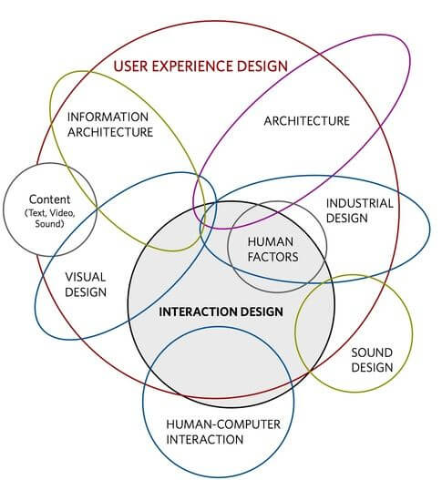
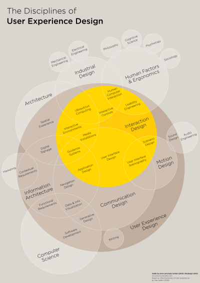
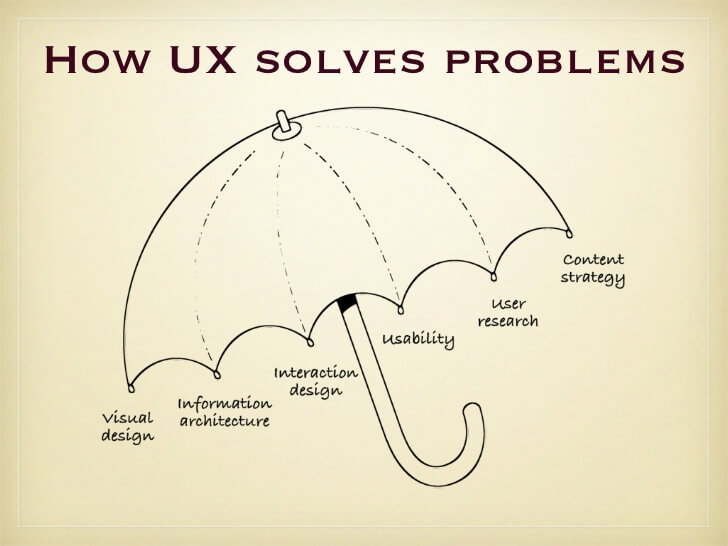

## Quais são as áreas da UX

Anteriormente, estudamos o que é "Experiência de Usuário", exploramos o conceito de experiência e diferentes tipos de usuários. Mas, quais áreas englobam a UX? E de onde surgiu o termo "UX"?

O termo foi criado em 1993 por [Donald Norman](https://pt.wikipedia.org/wiki/Donald_Norman), vice-presidente de Tecnologia Avançada da Apple, no início da década de 1990. O termo foi criado considerando a falta de um para fazer referência à experiência do usuário de maneira abrangente.

A UX ocorre antes e depois do momento da venda. Por exemplo, quando vemos a propaganda de uma multicanal, temos uma primeira experiência de usuário com a marca. Se encontrarmos uma dificuldade com o serviço de internet e precisarmos ligar para a assistência técnica, teremos outro tipo de experiência.

Existe um livro bastante famoso escrito por Norman, chamado "The Design of Everyday Things", no qual o autor afirma que design se refere também à função e à forma do seu produto, e não apenas à parte estética.

Se fizermos uma pesquisa no Google, encontraremos diversos infográficos sobre o que é UX. Um deles foi criado por [Dan Saffer](http://www.odannyboy.com/).

 

 

O infográfico é um tanto minimalista. Possui um círculo vermelho que engloba tudo o que faz referência à experiência de usuário. Algumas áreas são englobadas parcialmente. Uma delas é a de "Arquitetura da Informação", que nos remete à estrutura da informação, destacando os elementos de maior relevância na tela.

Outro exemplo é quando um redator trabalha com o conteúdo do site, preocupando-se também com a experiência do usuário. Focando na parte mais textual do UX, o Microcopy trabalha a utilização de textos para que o usuário se sinta confortável no site.

A parte de "Design Visual" envolve preocupações que vão além da criação de um layout bonito. Observe que ela também se comunica com outras áreas, como "Conteúdo" e "Design Interativo". Outra área inclusa na UX é a de "Design Sonoro", que permite a identificação de uma marca pelo som; o aviso sonoro da inicialização de um sistema operacional, por exemplo.

O designer Philipp Sackl se aprofundou ainda mais no tema. O infográfico exibido abaixo está disponível também no [Github de Sackl](https://github.com/envisprecisely/disciplines-of-ux).

 

 

O maior círculo do gráfico, na cor marrom, representa a Experiência de Usuário, englobando **muitas áreas**, como: Ciência da Computação, Conteúdo, Interface e HCI (*Human Computer Interaction*, que se refere à interação entre humanos e computadores). O infográfico também mostra áreas que se relacionam de forma indireta com a UX, como:

+ Engenharia mecânica;
+ Engenharia elétrica;
+ Filosofia;
+ Ciência Cognitiva;
+ Psicologia;
+ Sociologia.

O "UX umbrela" é outro infográfico, criado por [Dan Willis](http://www.dswillis.com/), que representa bem as áreas englobadas pela UX, como:

+ Visual Design;
+ Arquitetura da Informação;
+ Design Interativo;
+ Usabilidade;
+ Pesquisa de Usuário;
+ Estratégia de Conteúdo.

 

 

## Análise do Usuário

A UX engloba diversas áreas. Mas, afinal, de quem é a experiência? A criação de um produto e as decisões tomadas em relação a ele devem se basear em quem irá usá-lo, ou seja, no **usuário**.

Precisamos questionar o quê será melhor para quem usa o produto. Temos que sair do modelo mental de quem cria, focado no mecanismo, e entrar no modelo mental do usuário. Assim, precisamos analisá-lo, nos perguntar quais são os objetivos de vida dele. Por exemplo, se o usuário gosta de viajar e quer realizar uma viagem de um ano, podemos criar um aplicativo relacionado a viagens.

Podemos analisar vários aspectos, como:

+ Será que o seu usuário é influenciado pelos amigos?

+ Ele usa sites de reclamações online?

+ Onde esse usuário está? No ponto de ônibus? Onde ele estava antes?

+ Quais são os seus medos? Se ele tem medo de ser roubado, ele usaria um aplicativo com o nome pouco confiável "Anonimous"? O ideal é que o seu aplicativo consiga amenizar este medo.

> Analisar o usuário é, simplesmente, **trabalhoso**. Mas é possível!

Eu já trabalhei em locais em que não tínhamos a oportunidade de nos perguntar sobre a Experiência do Usuário, questionando:

+ Como será a utilização desse sistema?

+ Qual será o meio de acesso ao produto (*tablet, smartphone*)? Onde ele será necessário (dentro de uma viatura da polícia, no ônibus, na rua)?

Além das características **demográficas**, podemos levar em consideração as características **físicas**, como sexo e idade, buscando identificar perfis. Caso o usuário não esteja habituado a utilizar dispositivos mobiles, podemos explorar isso no aplicativo.

Com relação ao **ambiente**, se o usuário está em uma excursão, será que o celular terá bateria suficiente para usar a aplicação? Ou será que a app é utilizada no transporte?

Podemos analisar também o perfil **psicológico**, identificando qual seria o público da aplicação. Como é o humor dele? Qual será o seu estilo musical? É tímido ou gosta de se relacionar com outras pessoas? Como facilitar a vida do usuário?

Imagine um usuário que acabou de bater o carro e pode estar se sentindo frágil ou ansioso. O ideal seria que a seguradora tivesse uma app para acionar um guincho, rapidamente, por exemplo.

Pensando em uma situação positiva, outro usuário está em uma praia com a família. Como você poderia potencializar o estado de felicidade? De repente, criando uma aplicação de filtros de fotos, como os do Instagram, ou que armazene as imagens com eficiência e segurança.

Todas essas questões envolvem a análise do perfil do usuário.
