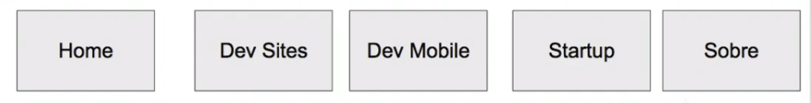
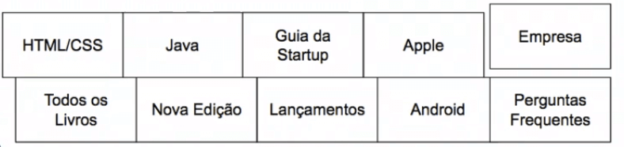
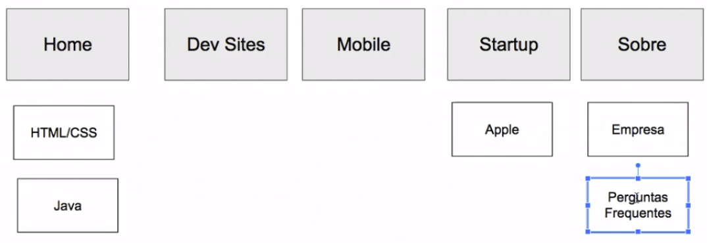
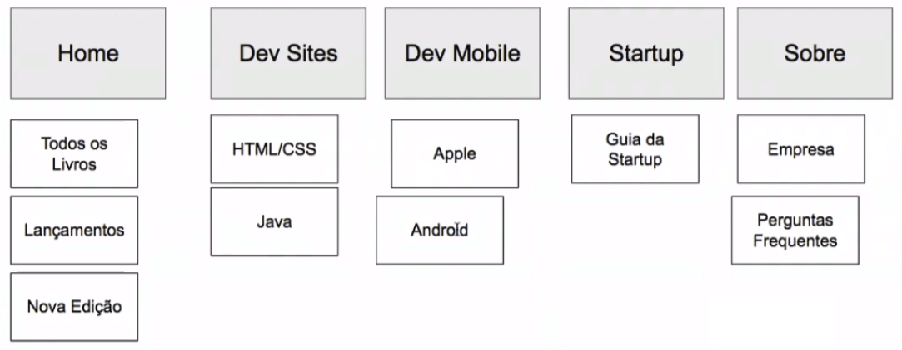
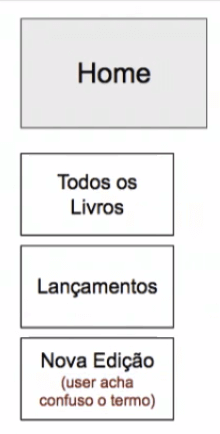
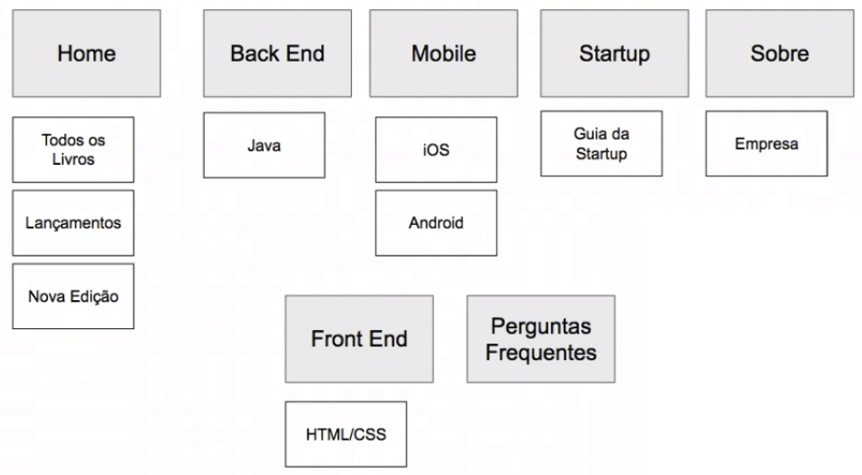

# Card Sorting e Taxonomia

 

## Começando o card sorting

Trabalhamos com as proto-personas, e antes disso, criamos nosso inventário de conteúdo. Sabemos que a Casa do Código tem uma "Home", com três opções no menu, mas será que listamos o conteúdo da melhor forma possível?

Existem um técnica chamada **Card Sorting**, que usaremos para sanar nossas dúvidas sobre as disposições dos conteúdos, se estão da maneira que os usuários acreditam ser mais fácil.

Obviamente, podemos entrar em uma conclusão com o cliente e definir a forma que o conteúdo vai ser exibido. Mas é claro que sempre tentaremos adequar ao usuário.

No *Card Sorting*, nomearemos alguns cartões com as funcionalidades, e o usuário consegue definir um ordem e uma estrutura de como ficará as funcionalidades no site da Casa do Código. Criaremos nossos cards usando o [Google Apresentações](https://www.google.com/intl/pt-BR/slides/about/). É importante que os cards representantes do menu tenham uma cor diferente dos cards das opções.

Imaginando um cenário onde estamos trabalhando em uma empresa que tem como cliente o site da Casa do Código, foi convidado um usuário que trabalha em uma empresa de tecnologia, mas que não é programador, para que ele possa nos ajudar a estruturar o site com o *Card Sorting*.

Existem dois tipos de Card Sorting, os fechados e os abertos. Os fechados são os que nós pré-determinamos os nomes dos cards, e o usuário agrupa as funcionalidades do menu. O formato aberto é semelhante ao fechado, porém, o usuário tem a possibilidade de alterar os nomes. Optaremos pelo fechado, mas se usuário sugerir a alteração de um nome, podemos anotar e trabalhar a ideia com a equipe.

Apresentaremos para o usuário os cards que representam o menu do site. As opções de card são: "Home", "Dev Site", "Dev Mobile", "Startup" e "Sobre".

 

 

Também temos os cards que representam as opções de seções. As opções de cards das seções são: **HTML/CSS, Java, Apple, Guia da Startup, Empresa, Todos os Livros, Nova Edição, Lançamentos, Android e Perguntas Frequentes.**

 

 

As regras para o usuário são simples, basta ele escolher um card de seção e posicioná-lo em uma opção de menu. Por exemplo, se o usuário achar interessante que os livros de "Java" e de "HTML/CSS" fiquem na "Home", deverá arrastar o card dos livros para baixo do menu "Home". A ordenação ficará semelhante ao seguinte exemplo:

 

 

É importante explicar para o usuário qual é a intenção do site para que o usuário entenda o negócio. Podemos inclusive mostrar sites de concorrentes diretos para que o usuário tenha uma visualização sobre como o site poderia funcionar.

 

## [Exercício] O que é Card Sorting

Segundo o que vimos em aula, card sorting é:

- [x] A) Um exercício colaborativo usado para categorizar menus de navegação, objetos ou estruturas de um sistema.
    > Preferencialmente faça sempre o card sorting com usuários, sendo uma forma de pesquisa qualitativa.

- [ ] B) Uma metodologia para organizarmos o conteúdo da forma mais lógica possível.
    > Devemos sempre ter cuidado com fatores de exatas, pois em UX tratamos com pessoas. O mais lógico para nós pode não ser o mais natural para nosso usuário.

- [ ] C) Um exercício usado exclusivamente para categorizar a estrutura de um menu de navegação.
    > O card sorting pode ser usado para categorizar qualquer coisa, até mesmo livros ou brinquedos em um e-commerce.

- [ ] C) Um exercício para balancear os requisitos do cliente com as necessidades do usuário.
    > O texto se refere a uma ferramenta chamada [UX Canvas](https://pt.slideshare.net/fernandaparisi/apresentacao-ux-canvas).

 

## Finalizando o card sorting

De acordo com o nosso usuário, na "Home" do site deveria ter a opção "Todos os Livros", justamente porque na opinião dele um usuário, ao acessar o site, iria querer ver o catálogo completo de livros.

Também na "Home", foi adicionada a opção de **Lançamentos**, por considerar, que outros usuário iriam procurar sobre tecnologias mais recentes do mercado.

Na mesma página, foi colocada a opção "Nova edição", que se refere aos livros do catálogo da Casa do Código que sofreram um atualização. Desta forma, os usuários seriam facilmente notificados dos livros atualizados.

Em "Dev Sites", o usuário decidiu que as opções "HTML/CSS" E "Java" seriam mais interessantes, pelo fato que essas tecnologias são usadas para desenvolver sites.

Na seção **Dev Mobile**, foi colocado as opções "Apple" e "Android", porque Mobile tem relação com aparelhos móveis como smartphones e tablets.

Mesmo o usuário não tem muita familiaridade com Startup, nesta seção do menu, foi colocado a opção Guia de Startup por ser do mesmo assunto.

Por último, na seção "Sobre", foram colocados "Empresa", para que os usuários contatem a Casa do Código, e "Perguntas Frequentes".

A estrutura ficou da seguinte maneira:

 

 

O Card Sorting pode ser feito com diversos usuário, e usando a ferramenta Google Apresentações, podemos separar um arquivo para cada usuário entrevistado.

De acordo com o usuário convidado para participar do Card Sorting, o termo "Nova edição" não deixa muito claro o que significa, e que outros usuário poderiam confundir com "Lançamento". Por isso colocaremos uma anotação no card.

 

 

Repare que usamos "Apple" no lugar de "iOS", justamente porque o entrevistado não é desenvolvedor. Em entrevistas para o Card Sorting, é importante que a linguagem fique mais acessível para usuários que não são o público-alvo.

Agora com as informações adquiridas com os usuários, a equipe de UX decide se o qual estrutura será melhor para o site. Com a ideia pronta, será necessário conversar com o cliente para termos a decisão final.

Mas lembrando que o modelo do Card Sorting pode ser alterado. Podemos colocar seções no menu como "Back-end" deixando apenas o "Java" e outros livros relacionados a essa área, e outra seção "Front-End" colocando "HTML/CSS" e os livros de Front-end.

A seção "Startup" poderia ser mudado para "Empreendedorismo" para que os usuários que não tenha familiaridade com o termo.

Agora precisaremos conversar com a equipe e ver se faz sentido as informações que coletamos.

 

## Após o Card Sorting

Após facilitar um card sorting, você precisa dar continuidade no projeto

Citamos em aula que uma tarefa deveria ser cumprida.

Das opções abaixo, qual é essa tarefa?

- [x] A) Validação da categorização feita 
    > Importante validar o card sorting diretamente com usuários.

- [ ] B) Criação de um moodboard 
    > Como saber se os resultados de algumas rodadas de card sorting fazem sentido para mais usuários?

- [ ] C) Análise de concorrentes (benchmarking) 
    > Comumente fazemos isso antes do card sorting.

- [ ] D) Prototipação 
    > A prototipação é interessante num segundo momento. Primeiro precisamos validar a categorização feita pelos usuários.

 

## Taxonomia

Conversamos com o usuário convidado, e agora precisamos saber se a estrutura proposta faz sentido. Separaremos alguns pontos que sobre o que foi conversado.

O usuário relatou que o campo **Nova Edição** era confuso. Por isso a equipe decidiu manter essa sugestão e ver com o cliente se aprova a mudança.

Outro ponto que foi decidido é trocar a seção **Dev Site** por duas novas seções, **Back End** e **Front End**. Dessa forma o livro de **Java** ficariam em Back End e o de **HTML/CSS** ficariam em Front End.

Na seção de **Mobile**, a única coisa que foi decidido era de trocar o **Apple** por **iOS**. E em ***Empreendedorismo**, foi retornado o termo **Startup**, já que o público alvo tem familiaridade com o termo.

A seção Sobre ficou bom, porém o mais interessante era criar um seção própria para o Perguntas Frequentes.

 

 

Normalmente junto com com o *Card Sorting*, fazemos a **Taxonomia**. A taxonomia é uma técnica que nos auxilia a colocar nomes que fazem sentido para o nosso contexto.

Vamos analisar a taxonomia do site do [G1](https://g1.com). O site do G1 possui diversas categorias, como: **todas as regiões** que você pode ir filtrando entre as subcategorias para a região desejada, **na tv**, que mostra todos os programas, **globonews**, que também é um programa de tv, porém ficou em um seção separada por fazer mais sentido para os usuários, e muitas outras seções. Um observação é que existe a seção **fale conosco**, mas dentro de serviços também tem essa opção.

 

 

Sobre a estrutura que colocamos no *Card Sorting*, as seções **Back End** e **Front End** fazem sentido, já que são áreas de atuação dos profissionais que utilizariam a Casa do Código. Dessa forma, se livros novos sobre linguagens de back-end surgirem, já tem um seção pronto. O mesmo serve para *front-end*.

As seções como **Mobile, Startup** e **Perguntas Frequentes** fazem sentido para o nosso contexto, já **Sobre** poderia ser alterado para **Sobre nós**. Ainda falta conversarmos com o cliente para uma possível alteração da opção **Novos Livros.**

Como poderemos fazer para validar essas informações com o cliente? Esse é o nosso próximo passo.

 

## [Exercício] Criando seu card sorting

Assim como fizemos no estudo, crie o card sorting do site com um colega ou amigo. Utilize cards de papel ou no computador, e registre esse momento, filmando a ação do seu usuário.

Após feito isso, pense você em nomes para as categorias, relembrando o que vimos de taxonomia.

Lembre-se que o Card sorting deve ser um momento que o usuário organiza como ele quer e não como você quer. Caso tenha algo que não faça sentido nenhum, reorganize e então parta para o momento da Taxonomia.

 

## [Links] Mais sobre card sorting

+ [Links interessantes sobre card sorting:](https://www.usability.gov/how-to-and-tools/methods/card-sorting.html)
+ [Por trás do novo visual do Alura](https://www.alura.com.br/artigos/por-tras-do-novo-visual-do-alura)