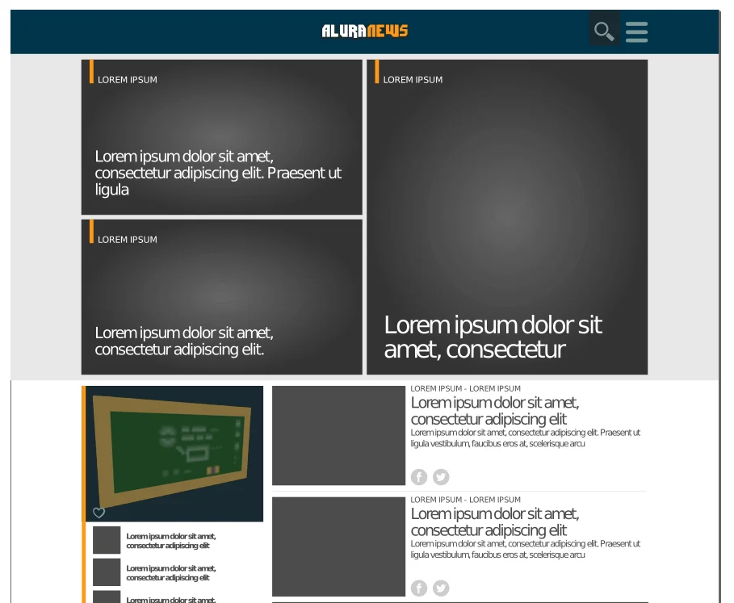
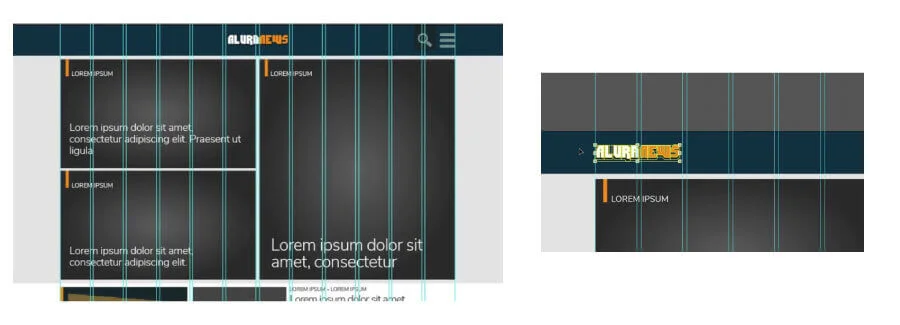

# Introdução

 

Neste estudo, analisaremos os mitos da usabilidade em relação a interface. Receberemos um material de um portal de notícias do nosso cliente para fazer essa análise e usaremos como referência principal o site [UXMYTHS](https://uxmyths.com/), além de muitos outros estudos em nossos exercícios.

Faremos toda a análise dos mitos da usabilidade ligados a interface e logo aplicaremos algumas melhorias relacionadas ao material do nosso cliente. Para isso, trabalharemos com o Illustrator

 

Este é um estudo mais prático que irá abordar alguns mitos, são eles:

Mito 7: Os gráficos tornarão um elemento da página mais visível
Mito 8: as fotos melhoram a experiência dos usuários
Mito 9: O design precisa ser original
Mito 13: Ícones aprimoram a usabilidade
Mito 28: Espaço em branco é um espaço desperdiçado

Aqui você poder ler, resumidamente, sobre todos os 34 Mitos de UX:

 

## Mitos UX

### Mito 1: as pessoas leem na web

As pessoas leem um texto somente quando é de interesse próprio. Somos acostumados a escanear o texto procurando por palavras-chave que faça sentido com o que estamos procurando, pois muitas das vezes estamos com pressa.

Então é importante destacar palavras-chave, ter títulos interessantes, e quando possível parágrafos curtos, facilitando e oferecendo uma melhor leitura ao usuário.

 

### Mito 2: todas as páginas devem estar acessíveis em 3 cliques

As pessoas não saem do site ou aplicativo se não conseguirem encontrar as informações desejadas em três cliques, de fato, o número de cliques necessários não afeta a satisfação do usuário nem a taxa de sucesso, o que realmente conta é a facilidade de navegação, e disponibilidade de informações.

 

### Mito 3: As pessoas não rolam

Para um conteúdo como algum artigo ou tutorial, a rolagem oferece uma usabilidade ainda melhor do que dividir o texto em várias páginas separadas, para que isso aconteça é preciso seguir certos princípios de design e fornecer conteúdo que mantenha seus visitantes interessados.

 

### Mito 4: Design significa tornar um produto com boa aparência

Muitas pessoas consideram o design de produtos como decoração, mas o design ux é baseado no entendimento de como os usuários pensam e se comportam. E o conjunto de ferramentas do designer não é apenas cores e estilos de fonte, pois também inclui pesquisa de usuários, prototipagem, testes de usabilidade e muito mais.

 

### Mito 5: Acessibilidade é cara e difícil

Criar um site acessível a partir do zero custa praticamente o mesmo que desenvolver um site que não é.

 

### Mito 6: sites acessíveis são feios

Um requisito essencial da acessibilidade da Web é separar o conteúdo (HTML) da aparência visual (CSS) para permitir com que usem sua própria folha de estilos específica para acessar o conteúdo. Por tanto, como a aparência visual de um site é definida pelas folhas de estilo, a acessibilidade não tem nenhum impacto no design visual.

 

### Mito 7: Os gráficos tornarão um elemento da página mais visível
Quando as pessoas procuram algo específico em um site, pesquisam texto e links para que as informações sejam encontradas e, muitas vezes, as pessoas confundem elementos visuais e coloridos da página com anúncios e evitam clicar.

 

### Mito 9: O design precisa ser original

Muitos profissionais preferem criar um design novo do que adaptar os padrões convencionais de outros designs que funcionam bem e que já foram introduzidas e testadas quanto à usabilidade, o que deve ser feito é considerar os padrões já testados.

 

### Mito 10: se seu design é bom, pequenos detalhes não importam

Detalhes finos, como uma mensagem de erro informativa ou as ordens em que os produtos são mostrados em uma página de categoria, impactam a experiência do usuário e os resultados finais.

“Os detalhes não são os detalhes. Eles fazem o design. ” disse Charles Eames .

 

### Mito 11: você precisa redesenhar seu site periodicamente

Feedbacks de usuários em diversas reformulações provaram que eles não gostam de mudanças , mesmo que o novo design seja claramente superior ao original. Para que um projeto (ou realinhamento) seja eficaz, ele deve resultar do entendimento das funcionalidades que funcionam e das que não funcionam no site atual, e de como as necessidades do usuário foram alteradas desde o último projeto.

 

### Mito 12: Mais opções e recursos resultam em maior satisfação

Quanto mais opções um site ou aplicativo da web oferece, mais difícil é entender a interface. Estudos mostram que ter muitas opções muitas vezes leva à paralisia da decisão e à frustração, a solução mais simples vence com maior satisfação.

 

### Mito 13: Ícones aprimoram a usabilidade

Muitos pesquisadores mostram e comprovam que os ícones são difíceis de memorizar e são altamente ineficientes, substitua por textos. Utilize, em último caso, ícones que estamos acostumados a ver e de fácil entendimento.

 

### Mito 14: você é como seus usuários

Se você pensar que todos são iguais a você e fazer um design de acordo com os seus ideais e comportamentos, sem envolver e fazer com que os usuários interajam no processo de desenvolvimento do site, há uma grande chance do seu design ser ineficiente.

 

### Mito 15: os usuários fazem escolhas ideais

Em um mundo ideal, os usuários percorreriam a página inteira para encontrar as informações que procuravam, mas a pesquisa mostra que esse não é o caso. Os testes de usabilidade provam que as pessoas tendem a escolher a primeira opção que chama sua atenção.

 

### Mito 16: a pesquisa resolverá os problemas de navegação de um site

Em um site, as pessoas geralmente pesquisam primeiro as palavras-chave e só usam a função de pesquisa quando não conseguem encontrar um link de navegação.

É mais fácil e rápido clicar em um link do que inserir um termo de pesquisa: você não precisa criar espontaneamente a expressão de pesquisa adequada ou se preocupar com sinônimos e ortografia.

 

### Mito 17: A página inicial é a página mais importante

Jakob Nielse e outros especialistas de usabilidade argumentavam que o espaço mais valioso do site é a página inicial, porém este não é mais o caso já que o comportamento de navegação e pesquisa dos usuários mudaram significamente ao longo do tempo.

 

### Mito 18: Flash costumava ser ruim

Antigamente, fazer um design através da tecnologia Flash era considerado ruim, já que nem todo mundo tinha uma boa ou rápida conexão com a Internet ou se quer tinham o Flash Player.

Hoje em dia, os avanços da tecnologia Flash fez com que essa realidade mudasse e ganhou recursos avançados de acessibilidade.

 

### Mito 19: você não precisa do conteúdo para criar um site

O conteúdo é de longe o elemento mais importante no design da interface do usuário. Uma página com uma estrutura simples, mas com conteúdo de qualidade, apresenta um desempenho melhor nos testes de usabilidade do que um bom layout com texto abaixo da média.

 

### Mito 20: Se funciona para a Amazon, funciona para você

Não quer dizer que, se Amazon usou o design x que aumentou significamente o lucro da empresa, todos devem copiá-los, esse design pode não funcionar com você.

Isso não significa que você não deve copiar o design de outras pessoas. Primeiro entenda o porque funcionou para eles e como funcionará para sua empresa e seus usuários, faça adaptações, estude o design.

 

### Mito 21: As pessoas dizem o que querem

Muitas organizações ainda dependem de perguntar às pessoas quais mudanças gostariam de ver em seu site.

Devemos estar cientes de que as opiniões/comportamentos das pessoas são instáveis, ou seja, muda com o tempo. Há uma enorme diferença entre imaginar usar algo e realmente usá-lo.

 

### Mito 22: O teste de usabilidade é caro

Muitas organizações ainda acreditam que o teste de usabilidade é um luxo que requer um laboratório caro e leva semanas para ser conduzido, mas de fato os testes de usabilidade podem ser rápidos e relativamente baratos.

 

### Mito 23: As escolhas sempre devem ser limitadas a 7 +/- 2

A teoria original de Miller diz que as pessoas podem manter menos do que 7 (mais ou menos 2) itens em sua memória de curto prazo.

Porém, em uma página da Web as informações estão visualmente presentes, as pessoas não precisam memorizar nada e, portanto, podem gerenciar facilmente opções mais amplas.

 

### Mito 24: as pessoas sempre usam seu produto da maneira que você imaginou que usaria

Mesmo que um produto tenha sido projetado para atender às necessidades específicas dos usuários, os clientes nem sempre usam com a finalidade que o produto foi originalmente planejado.

Portanto, você deve sempre coletar feedback sobre como seu produto é realmente usado para obter novas ideias.

 

### Mito 25: A estética não é importante se você tiver uma boa usabilidade

Não devemos descartar a estética do site. Os usuários, ao entrar em um site com um design visual agradável e atraente, têm sua primeira impressão positiva, e tendem a achar o site mais credível e mais fácil de usar.

 

### Mito 26: Teste de usabilidade = grupos focais

Quando se trata de coletar feedback dos usuários, os testes de usabilidade e os grupos focais geralmente são confundidos: Os grupos focais avaliam o que os usuários dizem, sentem, pensam, atitudes e motivações. O teste de usabilidade observa como as pessoas realmente usam um produto, analisando seu desempenho e experiência.

 

### Mito 27: o UX design é sobre usabilidade

O UX design é mais do que tornar o produto utilizável, se trata de proporcionar às pessoas uma experiência agradável e significativa sendo elaborado com cuidado.

 

### Mito 28: Espaço em branco é um espaço desperdiçado

O espaço em branco, referente ao espaço vazio entre e ao redor dos elementos de um design ou layout de página, geralmente é ignorado, ele é um elemento essencial no design da web e "deve ser considerado como um elemento ativo, não um fundo passivo" , escreveu Jan Tschichold em 1930.

 

### Mito 29: As pessoas são racionais.

As pessoas não tomam decisões puramente racionais com base em uma análise cuidadosa do custo e da utilidade esperada. Resultados de pesquisas confirmam que as nossas decisões são dirigidas mais por nossas emoções do que por pensamentos lógicos e conscientes.

Portanto, bons designers podem aprender sobre a tomada de decisão humana e ir além da usabilidade para criar produtos que influenciam nosso comportamento.

 

### Mito 30: se você é um especialista, não precisa testar seu design

Quando se trata em avaliar a usabilidade de uma interface, o teste do usuário é frequentemente considerado desnecessário se um especialista já revisou. Os testes de usabilidade e as análises de especialistas são úteis; portanto, é recomendável combinar os dois para obter a análise mais abrangente da interface.

 

### Mito 31: o design de UX é apenas um passo em um projeto

O design da experiência do usuário não se limita em esboçar as interfaces, o design do UX é um processo muito mais amplo, começa no nível da estratégia e afeta todo o ciclo de vida de um projeto ou negócio.

Assim, o design do UX tem uma parte crucial na definição da estratégia de negócios, fornecendo linhas de base para as decisões com entregas de design, como personas ou histórias de usuários.

 

### Mito 32: O sucesso acontece da noite para o dia

Leva muitos anos de trabalho duro, resistência, aprendizado, experimentação e muitas falhas ao longo do caminho para ser um sucesso, mesmo para empreendedores da Internet, seja qual for o negócio, o grande sucesso leva anos para ser construído.

 

### Mito 33: Os usuários mobile estão distraídos

As distrações estão por toda parte, não é um fenômeno apenas para celular, então temos que observar a usabilidade e facilita-la cada vez mais no mobile já que as pessoas estão usando mais o celular.

 

### Mito 34: Simples = mínimo

A **simplicidade** é a chave para um design de produto excelente e inovador, porém ela (simplicidade: redução da complexidade) é muitas vezes confundida com o estilo minimalista (redução de elementos).

Ícones sem rótulos de texto podem ser mais difíceis de entender, as decisões do projeto visando redução (minimalismo) podem facilmente introduzir mais atrito e carga cognitiva, fazendo com que a experiência do usuário seja mais complexa.

 

## Convenções visuais para web

O cliente nos enviou o layout de seu portal de tecnologia para avaliarmos e verificarmos a necessidade de melhorias. Este site possui uma página inicial com uma listagem de notícias, área de destaque e áreas de *widgets*.

 

 

O layout traz também uma página que ilustra uma matéria longa com algumas áreas de *widgets*, entre outros elementos.

 

 

A **primeira etapa** no processo de criação de um layout é a busca por **referências**. Como o portal do cliente trabalha com cobertura de notícias sobre tecnologia, nada mais prático que buscar outras referências de sites tecnológicos. Alguns deles são:

+ [Computer World](https://www.computerworld.com/)
+ [Adrenaline](https://adrenaline.com.br/)
+ [Gizmodo](https://gizmodo.uol.com.br/)
+ [TechTudo](https://www.techtudo.com.br/s)

Todos têm a organização de conteúdo com menus, áreas de widgets, alguns têm bloco de destaque e outros não, mas fundamentalmente, a maioria deles prioriza o conteúdo do lado esquerdo da página e adicionam áreas complementares à direita. Veja a página da Booking, que prioriza o formulário de pesquisa no lado esquerdo:

 

 

O formulário provavelmente é a parte mais importante do portal. É onde os usuários fazem buscas por hotéis. Já as matérias secundárias, tomam conta do lado direito da página. O que é natural, considerando que em português a leitura começa da esquerda para a direita. Mas, e se lêssemos da direita para a esquerda, como em Árabe, de que maneira o site da Booking estaria posicionado? Mudando o idioma do site, veremos:

 

 

As áreas importantes são movidas para a direita, ou seja, se adapta a leitura do usuário. Se utilizarmos os sites da TechTudo e do Gizmodo como referência, veremos que eles têm características comuns, áreas de destaque, listagem de notícias à esquerda e widgets à direita. Talvez seja isso mesmo que devemos seguir.

Observando isso, cairemos no primeiro mito: [O design tem que ser original?](https://uxmyths.com/post/712377283/myth-9-design-has-to-be-original) *(mito 9 no site UXMYTHS)*. O designer, por ter um trabalho criativo, tende a querer criar algo novo, do zero e inovador. O que nem sempre é funcional, porque o usuário está adaptado a determinados padrões e essa nova criação pode deixá-lo confuso, dificultando a interação.

De acordo com o livro "Don't Make Me Think", do arquiteto de informação [Steve Krug](https://en.wikipedia.org/wiki/Steve_Krug), as convenções são boas e ajudam os usuários quando os mesmos vão de um site para outro. Um leitor do Gizmodo ou TechTudo pode encontrar facilidade para navegar quando visitar nosso site, se ele for semelhante aos dois citados.

[Seth Godin](https://www.sethgodin.com/), escritor norte-americano sobre livros de negócios, afirma em seu blog que há mais de 1 bilhão de páginas para utilizarmos como inspiração e que referências são importantes. No momento da criação, o designer pode utilizar essa referência para criar algo semelhante, favorecendo a experiência do usuário.

Ben Hunt traz outra informação interessante em seu [blog](https://seths.blog/2007/10/how-to-create-a/), sobre não forçar o processo criativo a qualquer preço, tornando o processo mais simples, barato e lucrativo, beneficiando ainda mais o usuário que já está adaptado com as convenções na web.

Considerando o que falamos, o que podemos fazer para melhorar nosso layout? Notem que a logo marca está centralizada. Isso não é um problema, mas por ordem de leitura, posicionaremos a mesma no lado esquerdo. Não podemos dizer que será melhor, de fato, porque é exigido um teste de usabilidade para afirmar com certeza. Porém, estamos quebrando mitos. Sendo assim, moveremos o ícone da logo marca para o canto esquerdo.

 

 

Lembrem-se que o controle de posicionamento com valores absolutos pode ser utilizado movendo o ícone para o pixel 1280 à esquerda e 25 para cima. Para não repetir o trabalho na página interna, utilizaremos os atalhos 'CTRL + C' para copiar e 'CTRL + F' para colar na frente. Assim, posicionaremos os itens exatamente na mesma posição.

 

 

Podemos melhorar a parte de destaques do site também. Vamos invertê-la para que o destaque maior fique à esquerda e os secundários fiquem à direita.

 

 

A área de widgets em nosso site está posicionado à direita das notícias, vamos invertê-los também. O que antes estava assim:

 

 

Ficará assim:

 

 

Com isso, terminamos os ajustes para a página inicial. Vamos para a página de artigo? Nele, precisamos apenas inverter a posição do conteúdo com a da área de widgets.

 

 

Uma dica é sempre usar o Zoom para alinhar corretamente como as linhas guias e usar o 'SHIFT' para mover os elementos na horizontal, mantendo o alinhamento vertical. Ao final, podemos usar o 'CTRL + 1' para aplicar o Zoom de 100% e ter uma experiência próxima a do usuário e verificar se a leitura parece mais natural. Nessa verificação, lembrem-se de ocultar as guias.

Assim, quebramos o mito de que o design da página **precisa** ser original. De fato, melhoramos a experiência do usuário, tornando-a semelhante à experiência que ele tem em outros, sem que seja necessário reaprender algo.

 

## Arquivos do estudo

### Detalhes importantes

**Fontes ausentes:** Se esta notificação surgir ao abrir o arquivo, instale as fontes Nunito Sans disponíveis na pasta _fonts, que serão utilizadas nesse projeto. Caso contrário seu texto terá a fonte substituída por uma fonte padrão utilizada pelo programa.

**Imagens não encontradas:** Se surgir um aviso de imagem não encontrada, clique em Replace (Substituir), selecione a pasta de _images e clique em Replace. As imagens do projeto serão todas vinculadas novamente.

 

## Convenções visuais

O que podemos concluir sobre o que são convenções visuais na web?

- [ ] A) Características que todo layout tem por padrão quando será desenvolvido. 
    > A utilização de quantas e quais convenções visuais serão utilizadas cabe à equipe do projeto, ou seja, não é um roteiro padrão a ser seguido, e sim uma boa prática.

- [ ] B) São orientações de passos para criar um layout mais original. 
    > As convenções visuais são elementos padrões que funcionam bem para a usabilidade e, portanto, não estão atrelados à originalidade do projeto, mas ao reaproveitamento do que já existe para facilitar a interação do usuário.

- [ ] C) Acordos preestabelecidos para que os layouts sejam sempre similares. 
    > Utilizar as convenções visuais, segundo Ben Ruch, significa não forçar um design original a qualquer custo, o que também não quer dizer que estaremos presos dentro de um único modelo de layout e sim que utilizaremos um recurso para poupar gastos de tempo e dinheiro desnecessários.

- [x] D) As convenções visuais facilitam a interação do usuário com o site. 
    > Steve Krug afirma em seu livro Don't Make Me Think que as convenções são "amigas", uma vez que, se o site for mais parecido (não igual) com outros sites do mesmo tema fica mais fácil para o usuário encontrar o que ele procura.

 

## Primeiros passos

O que devemos sempre fazer antes de começar a criar ou corrigir um layout?

- [x] A) Procurar referências de sites que já existam 
    > Olhando para as referências do que já encontramos por aí, as referências visuais que buscamos, entendemos melhor como está o mercado na área e quais os padrões mais eficientes para usabilidade.

- [ ] B) Desenhar nosso rascunho do layout procurando ser o mais original possível. 
    > A originalidade pode ser um problema para a compreensão do usuário e, consequentemente comprometer a usabilidade da página. Portanto, uma boa prática para iniciar um layout é buscar as referências visuais já existentes.

- [ ] C) Alinhar os elementos do layout de considerando apenas as nossas preferências. 
    > Embora as preferências devam ser consideradas durante a criação, utilizar referências visuais antes de iniciar o desenvolvimento colabora para um trabalho mais ágil e mais focado, buscando padrões que facilitam a usabilidade do site.

 

## Distribuindo e organizando

O design tem que ser algo original sempre?

- [ ] A) Não, os usuários não compreendem as novidades que inserimos 
    > A originalidade é algo importante, porém, padrões e elementos muito incomuns no layout podem prejudicar ou dificultar a usabilidade do site.

- [ ] B) Sim, só assim conseguiremos alcançar mais usuários. 
    > O excesso de elementos novos em um layout pode dificultar a usabilidade para os usuários e, consequentemente, diminuir o alcance que esperávamos.

- [ ] C) Sim, pois os designers precisam ter liberdade no processo de criação para reinventar e criais novos padrões. 
    > Ainda que os designers queiram incluir novidades no layout, novos padrões podem dificultar a usabilidade. Utilizar convenções visuais auxilia na compreensão por parte do usuário.

- [ ] D) Não, pois estamos acostumados com alguns padrões e algo totalmente novo pode acabar confundindo o usuário. 
    > Ao inserirmos muitas novidades no layout corremos o risco de prejudicar a usabilidade do site e dificultar a compreensão por parte do usuário.

 

## Reposicionando os elementos

Abra o arquivo do projeto no Illustrator e aplique as mudanças de posicionamento aprendidas no estudo.

Lembre-se dos conceitos levantados em aula quanto à orientação de leitura para reposicionar esses elementos. Mova os elementos mais importantes do layout para a esquerda, como as notícias e os destaques primários, e deixe à direita os elementos menos prioritários, como os widgets.

Utilize o grid do documento para facilitar na organização e procure deixar o arquivo o mais próximo possível do que vimos no estudo para que possamos trabalhar neste mesmo projeto nas aulas seguintes!

Desbloqueie as camadas, deixando apenas o plano de fundo e as guias bloqueadas.

 

 

Mova o logo da AluraNews para a esquerda, alinhado à guia. Depois, reposicione os destaques da esquerda para a direita e vice-versa, deixando os elementos de maior importância do lado esquerdo do layout.

 

 

Vá reposicionando os elementos até que seu resultado fique mais ou menos assim:

 

 

 

 

