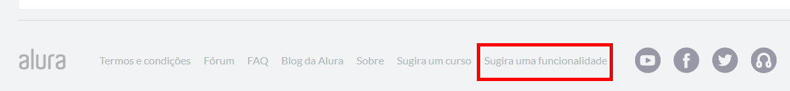
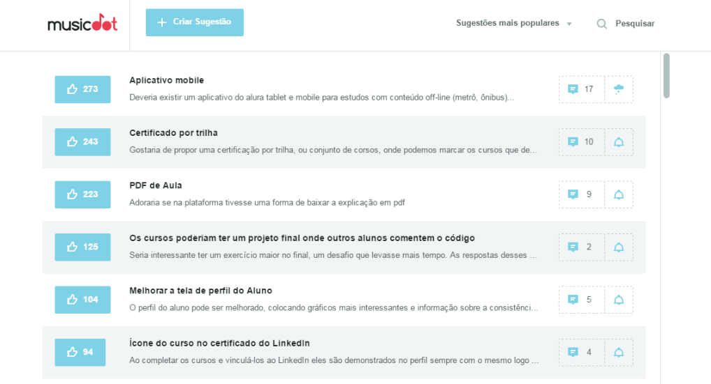
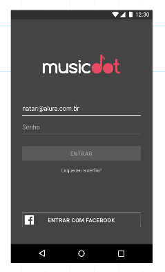
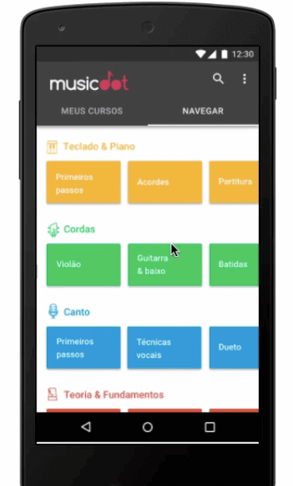
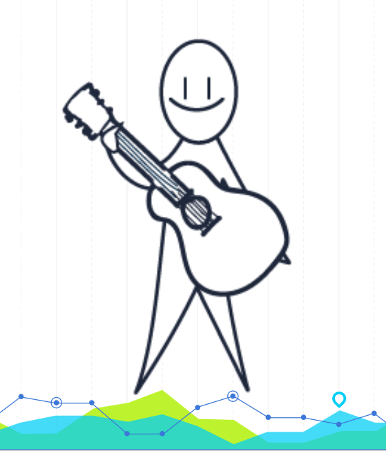
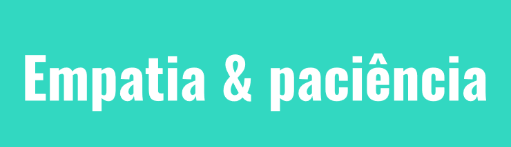
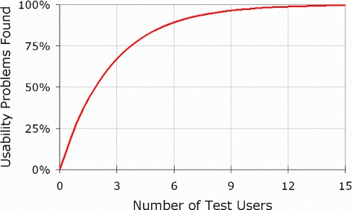
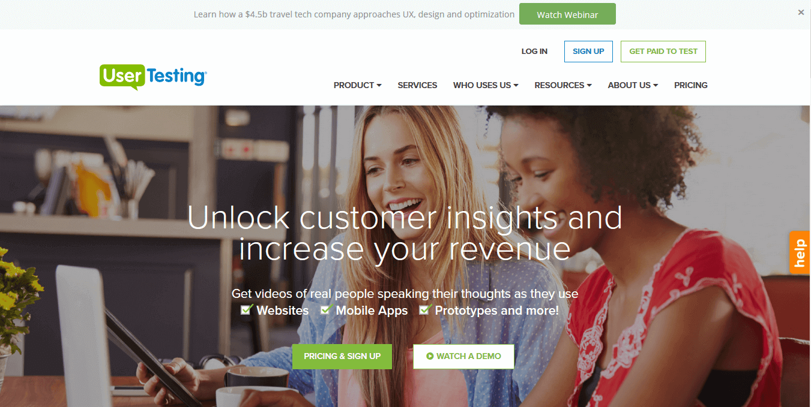
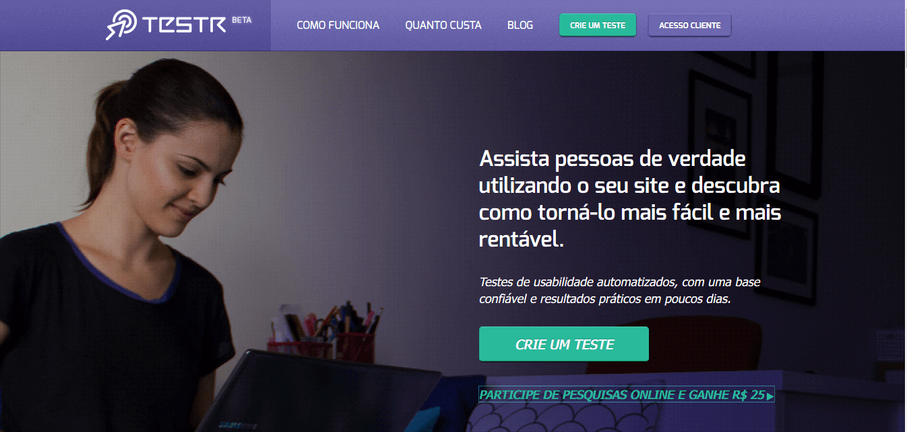
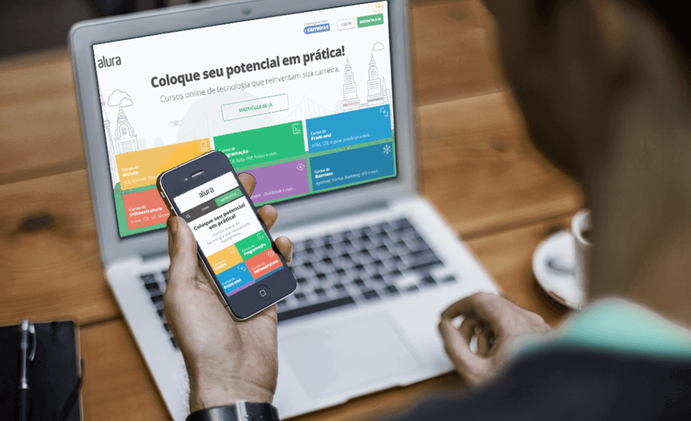

# Validação de ideias

 

## Validar ideia

Imagine a situação em que seu chefe informa a necessidade de criar um aplicativo para a empresa e a justificativa é "já que toda empresa tem app, nós também teremos". Você pode já ter passado por uma situação parecida, talvez, não com um aplicativo... Mas às vezes, podem ter solicitado a criação de um funcionalidade que não tinha uma demanda real. Mas será que existe a demanda para um aplicativo da MusicDot? Vamos ouvir a opinião do nosso usuário para respondermos a questão. Poderíamos perguntar pessoalmente, mas seria trabalhoso. Na plataforma da Alura, existe uma seção em que os usuários podem sugerir uma nova funcionalidade.

 

 

Imagine que colocamos a funcionalidade de sugestão na plataforma da MusicDot e ela ficou da seguinte forma:

 

 

Observe que a sugestão que aparece no topo é a aplicação para o **aplicativo mobile**. Desta vez, o chefe estava certo, logo, passaremos a tarefa para os desenvolvedores. Mas precisamos pensar em um fluxo de telas que faça sentido para os usuários e encontrar uma forma de não perdermos tempo na fase de desenvolvimento. No curso de [UX Usability](https://cursos.alura.com.br/course/ux-usabilidade), apresentamos o Marvel app, uma ferramenta que nos auxilia na validação de ideias.

 

 

Aproveitei alguns layouts de tela já prontos e criei um protótipo. É possível acessá-lo do meu celular como se fosse um aplicativo, mas com quem eu devo validar? Se enviarmos para o nosso chefe, ele pode nos dizer que gostou do resultado, mas só a opinião dele resolve? É importante validarmos com o usuário também.

 

 

O chefe consegue avaliar a parte de negócios, mas é o cliente final quem poderá nos dizer se o app está funcionando. E onde encontraremos os usuários? A nossa aplicação é focada em cursos de música, então, não resolveria testarmos com uma pessoa que não gosta de música - ou que não tem interesse em aprender a tocar um instrumento. Nós devemos ser mais assertivos na seleção destes voluntários... No curso de UX Strategy, vimos o conceito de proto-personas. Então, devemos já ter uma ideia do perfil do usuário antes de ir para fase de testes.

No nosso caso, poderíamos falar com alguém que tenha interesse em aprender a tocar violão.

 

 

E como faremos para atrair este usuário para a fase de validação do protótipo, sem dependermos apenas da boa vontade da pessoa? É comum oferecermos algum benefício em troca da participação no teste. Como o aplicativo é para a MusicDot, poderíamos oferecer uma assinatura da plataforma em troca. Esta é uma boa alternativa em casos onde o orçamento é escasso.

Você pode captar os interessados divulgando entre as pessoas ou nas mídia sociais. Uma sugestões é divulgar no slack UXSP. Para entrar, basta acessar o endereço [http://uxsp.in/](http://www.uxsp.in/) e solicitar um convite.

 

## Roteiro

O usuário veio até a sua empresa testar seu prototipo. Você, então, entrega o celular e sem nenhum cuidado, diz para ele começa o teste. Você explica nada, nem o funcionamento, nem a utilidade. O usuário só ficará clicando nos botões, sem saber o que está fazendo. Não faça isso...

O objetivo ao fazermos o teste de usabilidade é identificar a praticidade do uso do protótipo. É bem provável que o usuário saiba como usar uma touch screen, ou um teclado e um mouse. Nós queremos testar a usabilidade e não do usuário! Devemos esclarecer isso para o usuário e explicar que queremos avaliar a interface. Para isto, não podemos deixar a pessoa fazer o teste sem nenhuma orientação.

Para evitarmos o maremoto de informações para o usuário, é interessante elaborarmos um roteiro para o teste. Vamos ver um exemplo de roteiro:

> Roteiro
> 
> 1 - Use o campo de busca e digite "canto", use o mouse para fazer a busca;
> 
> 2 - Na página seguinte, clique no curso de Canto I;

No entanto, essas instruções podem não ter ficado tão claras para o usuário e o roteiro ficou parecendo um tutorial. Novamente, você não quer testar o usuário.

Quando falamos em um roteiro para teste, podemos pensar em tarefas para serem executadas:

> tarefas
> 
> 1 - Descobrir quem é o professor do curso e Cantando em Duetos;
> 
> 2 - Achar os cursos de Técnica Vocal;
> 
> 3 - Achar curso de Violão II

Em seguida, nós iremos acompanhar com que facilidade o usuário realizou tais tarefas. Não especificamos quais os caminhos seriam seguidos, nem as formas de realizar as buscas. Nós demos liberdade... Só especificamos em qual ponto o tester precisa chegar e onde termina a tarefa.

 

## Conversa inicial

Pensamos nas tarefas, o seu usuário veio para o teste, mas no momento de realizar as atividades, nós induzimos as ações. Cuidado! Não indique os caminhos que o usuário pode seguir para chegar até onde você deseja. Mas podemos dar dicas... Perguntar "você já observou a parte superior da página?" é melhor do que indicar diretamente onde está e a barra de busca. Nosso objetivo não é dar um tutorial sobre como realizar a busca.

Para o *tester*, o seu protótipo pode se tornar um labirinto em que ele não sabe qual porta escolher. Por isso, o moderador deve ter consciência das potencialidades do protótipo e também, do que não é capaz.

O ideal é começar o teste com um conversa com usuário (uma smalltalk), tentando diminuir a formalidade do contexto. Se possível, tente direcionar a conversa para o tema da sua aplicação. No nosso caso, podemos investigar qual é o interesse do usuário por música, se ele deseja aprender a tocar algum instrumento. Outra finalidade desse momento introdutório é tentarmos tranquilizar o usuário. A pessoa não deve ter medo de manusear o protótipo, de danificá-lo ou que os seus dados fiquem desprotegidos. Vale lembrar que às vezes, um protótipo de alta-fidelidade pode dar a impressão de já ser o produto finalizado e o seu usuário pode se esquecer disso.

As palavras-chaves no caso de teste são: **Empatia & paciência**.

 

 

Coloque-se no lugar de quem está realizando o teste. Ele está em um ambiente estranho, interagindo com pessoas desconhecidas, provavelmente, haverá uma câmera durante o teste. Tente encontrar formas para deixar o tester mais tranquilo. De repente oferecer um café... Ou se o usuário não está conseguindo realizar a tarefa e você está perdendo a paciência... É importante se colocar no lugar do usuário, alguém que disponibilizou seu tempo para testar o protótipo. Mesmo que exista uma contrapartida financeira, é o tester que te ajudará a deixar seu aplicativo melhor.

 

## Equipe e gravar expressão

É importante também que apenas as pessoas necessárias participem do momento do teste - e geralmente, a equipe de desenvolvimento não precisa estar. Pode ser incomodo para o seu usuário ser observado por várias pessoas no momento do teste e isso pode prejudicar o resultado.

Isto também não significa que o restante da equipe não deve ter acesso a nada. Uma opção é deixar o restante da equipe em um sala a parte, exibindo um streaming do teste. Desta forma os membros do time consegue conversar entre si, sem incomodar o usuário.

Um ponto que vale ser analisado é observar como o usuário está reagindo ao menu de **busca**. Será que disponibilizamos muita informação, ou usuário está tendo dificuldade de encontrar um determinado curso. Um fator que auxilia a análise é acompanhar as expressões do usuário enquanto manuseia o protótipo. Por isso, um recurso bastante utilizado é gravação do rosto do tester, feita com uma webcam ou outra câmera mais discreta disposta próxima do dispositivo utilizado. Obviamente, é interessante captar as **microexpressões** do usuário e conseguir identificar em que ponto elas ocorreram. Fazer a pergunta: "Por que o usuário fez essa cara de dúvida quando estava usando o menu de busca?". O time deve fazer este tipo de pergunta durante a realização do teste de usabilidade.

O moderador deve tentar compreender o que está passando na cabeça do usuário, mas sem recorrer à "bola de cristal". O melhor é que o próprio usuário verbalize o que está pensando e assim, não precisamos adivinhar o que ele tem em mente quando clica em algum ponto. E no fim do teste, você pode até perguntar se o usuário gostou do produto, mas a resposta pode não ser tão sincera. Por exemplo, perguntas com respostas de "sim" e "não", podem induzir o resultado. Mais interessante é perguntar o que ele achou do protótipo, tentando extrair informações concretas.

Talvez, neste momento, você consiga levantar coisas que não foram pensadas durante o teste de usabilidade. Novamente,vamos recomendar que você tenha empatia com o usuário e tente adaptar a abordagem para que ele se sinta mais confortável em compartilhar sua opinião.

 

## Quantos usuários? Anotar e justificar

Quando durante a realização do teste de usabilidade, o usuário dá algumas opiniões negativas, você as escuta e tenta justificar as escolhas feitas pelo time. No entanto, o objetivo deste momento não é vender o aplicativo para o tester. O objetivo é testar a interface. Tenha a humildade de reconhecer possíveis falhas que ocorreram durante a execução de algumas ideias. Se o usuário não encontrou o músico de canto, temos que voltar às pranchetas.

Outra dica interessante para usar durante o teste é, além de gravar as reações e ações do usuário, fazer anotações sobre as mesmas. Você não tem como prever se ocorrerá algum problema com o material gravado e por isso, correrá o risco de perder as avaliações feitas no teste. Não seja dependente da gravação e evite o retrabalho.

E como quantos usuários você deve realizar o teste de usabilidade? Há pesquisa indicando que o número ideal é **800**. Mas se formos oferecer alguma gratificação financeira para os participantes do teste, o investimento pode ficar alto. O "guru" da usabilidade **Jakob Nielsen** chegou em um número muito inferior:

 

 

No eixo vertical do gráfico, encontramos os problemas de usabilidade encontrados em relação ao número de usuários testados, do eixo vertical. A maior certeza que o gráfico nos aponta é: se não testarmos o app, não identificaremos nenhum problema de usabilidade da interface. Mesmo se tivermos o tempo muito escasso, tente testar pelo menos com uma pessoa.

Talvez, você tenha dificuldade de convencer a sua empresa a realizar teste, mas tente encontrar formas gratuitas de realizá-lo, inclusive, usando os próprios membros da equipe. Mas observe que depois do número 6, a curva do gráfico começa a ficar reta. Isto ocorre porque, quando realizamos o teste com 5 ou 6 usuários, a partir deste momento os resultados começam a se repetir e os erros encontrados passam a ser os mesmos. Então, o número recomendado por Jakob Nielsen é entre 5 e 6 pessoas. De 800 para 5 usuários, conseguimos fazer um economia grande.

Porém, onde podemos realizar os testes quando os recursos são realmente escassos e não podemos construir um laboratório de usabilidade ou pagar o aluguel de um espaço apropriado. Existem locais que oferecem uma sala com uma janela espelhada - semelhante aos filmes policiais americanos - e nos permitem ficar observando o teste sem sermos notados. Porém, usar um espaço assim não é mais a única opção. Já existem ferramentas online que nos permitem fazer testes remotos de usabilidade, uma delas é a [UserTesting](https://www.usertesting.com/).

 

 

Quando contratamos o serviço, a plataforma encontrará os usuários e realizam o teste. Mas tudo é feito online. E existia a plataforma brasileira de teste chamada **Testr**(encerrou suas atividades no final de 2019), que possui a mesma utilidade.

 

 

São opções podem ser mais econômicas para sua marca realizar um teste. Mas se você não disponibiliza de recursos para investir em testes de usabilidade, minha recomendação é que você "dê um jeito". Encontre um usuário que queria participar, faça em um local mais mais informal... Mas o verdadeiro problema estará em não realizar testes.

Na época da gravação do curso, a plataforma estava em sua versão Beta. Depois, a Testr mudou de nome e passou a se chamar Oppino. Infelizmente acabou parando suas operações. [Post sobre o fim da Testr](https://medium.com/testr/o-fim-do-testr-25640ea23ec2).

 

 

Acima vemos uma montagem de um usuário testando a interface da Alura tanto no notebook como no mobile. Mantenha toda a estrutura inicial citada e adapte a parte do local e das gravações. E caso exista também a limitação do tempo, use como argumento que o trabalho de correção dos problemas posteriores pode ser utilizado neste momento agora. Será que teremos tempo de refazer o trabalho se não testarmos uma feature nova? Reforçando, não deixe de realizar testes. Valide a sua ideia, não só com sei chefe, mas também com o usuário.

É válido também, fazer um levantamento de quanto foi economizado com a realização dos testes. Este pode ser um número bem interessante de apresentar. Mostrar que determinadas decisões tomadas durante o processo trouxeram benefícios como redução das reclamações, aumento dos feedbacks positivos ou se o curso de canto passou a ter uma melhor avaliação.

 

## [Exercício] Validação de ideias

Você fez um protótipo para um cliente seu, um e-commerce de roupas como a Mirror Fashion. Seu chefe pede para ver e pede diversas alterações.

Qual das alternativas abaixo casa melhor com essa situação? Considerando o conteúdo sobre teste de usabilidade visto em aula?

- [x] A) Precisamos validar o protótipo com o usuário 
    É necessário validar a ideia justamente com quem usará o produto/serviço

- [ ] B) Como profissionais de UX (experiência de usuário), não devemos ouvir o chefe 
    **Errado**, o chefe/cliente na maioria das vezes possui uma visão de negócio muito maior que a nossa, é importante ele participar

- [ ] C) Nosso papel é saber o que é melhor para o usuário 
    Nosso papel é entender e defender o **usuário**.

- [ ] D) Precisamos validar o protótipo com o chefe 
    A validação do teste de usabilidade é para validação da facilidade de uso da interface, e não de regras de negócio, que já deveriam ser consideradas no desenvolvimento do protótipo

 

## [Exercício] Recrutando usuários

Sua empresa já autorizou a realização de teste de usabilidade para seu mais novo produto.

Qual o principal problema em recrutar pessoas aleatórias, sem um corte inicial, para realizar esse teste?

- [ ] A) A pessoa pode vir de má vontade 
    Isso pode acontecer, mas pensando no teste, não é o principal

- [ ] B) Não existe problema, pois dessa forma o teste fica mais rico em representatividade 
    Partindo do princípio que já foi feita pesquisas para identificar potencial do público-alvo desse produto, devemos focar justamente nesse público

- [ ] C) A pessoa pode ser usuário de um concorrente 
    Isso não seria um problema, e sim uma rica fonte de informações

- [x] D) Poderão vir pessoas que não são o perfil de usuário que usaria seu produto 
    O que acaba gerando custos desnecessários

 

## [Exercício] Roteiro

Um exemplo de roteiro para um teste de usabilidade:

+ Use o campo de busca e digite "React"
+ Use o mouse e clique no botão de "Pesquisar"
+ Na página seguinte clique no curso de React

Qual o problema principal de se fazer um roteiro desta maneira?

- [ ] A) As instruções deveriam ser mais precisas, como já passar a localização dos componentes 
    Roteiro “tutorial” pode ser irrelevante para um teste de usabilidade

- [x] B) Desta forma você acaba testando o usuário, e não a interface 
    A ideia é testar e conseguir medir a facilidade de uso da interface

- [ ] C) Há poucas instruções 
    Desta forma “tutorial” o número de instruções é irrelevante

- [ ] D) Não há problema, você acaba testando o usuário e a interface no mesmo teste 
    Por qual motivo você testaria a habilidade do usuário em conseguir executar instruções em uma ordem específica?

 

## [Nota] Como fazer uma entrevista

Confira o excelente vídeo do pessoal do Google Ventures (criadores do Design Sprint Method) sobre **como fazer uma entrevista de usuário** (inglês, legendas em inglês):

[How to do a user interview (from Google Ventures updated)](https://www.youtube.com/watch?v=Qq3OiHQ-HCU&ab_channel=KonstantinosKazakos)
