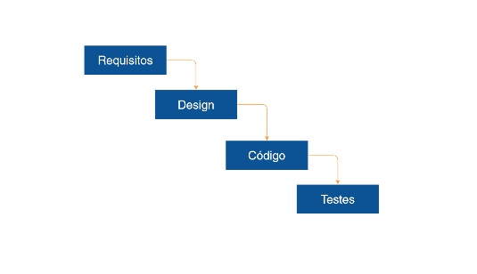
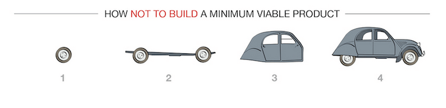
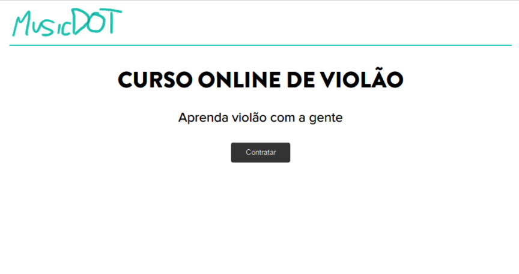
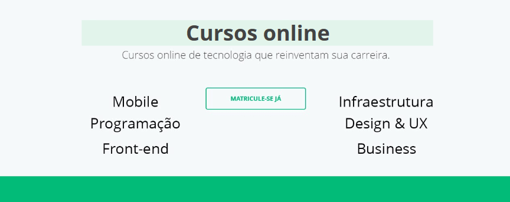
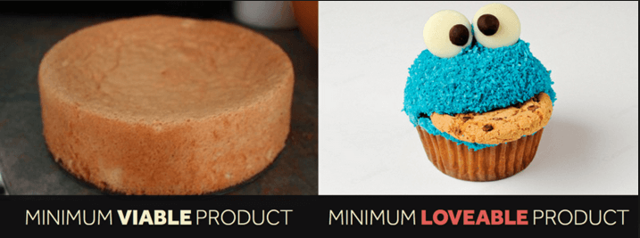

  
  # MVP e MLP
  

 

## Waterfall

Dentre as ideias que tivemos para ajudar o usuário a não viajar sozinho, temos:

+ Chat
+ Reviews
+ Criar grupos
+ Passeios próximos
+ Alerta de passagens

Qual dessas funcionalidades nós priorizaremos?

E se escolhermos lidar com todas as partes ao mesmo tempo? Como existem algumas dessas atividades que demoraremos para finalizar, ou será necessário contratarmos terceiros, imagine que chamemos um analista de requisitos para nos ajudar.

Suponhamos que essa pessoa demore 2 meses para entregar o produto. Podemos pensar que é necessário elaborar o design, as telas do aplicativo após o recebimento dos requisitos, e a criação disso tudo levará em média 4 meses. Também será necessário um front-ender ou back-ender para finalizar a parte de programação e desenvolvimento. A pessoa responsável por isso também acaba dando um prazo de 4 meses. Até agora temos a soma de 10 meses para a finalização do aplicativo.

Por fim, falta testar tudo isso que construímos e, pensando nisso, podemos terceirizar essa etapa, resultando em um mais um prazo de 2 meses. Assim, a duração do desenvolvimento do projeto será, ao todo, de 12 meses! Será que as necessidades e objetivos do cliente serão as mesmas quando chegarmos ao final desse projeto que levará todo este tempo de produção?

A ideia de começarmos uma atividade apenas quando outra termina implica no **Waterfall**, em que inicialmente trabalham-se os requisitos, passando para o design, e depois encaminha-se para a programação, ao final da qual fazem-se os testes. Ou seja, é uma lógica de cascata:

 

 

Nesse meio tempo o usuário pode ficar frustrado, seja esperando o aplicativo, ou o desenvolvimento de uma nova funcionalidade. Não que o modelo Waterfall não funcione, na verdade diversas empresas o utilizam. Porém, ele vai contra as ideias da engenharia da agilidade.

Agilidade consiste em lidarmos com pequenas partes de um projeto, em vez do todo. No lugar de focarmos no todo e fazer um aplicativo mega revolucionário, hiper completo, vamos pegar uma ideia e ver o que conseguimos desenvolver a partir dela.

O que apresentamos aqui é o **Produto Mínimo Viável** ou Minimum Viable Product (MVP), um conjunto mínimo de funcionalidades que podemos ter no produto para lançá-lo. No MVP precisaremos nos preocupar com questões sobre viabilidade.

Por ser um produto pequeno, uma fração de um todo, ele é lançado com mais agilidade. Assim, sempre que pensarmos em produtos e projetos, poderemos pensar também em como gerar valor para o usuário mais rapidamente, e em como ter um retorno rápido também.

Quem utilizará o MVP? O usuário! Então, é necessário pensarmos no MVP focando sempre no modelo mental do usuário, no usuário como sendo o centro das tomadas de decisão.

 

 

Embora o usuário já consiga se locomover a partir da imagem 1, a questão é que o usuário gostaria de, além disso, levar uma segunda pessoa, o que só poderia ser possível a partir da imagem 3 e, ainda, se a segurança fosse primordial, o produto só estaria disponível a partir da imagem 4.

Finalmente, um exemplo de como construir um MVP.

 

 

No número 1 temos um caminhão simples, no 2 temos o mesmo caminhão com uma carroceria. No número 3 o "layout" é melhorado, e corresponde a um carro, e no 4 exibe-se um carro melhor ainda. Nesse exemplo é possível verificar que em todos os passos sempre foi gerado valor para o usuário!

É exatamente isso que desejamos que aconteça ao desenvolvermos o MVP, ou seja, que o valor seja gerado para o usuário. Vamos explorar um caso real que envolve o [musicdot](https://www.musicdot.com.br/), uma empresa de ensino online focada em instrumentos musicais e aulas de música e canto.

Antes do site ser desenvolvido, foi medido o real interesse de diferentes indivíduos em relação ao produto, para verificar se de fato haveria interesse em pagar uma assinatura para aprender a tocar instrumentos dessa maneira. Além disto, quanto seria um valor interessante para tal produto?

 

 

A plataforma [Launchrock](https://www.launchrock.com/) é composta de uma página, um texto, um background e um campo de busca, através dos quais é possível conseguir um levantamento de possíveis usuários de um site que muitas vezes nem chegamos a elaborar. A ferramenta serve justamente para medir este interesse.

Observe que o texto da página fala sobre acesso infinito, "chega de tiozinho com violão velho", valores mensais, e demais informações. Usar essa estratégia serve para averiguar a boa aceitação da ideia, e se as palavras empregadas atraem público.

Usando esta ferramenta, é possível testarmos distintos valores, por exemplo - em um primeiro momento o definimos com R$49, e assim notamos que 50 pessoas manifestaram interesse. Quando colocamos o valor como R$59, apenas 2 pessoas manifestaram vontade de fazer os cursos.

 

## Cases

Vamos ver mais alguns *cases* relacionados a MVP no site <a href="https://scalexl.com/get-inspired/the-ultimate-guide-to-minimum-viable-products/?lid=256" target="_blank">Scalemy Business</a>.

O **Dropbox** é uma plataforma na qual você pode salvar seus arquivos pessoais na nuvem. Antes de sua criação, fizeram um vídeo mostrando como funcionaria essa ferramenta, e através disso os desenvolvedores perceberam que pessoas estavam compartilhando e curtindo o vídeo. Assim, eles compreenderam que havia potencial na ferramenta, e começaram a produzi-la.

É como o **Lauchrock**, que antes mesmo de começar a desenvolver a ideia verifica se haverá público interessado na ferramenta!

Outro *case* vem da empresa **Zappos**, um e-commerce de calçados. Antes de começar a pensar na logística da própria loja, em 1999 o próprio dono da empresa foi a lojas de calçados próximas a sua casa e fotografou os sapatos, colocando-os na internet. Caso os itens fossem vendidos, uma parte do dinheiro ficaria para a loja, e uma comissão ficava com o futuro dono. Quando o negócio se tornou rentável, investiu-se de verdade na ideia. Perceba o quão engraçado é esse MVP, pois foi um processo totalmente manual.

Um terceiro *case* é o da **Concierge MVP**, que antes de lançar um determinado produto expôs sua ideia em uma *fanpage*, com um manual do seu futuro produto para verificar como as pessoas reagem, se há interesse ou não. Lembrando que é importante pensar também no manual, como se você fosse o usuário.

Também existe o caso em que, antes do lançamento do produto propriamente dito, seja utilizado um site de financiamento coletivo como o *Kickstarter*, e o <a href="http://catarse.me" target="_blank">Catarse</a> aqui no Brasil. Trata-se de um *crowdfunding* para apresentação de um projeto. Se as pessoas tiverem interesse podem investir nele, e se baterem a meta do financiamento, o projeto é autofinanciado.

O **Single Featured MVP** pode ser exemplificado pelo caso do **Google**, que no início só possuía uma funcionalidade: ser um buscador. Não existia e-mail, calendário, Google Keeper e nenhuma de suas outras funcionalidades.

 

## Entendendo o MLP

Será que apenas o MVP é suficiente? Vamos observar o primeiro caso, do musicdot:

 

 

Notaremos que esta página está esquisita, e para melhorá-la acrescentaremos um menu de navegação, adaptaremos as cores, o logotipo, acrescentaremos um ícone de desenho de violão, e melhoraremos o layout do botão:

 

 

Mas será que nossa página não segue com um visual predominantemente relacionado a MVP? Vamos trocar o fundo por uma foto de violão, alterar o texto e o conteúdo do botão para "Bora tocar!". Teremos:

 

 

Com isso, o layout muda totalmente. Aquele MVP inicial que tínhamos foi bastante melhorado, e a ideia é deixá-lo atrativo para o usuário. Após tornarmos o produto mais atrativo, é possível considerarmos ir além, pois queremos que o usuário olhe para o produto e pense: "Eu amo esse produto".

Estamos falando de um MVP? Sim! Mas, é um MVP um pouco mais adorável, sendo o produto pequeno, um **Produto Mínimo Adorável**, um **Minimum Loveable Product**, um **MLP**. É um produto viável e extremamente desejável, de que as pessoas se tornarão fãs, e o compartilharão com o mundo. A ideia é realmente fidelizar o cliente, e tornar o produto memorável. Desejamos que a pessoa que se depare com o nosso MLP se torne defensora desse produto!

Vamos analisar mais um case. Imagine que a home da Alura possua o seguinte aspecto:

 

 

Podemos navegar por essa página, no entanto, o que a deixaria um pouco melhor? Observe a página original:

 

 

Essa página seria melhor se tivesse um background bacana, e as categorias separadas por cores. Então, perceba que é possível aplicar MVP, só que o *Minimun Loveable Product* é mais apelativo, tocando em uma esfera mais emocional da pessoa. Uma imagem que traduz melhor a diferença é a seguinte:

 

 

O MVP é o bolo que aparece na primeira imagem, sem chantilly ou cores. Agora, o MPL é o cookie fofo que aparece na segunda imagem, a qual nos remete a uma doceira que prepara seus doces com carinho, para deixá-los lindos e gostosos. Isto traduz o que é o MLP, que ainda é um MVP, sendo um pouco mais adorável e também apelativo!

Quais são as features desse MVP ou MLP? Veremos isso na sequência.

 

## [Exercício] Muitas features

Em um projeto, chega uma hora que temos várias features pensadas.

Pegar todas essas features e tentar colocar de uma vez no projeto pode e/ou vai…

- [x] Todas as alternativas
- [ ] Gerar valor para o usuário somente no final
- [ ] Deixar o projeto “inflado”
- [ ] Atrasar o projeto
- [ ] Gerar valor para o negócio somente no final

Pegar todos os requisitos do projeto, para depois fazer o layout de todas as telas, depois partir para a codificação, é o conceito de waterfall, e isso vai contra os princípios de agilidade.

Em vez disso, é preferível pegar uma parte mínima do produto para ser lançada.

 

## [Exercício] MVP

Em aula vimos o conceito de MVP, que basicamente é...

- [x] Conjunto de funcionalidades mínimas de um produto, que juntas tornam possível colocá-lo em produção e conseguir validá-lo de alguma forma
  O interessante do MVP é justamente não perder muito tempo e conseguir testar sua ideia. Se foi positivo ótimo, continuamos. Caso contrário ótimo também, pois não perdemos tempo com algo que não iria pra frente de qualquer jeito.

- [ ] Conjunto de funcionalidades de um produto com média importância e alta importância

- [ ] Conjunto de todas as funcionalidades pensadas de um produto a fim de deixar o produto mais completo e robusto

- [ ] Conjunto de funcionalidades mínimas de um produto, descartando-se a possibilidade de colocá-lo em produção

A sigla vem de **Minimum Viable Product**, ou Produto Mínimo Viável. É o conjunto de funcionalidades mínimas de um produto, que juntas tornam possível colocá-lo produção.

 

## MVP pra dividir conta

Imagine que estamos trabalhando em uma startup que está desenvolvendo um aplicativo para dividir a conta quando jantamos com amigos.

**Pensando em MVP**, quais as features que esse aplicativo deve possuir?

Para ajudar a definir o que vai no MVP imagine o dinheiro bem escasso, tendo a opção de trabalhar em apenas um objetivo, qual seria ele?

- [x] Adicionar gastos e dividir igualmente entre o grupo

- [ ] Adicionar gastos, login, nome, pesquisa, filtro

- [ ] Adicionar gastos, remover gastos, colocar data/hora, nome e avatar das pessoas

- [ ] Adicionar gastos, geolocalização e dividir a conta entre o grupo

 

Partindo do princípio que a necessidade é apenas **dividir a conta**, um aplicativo que ofereça as funcionalidades de adicionar gastos e da divisão igualitária da conta, já poderia ser considerado um MVP.

Não seria um app incompleto, mas um app mínimo que atenda a um determinado público.

E tudo isso claro, tendo em vista o escopo, o que seria usável para o usuário, minimamente, para que ele enxergue valor no aplicativo.

 

## [Exercício] MVP do Uber

Pegando o Uber como exemplo, note que hoje ele possui diversas funcionalidades e várias opções de categorias diferentes. Em Jun/16 até entrou em Beta a funcionalidade para pedir um helicóptero.

Pense e comente qual seria o MVP do Uber (app do passageiro).

Minimamente, o Uber versão Alpha 0.01 poderia ter somente uma única opção de categoria e a visualização da placa do carro, por exemplo. Até mesmo o pagamento via cartão de crédito pré-cadastrado (questão de segurança para o passageiro e o motorista) poderia entrar em um segundo momento.

Uma pesquisa para conseguir sentir se as pessoas usariam o aplicativo também poderia ser considerado um MVP.

 

## [Ferramenta] Launchrock

Uma ferramenta online comentada em aula é a [Launchrock](https://www.launchrock.com), um gerador de landing page focado em medir aceitação de ideias do público.

Esse tipo de ferramenta serve para medir interesse, medir conversão, medir que palavras atraem e pode ser testado até mesmo valores.

Colocando valores diferentes, para sentir em que ponto ficava caro e as pessoas deixavam menos vezes seu email.

Algumas alternativas:

- [Unbounce](http://unbounce.com/)
- [Spaces](https://mvp-space.com/)
- [QuickMVP](http://quickmvp.com/)

 

## [Post] Leitura complementar - Cases MVP

O *Scale My Business* desenvolveu um guia (em inglês) para MVPs, comentado em aula:

https://scalexl.com/get-inspired/the-ultimate-guide-to-minimum-viable-products/?lid=256

[Se o site estiver fora, tente por aqui](http://scalemybusiness.com/the-ultimate-guide-to-minimum-viable-products/?utm_source=GrowthHackers&utm_medium=Anuj+Adhiya&utm_campaign=Anuj+Adhiya&utm_campaign=Submission&utm_medium=Community&utm_source=GrowthHackers.com)

Se quiser ver a versão antiga do site da Zappos.com ou de qualquer outro site, use a ferramenta Web Archieve:

https://archive.org/web

Dropbox Demo (inglês):

https://www.youtube.com/embed/7QmCUDHpNzE

 

## MLP (Produto Mínimo Adorável)

Pensando em ser mínimo, muitos times acabam levando muito ao pé da letra essa palavra e acabam deixando de lado alguns itens, como erros básicos de usabilidade e design.

Como o MLP (Minimum Loveable Product / Produto Mínimo Adorável) soluciona isso?

- [x] Tentando ser o mais desejável e humano possível

- [ ] Começando o projeto pelo design

- [ ] Todo MVP é um MLP, não existe diferença

- [ ] Tentando ser mais mínimo que o MVP

O MLP é viável também, mas o interessante é que ele seja agradável de se usar, memorável, excepcional.

A ideia é que os usuários desse MLP, mesmo que poucos, espalhem a palavra do meu produto/serviço. Que eles se sintam confortáveis em utilizar, defender minha marca.

Um post sobre MLP:

[MVP é coisa do passado a moda agora é MLP](https://medium.com/collabcode/mvp-%C3%A9-coisa-do-passado-a-moda-agora-%C3%A9-mlp-4446fc476006#.ftdr8maco)
