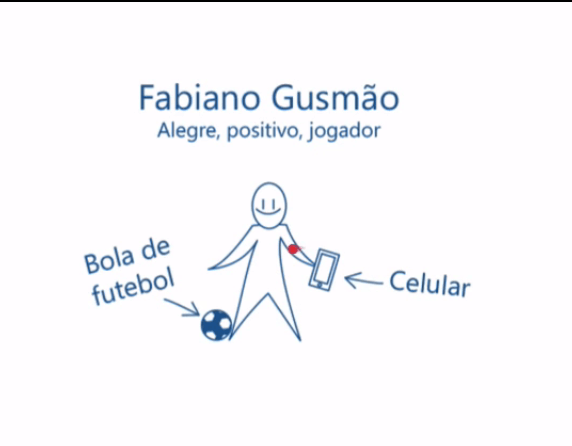
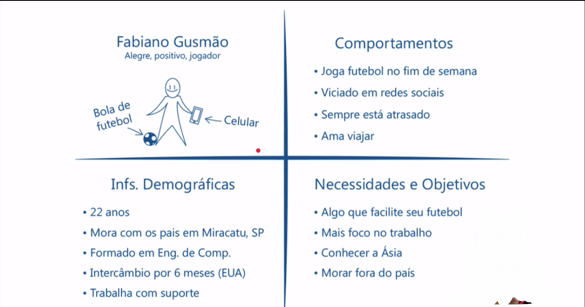
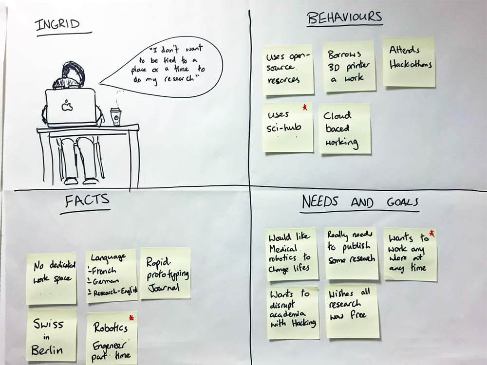
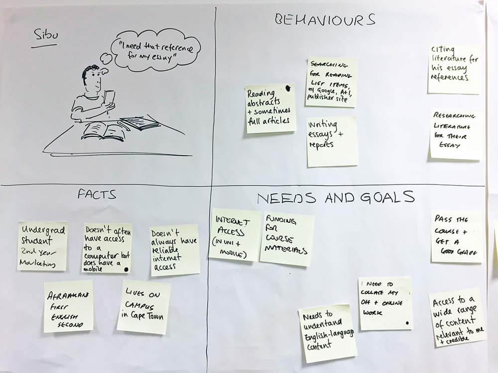

  
  # Entendendo o usuário
  

 

Nas últimas aulas abordamos o Triângulo de Keeley ou Triângulo de Ouro. Lembra-se que preenchemos essa ferramenta e também o 360º View com post its? Fizemos isso pensando no usuário, mas quem exatamente é o usuário?

Temos que continuar nossa investigação para aprimorarmos a estratégia de UX. Por enquanto construímos uma visão geral, portanto é como se continuássemos navegando em um mar de possibilidades. Conseguimos nos direcionar utilizando as ferramentas já apresentadas, mas ainda temos muito o que fazer.

A pergunta agora é: quem é o usuário do aplicativo?

Nós podemos não saber quem exatamente é o usuário, mas provavelmente algum setor da nossa empresa, como o setor de marketing, *Call Center*, ou setores relacionados ao cliente, deve ter informações que nos ajudem a mapear esse perfil. É preciso perguntar: o que esse usuário deseja? Do que ele gosta? Quais são os seus objetivos?

Dessa forma, o que vamos fazer é uma espécie de "chute" ou, em termos técnicos, elaborar uma hipótese. Passaremos a construir a hipótese de quem é nosso usuário, imaginando que ele se chame Fabiano Gusmão. Ele é alegre, positivo, e é jogador de futebol. E como é sua aparência física? Uma pessoa magra, que gosta de esportes e está sempre com o celular em mãos. A partir dessas características faremos um desenho do hipotético Fabiano Gusmão:

 

 

Nesse desenho iremos agregar elementos que representem o usuário, como um celular. Qual é o comportamento de Fabiano? Bom, ele joga futebol nos finais de semana e é viciado em redes sociais. Podemos pensar também em outros características, por exemplo, estar sempre atrasado e amar viajar. Todas essas informações serão anotadas junto ao esquema.

 

## Comportamentos

+ Joga futebol no fim de semana
+ Viciado em redes sociais
+ Sempre está atrasado
+ Ama viajar

Outro aspecto interessante que pode estar presente na hipótese são as informações demográficas do usuário: idade, ocupação, onde vive, se já fez intercâmbio, graduação, e afins.

 

## Informações demográficas

+ 22 anos
+ Mora com os pais em Miracatu, SP
+ Formado em Engenharia da Computação
+ Intercâmbio por 6 meses (EUA)
+ Trabalha com suporte

Dentro desse modelo é importante pensar nas **necessidades e objetivos** do usuário. Já sabemos algumas características de Fabiano, portanto pensaremos em algo **que facilite seu acesso ao futebol, dê mais foco no trabalho, que o faça conhecer a Ásia e que possibilite que ele more fora do país.**

 

## Proto-persona

Após pensarmos nessas quatro categorias: **Comportamentos, Informações demográficas, Necessidades/Objetivos e Nome**, vamos colocar tudo o que mapeamos no papel. Ao fazermos isso traçamos duas linhas transversais que separam o papel em quadrantes diferentes, e em cada um situamos as características equivalentes:

 

 

O usuário hipotético que acabamos de construir é denominado **Proto-persona**.

A imagem acima é um exemplo de ***template*** bem simples de proto-persona. Claro que esse modelo não é um padrão, é possível criar um próprio. É recomendado, porém, atentar-se às informações que **devem** estar presentes no esquema:

+ Nome;
+ Informações demográficas;
+ Necessidades e/ou objetivos;
+ Comportamentos/Hobbies

Vamos analisar alguns exemplos diferentes de proto-persona, como o da Porto Belo:

 

 

Outro exemplo é o de "proto-personinha", outra maneira de montar uma proto-persona, mas de forma mais reduzida. Essa estratégia é interessante para reuniões rápidas. A ideia desse esquema é responder as lacunas das perguntas em laranja. Preenchemos, por exemplo, da seguinte maneira:

+ Quem é Fabiano? Um engenheiro.

+ Do que ele precisa? Arrumar companhia para viajar ou um guitarrista para sua banda.

+ Como a experiência deve ser? Rápida ou gratuita.

+ Por que ele valorizaria? Ele quer que a experiência seja rápida, pois valoriza dinheiro.

 

Para finalizar a aula propomos um **gamestorming** cujo objetivo é elaborar uma proto-persona, cujas regras são:

+ Tempo de duração da atividade: máximo 30 minutos.

+ Ambiente: folhas e canetas.

+ Objetivo: criar a proto-persona.

 

## Nota: Entendendo o Usuário

Com certeza existem pessoas em sua empresa que possuem informações valiosas sobre o usuário, pessoas que possuem uma forte ideia de como o usuário se comporta e age. Baseando-se em hipóteses, uma ferramenta interessante para ajudar a nortear o time na maioria das decisões que envolvem o projeto, é a proto-persona.

Sendo bastante interessante para começar a introduzir a cultura de DCU (Design Centrado no Usuário) na sua empresa, por ser algo simples e barato de ser produzido.

 

 

Possuem normalmente quatro quadrantes:

+ **Nome:** quem é esse usuário e como ele é;

+ Alguns **comportamentos**/hobbies;

+ **Informações demográficas** como idade e profissão;

+ E o ponto chave: suas **necessidades e/ou objetivos**

As informações inseridas na proto-persona podem ser feitas por escrito, da forma vista em aula, ou com cartões (post-its):

 

 

 

 

Fotos via [@Eva_Bec](https://twitter.com/Eva_Bec)
