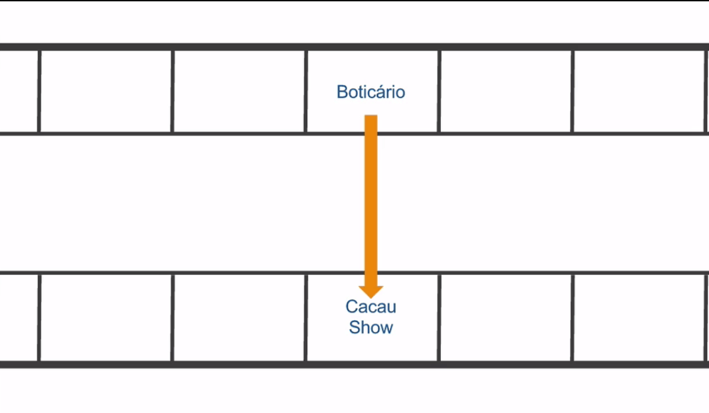
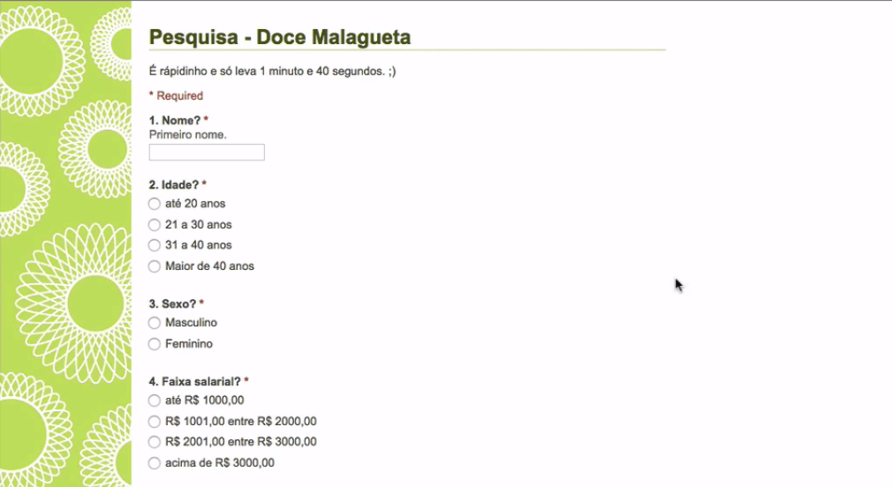
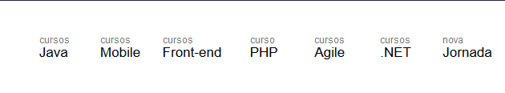
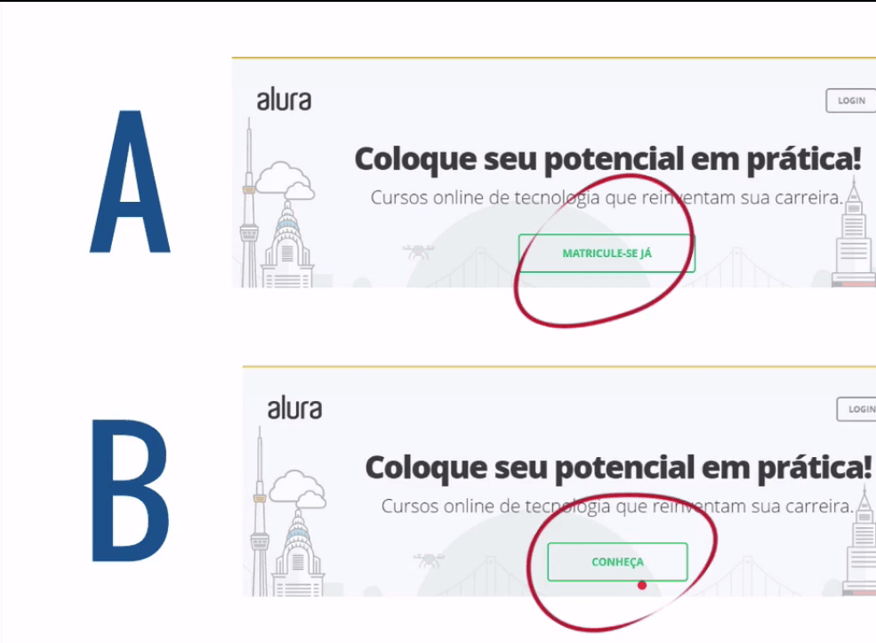
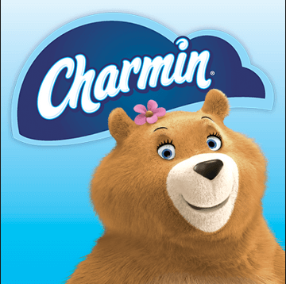
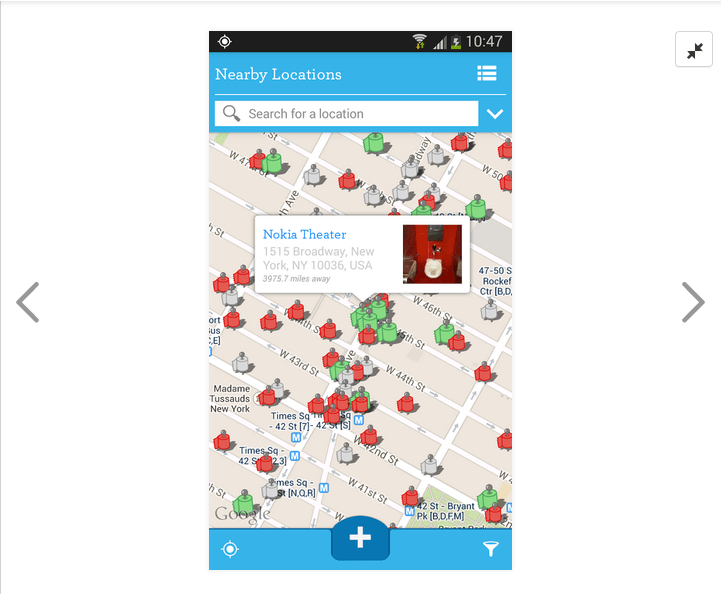
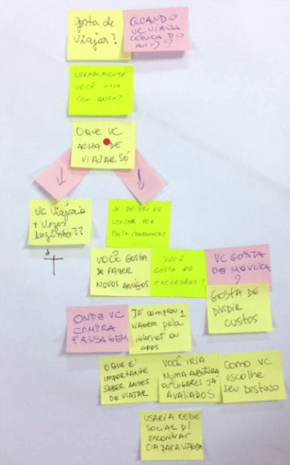

  
  # Definindo o Roteiro
  

 

## Pesquisas e tipos de pesquisas

Já vimos como utilizar diversas ferramentas, mas será que estamos sendo assertivos na construção do perfil do nosso usuário?

Primeiramente, quem é o alvo de tudo isso? Como estamos tentando pré-definir informações acerca do usuário, é necessário pensarmos em realizar uma pesquisa e, para exemplificar a importância disto vamos contar um case do **Boticário**.

Em determinada época a empresa notou um decréscimo nos lucros, e para tentar reverter essa situação, eles começaram a pesquisar sobre o público-alvo da marca, e foi assim que perceberam que este era composto de pessoas de idade mais avançada.

Houve uma tentativa da empresa de realizar campanhas para atrair um público mais jovem. Entretanto, elas poderiam ser prejudiciais, pois o público mais idoso poderia deixar de se identificar com a marca. Assim, a solução encontrada foi a criação de uma nova marca: **quem disse, berenice?**, relacionada a uma identidade colorida, buscando atrair um público mais jovem. E a decisão de criar uma nova marca foi baseada nas pesquisas realizadas.

A grande questão é: onde a Boticário encontrou o seu usuário?

Para saber quem é o usuário, é necessário pensar nele. Ainda que utilizar o Triângulo de Keeley, o 360 View e proto-personas demonstre que pensamos no usuário, para se ter certeza do que ele necessita, é preciso realizar pesquisas. Isto envolve UX e é bacana, pois acabamos saindo um pouco da esfera do "achismo" e das hipóteses para um caminho que ajudará a eliminar ou minimizar as chances de falha.

Partimos para a pesquisa quando estamos com dúvidas ou questionamentos para tomar decisões, e ela pode nos ajudar bastante; existem diversos tipos de pesquisas disponíveis.

 

Nota: Diferença entre pesquisa aberta (não estruturada) e a fechada (estruturada)

A **pesquisa não estruturada** consiste em ser uma conversa sobre um assunto específico, sendo feitas perguntas mais abertas e mais aprofundadas.

Interessante para obter as primeiras impressões e novos insights. Seu problema é que por ser uma coisa mais “solta”, torna-se mais difícil das respostas serem tabuladas e analisadas.

Já a **pesquisa estruturada** consiste em perguntas mais curtas, claras e fechadas, visando obter respostas precisas.

Interessante para obter dados rapidamente, feedback e validar informações. Seu problema é que justamente por ser muito fechada, fica praticamente impossível a coleta de novos insights.

 

## Método de pesquisa: Observação

A **Kopenhagen** é uma marca de chocolates que passou por uma situação similar a do **Boticário**: seus lucros também estavam decaindo. No caso deles, porém, havia outro motivo, um novo competidor no mercado, a **Cacau Show**. A diferença entre uma marca e a outra é que a mesma trufa que custa R$ 7,00 em uma loja da Kopenhagen custa R$ 1,00 na Cacau Show.

A ideia inicial da **Kopenhagen** foi equivaler os preços das suas trufas com as do concorrente, mas o consumidor opta pela **Kopenhagen** por conta da marca forte que possui. Assim, para não prejudicar o produto nem o consumidor, decidiu-se pela criação de outra marca: a **Brasil Cacau**. Essa nova empresa, que faz parte do grupo da **Kopenhagen**, poderia vender trufas com preços equivalentes as da **Cacau Show**.

O próximo passo consistia em vender em shoppings, e o desafio foi encontrar um ponto de venda dos produtos, sendo necessário utilizar uma empresa de consultoria para encontrar o melhor local. Essa consultoria começou a observar a **Cacau Show** e, a partir da análise dos usuários, percebeu-se que eles entravam, compravam uma lembrança e iam embora.

No entanto isso não era muito esclarecedor, então eles começaram a notar que os usuários saíam do Boticário e entravam na Cacau Show. A partir daí, eles compreenderam que o cliente que ia dar um presente de dia das mães, por exemplo, entrava primeiro no Boticário e, caso os preços estivessem um pouco acima do orçamento previsto, entravam na Cacau Show e compravam presentes com preços mais acessíveis.

Assim, chegaram à conclusão de que o melhor ponto para se colocar uma loja da Cacau Brasil era justamente em frente a uma loja da Boticário.

 

 

O mais interessante é que isso foi descoberto através da observação, um método de pesquisa. Foi necessário ir a campo e observar, não o próprio usuário ou cliente, pois este ainda não existia, mas o do concorrente. E essa é uma abordagem de início de projeto, quando ainda não existe um usuário próprio.

Uma das partes bacanas da observação é que não há espaço para mentiras. Veremos mais adiante a questão de como o usuário omite certas questões e como nós lidamos com isso. O ponto chave é que no método de observação, a margem para isso é mínima.

Você ainda pode estar com a impressão de que a pesquisa não influencia tanto no produto final, mas ela serve para medições prévias em relação a pontos relevantes. Ou seja, fazer uma pesquisa concede mais credibilidade e deixa o projeto com um rumo mais definido e, consequentemente, mais assertivo.

 

## Outros métodos: questionário, card sorting e teste A/B

Para obtermos uma amostragem grande de dados, podemos utilizar um método de pesquisa quantitativo, como o questionário. Um meio fácil de fazê-lo é com o **Google Forms**, que auxilia na criação de um questionário online. Observe um exemplo de formulário do **Google**:

 

 

Esse questionário foi aplicado para compreender o público-alvo de um projeto cujo objetivo era um livro impresso de custo elevado. Vamos pensar em outra situação: o menu do site da Caelum.

 

 

Neste menu de navegação principal, será que a ordem dos elementos faz sentido para o usuário? Para verificar se a categorização do site funciona, é interessante perguntarmos ao próprio usuário se aquilo que está sendo utilizado é adequado ou não. Este é outro método de pesquisa, denominado **Card sorting**.

Ainda, outra situação com a qual podemos nos deparar é querer melhorar a taxa de conversão de venda. Ou seja, a cada 100 usuários da Alura, há dois que acabam comprando nosso curso, nesse caso, nossa taxa de conversão é de 2%. Para melhorarmos isto, podemos acessar o site e verificar como está a tela inicial:

 

 

Podemos levantar a questão: se no lugar do texto "Matricule-se já" tivéssemos outro texto, isto faria alguma diferença na quantidade de pessoas que se matriculam? Podemos testar versões diferentes desse botão:

 

 

Na versão **A** temos "Matricule-se já", e na **B** temos "Conheça". O que desejamos é entender em qual das versões o usuário clica mais. Essa estratégia de testarmos uma versão e depois outra chama-se **Teste A/B**.

Existem diversos métodos de pesquisa, no entanto nenhum dos que vimos até agora servem para resolvermos o nosso problema, que é **validar nossa hipótese**. Por que esses métodos não nos servem?

 

+ Observação: quando necessário, é interessante observar o usuário em seu próprio *habitat*. Isto não resolve nosso caso;

+ Questionário: não nos importa tanto, pois não necessitamos de um grande número de dados;

+ *Card sorting*: validar nossa hipótese também não se relaciona com categorização;

+ Teste A/B: nosso problema tampouco está relacionado a versões diferentes de um aplicativo ou site, pois não estamos utilizando nenhum deles até o momento.

Será necessário partir para um outro meio de pesquisa, a **entrevista**! Ou seja, é preciso conversar com o usuário para entendermos melhor nossas questões!

 

## Método de pesquisa: entrevista

Antes de aplicar o método da entrevista devemos pensar no seguinte exemplo: se seu aplicativo versa sobre aposentadoria, qual seria a real necessidade de entrevistar pessoas mais jovens?

O primeiro passo é pensar no **recorte** (social, demográfico, racial, e por aí vai).

Se o público-alvo de determinado produto é composto na maior parte por mulheres, não é necessário entrevistar homens, e vice versa. Outro exemplo: se você está desenvolvendo um aplicativo, a pessoa a ser entrevista deve ter o requisito mínimo de possuir um *smartphone* com uso relativamente constante, caso contrário talvez ela não caiba em seu recorte.

Portanto, antes de entrevistar n pessoas na rua, defina primeiro um corte de seu público-alvo. Tendo isto definido, devem ser iniciadas as entrevistas. Porém, nas entrevistas, é comum as pessoas acabarem mentindo de alguma forma. O método de observação, diferentemente da entrevista, impede as pessoas de não dizerem a verdade.

Por que as pessoas mentem? Muitas vezes o entrevistado reluta em dizer a verdade por temer ferir os sentimentos do entrevistador. Entretanto, existe um momento em que as pessoas tendem a mentir menos - imagine uma conversa que se assemelhe a uma conversa casual com os amigos, algo mais leve e descontraído. A entrevista deve ser informal o suficiente para que o entrevistado fique o mais à vontade possível, permitindo simpatia e empatia. Mas lembre-se: simpatia e empatia **não** são sinônimos!

+ **Simpatia** é quando tentamos contornar algum problema mas acabamos nos contendo, como quando alguém fala "Meu filho está indo mal na escola" e a outra pessoa pergunta se ele quer ajuda.

+ **Empatia** é realmente algo mais profundo, de se colocar no lugar do outro, da pessoa que você está entrevistando. É tentar entender a situação que a pessoa está falando. E só conseguimos ajudar alguém de verdade quando nos colocamos no lugar desse indivíduo.

**Simpatia** é você possuir uma afinidade moral, muitas vezes até superficial.

**Empatia** é você se colocar no lugar do próximo, tentar sentir suas dores, seus medos, enxergar o mundo através de seus olhos.

Empatia vs Simpatia ilustradas em uma animação baseada numa TED de Brené Brown:

[Brené Brown on Empathy](https://www.youtube.com/watch?v=1Evwgu369Jw&ab_channel=RSA)

 

## Processos de uma entrevista

Para frisar a importância da empatia, vamos comentar um case da Charmin, que é uma marca de produtos higiênicos e descartáveis dos EUA:

 

 

Em determinado momento essa empresa decidiu que deveria aparecer mais na mídia, e para isso contratou uma empresa de marketing, que foi a campo e começou a observar o comportamento do consumidor, buscando entender quais eram os problemas e as possíveis soluções. Através disso desenvolveriam um meio de realmente gerar o *buzz*.

Em uma das idas a campo - ao **Walmart** - a equipe de marketing deparou-se com a seguinte cena de uma mãe trocando o filho em um carrinho de compras no estacionamento do supermercado, um espaço totalmente sujo e pouco higiênico para fazer isso.

Tente responder a seguinte pergunta: o que será que fez com que essa mãe decidisse trocar seu filho nesse lugar?

Onde normalmente a mesma tarefa seria realizada? Provavelmente, em um banheiro. É esperado que o Walmart possua um banheiro, mas em quais condições será que ele se encontrava? Para essa mãe optar por trocar seu filho no carrinho, talvez ele estivesse em condições bastante lastimáveis.

Os observadores, confrontados com essa situação, pensaram em uma solução: um aplicativo, o ***sit or squat***, que mapeia banheiros próximos a você e indica qual é a situação deles.

 

 

Os símbolos em verde indicam banheiros limpos, os vermelhos, banheiros em situações emergenciais, e os cinzas representam lavabos mais ou menos limpos. O trabalho do marketing foi, realmente, o de colocar-se no lugar dessa mulher.

Como eles chegaram a essa solução? Eles se colocaram no lugar do usuário, tiveram empatia. Se você pensa no usuário apenas como um número, é difícil obter algum tipo de ***insight*** sobre o tema. Assim, além de pensar na entrevista como apenas um recorte, é importante dar atenção também à empatia, que é justamente o aspecto mais interessante de uma entrevista.

O próximo passo é tornar as perguntas mais empáticas. Por exemplo, em vez de perguntarmos simplesmente "Você gosta de viajar?", que pode induzir a respostas de tipo "sim" e "não", vamos alterar para: "Me fale a viagem que mais te marcou".

Quando o usuário responder a essa pergunta, provavelmente ele contará um pouco da sua história pessoal e experiências, tornando a resposta mais interessante e rica. A resposta que queremos é se o indivíduo gosta de viajar, mas se o entrevistado contar sobre alguma viagem que realizou, nós captaremos a resposta pela sua maneira de contar.

> Perguntas cujas respostas trazem "sim" ou "não" induzem o usuário a responder algo específico e sem aprofundamento. Uma pergunta mais aberta é mais interessante

Se a pessoa está com boa vontade para responder as suas questões, aproveite para pedir mais detalhes e fazer várias anotações. Em um contexto de entrevista de rua, evite se aproximar fazendo perguntas sem nem ao menos se apresentar, você pode parecer grosseiro.

Se apresente antes, explique o motivo pela qual está fazendo a pesquisa. É nesse início de conversa que pode se criar uma relação de empatia entre entrevistado e entrevistador. Então, alguns pontos fundamentais na **entrevista** são:

1) Recorte (social, de gênero, etc.)

2) Empatia

3) Perguntas abertas

4) Explicar o objetivo

 

## Roteiro de entrevista

Quais as perguntas que temos que fazer ao entrevistado? Na verdade, temos que nos perguntar o que é mais importante, as perguntas ou as informações que desejamos obter a partir delas.

Essa resposta é fácil, as informações! Antes de criarmos um roteiro de perguntas bem detalhado com entonações, pausas e questionamentos específicos, é preciso entender que diferentes entrevistadores realizam as mesmas perguntas de maneiras distintas. A ideia não é pensar nas perguntas, mas nas informações relevantes que desejamos obter para o aplicativo.

Como estamos construindo um aplicativo de companhia para viajar, temos que pensar nas informações relevantes para ele. Vejamos algumas questões:

+ Idade: importante para pensarmos em como abordar esse usuário através do aplicativo, quais serão os tons das mensagens, se usaremos termos informais, como serão as mensagens de alerta;

+ Viagem mais bacana que a pessoa fez: pode servir de indicativo se a pessoa tem preferência por destinos nacionais ou internacionais;

+ Viaja sozinho: se a pessoa gosta ou já viajou sozinha;

+ Como a pessoa escolhe o destino da viagem: isso é interessante pois revela diversas informações, se a pessoa é impulsionada para determinado local devido a alguma promoção ou não, e por aí vai;

+ Planejamento acerca da viagem: por exemplo, se o viajante gosta de saber se o local tem bares bons, o clima do local, e como ele se organiza essas informações;

A ideia não é fazer um questionário, então, por motivos de praticidade, usaremos o Google Forms. Também é possível fazermos anotações das informações de que precisamos utilizando o Sublime (um editor de código, caso você esteja familiarizado com programação, por exemplo), um bloco de notas ou mesmo post its para criar o roteiro.

 

 

No exemplo acima, note que dependendo da resposta o rumo do roteiro pode desdobrar-se em perguntas específicas.

Agora que compreendemos como funciona um roteiro de uma entrevista, vamos fazer um **gamestorming** com as seguintes regras:

+ Tempo máximo: 15 minutos.
+ Ambiente: folhas, canetas, post its.
+ Objetivo: pensar nas informações que você quer extrair e bolar um roteiro de perguntas.
