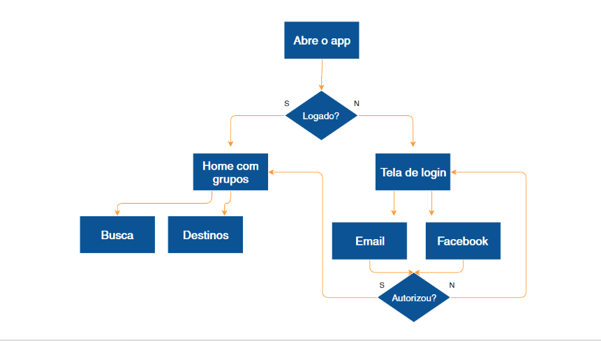
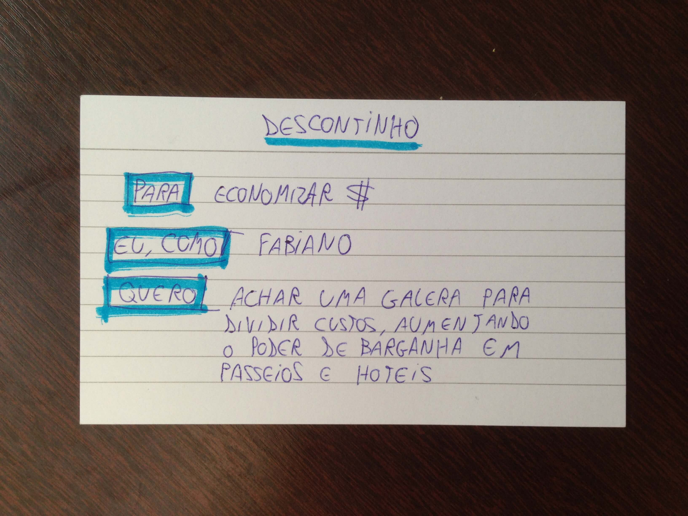

  
  # Cenários e Histórias
  

 

## Cenário

Já utilizamos diversas ferramentas para traçar o perfil do nosso usuário, mas de que forma o Fabiano Gusmão realmente utilizaria esse aplicativo?

Vamos imaginar que inicialmente ele abre o aplicativo, verifica se está logado, acessa a home com outros grupos. Caso não esteja logado, abre a tela de login. As opções para quem não está logado são acessar o aplicativo usando o e-mail ou o Facebook, e se isso for autorizado passa-se para a página inicial com grupos, ou volta para a tela de login.

Na home com os grupos, o usuário encontra outros, por meio do campo de busca ou dos destinos:

 

 

Essa é uma forma de mostrar como é a jornada do usuário usando o aplicativo. O problema é que esse esquema acaba caindo no esquecimento. Existe uma forma muito mais rápida e simples de fazermos isto. Sabendo que quem usará o app é o Fabiano Gusmão, para quê ele o utilizará, exatamente?

Lembrando que o Fabiano Gusmão tem os seguintes objetivos:

+ Conhecer o continente africano.

+ Morar fora do país.

+ Economizar dinheiro enquanto viaja.

+ Mais foco no trabalho.

 

Vamos focar em um desses objetivos, no caso, "Conhecer o continente africano".

**Como e onde o Fabiano Gusmão utilizaria o aplicativo? No trem? No bar? Em casa?**

Um contexto de uso mais usual do aplicativo seria em casa, com a internet boa, banda larga, tomada acessível, e tudo mais. Vamos listar o contexto de uso do aplicativo:

+ Ele utiliza o aplicativo em casa

+ Ele está praticamente de férias

+ Ele encontrou a passagem em promoção

+ Nenhum amigo dele está disponível para viajar

+ Ele busca a companhia de viagem em nosso aplicativo

Nesse caso, é mais fácil nos lembrarmos de todos os itens dessa lista se houverem conexões entre os fatos, como em uma história. Vamos criar um cenário, em um editor de texto, e escrever o seguinte:

> Fabiano está em casa, faltando 40 dias para entrar de férias. Em um blog de dicas de viagem, esbarra numa promoção de passagem para Moçambique e acaba comprando-a. Começa a postar em seu Facebook se alguém topa ir com ele, e até apela para o grupo da família no Whatsapp, mas sem sucesso. Um de seus primos indica o app.

> Fabiano baixa o app na App Store e o abre. Rapidamente loga e consegue achar um grupo que pretende ir para Moçambique também. Ele entra no grupo e os informa sobre a promoção que comprou mais cedo, e da data que irá. Todos o agradecem e a maior parte do grupo compra também, para a mesma data.

> Já até começaram a trocar umas ideias e marcam um bar para papear sobre a viagem.

Isso que acabamos de escrever é um **contexto de uso**. Perceba que em nenhum momento da construção desse texto é mencionado o layout, ou as funcionalidades do aplicativo. Para construirmos esse roteiro nos colocamos no lugar do próprio Fabiano e fomos pensando no que faria sentido para ele.

Por ora, estamos preocupados se ele chegará ao aplicativo e conseguirá interagir com ele. É isso que chamamos de **cenário**, e a ideia é juntar a regra de negócio com o que faz sentido para o usuário. Trata-se de uma narrativa rápida e direta para entendermos como o usuário vê o aplicativo.

E é isso que faremos para praticar, através de um gamestorming:

+ Tempo: 15 minutos

+ Ambiente: folhas, canetas, persona criada

+ Objetivo: criar cenário com base na persona. O cenário pode ser feito através de narrativa, storyboard, vídeo, e assim por diante

Às vezes queremos ser descritivos e acabamos entrando e abordando um pouco acerca das funcionalidades e layouts do nosso aplicativo, como saber que o Fabiano clicou em um botão que estava na tela inicial. Não é uma informação relevante no momento.

Se você for aplicar isso em sua empresa é interessante que cada membro de sua equipe elabore um roteiro e cada um faça um cenário individualmente. Depois, cada um deve ler o seu, explicar e, dentre todos, deve ser escolhido o melhor.

 

## História de usuário

De que forma sua equipe de trabalho sabe quais são as tarefas a serem executadas?

Normalmente, isso é passado por e-mail. Por exemplo:

> Querido time, bom dia

> Segue lista das tarefas desse lindo dia:

> + Chat

> + Criar grupo

> + Login

Por meio desse e-mail, sua equipe pode se perguntar "Mas por que devo criar um chat?", "Por que é preciso criar um grupo?" ou "Por que um login de Facebook?". Geralmente é o desenvolvedor que está pensando nisso tudo, então tentaremos deixar tudo explicado e compreensível para o time todo.

O que nosso usuário, Fabiano Gusmão, deve esperar da feature que queremos enviar para o time desenvolver? Qual é o objetivo?

Vamos montar uma **História do usuário**:

1. Escreveremos em um cartão "Para...", que deve ser completado com o objetivo do Fabiano Gusmão;

2. Na próxima linha escreveremos "Eu, como...", e aqui completaremos com a persona. Nesse ponto você pode incluir inclusive, o contexto: "Eu, como Natan, que estou viajando sem dinheiro...";

3. Na terceira linha acrescentaremos o "Quero...", a ser preenchido com a funcionalidade em si, o benefício;

Um exemplo pronto desse esquema é o seguinte:

> Para... conhecer uma cidade fora dos clichês

> Eu, como... viajante solitário

> Quero... encontrar companhias locais e confiáveis que façam roteiros alternativos

Percebam que é muita informação; imagine que temos um aplicativo da Alura, com diversas funcionalidades. Então, se fôssemos fazer o mesmo, isto é, colocando tudo isso através de histórias, teríamos um problema de identificação. E uma forma fácil de diferenciar as histórias seria colocando títulos em cada uma delas.

Como vimos, esse *framework* de contarmos uma história é o que denominamos "História do usuário". Para montá-la, pode-se utilizar como material uma ficha pautada, optando pelo sistema de organização de sua preferência. Por exemplo: o **Kanban**, com numerações para assinalar prioridade, etc.

Vejamos um outro exemplo de História:

### Chat

> Para... conversar com a galera antes de viajar

> Eu, como... pessoa antes de viajar

> Quero... um chat com videochamada, que seja possível mandar gifs como resposta

Nesse exemplo, o "Quero" possui muitas informações, e quando temos histórias com muitos verbos, podemos separá-la em mais de uma. Outro exemplo:

### Pagamento em boleto

> Para... que o comprador possa pagar sem cartão

> Eu, como... comprador

> Quero... que o sistema dê suporte à emissão de boletos

Repare que o "Para" parece partir do ponto de vista do cliente, e não do usuário. A sentença correspondente está escrita em terceira pessoa. Nesse caso, você pode substituir "o comprador" por "eu".

Em nossas pesquisas identificamos que segurança é um tópico extremamente importante, assim, criamos mais um exemplo sobre isso:

### Segurança

> Para... confiar nas pessoas com que combinei minha viagem

> Eu, como... um cara desconfiado

> Quero... que o app me dê alguma garantia de segurança com relação aos utilizadores

E também um em relação a esquecer o nome de algum ponto turístico:

### Qual era o nome?

> Para... achar o ponto turístico que li sobre mas não lembro o nome

> Eu, como... viajante que já está na cidade

> Quero... que o app me mostre lugares próximos de mim

 

Existem diversos exemplos que poderíamos oferecer, mas agora você pode praticar fazendo o gamestorming de História do usuário:

+ Tempo máximo: 5 minutos (elabore cerca de três histórias)
+ Ambiente: ficha pautada, folhas, canetas, post its
+ Objetivo: criar histórias retiradas dos cenários desenvolvidos

 

## [Exercício] Narrativas rápidas

*“_ são narrativas que fornecem uma maneira rápida e eficaz para imaginar os conceitos de design caso o produto tivesse sido construído. Em certo sentido, são protótipos construídos em palavras.”*

O texto refere-se a qual ferramenta de UX?

**Cenário**

Os **cenários** são narrativas em primeira ou terceira pessoa desenvolvidas para ilustrar a jornada do usuário utilizando o produto ou serviço, deixando mais claro o que precisa ser feito para que seja possível atender aos objetivos desta persona.

É muito comum começar com o cenário de primeira utilização: o quê acontece quando personas encontram o produto ou serviço pela primeira vez?

 

## [Exercício] Problema no cenário

“Alice quer comprar um presente para a namorada, e ela sabe que sua namorada gosta de cozinhar. Então entra em um e-commerce de artigos de cozinha, e utiliza o scroll do mouse até chegar no último dos cinco banners que exibem facas profissionais de chefe. Alice clica no botão azul com ícone de cesta de compras escrito “Adicionar na sacola”. Nesse momento uma requisição AJAX é acionada, e verifica a disponibilidade do item.”

Qual o problema desse cenário? O que acaba o deixando menos crível?

**Alice provavelmente não pensa se usou ou não o scroll do mouse, não repara no ícone do botão ou quantos banners tinham. Além de não saber o que é AJAX.**

Como tudo é feito sob o ponto de vista da persona, as coisas acontecem "magicamente", **não havendo a necessidade descrever como as coisas acontecem por debaixo dos panos**. Esse ponto de vista é o chamado modelo mental, como um indivíduo enxerga o mundo, pode condizer com a realidade ou não.

 

## [Exercício] História de usuário

Nesse capítulo estudamos histórias ou, em inglês, user stories.

Mas o que seria exatamente uma História de usuário?

**um item que agrega valor pro usuário**

Uma história representa algo que agrega valor para nosso usuário. É uma especificação simples e direta muito usada em agilidade, eliminando burocracias e superficialidades.

 

 

Tente evitar dependências entre as histórias de usuário, pois pode ficar complicado na hora de priorizá-las e estimá-las.

 

## Perguntas de uma história de usuário

Uma história de usuário é uma especificação simples, rápida e direta.

Quais perguntas ela responde?

**Para (objetivo/por quê), Eu, como(para quem), Quero (benefício/o quê)**

Basicamente, a história de usuário possui essas três informações:

+ por que é importante que o sistema tenha essa funcionalidade;

+ que tipo de usuário se beneficia mais com essa funcionalidade;

+ objetivamente, o que se quer que o software faça.

 

Sabendo da motivação e importância de cada história, conseguimos priorizá-las melhor. O pedido objetivo de uma feature nova facilita aos envolvidos entenderem exatamente o que e para quem deve ser produzido.

Normalmente são usadas fichas pautadas para as histórias, mas você pode usar o material que lhe for mais conveniente.

  

## [Livro] Leitura Complementar

Um bom livro focado só em Histórias de Usuário:

[Histórias de Usuário - Rafael Helm & Daniel Wildt](http://www.wildtech.com.br/historias-de-usuario/)

