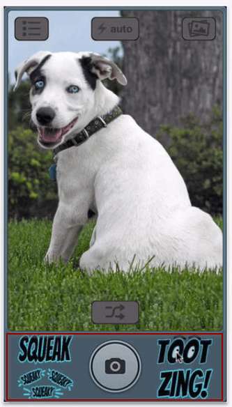
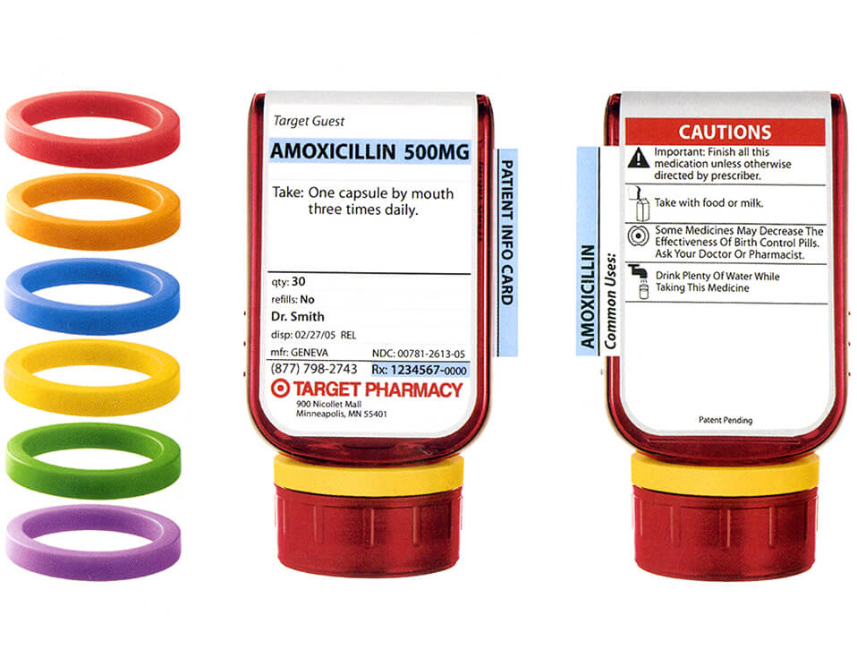

## O que significa o termo UX?

O termo se refere a "User Experience", que traduzido para o português significa **"Experiência do Usuário"**. É comum encontrá-lo em descrições de vagas de emprego. É um conceito recorrente, que todo designer deve conhecer.

 

> User eXperience - Experiência de Usuário 

 

Mas, vamos nos aprofundar no quê queremos dizer com **experiência**. Quando pensamos nessa palavra, associamos seu significado a:

+ **Vivência:** o que foi vivido;

+ **Acontecimento:** viagens, eventos;

+ **Conhecimento:** domínio sobre o uso de alguma ferramenta ou em algum cargo;

+ **Sentimento:** referência a um acontecimento e ao que você sentiu no momento.

Você provavelmente pensou em palavras parecidas. Mesmo não sendo sinônimos de experiência, estão interligadas conceitualmente, como demonstrado acima.

 

### E o termo "usuário"?

 

  

 

Vinculamos "usuário" a uma pessoa que **usa** determinado produto ou serviço. No entanto, também podemos pensar em um **sistema**. É possível desenvolver um programa que funciona como uma ponte entre dois sistemas com linguagens diferentes, comunicação entre Java e dotNET, por exemplo.

Até um **pet** pode ser considerado um usuário. Mas antes que você fique chocado com a ideia de que um animalzinho possa ser considerado um usuário, vamos conhecer o caso do aplicativo "Pose a Pet".

Para conseguir tirar boas fotos de animais de estimação, precisamos chamar a atenção deles. Pensando nisso, o aplicativo oferece opções de sons, que são emitidos próximo ao botão da câmera para que a foto possa ser batida, assim que tiver a atenção do mascote.

Somos nós que o usamos o aplicativo, mas o foco da experiência de usuário está no animal de estimação. Portanto, de certa forma, ele também é um usuário. Ainda para os mascotes, existe uma capinha de celular que vem acompanhada de um suporte para bolinha, que fica próximo à câmera e também atrai a atenção do animal. Independente do usuário, quando pensamos na solução de um problema, estamos pensando na experiência.

É importante ter conhecimento da experiência do usuário, pois se o seu site não tiver um conteúdo de qualidade, quem irá acessá-lo? Se o seu aplicativo não fornece alguma solução para o problema do usuário, ou se ele tem uma roupagem diferente, mas não oferece nenhuma funcionalidade nova, por que o usuário baixará a sua app? Por isso, pequenas e grandes empresas começaram a fazer perguntas como: quem vai usar o site ou aplicativo? Pensando no usuário, vem a importância da UX.

Imagine um usuário que acessa o seu site e-commerce e não consegue encontrar os produtos nos quais está interessado. Ou seja, a pessoa está disposta a comprar os seus produtos, mas você não disponibilizou os itens de uma forma que facilite o fluxo de navegação do usuário na efetuação da compra.

Pensar em UX envolve o atendimento às expectativas do usuário e o fornecimento de um serviço ou produto de qualidade, preferencialmente, de uma forma simples e direta. Dessa forma, espera-se que o usuário consiga finalizar a ação que veio realizar no seu aplicativo, com satisfação.

 

## Case Clear RX

**ClearRX** é um sistema de embalagem para quem usa medicamentos com receita, que torna mais fácil as pessoas saberem como tomar seus remédios. Ele é um exemplo de como UX pode influenciar toda uma estratégia de negócio.

Após sua avó ter tomado o remédio de seu avô por engano, a estudante de design Deborah Adler decidiu desenvolver esse sistema como sua tese de mestrado.

Suas características:

+ contém a prescrição e posologia no frasco para que não haja enganos;

+ o nome do medicamento está escrito não só na face lateral como no topo;

+ na outra das faces há importantes informações pessoais e relativas ao medicamento;

+ tem faces planas para que a informação seja lida com mais facilidade;

+ se, mesmo assim, ainda for difícil perceber o que está escrito, o frasco vem com um "cartão-lupa" para ler o texto;

+ existem anéis de diferentes cores para que, no caso de existir mais que um frasco em casa, se possa diferenciar que frasco pertence a quem;

+ o frasco para líquidos está adaptado à entrada de seringas orais para uma medição mais fácil.

Depois de concluir sua tese, Deborah levou a ideia à Target, e juntos criaram o sistema completo.

**Soluções simples podem mudar a vida do seu usuário.**

 

[UX por Don Norman](https://www.youtube.com/watch?v=9BdtGjoIN4E&ab_channel=NNgroup)

 

## O que é UX

Experiência do Usuário (UX, de **User Experience**) é um tema bastante subjetivo. É difícil, de maneira objetiva e direta, dizer como desenhar uma experiência do usuário.

Mas é possível aprendermos como desenhar um produto, serviço ou ambiente que proporcione uma experiência satisfatória para alguém que os use, identificando todos os aspectos da interação do usuário com esse produto (ou serviço ou ambiente).

 

## Experiência do Usuário

Como uma pessoa se sente ao usar um produto. Ou mais formalmente, de acordo com a definição dada pela ISO 9241-210, são as respostas e percepções de uma pessoa resultantes do uso de um produto, sistema ou serviço.

Como disciplina, é uma palavra guarda-chuva, que tem relação com os princípios de Design Centrado no Usuário (UCD), **Design de Interação (IxD) e Usabilidade**, todos vistos ao longo dos capítulos.

É multidisciplinar, incorporando aspectos da psicologia, antropologia, ciência da computação, design gráfico, design industrial e ciência cognitiva. Apesar de Experiência do Usuário estar presente em produtos físicos como virtuais, serviços ou ambientes; será abordado um tipo específico de produto: aplicativos mobile.

 

## Experiência

No dicionário: “*qualquer conhecimento obtido por meio dos sentidos*”. Na nossa cabeça pode vir várias coisas como **vivência, sentimento, acontecimento**, etc.

 

## Usuário

No dicionário: “*aquele que, por direito de uso, serve-se de algo ou desfruta de suas utilidades*”. Apesar de pensarmos automaticamente em **pessoas**, usuário também pode ser um sistema ou até mesmo nosso animal de estimação. Vide o App Pose a Pet.

 

## Responsáveis pela experiência do usuário

Inicialmente, você pode pensar que somente o pessoal de design é responsável pela UX. Mas desenvolvedores, gerentes, redatores, etc., são responsáveis sim pela experiência do usuário.

 

## Evolução do UX

O termo **Experiência do Usuário** foi cunhado pela primeira vez por **Don Norman**, em meados de 1990. O próprio Norman comentou em uma entrevista:

> "Eu inventei o termo, porque achava que interface do usuário e usabilidade eram muito restritos, eu queria cobrir todos os aspectos da experiência de uma pessoa com o sistema, incluindo design industrial, gráficos, a interface, a interação física e o manual. Desde então, o termo tem se espalhado amplamente..."
