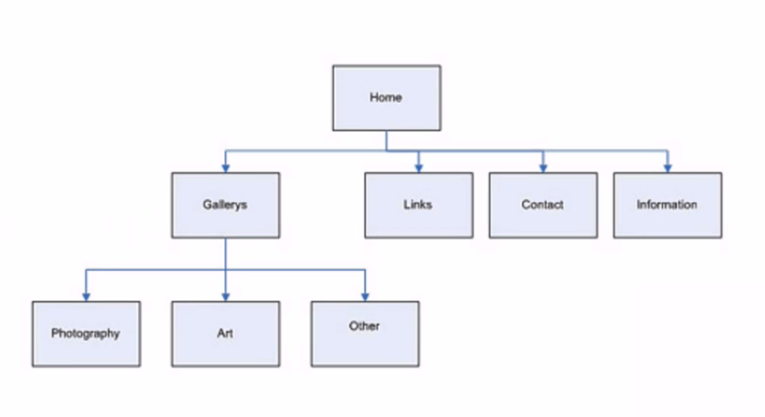
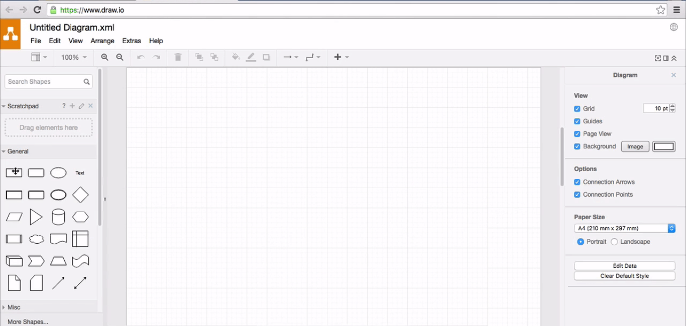
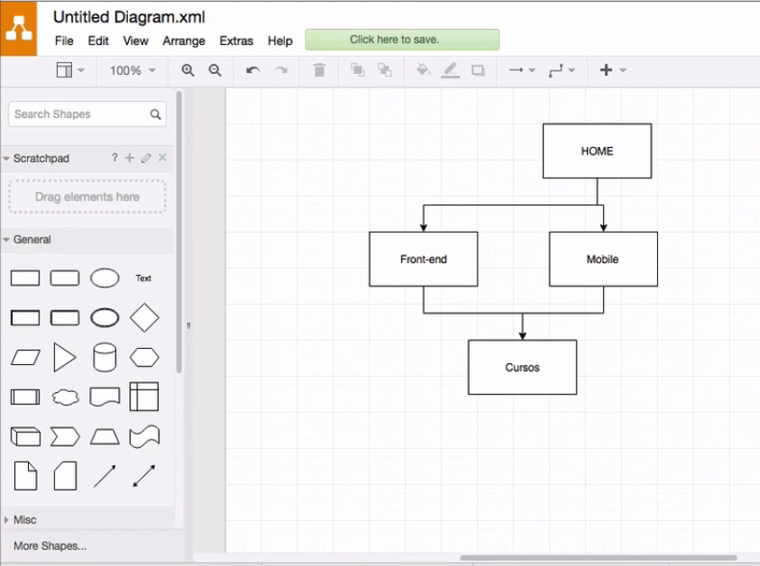
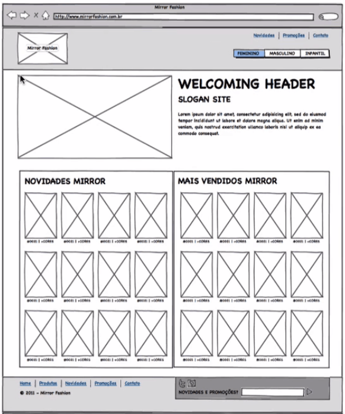
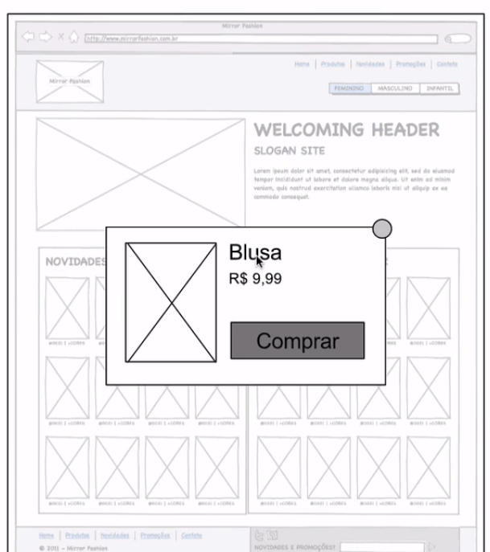
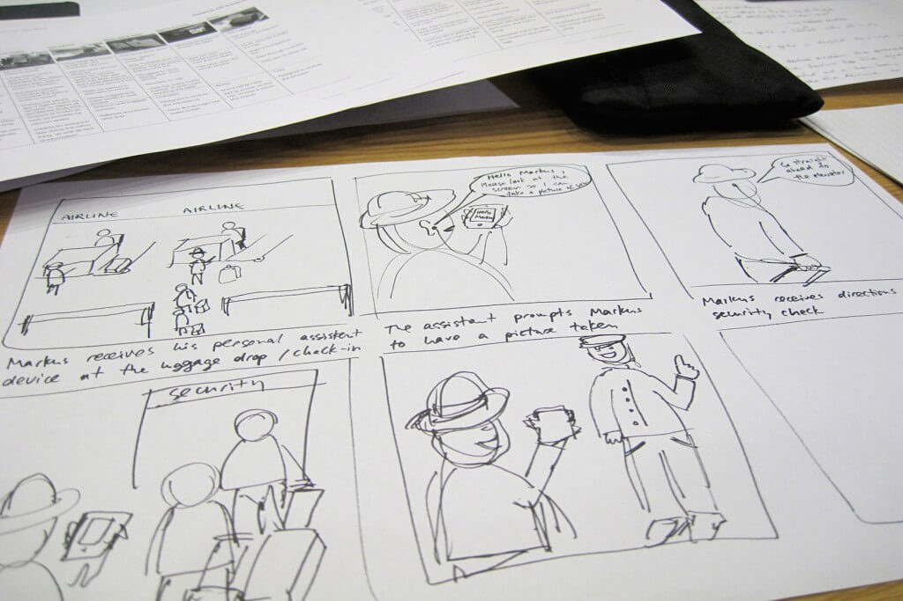

# Entregáveis e Ferramentas

Exploramos comunicação visual, Kanban e Card Sorting. Mas, concordamos que a estrutura final da organização dos cartões continua inapropriada para uma apresentação formal.

Imagine que você tem uma Startup. Tirar uma foto de pequenos papeis e enviá-la aos investidores não parece a melhor opção. Como profissionais de UX, temos que saber como entregar o nosso trabalho para os clientes. Nesta aula, comentaremos sobre algumas opções de **entregáveis**.

Mas como podemos entregar os resultados? Começaremos pelo exemplo do Card Sorting. Criar uma planilha com a estrutura final dos cartões é uma opção mais profissional.

 

Cursos Básicos | Design & UX | Front End | Marketing Digital | Mobile | Programação
------------ | ------------- | ------------- | ------------- | ------------- | -------------
Programação Básica | Photoshop | HTML | Marketing Digital | Android | Java
Lógica de Programação | Illustrator | CSS | SEO | iOS | PHP
Linux | InDesign | JavaScript | Adwords | Jogos | C# e .NET
Excel | Corel Draw | Design Responsivo | E-mail Marketing |  | Python
Arduíno | Edição de Vídeos |  | Mídias Sociais |  | Ruby
&nbsp;  | Identidade Visual |  | Empreendedorismo |  | Banco de Dados
&nbsp;  | UX | |  |  | Lógica de Programação
&nbsp;  | 3D |  | | | Programação Básica
&nbsp;  | Flash |  |  |  | Framework
&nbsp;  |  |  |  |  | Infraestrutura
    
 

Para deixá-la mais visual, temos o [Sitemap](https://www.xml-sitemaps.com/), um mapa visual do site, basicamente, um diagrama hierárquico.

 

 

Quando você entra na "Home", vemos que os seguintes itens podem ser selecionados: "Gallerys", "Links", Contact" e "Information". Se clicarmos em "Gallerys", teremos acesso a outras páginas. De acordo com o Sitemaps, a partir de "Other", não conseguiremos chegar até a página de contato. Para criar o diagrama, existe uma ferramenta gratuita chamada [draw.io](https://app.diagrams.net/).

 

 

Ele é um equivalente ao Microsoft Visio, software usado para a criação de fluxogramas e diagramas. Vamos construir a parte de Front-end utilizando-o.

 

 

Outro entregável existente é o [**Wireframe**](https://wireframe.cc/).

 

 

Observe que não existe uma preocupação com o visual. É uma forma de **"esqueleto"** do site. O objetivo é que o designer possa compreender o que, de fato, é importante. Nele, temos um cabeçalho, dois menus e o logo.

Outro entregável são os **protótipos**. Com eles, podemos mostrar como será o **fluxo de navegação**. Existem dois tipos de protótipos: o de baixa e o de alta qualidade. Por exemplo, se fizermos vários Wireframes e criarmos uma navegação entre eles, teremos um protótipo de baixa fidelidade. Se decidimos fazer os detalhes visuais da página no Photoshop, adicionando logo e textos finais, teremos o de alta fidelidade.

 

 

Se clicarmos em comprar, seremos levados para o próximo passo que é "Comprado!". Dessa forma, conseguimos mostrar, de forma visual, o fluxo de usuário. 

Outra ferramenta utilizada é o **Storyboard**. Semelhante a uma história em quadrinho, demonstra como seria a experiência do usuário antes e depois de usar o aplicativo. No exemplo abaixo, vemos o desenho do momento em que o usuário utiliza o aplicativo.

 

 

## Ferramentas de UX

Existem diversas ferramentas que podemos utilizar na UX. A seguir, conheceremos algumas.

Uma das mais usadas é o **Photoshop**, com o qual, atualmente, é possível criar 3D, Gifs e Wireframes. Outra ferramenta que tem ganhado bastante espaço é o **Sketch**, um software de edição de imagens que só roda no sistema operacional Mac — sem planos, de criar uma versão para Windows.

O **Axure** também é muito usado para criar Wireframes e protótipos navegáveis. Ele oferece a possibilidade de criar protótipos de baixa e alta fidelidade. Essa já é uma ferramenta mais avançada para a criação de um entregável.

Outra ferramenta é o Adobe Experience Design, o **Adobe XD**, antigamente conhecido como Adobe Comet. Essa ferramenta traz grandes avanços nas áreas de prototipagem e oferece recursos que outras ferramentas não têm. Lembrando que é uma ferramenta usada para protótipo e não para a criação de uma aplicação.

Além das citadas acimas, seguem sugestões de outras ferramentas:

+ Figma
+ UXPin
+ Wireframe.cc
+ Marvel
+ Invision
+ Balsamiq

 

Uma excelente ferramenta alternativa à BoardThing é a ferramenta Mural, que também serve como um quadro branco para colar post-its e desenhar diagramas.

Algumas outras que foram desenvolvidas pensando-se no uso em celular e tablets:

+ iMockups
+ Adobe Comp
+ POP

E as ferramentas máximas: papel e lápis.

Carregue sempre com você um caderninho ou bloquinho para anotar suas ideias!
