

# Primeros Passos com UX

 

## Introdução

Para um UX designer em começo de carreira pode ser bem difícil entrar no mercado de trabalho. Principalmente, se ele já terminou a faculdade e tem pouca experiência, pode ser complicado conseguir uma vaga de estágio.

Esse estudo é focado em criar o primeiro projeto, como se estivéssemos iniciando no primeiro trabalho. O projeto será simples, mas passaremos por todos os processos de UX, por meio de uma trilha. Lembrando que UX não é um processo "cascateado", permitindo ser feito por diversos caminhos e chegar em um bom resultado. A trilha irá ajudar a quem está começando ou quem tem dúvidas.

Começaremos com um **Carding Sorting**, faremos **Site Mapping**, e chegaremos até o desenho do menu do site. Usaremos diversas ferramentas que oferecem a possibilidade de ser grátis, para facilitar a realização do seu primeiro trabalho como UX Designer.

 

## Propósito do Estudo

O conteúdo deste estudo é voltado exclusivamente para o desenvolvimento de um **projeto de UX, focando em mostrar ferramentas desde o briefing até um protótipo de baixa fidelidade**, e tem como objetivo principal de mostrar essa parte de análise de concorrentes e priorização de conteúdo.

Você aprenderá como uma simples tabela do Excel pode organizar o trabalho do UX Designer, além de conhecer uma pequena parte do InVision, uma das ferramentas online focadas em UX mais usadas atualmente no mercado.

Não abordaremos neste estudo:

+ ferramentas offline como UX Canvas ou Canvas MVP;

+ protótipos de alta fidelidade ou UI Design (design visual);

+ testes de usabilidade;

+ código front-end (HTML e CSS).

 

## Briefing do Projeto 

**Cliente**: Casa do Código 
**Projeto**: Reformular o Menu 

 

### Home da Casa do Código

 

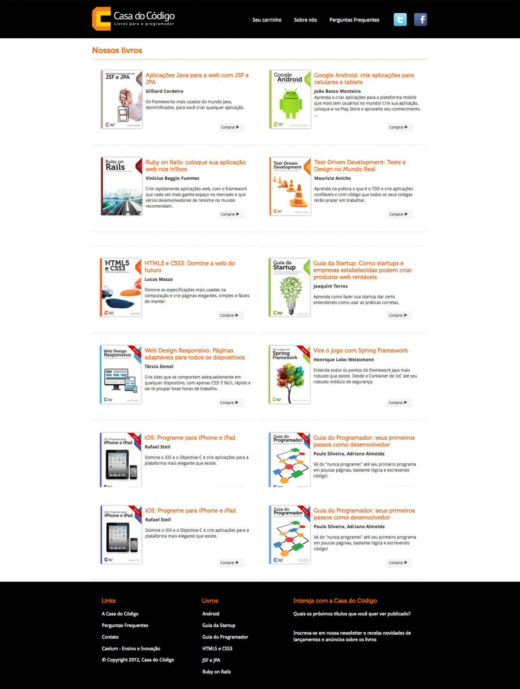

 

### Página Nossos Livros

 

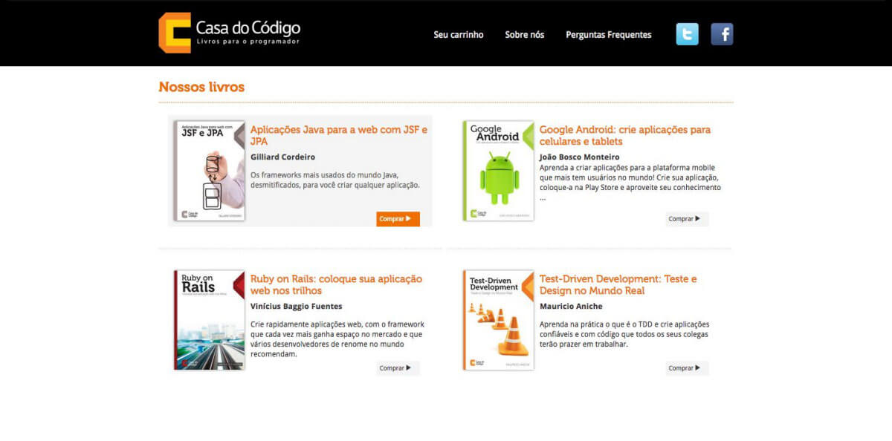

 

### Página do produto

 

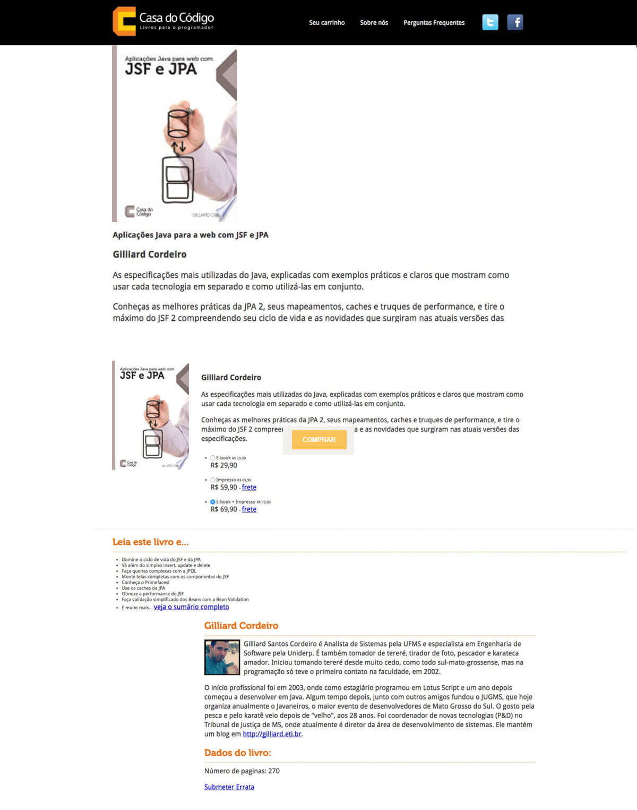

 

### Informações sobre o público do site: 

+ 85% Homens / 15% Mulheres
+ Idade: 18 a 34 anos
+ 4% - Technophiles
+ 3% - Movie Lovers
+ 3.4% - TV Lovers
+ 3.01% - New Junkies / Entertainment & Celebrity News Junkies 
+ 3.07% - Sports Fans / Soccer Fans
+ 99% no Brasil (40% SP, 10% RJ...)

 

## Análise de concorrentes

Imaginando o cenário onde você estudou bastante para trabalhar com UX. Antes de entrar no mercado de trabalho, acabou criando diversos projetos pessoais para apresentar em entrevistas.

Até que finalmente conseguiu o primeiro emprego. Seu chefe, sabendo que você estudou o assunto, decide te passar um primeiro projeto para que seja aplicado todo conhecimento adquirido nos estudos.

O projeto é de uma livraria online, que deseja reformular o menu do site, a forma de expor as seções e subseções. O site ficaria mais visual, facilitando a demonstração de promoções e ofertas em datas especiais.

Essa livraria é a [Casa do Código](https://www.casadocodigo.com.br/), mas como material do curso, trabalharemos com a versão de 2012 do site.

Basicamente, o site só possui três opções no menu, sendo **Seu carrinho**, **Sobre nós** e **Perguntas frequentes**.

 

 

No rodapé temos alguns *links* sobre a empresa, sobre os livros e um campo onde podemos interagir, mandando e-mail e se cadastrar na *newsletter*.

 

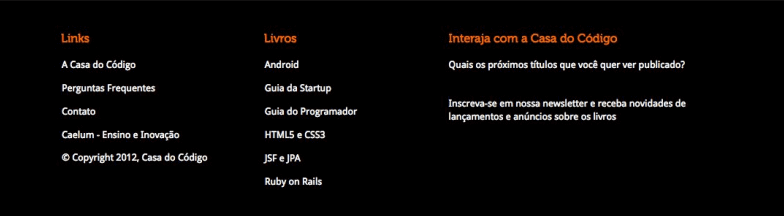

 

No corpo da página, todos livros estão listados, onde podemos rolar a página e visualizar praticamente todo o conteúdo do site. Ao lado dos livros, existe um botão para compra.

 

 

O titulo dos livros são links para outra página, onde é apresentado a descrição e os dados do livro, informações sobre o autor, os preços para as diferentes versões. Isso se aplica a todos os livros apresentados na página inicial.

O site não está muito interessante, ele não mostra onde ficam os livros em promoção e os lançamentos. Imagine que a Casa do Código passe a ter muitos livros, o cliente terá que rolar a página inteira até encontrar o livro que deseja.

Mas como podemos deixar o site mais atrativo? Caso não tenha muito conhecimento sobre o mercado de livros, podemos pesquisar na internet sobre algumas referências.

Pesquisaremos no Google sobre "Livraria online". Como resultado, temos diversos sites como a [Amazon](https://www.amazon.com.br/), [Saraiva](https://www.saraiva.com.br/), [Livraria Cultura](https://www3.livrariacultura.com.br/), Cia. das Letra e assim por diate.

Lembrando que, empresas que trabalham no ramo de venda de livros online, ou seja, o mesmo negócio que a Casa do Código, são chamados de **concorrentes diretos**. Já empresas de comercio online que vendem produtos diferentes do nosso, por exemplo, a Netshoes, são considerados **concorrentes indiretos**.

 

### Concorrentes diretos

No site da Amazon, tem imagens mostrando algumas ofertas. Também possui a área de ofertas em destaque com as seções **Ofertas disponíveis**, **Próxima**s e **Ofertas encerradas**. Ao final do corpo da página, possui os **Lançamentos da Semana** com algumas opções de livros.

 

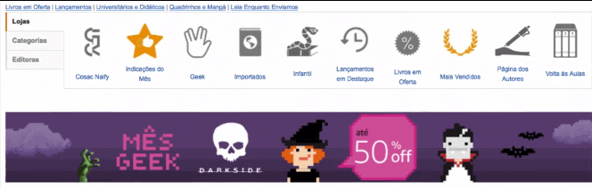

 

A Livraria Cultura possui um **menu de categorias** do lado esquerdo, com as opções de produtos vendidos pelo site. Se selecionarmos a opção de livros, veremos uma imagem de promoção de algum livro em destaque no momento, e também o campo **Destaques** com as opções de **Mais vendidos**, **Lançamentos**, **Pré-venda** e assim por diante. Independente da categoria do produto, sempre é apresentado no mesmo padrão, mostrando uma imagem de promoção.

 

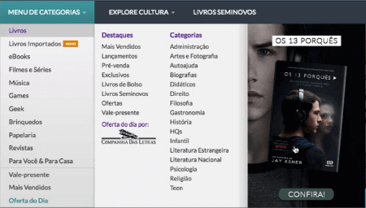

 

No site da Saraiva, nota-se um banner bem grande na página inicial com promoções. E assim como a Livraria Cultura, também possui um menu do lado esquerdo, com a diferença que ele fica ocultado até que o usuário passe o mouse. Também segue o padrão de imagens de promoções associados as categorias.

 

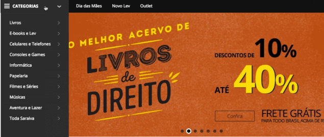

 

Já no site Cia. dos Livros, o menu é na parte superior, com as opções de tipos de livros como, **Medicina, Enfermagem e Odontologia, Direito, Literatura e Literatura Infantil, Todas as categorias**, e assim por diante. Ao passar o mouse em uma dessas categorias, o menu expande mostrando as subcategorias e uma imagem de promoção.

 

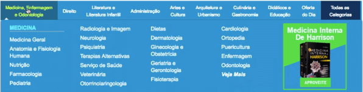

 

### Concorrentes indiretos

Agora que pegamos algumas refêrencias dos concorrentes diretos, podemos ver alguns sites de **concorrentes indiretos**. Isso serve para termos uma noção de forma como eles trabalham, se é muito diferente das empresas que são concorrentes diretas.

Acessaremos o site da [Netshoes](https://www.netshoes.com.br/). Logo na página inicial, veremos um banner com promoções. Na parte superior existe um menu com as opções de Departamentos, Homens, Mulheres, Crianças, Calçados e assim por diante. Ao passar o mouse na opção "Departamentos", o menu irá expandir mostrando todos os departamentos do site, sem nenhuma imagem, já se acessarmos os menus mais específicos como Mulheres, o menu irá expandir com subcategorias de produtos femininos e uma imagem de alguma promoção.

 

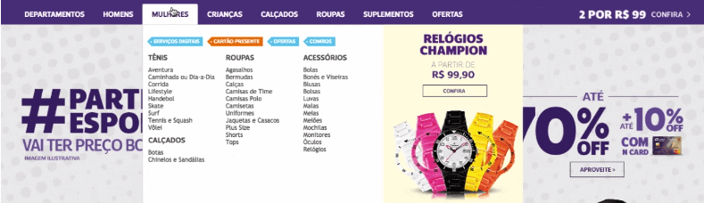

 

Agora que conseguimos todas essas informações, como podemos trabalhar com elas? E se esquecermos as referências que vimos? Isso é o que abordaremos a seguir.

 

## [Exercício] Concorrentes diretos

Em aula vimos informações sobre concorrentes diretos e indiretos.

Quando pensamos em **concorrentes diretos** temos que ter em mente que eles trabalham com:

- [ ] A) Produtos diferentes e forma de atendimento similar. 
    Se os produtos ou serviços são diferentes isso se trata de concorrentes indiretos.

- [x] B) Mesmo produto e forma de atendimento similar. 
    E por isso, ao fazer um trabalho de UX precisamos olhar como esses concorrentes trabalham com bastante atenção, principalmente quando não conhecemos o mercado.

- [ ] C) Produtos diferentes e a forma de atender os clientes é diferente apenas quando comprado pela internet. 
    Concorrentes diretos e indiretos independem da compra ser feita exclusivamente pela internet.

- [ ] D) Mesmo produto em regiões diferentes. 
    Hoje em dia não importa onde está o negócio, você pode ter concorrentes diretos em qualquer lugar do Brasil ou do mundo.

 

## Trabalhando com referências

Vimos em aula que no começo de um projeto que não temos familiaridade, precisamos compreendê-lo bem antes de sair fazendo personas ou protótipos.

Sendo assim, no que diz respeito a **referências**, temos que nos lembrar que elas:

- [ ] A) Atrasam o processo da compreensão de como os concorrentes atuam no mercado. 
    Inicialmente pode parecer que estamos atrasando o andamento do projeto, mas o ponto principal é ser mais assertivo para evitarmos ter retrabalho futuramente.

- [ ] B) Nos auxiliam a compreender como os concorrentes atuam no mercado e também a termos personas navegáveis e de interação nos projetos. 
    Não falamos nessa aula sobre personas e atualmente não existe em UX personas navegáveis.

- [x] C) Nos auxiliam a compreender como os concorrentes atuam no mercado e também são uma fonte para nos inspirarmos. 
    E isso pode nos mostrar muito sobre o que o usuário já está acostumado a utilizar e isso pode aumentar nossa assertividade.

- [ ] C) São uma ótima forma de se copiar e agilizar nosso trabalho. 
    A ideia de olharmos referências, não é de fazermos uma cópia. Lembre-se que o usuário de um concorrente, direto ou indireto, não é o mesmo usuário do seu cliente. Além de ser considerado anti-ético pela maioria dos profissionais da área.

 

## Moodboard no InVision

Encontramos as nossas referências, mas como mandaremos para nosso cliente? Teríamos que copiar os links dos sites e enviar ao cliente. Enviar por e-mail não seria um boa ideia, já que o cliente poderia perder no meio de outros e-mails ou até mesmo excluir sem querer. Outro problema é, se o cliente estiver em um local sem acesso a internet, os links não seriam muito útil.

Outra ideia seria tirarmos *prints* das telas dos sites. Podemos capturar os pontos fortes de cada site, mas como o nosso cliente deseja alterar o menu, então vamos tirar *print* dos menus de cada site.

Mesmo com os *prints* de tela, ainda teríamos o problema de muitos arquivos no e-mail, ou até mesmo problemas em fazer o download dos arquivos. Caso o cliente goste do menu de um imagem e da cor de outra, como ele nos falaria? Seria necessário editar a imagem, ou usar outras ferramentas como *PowerPoint, Google Docs*, e assim por diante.

Para auxiliar nesse processo, podemos usar o [Invision App](https://www.invisionapp.com/). O Invision é um site onde podemos guardar as nossas referências, idéias e protótipos.

Para usar o *Invision* é necessário ter uma conta e efetuar o login. Efetuando o acesso, a página inicial será carregada com alguns interfaces já criadas pelo próprio *Invision*.

Clicando na interface ***Moodboard**, vemos que o foi agregado algumas imagens de exemplo que podem ser usadas, opções de cores, opções de fontes, imagens de ícones e animações. Ele foi criado para demonstrar o que a ferramente pode fazer.

 

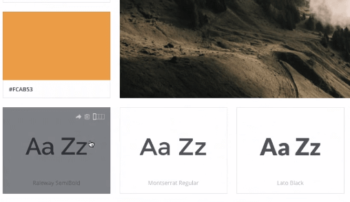

 

Não criaremos um protótipo navegável, mas sim um repositório para as nossas referências. Sinta-se a vontade caso prefira utilizar outras ferramentas, a vantagem do Invision é a possibilidade do cliente poder fazer comentários nos itens salvos. Outra vantagem é de manter os trabalho salvos para o portfólio.

Na página inicial do usuário, clicaremos no simbolo de `+` que se encontra no lado direito superior da na página.

 

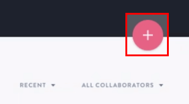

 

Na janela **Choose a project type**, devemos escolher o tipo de projeto. Como vamos guardar uma coleção de referências, **escolheremos a opção Create a new board.**

 

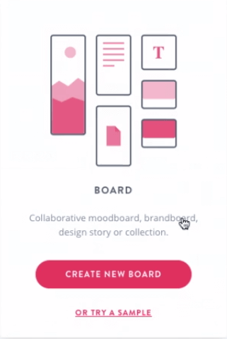

 

Na nova janela, colocaremos o nome do projeto, que no caso será **Referências - Site Casa do Código**. Escolheremos também o tipo de moodboard, as opções são: **Mansory, Meticulous e Grid**. Em nosso exemplo, escolheremos a Meticulous. Após a escolha, basta clicar em "Get Started".

 

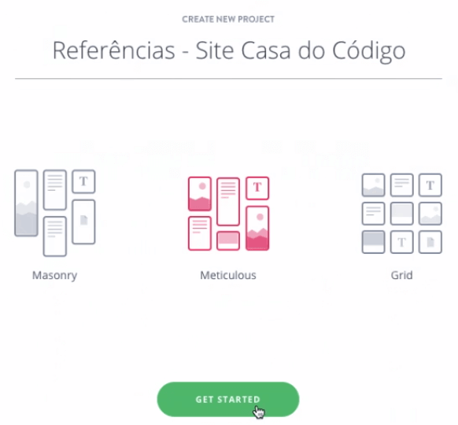

 

Com o projeto "Referências - Site Casa do Código" criado, podemos colocar um descrição no campo Add a description here, sobre o que se trata o projeto. A descrição que colocaremos será:

> Sites de referência para o novo menu da Casa do Código

Embaixo do campo de descrição, estão listados os membros do projeto, que no momento é apenas a nosso perfil. Caso queira adicionar outro membro, basta clicar do simbolo de + que fica ao lado do ícone do seu perfil.

Na área de **Drag and Drop**, arrastaremos os prints que tiramos dos sites. Após o termino do carregamento, teremos todas as imagens de referência em um único lugar.

Para o moodboard ficar ainda mais organizado, podemos arrastar o mouse para o final da tela, até aparecer um simbolo de +, que é o botão de **Create new section title**. Clicando no botão, será criado um nova seção.

 

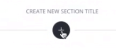

 

Na nova seção, colocaremos o título de "**Netshoes - Concorrente Indireto**". Agora arrastaremos a imagem do site da Netshoes para a seção.

 

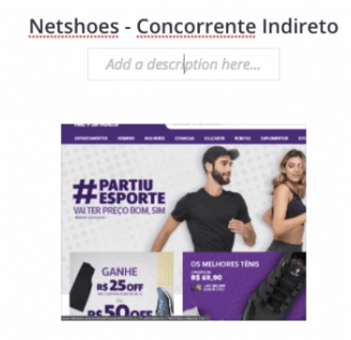

 

Criaremos um nova seção, e colocaremos o título de "Amazon - Concorrente Direto", em seguida arrastaremos a imagem do site da Amazon para a seção.

 

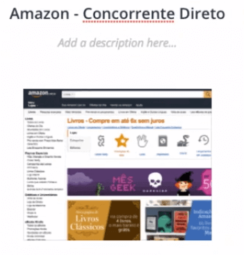

 

Faremos o mesmo para a Livraria Cultura, colocando o título de **"Livraria Cultura - Concorrente Direto"**.

 

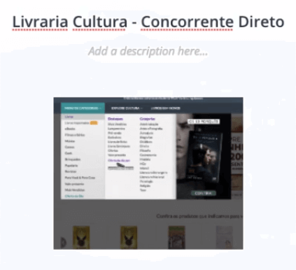

 

Para a livraria Saraiva, o titulo da seção será **"Livraria Saraiva - Concorrente Direto"**.

 

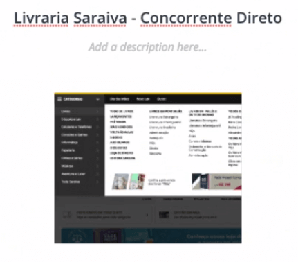

 

E por último, criaremos a seção da Cia. dos Livros com o título **"Livraria Cia dos Livros - Concorrente Direto"**.

 

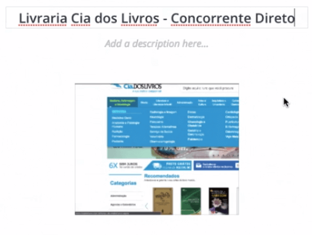

 

Cada seção possui apenas um imagem do menu aberto de cada site. Mas no decorrer do projeto, podemos adicionar novas telas nas seções.

Se clicarmos na imagem, podemos alterar o seu nome no campo **Add title here**. Também podemos fazer comentários sobre a imagem, basta clicar no campo **Leave a comment**.

 

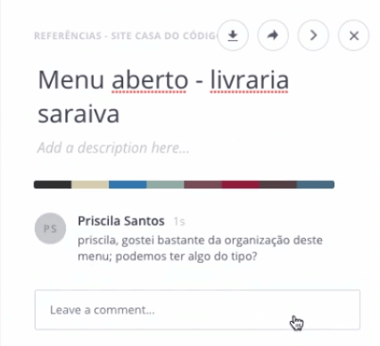

 

O ponto forte de UX é que vemos a necessidade do momento. Por exemplo, podemos estar navegando na internet e encontrarmos outro site com um menu interessante, podemos tirar um print screen e apresentar ao cliente para que a ideia evolua.

 

## [Exercício] Sobre o moodboard

A fim de centralizar nossos entregáveis de UX em um único lugar, podemos criar um quadro de referências: o **moodboard**.

Para que tipo de referências podemos usar o *moodboard*?

- [x] A) Referências de microtexto  
    Recomendo fazer o curso de Microcopy quando for possível.

- [x] B) Referências de UI design, como paletas de cores  
    Sites bacanas como o [Behance](https://www.behance.net/) ou o [Abduzeedo](https://abduzeedo.com/) podem ajudar nisso.

- [ ] C) Referências para copiar elementos visuais 
    O *moodboard* deve ser usado como fonte de inspiração e não como uma caixa de ferramentas para se fazer um projeto com elementos copiados de diversos lugares.

- [x] D) Referências interativas 
    Pensando em microinteração, é uma excelente forma de se inspirar.

 

## [Exercício] Criando o seu Moodboard

Assim como fizemos no estudo, entre no [InVision](https://www.invisionapp.com/), crie a sua conta e monte o seu moodboard.

Você também pode criá-lo em outra ferramenta como o Figma, Photoshop, Sketch ou Illustrator, mas nenhuma dessas tem algo específico para boards desse tipo.

Assim como visto em aula, pegue referências de e-commerces de livros (concorrentes diretos) ou mesmo e-commerces de outros nichos (concorrentes indiretos). Alguns exemplos de indiretos:

+ [Loja do Mecânico](https://www.lojadomecanico.com.br/)
+ [Waz](https://www.waz.com.br/)
+ [Gimba](https://www.gimba.com.br/)

Lembre-se de nomear seu moodboard e colocar os sites usados como referência, focando em seus respectivos menus de navegação.

O Moodboard do InVision é relativamente simples de ser criado e contém um layout prático para ajudar em sua manipulação e compreensão.

Recomendo fazer seus futuros projetos utilizando ele ou alguma outra ferramenta com funções similares.

Uma boa tabela comparativa de ferramentas é a [UX Tools](https://uxtools.co/tools/design/).

 

## Moodboard Visto no Estudo

Neste estudo, criamos o Moodboard de referências do projeto do nosso estudo.

Você consegue visualizá-lo aqui:

[Moodboard feito em estudo](https://projects.invisionapp.com/boards/C2373LYXKRFQ3)

[Moodboard criado na pesquisa de concorrentes indiretos](https://projects.invisionapp.com/boards/JG40ZQZ9RCA/)

