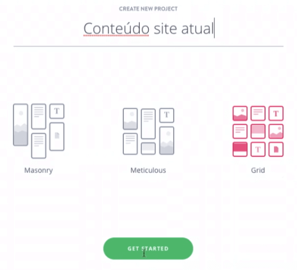
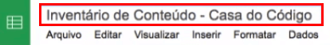
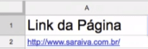
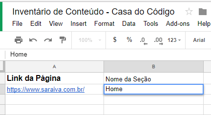
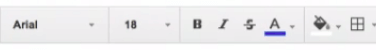
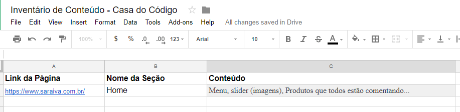
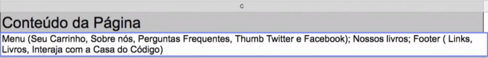
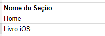
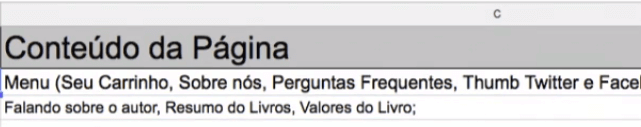
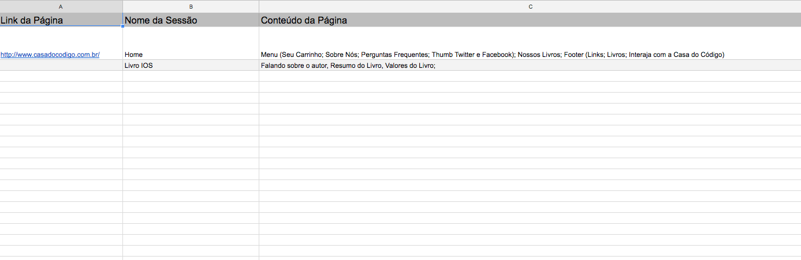

# Inventário de Conteúdo

 

## Guardando Conteúdo do Site

A próxima etapa é garantir que tudo o que o site atual da Casa do Código, vá para o novo menu. Uma opção para armazenarmos todas informações do site da Casa do Código, é fazermos o mesmo processo que usamos para as referências.

Usaremos print screen para capturar, todas as áreas do site da Casa do Código. Começaremos tirando do cabeçalho, do corpo e do rodapé da pagina inicial. Na página de descrição do produto, também usaremos o print screen no cabeçalho, em todas as partes do corpo, e no rodapé da página.

Com todos os prints do site, acessaremos o Invision e criaremos um novo projeto. Selecionaremos o tipo do projeto como "Board". Em "Add project name", colocaremos "Conteúdo site atual", em seguida selecionaremos a opção Grid e pressionaremos "Get Started".

 

 

Com o projeto criado, podemos arrastar todos os prints que fizemos do site da Casa do Código para a área de "Drag and Drop".

Podemos organizar as imagens segurando e arrastando com o mouse, colocando a ordem em que foram tirados os *prints*, trocar de nome, e assim por diante.

Analisando mais atentamente o site da Casa do Código, quando passamos o mouse por cima de algum produto, temos o efeito de "Hover". Quando o Hover é ativado, a cor do botão "comprar" vai mudar.

 

 

Esse tipo de interação com a página não é mostrada nas imagens que tiramos do print screen. Outro detalhe que devemos nos atentar, é o fato de que se a Casa do Código tiver muitos livros, precisaremos rolar a página e fazer diversos prints para mostrar todos os produtos.

Para esse tipo de ação, usamos uma técnica chamada de **Inventário de Conteúdo**. Trata-se de um local onde colocamos, quais são as áreas, qual é a seção e o link para essa seção. Tudo isso colocamos em uma planilha.

Para fazermos isso, usaremos as Planilhas do Google. Caso prefira, também pode ser usado o Excel, a vantagem de usar a solução do Google evitar erros de compatibilidade, arquivos que podem corromper, e assim por diante. Além de ter mais segurança com *backup*, pois os arquivos são armazenados na nuvem.

 

## [Exercício] Inventário de conteúdo

Para ajudar o usuário a ter uma boa experiência devemos pensar com cuidado sobre o conteúdo que será apresentado, visando deixar essa experiência não só completa como eficiente.

Existe um entregável diretamente relacionado ao levantamento de conteúdo, o **inventário de conteúdo.**

Das alternativas abaixo, qual delas define bem a ideia desse entregável de UX?

- [ ] A) Listagem de todos os textos do site 
    Um site comumente não é composto apenas por textos.

- [ ] B) Listagem de todos as imagens do site 
    Um site não possui apenas imagens, como outros conteúdos como textos, categorias, etc.

- [ ] C) Listagem de todos as referências do site 
    As referências são utilizadas para o moodboard e não para o Inventário de Conteúdo.

- [x] D) Listagem de todos os conteúdos do site 
    E isso nos auxilia a termos em mente sempre o que precisamos entregar no projeto final.

 

## Inventário de conteúdo

Para fazermos o inventário de conteúdo, usaremos as Planilhas do Google. Se já estiver logado em uma conta Google, basta clicar em "Ir para o planilhas Google" para ser redirecionado.

Com uma nova planilha aberta, colocaremos o nome "Inventário de Conteúdo - Casa do Código". Desta forma, manteremos a organização de nossas planilhas, e não confundiremos com o inventário de conteúdo de outros trabalhos e clientes.

 

 

Em seguida, colocaremos quais são as abas e o conteúdo de cada página. Como o site da Casa do Código é pequeno, usaremos como exemplo o site da Saraiva, pertencente a [Saraiva](https://www.saraiva.com.br/), o layout da página pode sofrer alterações.

Após acessar a página inicial da Saraiva, podemos notar que mesmo se passarmos o mouse em qualquer ponto da página, o endereço do site continua o mesmo, justamente por não termos clicado em nada.

Na planilha `Inventário de Conteúdo - Casa do Código` - Estamos usando o site da Saraiva apenas como exemplo - colocaremos na célula `A1` o título "Link da Página" para a coluna. Já na célula `A2` colocaremos o link da página da Saraiva.

 

 

Agora colocaremos o que tem na seção do link especificado. Por isso, na célula `B1`, colocaremos o título "Nome da Seção" para a coluna e na célula B2 colocaremos "Home".

 

 

Caso prefira, é possível alterar as cores de fundo da célula, tamanho da fonte, colocar em negrito, colocar em itálico, e assim por diante. No exemplo colocaremos a cor de fundo das células dos títulos como cinza.

 

 

Já colocamos na planilha que o link https://www.saraiva.com.br/ leva para a página **Home** do site. Agora precisaremos documentar o que encontraremos ao acessar a página inicial do site.

Quando entramos na home, vemos o menu com as categorias, um slider onde passam imagens com diversas promoções e novidades, além de banners com mais promoções. Também vemos no corpo da página, seções como "Produtos que todos estão comentando", "O melhor em tecnologia", "Produtos que baixaram de preço" e "Mais populares".

Como falamos anteriormente, tirar print da tela não é a melhor opção, por o layout pode mudar. Criaremos na planilha uma coluna na célula `C1` chamada "Conteúdo". Nessa coluna colocaremos todo o que encontraremos na home.

Na célula C2 colocaremos:

> Menu, slider (imagens), Produtos que todos estão comentando, O melhor em tecnologia, Produtos que baixaram de preço, Mais populares.

No momento, nossa planilha está da seguinte maneira:

 

 

Se precisarmos documentar o conteúdo da categoria de livros, que é acessado pelo link www.saraiva.com.br/livros, devemos ir na planilha, colocar o link na coluna `Link da página`, adicionar o `Nome da sessão` e colocar todo o conteúdo da nova página na coluna `Conteúdo`. Para qualquer página que for necessário fazer o inventário, basta seguir o padrão.

Agora que aprendemos como criar um Inventário de Conteúdo, podemos começar a criar o inventário da Casa o Código. Na coluna Link da página, colocaremos o `link da home do site` https://web-beta.archive.org/web/20120919082801/http://www.casadocodigo.com.br/.

 

 

Na coluna `Nome da seção` colocaremos "Home", já que a página se refere à página inicial do site.

 

 

Na coluna Conteúdo colocaremos o todo o conteúdo da home. Vemos que a home tem um menu que contém as opções `Seu carrinho`, `Sobre nó`s e `Perguntas frequentes`, além de dois ícones (thumb), um do Twitter e outro do Facebook.

Também vemos na home a seção "Nossos livros" e um footer com as opções `Links`, `Livros` e `Interaja` com a `Casa do Código`.

 

 

Como estamos trabalhando com a versão de 2012 da Casa do Código, o site é bem simples. Para acrescentar mais conteúdo, faremos o inventário dos detalhes de algum livro. Clicaremos no livro de iOS: Programe para iPhone e iPad.

Após clicar no livro, será gerado um novo endereço. Colocaremos o novo endereço na coluna `Link da Página`.

 

 

Na coluna Nome da Seção colocaremos o nome da seção como Livro iOS.

 

 

Já em Conteúdo colocaremos as seções `Falando sobre o autor`, `Resumo do Livro`, `Valores do Livros`.

 

 

Isso pode ser feito para todos os livros, mas o importante do Inventário de Conteúdo é não esquecer as características do site. No momento estamos fazendo um simples menu e por isso o inventário parece trivial, mas em sites grandes devemos documentar cada detalhe, para que no final possa ser feito uma auditoria.

 

## [Exercício] Funcionamento do Inventário de Conteúdo

Vimos em aula como criar uma planilha de **inventário de conteúdo.

Tendo isso em mente quais áreas que uma planilha como esta poderia ter?

- [x] A) Qualquer categoria que faça sentido para o time 
      Como qualquer ferramenta e entregável de UX, você pode adaptar o inventário de conteúdo à sua necessidade.

- [x] B) Conteúdo da página 
      Outra forma de flexibilidade para quem for analisar a planilha, evitando ter que clicar no link para conferir o conteúdo da página.

- [x] C) Categoria 
      Pode ajudar para sentir a relação de distribuição de conteúdos do site.

- [x] D) Link da página 
      Facilita para quem for usar a planilha depois.

- [x] E) Nome da sessão 
      Pode ajudar inclusive [analistas SEO](https://www.alura.com.br/formacao-seo) para trabalhar em um bomtitle para a página.

- [x] F) Autor 
      Se tratando de um blog, faz sentido também como forma para ver a quantidade de posts de cada autor.

 

## [Exercício] Consequências do Inventário de Conteúdo

Foi mostrado em aula a importância de criarmos um inventário de conteúdo.

Se não o criarmos, qual seria a principal perda para o projeto?

- [ ] A) Perderíamos o controle da entrega, pois teríamos um material que engloba todo o conteúdo do site atual de nosso cliente e isso acarretaria em retrabalho após a entrega do projeto. 
    Se temos o inventário de conteúdo, se torna difícil perdermos o controle da entrega.

- [x] B) Perderíamos o controle da entrega, pois não teríamos um material que engloba todo o conteúdo do site atual de nosso cliente e isso acarretaria em retrabalho após a entrega do projeto. 
    E isso afeta diretamente não só o processo de UX mas também o de desenvolvimento. Além de poder gerar horas de trabalho sem que seja cobrado do cliente, pois foi um erro interno.

- [ ] C) Não perderíamos o controle da entrega, pois não teríamos um material que englobe todo o conteúdo do site atual de nosso cliente e isso acarretaria em trabalho já planejado para ser refeito. 
    Se não temos o inventário de conteúdo, com certeza teremos um delay em algum momento do projeto, pois ele se torna primordial como ferramenta de controle de entrega.

- [ ] D) Não perderíamos o controle da entrega, pois teríamos um material que englobe todo o conteúdo do site atual de nosso cliente e isso agiliza a entrega do projeto. 
    Se falta algo para o controle da entrega, não ganhamos agilidade no projeto. E isso é um equívoco para o projeto de UX.

 

## [Nota] Lembre-se sempre de criar o Inventário de Conteúdo

Lembre-se que o Inventário de conteúdo pode facilitar seu processo de UX, para que não esqueça de nenhum item do projeto que você está trabalhando.

Utilize-o sempre para seus projetos!

 

 