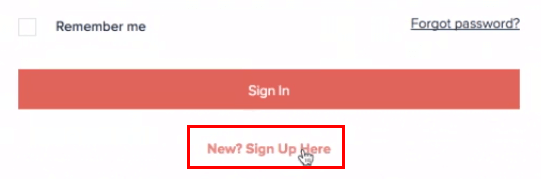
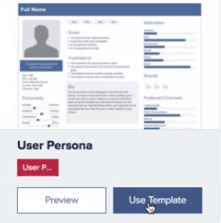

# Proto-Persona

 

## Usuários

Acabamos de fazer o nosso **Inventário de Conteúd**o, que servirá posteriormente para fazermos uma auditoria. Desta forma, quando terminarmos de criar o menu, veremos se englobamos todo o conteúdo colocado na planilha.

Analisamos a plataforma e a experiência que ela vai proporcionar, mas ainda não entramos em um assunto importante, que é o usuário.

O nosso cliente não tem verba para fazer pesquisa, mas ele possui conhecimento sobre os usuários da Casa do Código, com informações adquiridas usando a ferramenta **Google Analytics**.

Algumas informações eram que **85%** dos usuários são homens e **15%** mulheres, a idade é entre `18-34` anos, gostam de tecnologia, gostam filmes e seriados, assistem esportes, `99%` do público está no Brasil, sendo `40%`em São Paulo e `10%` no Rio de Janeiro.

Pegaremos as informações que identificam o público de usuários, e criaremos a persona. Acessaremos o site [Xtensio](https://xtensio.com/), efetuaremos o login clicando em Sign In. Caso não possua uma conta, ela pode ser feita clicando em "New? Sign Up Here".

 

 

Com o acesso efetuado, clicaremos em "Templates". Existem diversos modelos de *Templates* disponíveis, o que usaremos é o **User Persona**. Como usaremos a versão gratuita, não é possível exportar como arquivo, mas podemos tirar um print e compartilhar.

 

 

O Template possui vários campos onde podemos editar para caracterizar melhor a persona que representa o usuário. Podemos colocar imagem, nome e definir suas características. Também podemos colocar uma biografia, definir os objetivos e as frustrações do usuário e podemos colocar características pessoais como trabalho, filhos, cidade e detalhes da personalidade, e assim por diante.

Apesar de podermos usar um Template bem completo nós não temos essas informações, e o cliente não possui verba para gerar uma pesquisa. As únicas informações que temos são a adquiridas pelo Google Analytics.

Veremos como trabalhar com as informações que já possuímos.

 

## [Exercício] Definição de persona

Segundo o que vimos em aulas, quais das opções abaixo definem o que são as personas em UX?

- [ ] A) Usuários verdadeiros, aos quais podemos ter de 10 a 45 tipos diferentes de persona para cada feature.
    > Existe uma relação de pesquisa, resumo das mesmas e personas.

- [ ] B) Usuários falsos que utilizamos para que o time se distancie dos reais e isso auxilia a criar empatia.
    > A empatia se baseia justamente em se aproximar das pessoas e não de distanciamento.

- [x] C) Usuários baseados em resultados obtidos em pesquisa que auxiliam o time de UX a ter empatia pelo usuário final.
    > E elas são mais fáceis de memorizar a experiência a quem se está criando o projeto (produto ou serviço) pois damos nome a elas e utilizamos até fotos.

- [ ] D) Usuários disponibilizados pelo cliente para uma pesquisa aprofundada que nos remete ao moodboard.
    > Personas podem, sim vir prontas pelo cliente, mas elas não nos remetem ao moodboard.