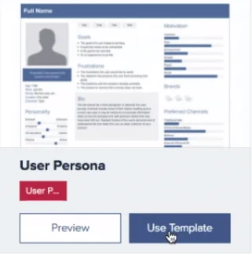
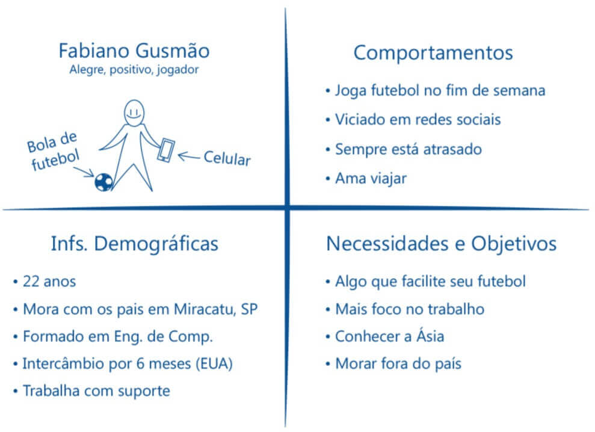
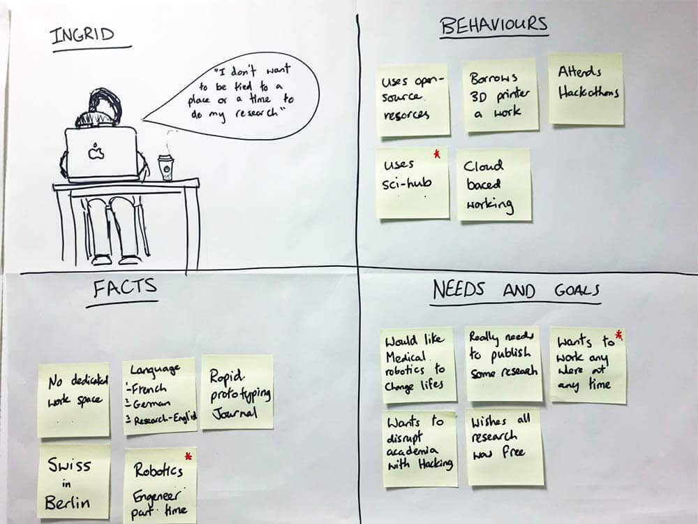
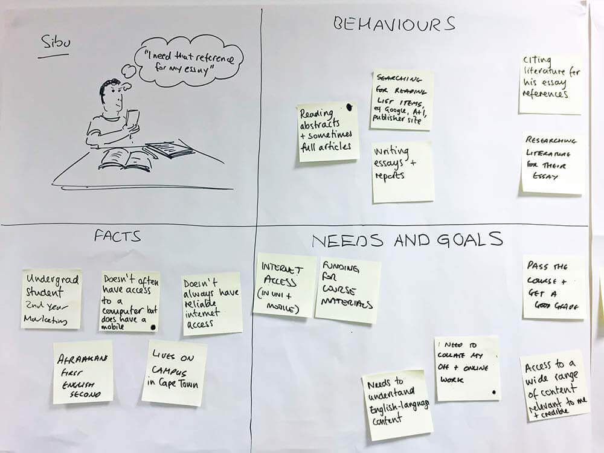

# Proto-Persona

 

## Usuários

Acabamos de fazer o nosso **Inventário de Conteúd**o, que servirá posteriormente para fazermos uma auditoria. Desta forma, quando terminarmos de criar o menu, veremos se englobamos todo o conteúdo colocado na planilha.

Analisamos a plataforma e a experiência que ela vai proporcionar, mas ainda não entramos em um assunto importante, que é o usuário.

O nosso cliente não tem verba para fazer pesquisa, mas ele possui conhecimento sobre os usuários da Casa do Código, com informações adquiridas usando a ferramenta **Google Analytics**.

Algumas informações eram que **85%** dos usuários são homens e **15%** mulheres, a idade é entre `18-34` anos, gostam de tecnologia, gostam filmes e seriados, assistem esportes, `99%` do público está no Brasil, sendo `40%`em São Paulo e `10%` no Rio de Janeiro.

Pegaremos as informações que identificam o público de usuários, e criaremos a persona. Acessaremos o site [Xtensio](https://xtensio.com/), efetuaremos o login clicando em Sign In. Caso não possua uma conta, ela pode ser feita clicando em "New? Sign Up Here".

 

 

Com o acesso efetuado, clicaremos em "Templates". Existem diversos modelos de *Templates* disponíveis, o que usaremos é o **User Persona**. Como usaremos a versão gratuita, não é possível exportar como arquivo, mas podemos tirar um print e compartilhar.

 

 

O Template possui vários campos onde podemos editar para caracterizar melhor a persona que representa o usuário. Podemos colocar imagem, nome e definir suas características. Também podemos colocar uma biografia, definir os objetivos e as frustrações do usuário e podemos colocar características pessoais como trabalho, filhos, cidade e detalhes da personalidade, e assim por diante.

Apesar de podermos usar um Template bem completo nós não temos essas informações, e o cliente não possui verba para gerar uma pesquisa. As únicas informações que temos são a adquiridas pelo Google Analytics.

Veremos como trabalhar com as informações que já possuímos.

 

## [Exercício] Definição de persona

Segundo o que vimos em aulas, quais das opções abaixo definem o que são as personas em UX?

- [ ] A) Usuários verdadeiros, aos quais podemos ter de 10 a 45 tipos diferentes de persona para cada feature.
    > Existe uma relação de pesquisa, resumo das mesmas e personas.

- [ ] B) Usuários falsos que utilizamos para que o time se distancie dos reais e isso auxilia a criar empatia.
    > A empatia se baseia justamente em se aproximar das pessoas e não de distanciamento.

- [x] C) Usuários baseados em resultados obtidos em pesquisa que auxiliam o time de UX a ter empatia pelo usuário final.
    > E elas são mais fáceis de memorizar a experiência a quem se está criando o projeto (produto ou serviço) pois damos nome a elas e utilizamos até fotos.

- [ ] D) Usuários disponibilizados pelo cliente para uma pesquisa aprofundada que nos remete ao moodboard.
    > Personas podem, sim vir prontas pelo cliente, mas elas não nos remetem ao moodboard.

 

## Proto-Personas

Vimos no vídeo anterior, não conseguimos criar um persona no Template do "Xtensio". O Template precisa de muitas informações que não possuímos, justamente pelo cliente não ter verba para criar um pesquisa.

O que podemos fazer nessa situação? Existe uma alternativa para a persona, que é a "proto-persona". A proto-persona é um tipo utilizado quando não temos as informações de pesquisa. Usamos as informações que vieram do cliente pelo *Google Analytics*, e misturamos com as intuições que o cliente e nós temos dos futuros usuários.

Desta forma, conseguimos pensar em diferentes casos de uso do projeto, e pensar nas necessidades de cada proto-persona, levando a **empatia**. Com isso, conseguimos nos colocar no lugar do usuário e tentamos entender o que ele busca em seus site, produto ou serviço.

Com base nas informações que já possuímos, criamos três proto-persona de mesmo modelo. Como a maioria o público é masculino, foi divido em duas proto-personas masculinas e uma feminina.

A primeira proto-persona é o **Adriano**. Ele tem 25 anos, isso porque nas informações a faixa de idade era entre `18-34`, mora em São Paulo, que é outra informação tirada do Google Analytics, onde `40%`são dessa cidade, fã de Star Wars, trabalha como desenvolvedor back-end com Java e procura aprender mais sobre JPA.

 

 

A escolha da profissão, é justamente porque precisamos de um proto-persona que use o que o site está vendendo, no caso, livros de tecnologia. Outra informação é que ele quer entender mais sobre **JPA**, inclusive é um dos temas de livros vendidos pela Casa do Código.

A segunda proto-persona é a **Gabriela**. Ela tem 33 anos, quase no limite da idade da faixa de 18 e 34 anos, mora em São Paulo, gosta de Game of Thrones, as informações indicam interesses por seriados, é desenvolvedora front-end, e procura algo que ajude a desenvolver site melhores.

 

 

Também possuímos livros sobre *front-end*, o que gera a empatia na equipe de desenvolvimento da Casa do Código, que vai usar seus conhecimentos para ajudar pessoas com o perfil da Gabriela a encontrar o que deseja.

A terceira *proto-persona* é o **Felipe**. Ele tem 19 anos, mora em São Paulo, gosta de novas de tecnologias, estudante de Sistemas da Informação e quer dar os primeiros passos como desenvolvedor.

 

 

Nosso foco foi a cidade de São Paulo, pelo fato de a maioria serem dessa cidade. O Felipe está no começo da carreira, e a Casa do Código tem produtos para perfis mais iniciantes.

Detalhe que todas as *proto-personas* possuem fotos, o que torna mais visual quem são os usuários da Casa do Código. Mas, agora que sabemos quem são os usuário, quais são os próximos passos para ajudá-los a navegar pelo site?

 

## [Exercício] Proto=personas

Vimos em aula que quando estamos em um projeto que não temos muita verba, precisamos improvisar um outro tipo de persona, a **proto persona**.

Segundo o que falamos, em qual situação é interessante usar a proto persona:

- [ ] A) Quando temos as personas e queremos também utilizar informações que a empresa possui sobre os usuários e que podemos conseguir com pesquisas nas ruas.
    > Quando já temos as personas, não utilizamos as proto personas, pois já temos as informações necessárias.

- [ ] B) Quando temos tempo para pesquisar e validá-la.
    > A ideia da proto-persona (protótipo de persona) é ser algo rápido e prático. Apenas em um segundo momento esperasse que ela seja validada.

- [x] C) Quando não temos verba, pegamos informações que a empresa já possui sobre os usuários. Além de intuição e [benchmarking](https://pt.wikipedia.org/wiki/Benchmarking).
    > Criado mais por feeling, com informações coletadas internamente em nossa empresa, ou da ideia que temos do nosso potencial usuário. Há sempre a necessidade de sua validação em algum momento.

- [ ] D) Quando temos uma verba considerável, pegamos informações passadas pelo cliente.
    > Se temos espaço financeiro, poderíamos fazer um trabalho de pesquisa para a persona primária já ser a final.

 

## [Exercício] Persona e Proto-Personas

- [ ] A) Proto-persona é mais verídica. 
    > Como ela se trata de um protótipo, é perigoso a levarmos até o final do projeto sem passar por uma validação.

- [x] B) Proto-persona começa sendo uma hipótese. 
    > Se torna interessante quando não temos verba (budget) ou tempo para fazer uma pesquisa qualitativa ou quantitativa sobre o usuário.

- [ ] C) Trabalhar com persona é algo 100% eficiente. 
    > Cuidado com certezas na UX. Da mesma forma que não existe receita de bolo para produtos ou serviços, não existe uma ferramenta que resolverá todos os seus problemas.

- [ ] D) Persona é baseada em intuição 
    > A **proto-persona** tem um pouco de *feeling* sim, porém, devemos realizar uma pesquisa para validar a persona.

 

## [Nota] Sua Proto Persona

Assim como fizemos em aula, pegue as características presentes no briefing e crie 3 proto personas para o menu da Casa do Código.

Pense no modelo simples que contenha:

+ Nome;
+ Idade;
+ Cidade onde mora;
+ Hobbie;
+ Profissão;
+ O que essa proto-persona busca/quer.
+ Você pode usar os exemplos de proto-persona: 

 

 

 

 

 

 

Lembre de colocar uma foto, de como você imagina essa proto-persona.

Bancos de imagem que recomendamos:

• [Pixabay](https://pixabay.com/pt/)

• [Freepik](https://br.freepik.com/)

 

## [Links] Mais sobre personas

Materiais extras sobre o tema da aula:

[A diferença entre personas de marketing, personas de design e proto-personas](https://brasil.uxdesign.cc/a-diferen%C3%A7a-entre-personas-de-marketing-personas-de-design-e-proto-personas-3375ead5b725)

[Entendendo o usuário com proto-persona](http://blog.caelum.com.br/entendendo-usuario-proto-persona/)
