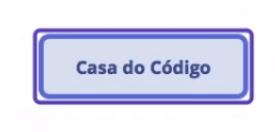
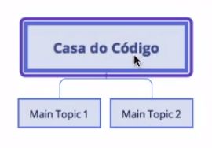
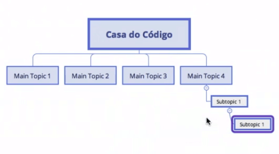
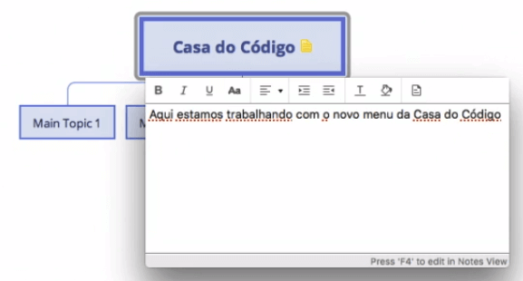
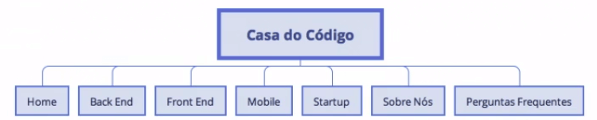
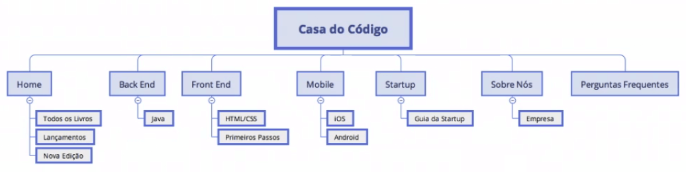
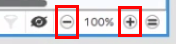
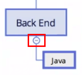
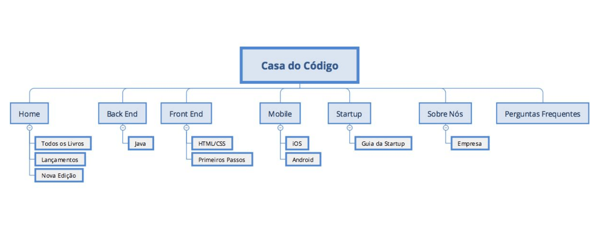

# Sitemap

 

## Sitemap no Xmind

Acabamos a última aula pensando em como mostraríamos as informações de tudo o que fizemos, a separação, o *Card Sorting* e a taxonomia, para o cliente.

A primeira opção seria compartilhar o arquivo do *Card Sorting* com o cliente, já que o Google Apresentações suporta está ação, ou tirar um printscreen da tela e colocar no *Invision*. Porém, o arquivo não está bonito, teríamos que diminuir a letra para organizar os blocos lado a lado.

Outra opção seria gravar o momento em que os usuários trabalham com o *Card Sorting*. Desta forma, é possível fazer uma reunião com o cliente e apresentar o vídeo, para que seja analisado e definido a estrutura do site.

Quando terminamos o *Card Sorting* e a taxonomia, alguns clientes mandam o **Sitemap** para que possamos usá-lo e ajustar os detalhes. No caso, o nosso cliente não mandou o *Sitemap*.

O Sitemap é a estrutura de como funciona o site. Diferente do Card Sorting, em que os cards ficam soltos, o Sitemap fica mais próximo de um diagrama. Existem casos onde o Sitemap já vem pronto do cliente, ou é a primeira entrega que o cliente deseja. Como já mencionamos, UX não é um processo "travado", podendo ser ajustado às diferentes situações.

Existe uma ferramenta que podemos usar para criar o Sitemap, trata-se do XMind. O [XMind](https://www.xmind.net/download/) possui algumas funcionalidades gratuitas, porém se desejar usar todas é necessário pagar.

Organizaremos o que foi feito com o Card Sorting e a taxonomia. Com o XMind aberto, clicaremos em "New Blank Map".

 

 

Agora no campo **Central Topic** que apareceu, colocaremos o assunto central, que é o site Casa do Código. Basta dar dois cliques e escrever "Casa do Código".

 

 

É possível alterar o tema clicando em **Themes**, do lado direito do XMind.

 

 

Para criar um **Main Topic** abaixo de Casa do Código, usaremos a tecla "Tab". Caso o item não apareça abaixo, podemos alterar a estrutura clicando com o botão direito do mouse em Casa do Código e "Structure > Org chart (Up to down)". A estrutura será mudada para baixo, como uma árvore, e se usarmos "Tab" novamente, o *Main Topic* já será criado no novo padrão.

 

 

Se selecionarmos um *Main Topic* e usarmos a tecla "Tab", criaremos um *Subtopic*. Para uma melhor visualização dos subtopics, acessaremos "Structure > Tree Chart (Right)", que ficarão alinhados a direita.

 

 

Podemos adicionar comentários nos tópicos, basta selecionarmos e pressionar "F4", assim o campo onde é possível colocar os comentários será aberto. Se desejar deletar ou modificar a nota, basta clicar com o botão direito do mouse, as opções **Modify** e **Delete** aparecerão.

 

 

Continuaremos trabalhando com o *Sitemap*.

 

[Exercício] Sobre o sitemap

Vimos em aula que temos um tipo de diagrama que nos auxilia no dia a dia de UX, o Sitemap.

Podemos afirmar que sitemap é:

- [ ] A) Representação em diagama das referências usadas no projeto.
    > Apesar do sitemap ser um diagrama, ele é relacionado às páginas do site, e não às referências usadas no projeto.    

- [ ] B) Um diagrama hierárquico que define a estruturação das páginas de um site ou aplicativo.
    > Interessante para se ter uma ideia da complexidade do projeto e da relação entre as páginas como um todo. Sempre focando no modelo mental do usuário.

- [ ] C) Um diagrama que relaciona todas as imagens e fotos usadas no projeto.
    > O sitemap é relacionado às páginas e não a um tipo especifico de conteúdo dentro delas, como imagens ou textos.

- [ ] D) Uma representação em formato de personagem do meu usuário.
    > Essa definição está mais ligada a ideia de persona.

 

## [Exercício] Sitemap e UX

Anteriormente estudamos o *sitemap*

Das opções abaixo, na organização do quê esse entregável de UX ele nos auxilia?

- [ ] A) Proto-personas 
    > Já passamos pela criação das mesmas e neste momento, estamos trabalhando com sitemap.

- [ ] B) Referências utilizadas 
    > As referências podem nos auxiliar a entender navegações e estruturas diferentes, entretanto, o sitemap é mais focado nas páginas.

- [x] C) Páginas 
    > E ainda facilita a identificar a relação entre esses conteúdos e quais telas teremos que produzir futuramente. Além de poder ajudar no trabalho do analista SEO.

- [ ] D) Pesquisas 
    > Atualmente não existe uma ferramenta focada em organização de pesquisas. O Google Docs seria uma boa saída.

 

## Fazendo o sitemap

Colocaremos todas as informações do Card Sorting no Sitemap, sendo o primeiro passo é organizar as seções do menu. A partir do Central Topic, localizado no topo e que leva o texto "Casa do Código", criaremos sete Main topic, nomeando cada um deles com as seguinte seções: "Home", "Back End", "Front End", "Mobile", "Startup", "Sobre Nós" e "Perguntas Frequentes".

 

 

O site atual da Casa do Código não possui todas essas categorias de menu. No entanto, com o Sitemap, estamos sugerindo essas opções para o cliente - isto significa, que elas podem ser recusadas.

Voltando ao Sitemap, adicionaremos três subtopic em Home, nomeando como: "Todos os Livros", "Lançamentos" e "Nova Edição".

No tópico Back End, colocaremos o subtópico **Java**, e no tópico **Front End**, adicionaremos o subtópico **HTML/CSS**. Colocaremos também livro "Primeiros Passos" no tópico Front End.

Em Mobile, colocaremos o os subtópicos "iOS" e "Android", e em Startup, iremos colocar "Guia da Startup". No tópico "Sobre Nós", colocaremos o subtópico "Empresa".

 

 

É possível aumentar e diminuir o tamanho da estrutura, basta clicar nos sinais de `+` (adição) e de `-` (subtração), que se encontram no canto inferior direito.

 

 

Dependendo do tamanho do site, a estrutura criada no Sitemap pode ficar enorme, de difícil visualização. Justamente por isso existe a opção de ocultar os itens da árvore clicando no sinal de - (subtração), que fica abaixo da caixa dos tópicos.

 

 

Vamos salvar o arquivo, é importante manter todas as versões de alterações que sua estrutura tiver. Infelizmente, na versão gratuita, não podemos exportar em algum formato que seja possível o cliente utilizar. Em um cenário ideal, se o cliente possuir o [XMind](https://www.xmind.net/), ele conseguirá abrir o arquivo exportado da versão gratuita.

+ [Draw.io](https://app.diagrams.net/)
+ [Gliffy](https://www.gliffy.com/)

Podemos tirar um *printscreen* e mandar para o cliente. A opção que a maioria dos profissionais de UX recomendam, é marcar uma reunião com o cliente e mostrar o *Sitemap*. Desta forma, é mais fácil sanar as dúvidas que o cliente pode ter sobre a estrutura.

O *printscreen* poderia ter sido feito do Google Apresentações, porém o XMind é mais organizado e fácil de trabalhar e apresentar para os clientes.

 

## [Exercício] Estrutura no Sitemap

Quando criamos em aula o nosso sitemap, ressaltamos a organização do conteúdo, a estrutura.

Como ficaria nosso site se optarmos por **não utilizarmos** um sitemap?

- [ ] A) Desorganizado e compatível com as práticas de mercado dos concorrentes visualizados. 
    > O sitemap feito em aula, se refere único e exclusivamente ao nosso cliente e não ao site dos concorrentes.
    
- [ ] B) Organizado e teríamos um índice do que devemos ter em nosso site. 
    > Sem o sitemap, a organização do site fica sujeita ao acaso de englobarmos todo o conteúdo que precisamos do site.

- [ ] C) Organizado e um índice do que sonhamos ter em nosso site. 
    > O sitemap vai além dos sonhos que o seu cliente tem, ele se preocupa com o que efetivamente precisa ter no seu site.

- [x] D) Desorganizado e não teríamos um índice do que devemos ter em nosso site. 
    > Porque ele sintetiza o Card Sorting e a Taxonomia feitas, mas de uma forma que irá ser absorvida pelo usuário.

 

## [Nota] Ferramentas para criação de Sitemap

+ [Xmind](https://xmind.net)
+ [Draw.io](https://app.diagrams.net/)
+ [Gliffy](https://www.gliffy.com/)

 

## Sitemap criado no estudo

 

 
