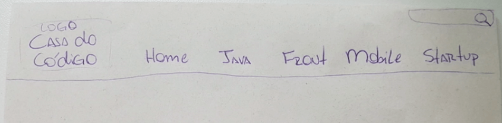
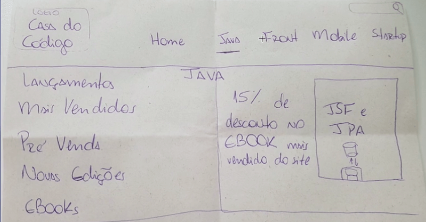

# Wireframe e Protótipo

 

## Desenhando o Menu

Além da entrega do Sitemap, precisamos também entregar alguns desenhos do menu. Se você fez os cursos de UX da Alura, viu que em casos de aplicações móveis usamos a técnica **Crazy Eight**.

No Crazy Eight, dobramos uma folha em **8 partes** para que em cada uma dessas partes representem uma etapa no processo de desenvolvimento da tela.

Como estamos trabalhando em um menu de uma tela web, podemos usar uma folha dobrada ao meio. Como vamos trabalhar apenas com o menu, não iremos alterar as telas da Casa do Código.

O cliente decidiu alterar as seções do menu, deixando o que ele julgava fazer mais sentido. No caso, foi decidido que o menu teria as seções: **Home, Java, Front, Mobile, Startup e um campo de busca**.

Primeiramente desenharemos o **menu fechado**, colocando todas as seções que ficarão visíveis antes da interação do usuário.

O menu fechado ficou da seguinte maneira:

 

 

Não é necessário ser um grande desenhista, e sim representar a ideia do menu para apresentar ao cliente.

A mudança do menu foi em decorrência de os livros de **Java** serem os mais procurados, por isso a escolha de manter uma seção no menu. Já as seções **Sobre nós** e **Perguntas Frequentes**, o cliente não achou necessário por estar no rodapé.

Faremos o **menu aberto**, com base no que foi pedido. Ao clicarmos em uma seção, por exemplo Java, ela ficará marcada. Será aberto um menu com os itens: **Lançamentos, Mais Vendidos, Pré Venda, Novas Edições e Ebooks**. Ao lado, terá uma imagem de um livro que está em promoção. As outras categoria do site seriam da mesma forma.

 

 

Em projetos, pode acontecer que o cliente não adote as funcionalidades que ele mesmo solicitou para a equipe de UX. Diversos fatores podem gerar essa situação, o cliente pode não concordar com o que fizemos, os usuários não conseguem utilizar a nova estrutura, e até mesmo ver que a ideia não era tão interessante.

E o que fazemos com os desenhos? Tiraremos uma foto e colocaremos no [Invision](https://www.invisionapp.com/).
