

# Wireframe e Protótipo

 

## Desenhando o Menu

Além da entrega do Sitemap, precisamos também entregar alguns desenhos do menu. Se você fez os cursos de UX da Alura, viu que em casos de aplicações móveis usamos a técnica **Crazy Eight**.

No Crazy Eight, dobramos uma folha em **8 partes** para que em cada uma dessas partes representem uma etapa no processo de desenvolvimento da tela.

Como estamos trabalhando em um menu de uma tela web, podemos usar uma folha dobrada ao meio. Como vamos trabalhar apenas com o menu, não iremos alterar as telas da Casa do Código.

O cliente decidiu alterar as seções do menu, deixando o que ele julgava fazer mais sentido. No caso, foi decidido que o menu teria as seções: **Home, Java, Front, Mobile, Startup e um campo de busca**.

Primeiramente desenharemos o **menu fechado**, colocando todas as seções que ficarão visíveis antes da interação do usuário.

O menu fechado ficou da seguinte maneira:

 

 

Não é necessário ser um grande desenhista, e sim representar a ideia do menu para apresentar ao cliente.

A mudança do menu foi em decorrência de os livros de **Java** serem os mais procurados, por isso a escolha de manter uma seção no menu. Já as seções **Sobre nós** e **Perguntas Frequentes**, o cliente não achou necessário por estar no rodapé.

Faremos o **menu aberto**, com base no que foi pedido. Ao clicarmos em uma seção, por exemplo Java, ela ficará marcada. Será aberto um menu com os itens: **Lançamentos, Mais Vendidos, Pré Venda, Novas Edições e Ebooks**. Ao lado, terá uma imagem de um livro que está em promoção. As outras categoria do site seriam da mesma forma.

 

 

Em projetos, pode acontecer que o cliente não adote as funcionalidades que ele mesmo solicitou para a equipe de UX. Diversos fatores podem gerar essa situação, o cliente pode não concordar com o que fizemos, os usuários não conseguem utilizar a nova estrutura, e até mesmo ver que a ideia não era tão interessante.

E o que fazemos com os desenhos? Tiraremos uma foto e colocaremos no [Invision](https://www.invisionapp.com/).

 

## Desenhando o Menu

Em aula, nós produzimos desenhos sobre o menu que precisávamos desenvolver.

Quais os principais ganhos de rascunharmos à mão em vez de trabalharmos diretamente com o computador?

- [ ] A) Escolha dos textos e microcopy utilizados. 
    > Apesar de ser aceitável, investir tempo no copywrite pode vir em um segundo momento.
    
- [x] B) Não dependeremos do conhecimento nenhum software de edição de imagens. 
    > O cliente também não precisará manusear o software. Isso pode ajudá-lo a se sentir mais parte do time e do projeto.

- [x] C) Agilidade em correções de algo que claramente não está terminado. 
    > Um layout final com uma UI interessante pode ser uma barreira para inovação, enquanto, um rabisco num papel, o time pode ficar mais solto para apontar melhorias.

- [ ] D) Agilizamos o processo de escolha das cores. 
    > Quando formos focar em rascunhas as ideias, tentamos deixar a interface de lado para não influenciar na estrutura do projeto.

 

## Desenho e Invision

Agora que tiramos as fotos dos desenhos do menu, colocaremos no Invision. Usaremos o *Invision* para não perdermos nada do projeto, e também para que o cliente possa utilizá-lo como se fosse um usuário.

Após efetuar o *login*, vamos criar um novo projeto. Desta vez, criaremos um protótipo, por isso escolheremos a opção **Create New Prototype**.

 

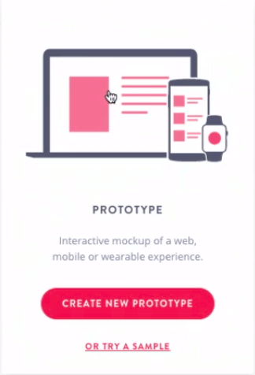

 

Na janela seguinte, escolheremos o tipo de protótipo que desejamos criar. Colocaremos o nome **Casa do Código - Desenhos**, e escolheremos a opção **Desktop (Web)**. Após, clicaremos em **Get Started**

 

 

Colocaremos o nome da imagem com o menu fechado de `menu1`e a do menu aberto `menu2`. Entrando no novo projeto, arrastaremos as imagens na tela de **Add some screens to get started**. Após o término do carregamento, abriremos as imagens.

Como é a primeira vez que estamos abrindo as imagens, o Invision nos mostrará algumas dicas. Podemos abrir as imagens no modo preview, adicionar interações no protótipo, colocar comentário entre o time e o cliente, modo de *inspeção* e o histórico das versões anteriores, além de verificar qual membro da equipe fez alterações ou subiu arquivos.

Com a imagem aberta, podemos passar para a próxima foto clicando nas setas que ficam na lateral. Na barra inferior, temos a opção de voltar para o *Invision*, acessar o projeto, nome da imagem, compartilhar nas redes sociais, subir novas telas, configurações de imagem, colocar status e compartilhar através de um link.

 

 

A ferramenta possui atalhos para acessar algumas funcionalidades. Para acessar o "Preview Mode", usaremos o atalho com a tecla "P", "Build Mode" com a tecla "B", "Comment Mode" com a tecla "C", o "Inspect Mode" com a tecla "I" e o "History Mode" com a tecla "H". Usaremos o Build Mode, para criar os link do protótipo. Criaremos o link da categoria **Java**, já que temos a tela que representa o menu.

Com o Build Mode ativado, selecionaremos a área da imagem que representa a seção Java. Após selecionar, clicaremos em "Browse" no menu **Link** to que será aberto automaticamente, e selecionaremos a imagem "menu2", em seguida clicaremos em "Save".

 

 

Faremos o mesmo com a seção **Home**, porém o link será para a imagem "menu1". Para ver se os links estão funcionado, podemos ir no Preview Mode e clicar na área da seção com o link configurado. Também é possível testar os links no modo *Build Mode*, basta segurar a tecla "Shift" e clicar no link.

Na tela "menu2", criaremos o link na seção *Home* direcionando para a imagem "menu1", e na seção Java, criaremos um link direcionando para a própria imagem "menu2".

Agora que o protótipo possui interação, podemos compartilhar com o cliente. Na barra inferior, clicaremos no nome do nosso protótipo **Casa do Código - Desenho**.

 

 

Voltamos para a tela inicial do protótipo. No canto superior direito, clicaremos no botão **Share**.

 

 

Na nova janela aberta, clicaremos em public share link para que o link do projeto seja copiado, basta enviarmos esse link para o cliente. Quando o cliente clicar no link será direcionado para a tela inicial do protótipo que é o "menu1".

 

 

Para fazer um cometário, basta ativar o botão de comentários e clicar no ponto da imagem que deseja comentar, uma caixa será aberta com um campo para escrever.

 

 

É possível responder em um comentário já existente, basta ativar o botão e clicar no comentário que deseja responder.

Agora sabemos como compartilhar com o cliente.

 

## [Exercício] Protótipo de papel

Após desenharmos o menu, desenvolvemos também um protótipo de papel no InVision.

Quais vantagens de enviarmos os desenhos para o cliente através da ferramenta e não por email?

- [x] A) Conseguimos simular o uso, pois o protótipo é navegável. 
    > Interessante para ver se o fluxo de navegação está fazendo sentido.

- [x] B) Coletar feedbacks usando a feature de comentários. 
    > Mesmo pessoas que não propriamente do time podem opinar a respeito.

- [ ] C) O código front-end já fica pronto. 
    > Atualmente nenhuma ferramenta de prototipação e/ou de design faz um código semântico e acessível.

- [x] D)Centralização dos entregáveis de UX em poucos lugares. 
    > Ter tudo organizado em um só lugar pode ajudar na organização do projeto.

 

## Conhecendo o Figma

Enviamos o protótipo para o cliente, e recebemos a aprovação. Porém, o cliente deseja ver como ficaria o menu no site, por isso, precisaremos enviar uma versão mais próxima do resultado final.

Existe alguns tipos de Wireframe: 

 + O primeiro foi desenhado à mão, e é chamado de **baixa fidelidade**. Ele é usado para ter noção da estrutura.

+ O segundo é o de **média fidelidade**. Ele pode usar elementos que serão usados na versão final.

+ O último, é a versão de **alta fidelidade**, no qual usamos as fontes, cores, imagens e logos do cliente. É o mais próximo do resultado final.

Alguns profissionais de UX fazem os dois primeiros, deixando o de alta fidelidade para o profissional de **User Interface** (UI). No entanto, existem empresas que UX e UI são responsabilidade do mesmo profissional. Em nosso cenário, faremos até média fidelidade.

Como faremos? Existem diversas ferramentas que podem ser usadas, como o Photoshop, Illustrator e Sketch, porém usaremos uma ferramenta chamada Figma. Trata-se de uma ferramenta gratuita, que pode ser utilizada ao criarmos uma conta colocando o e-mail e clicando em ***Create account**.

 

 

É possível criar seu *layout* e compartilhar com seus amigos, com a possibilidade de criar trabalhos colaborativos. Com o login efetuado, seremos direcionados para a tela de usuário.

Assim como o *Invision*, o *Figma* possui atalhos para otimizar o trabalho.

 

## [Exercício] Protótipos de baixa fidelidade

Citamos em aula que existem três tipos de protótipos e que cada um tem suas características.

Com relação ao de **baixa fidelidade** (tons de cinza), qual das alternativas abaixo possui uma de suas **desvantagens**?

- [ ] A) Leva um tempo considerável para ser feito. 
   > Por não nos preocuparmos com cores e diagramação, seu desenvolvimento normalmente é relativamente rápido.

- [x] B) Pode não passar a sensação de ser realmente um produto. 
   > O usuário precisa ter um certo nível de abstração para entender o que aquilo representa.

- [ ] C) Por não possuir cores, testes de usabilidade são impossíveis. 
   > Se você precisa testar o fluxo de navegação num teste de usabilidade, mesmo um protótipo de baixa fidelidade pode funcionar.

- [ ] D) Precisa ser feito em HTML e CSS. 
   > Protótipos feitos em HTML/CSS visam economizar tempo no desenvolvimento front-end, e normalmente já são feitos em alta fidelidade.

 

## Desenhando no Figma

Agora que criamos a conta e sabemos como funciona o Figma, criaremos duas partes do menu, para o cliente ver como funciona. Na tela do Figma, entraremos em **Google Material Design**.

 

 

Selecionaremos a tela "Desktop", pois o menu que criaremos é para um site desktop. Clicaremos no nome Desktop, a tela ficará selecionada, agora copiaremos com "Ctrl + C". Com a tela copiada, voltaremos para a área de seleção de projetos e selecionaremos a opção "New file".

 

 

Após o carregamento do projeto, clicaremos na seta que fica ao lado do título do projeto, em seguida, clicaremos na opção "Rename".

 

 

Colocaremos o nome "Casa do Código - Versão 2", isso porque temos a versão 1 no Invision, que também armazenará a versão 2. Após colocar o nome, usaremos o atalho "Ctrl + V" para colar a imagem que tínhamos copiado anteriormente. Caso ela esteja muito grande, basta retirar o zoom.

A tela que copiamos possui duas linhas rosas, para removê-las, será necessário clicar no cadeado que aparece no menu lateral esquerdo, especificamente em "redlines".

 

 

Agora com a tela "Ctrl" pressionada, selecionaremos a linha e, depois, pressionaremos a tecla "delete". Também é possível remover todas as linhas de uma vez, basta deletar a opção redlines do próprio menu.

Começaremos na tela com o menu fechado, a tela "menu1". Primeiramente, colocaremos o nome `Menu 1 - Figma` na tela clicando em Desktop em cima da barra de menu esquerdo.

 

 

Como vamos trabalhar em duas telas, clicaremos no nome que fica acima do layout, com a tela selecionada, iremos copiá-la e colá-la nesse mesmo projeto. Em seguida, reposicionaremos a tela ao lado da original. Não podemos esquecer de alterar o nome da segunda tela para `Menu 2 - Figma`.

Removeremos todos os elementos da barra superior do layout. Para isso, removeremos do menu esquerdo a opção "app bar".

 

 

Deletaremos também a opção "title bar".

 

 

Também removeremos toda a barra de aplicativos. Para remover de uma maneira mais rápida, deletaremos a opção "navbar" do menu.

 

 

Executaremos o mesmo procedimento na tela `Menu 2 - Figma`, e teremos dois retângulos pretos.

 

 

Agora temos duas telas limpas para trabalhar.

 

## Continuando o desenho no Figma

Analisando o menu fechado que foi desenhado à mão, perceberemos que existe uma linha que separa o menu de seções com o corpo da página, formando um retângulo. Esse será o primeiro passo.

 

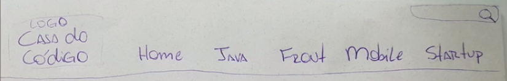

 

A Casa do Código possui as cores laranja e branco, como estamos trabalhando em um modelo de **média fidelidade**, não nos preocuparemos com a cor.

No menu superior do Figma, existe uma seção com o símbolo de uma quadrado, com várias opções para desenhos geométricos. Selecionaremos a opção "Rectangle Tool".

 

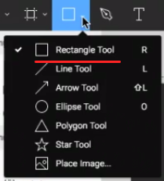

 

Também é possível acessar o Rectangle Tool utilizando o atalho "R". Em seguida, criaremos um retângulo na área superior do layout `Menu 1 - Figma`.

 

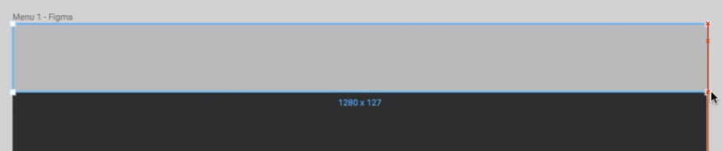

 

Retângulo foi criado na cor cinza que pode se confundir com a cor do editor. Na barra de menu do lado direito do Figma, existe a opção "Fill", onde podemos alterar a cor. Escolheremos a cor `#828282`.

 

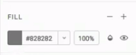

 

Com o retângulo selecionado, iremos movimentá-lo usando a seta do teclado. O primeiro elemento do menu é o logo da Casa do Código, porém, não estamos trabalhando em um *layout* de alta fidelidade, por isso, usaremos apenas um texto para representá-lo.

No menu superior do *Figma*, selecionaremos a opção "Text Tool", que pode ser acessada pelo atalho "T". Depois, escreveremos no retângulo que criamos do layout o texto: "Logo Casa do Código".

 

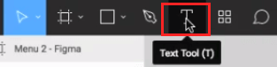

 

A letra está bem pequena, para aumentar, acessaremos o menu direito do Figma e na seção "Text", selecionaremos `18px`.

 

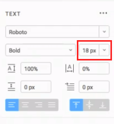

 

Ainda em Text, é possível alinhar o texto em diferentes posições, escolheremos alinhado ao centro. Usando o atalho "R", criaremos um retângulo para ficar em volta do texto. Mas perceba que, assim como Photoshop, o template do retângulo ficou na frente do texto. Podemos resolver isso arrastando os elementos no menu esquerdo do Figma, colocando o texto acima do retângulo.

 

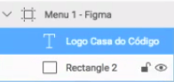

 

A representação do logo da Casa do Código está criada.

 

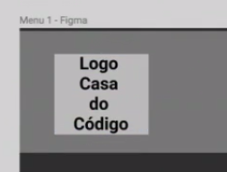

 

Criaremos como texto e com o tamanho da fonte 16px, as outras seções que estabelecemos no wireframe da Casa do Código. As seções são: **Home, Java, Front, Mobile e Startup**.

Para agilizar o alinhamento do menu, selecionaremos todas as seções, e clicaremos em **Distribute Horizontal Spacing**.

 

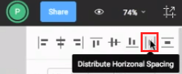

 

Temos todas as seções criadas no menu:

 

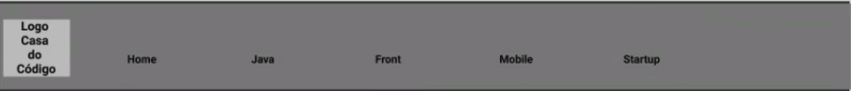

 

Ainda falta o campo de busca. Para ele criaremos um retângulo do lado direito superior, e dentro dele, escreveremos o texto "O que você está procurando?".

O texto ficou grande e destacado no campo de pesquisa. Na seção Text do menu direito do Figma, trocaremos o valor **bold** por **regular**, e mudaremos o tamanho da fonte para `12px`. Ainda com o texto selecionado, mudaremos a opacidade clicando na paleta de cores.

O menu fechado ficará da seguinte maneira:

 

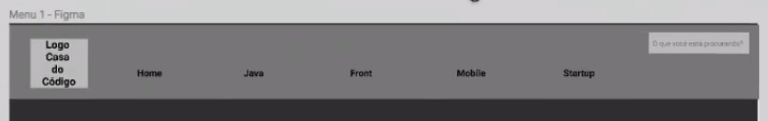

 

## Esboçando no Figma

Fizemos a nossa primeira tela, que representa o menu fechado. Faremos agora a **segunda tela**, que representa o **menu aberto**.

Começaremos selecionando todos os elementos do menu que criamos. Na barra lateral esquerda selecionaremos os elementos: **O que você está procurando?, Rectangle 3, Startup, Mobile, Front, Java, Home, Logo Casa do Código, Rectangle 2, Rectangle**.

 

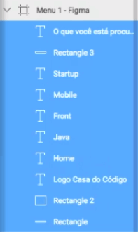

 

Com os elementos selecionado, podemos usar o atalho "Ctrl + G" (Windows e Linux) ou "Command + G" (Mac) para agrupá-los.

 

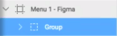

 

Agora selecionado o **Group** que foi criado, usamos o atalho "Ctrl + C" para copiar. Clicaremos no nome da tela **Menu 2 - Figma**, em seguida usaremos o atalho "Ctrl + V" para colar. Pronto, já temos parte do menu criado.

Para desagrupar, basta clicar com o botão direito do mouse no grupo e selecionar Ungroup Selection.

 

 

Olhando o primeiro projeto vemos no menu 2, a seção Java fica selecionada ao ser clicada. No Figma, começaremos desenhando um linha embaixo da seção Java.

Para desenhar a linha podemos usar o atalho "L", ou selecionar no menu superior do Figma a opção **Line tool**, em seguida só criar a linha com o mouse. Alteraremos a cor da linha para laranja e na seção **Stroke** da barra lateral direita, mudaremos o tamanho da linha em Weight, colocaremos **3px**.

 

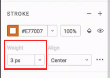

 

Faremos agora um retângulo que vai agrupar todas as funcionalidade da seção Java. Usando o atalho "R", criaremos um retângulo **1278 x 356** embaixo do menu. Novamente em Stroke, deixaremos o contorno do novo retângulo de laranja, para indicar que faz parte do menu.

 

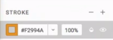

 

No topo do retângulo, escreveremos com o atalho "T" a "Você está navegando na área Java".

 

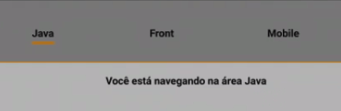

 

Criaremos outro retângulo **200 x 256** do lado direito, para representar a capa do livro em promoção. Mudaremos a cor para branco, assim não ficará na mesma cor que o retângulo de fundo. Para mostrar que é um capa de livro, faremos igual o ícone do site, escreveremos "Aqui estará o livro"

 

 

Do lado esquerdo, colocaremos em texto as opções que o menu oferece, que são: **Lançamentos, Mais Vendidos, Pré Venda, Mais Edições e eBooks.**

 

 

Perceba como o menu está diferente, deixamos um espaço em branco bem grande do meio. Veremos como ajustar isso no próximo vídeo.

 

## Finalizando no Figma e Protótipo

Colocaremos a frase "Você está navegando na área Java" acima da categoria "Lançamentos". Com a intenção de diminuir, o espaço entre os elementos, vamos aproximar a capa do livro para perto das opções do menu. Selecionaremos o retângulo da capa, depois, com as "Setas" do teclado para movimentar.

Também diminuiremos o tamanho do retângulo do menu aberto, para que não fique com muito espaço à direita. A frase "Você está navegando na área Java" mudaremos para "Departamento Java", e faremos uma linha separando as opções do departamento com a capa do livro.

 

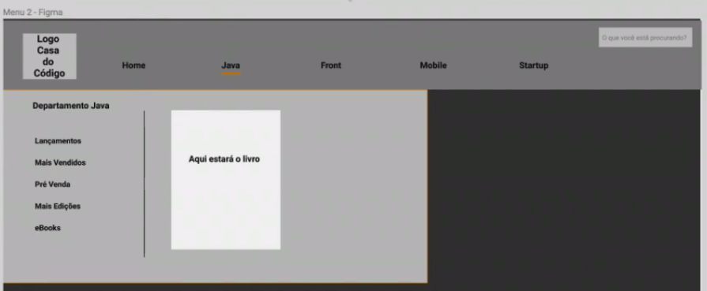

 

Desta forma, colocaremos o texto de promoção do livro, ao lado direito da capa. Escreveremos:

 

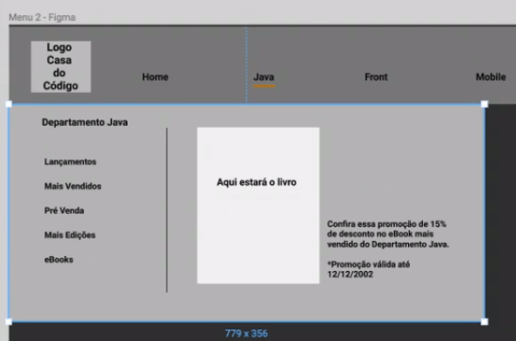

 

Para representar melhor a promoção, poderíamos colocar uma elipse, acima do texto de promoção, usando o atalho "O" ou selecionado **Elipse Tool** na barra superior. Colocaremos a cor preta na elipse, e dentro o texto **"15%"** em cor branca.

 

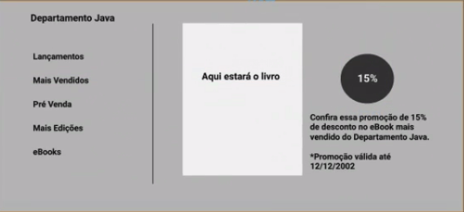

 

Para deixar mais claro para o usuário em qual seção ele está navegando, colocaremos um polígono que aponta para Java. Selecionaremos a opção "Polygon Tool" e colocaremos embaixo da seção "Java" do menu.

 

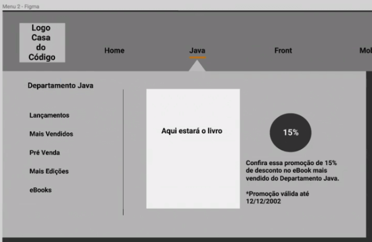

 

E como faremos para exportar as telas para colocarmos no Invision? Na barra lateral direita, temos a opção Export. Selecionaremos as duas telas e em **Export**, colocaremos o formato **JPG**, em seguida, clicaremos em "Export 2 Layers".

 

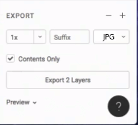

 

Com as duas telas exportadas, no Invision criaremos um novo protótipo com o nome "Casa do Código - Versão 2", do tipo desktop. O próximo passo será arrastar as imagens para a área "Add some screen to get started".

Após as telas carregadas, faremos o link das imagens da mesma forma como fizemos com a versão 1 do protótipo. Na tela "Menu 1 - Figma", usaremos o atalho "B" do Invision. Com o **Build mode** ativado, criaremos o link na seção Java, apontando para "Menu 2 - Figma".

 

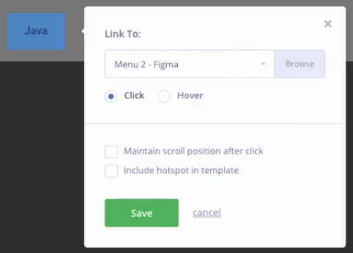

 

No menu superior do Invision, selecionaremos "Fixed Header". Ao marcar a opção, uma barra será exibida, onde posicionaremos na linha inferior do menu do protótipo, ou podemos colocar o valor **130** para que seja posicionada automaticamente.

 

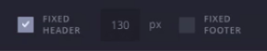

 

Na tela "Menu 2 - Figma" criaremos o link nas seções "Home" e "Java", apontando para a tela "Menu 1 - Figma". Desta forma, o menu ficará com uma animação de abrir e fechar ao clicar em Java.

Voltando para a raiz do projeto "Casa do Código - Versão 2", clicaremos em "Share".

 

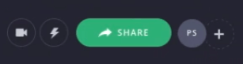

 

Na janela seguinte, clicaremos em "public share link" para copiar o link e enviar para o cliente.

 

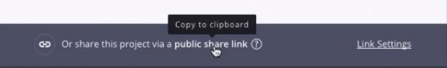

 

Colocando o link no navegador, veremos que tudo funciona.

 

## [Exercício] Criando o seu protótipo

Assim como fizemos no estudo, produza os seguintes itens:

1) Crie seus desenhos para o menu do nosso projeto;

2) Crie um projeto de protótipo no Invision e link os seus desenhos;

3) Crie uma conta no [Figma](https://www.figma.com/);

4) Crie um projeto (New File) no Figma e desenhe as telas em um wireframe de baixa/média fidelidade;

5) Exporte as telas do Figma e crie um novo protótipo no InVision e então, link todas as telas, para que a navegação funcione.

Lembre de pedir para alguém testar seu protótipo, pois só assim você conseguirá ver possíveis problemas no fluxo de navegação, seja de encontrabilidade ou mesmo sobre as categorizações feitas.

 

## [Para saber mais] Podcast sobre prototipação

Muito se fala sobre tirar uma ideia do papel e colocá-la em ação. Mas antes de tirar algo do papel, é necessário colocar algo lá.
Como fazer isso corretamente? Como esboçar uma ideia? Que ferramentas posso usar para isso?_

[Prototipação: erre cedo para acertar cedo – Hipsters #28 (41min)](https://hipsters.tech/prototipacao-erre-cedo-para-acertar-cedo-hipsters-28/)

 

## Protótipo feito no estudo

https://projects.invisionapp.com/share/RMB5L7KSD#/screens/227026932

 

## Slides do Estudo

 

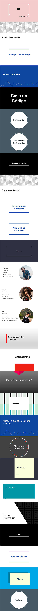

 
