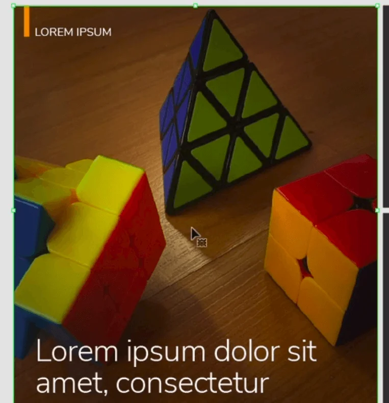
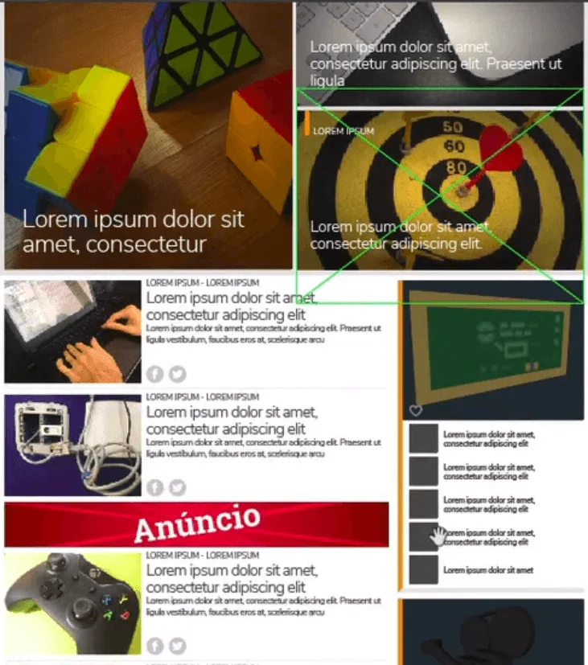
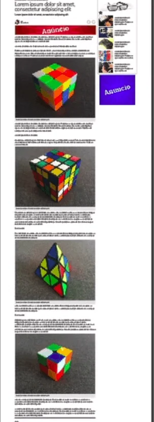
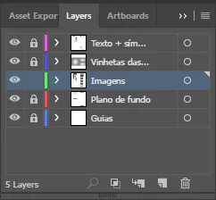
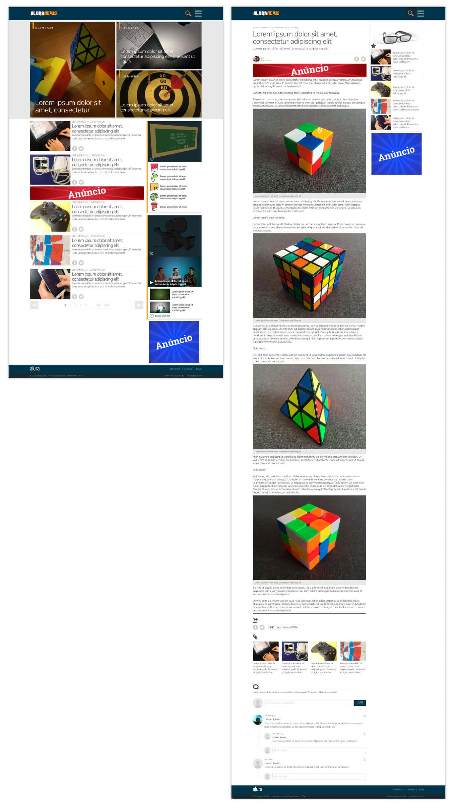
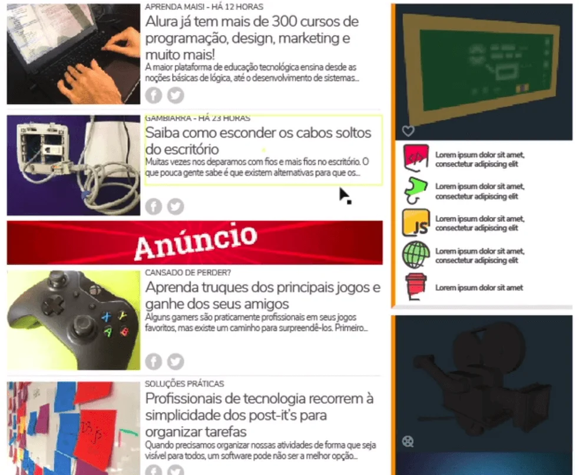

# Inserir conteúdo no layout

 

## Os problemas causados pela ausência de imagens

Posicionamos os elementos do layout de forma que a leitura fique mais fácil para o usuário. Mas continuaremos olhando um pouco mais de perto. Notem que há várias caixas cinzas que delimitam os locais onde deveriam ter imagens e, nos textos, temos o velho e conhecido preenchimento com textos do [Lorem Ipsum](https://www.lipsum.com/).

Neste ponto, caímos no mito de que [não precisamos do conteúdo para fazer o design do site](https://uxmyths.com/post/718187422/myth-you-dont-need-the-content-to-design-a-website). Este é o mito número 19 no [UX Myths](https://uxmyths.com/). O que os especialistas têm a dizer sobre isso?

[Kristina Halvorson](https://www.contentstrategy.com/kristina-halvorson), uma das autoras do livro "[Content Strategy for the Web](https://www.contentstrategy.com/content-strategy-for-the-web)" diz que as **decisões** de design devem ser baseadas no **conteúdo**. O design é criado como suporte ao conteúdo. O conteúdo é o principal fator para a criação do design.

Sem imagens no projeto, ficamos bem distantes da real sensação que o mesmo se propõe a passar. Primeiramente, nos preocuparemos apenas com as imagens, depois trataremos os casos de texto. No arquivo com o projeto do curso, baixado anteriormente, temos o 'conteudo-aluranews', que é um documento de texto com a descrição do conteúdo do site. Na sessão de "Destaques" da "Página principal", temos:

**Página principal**

**Destaques**

+ Foto
+ Palavra-chave
+ Título de destaque

1 - `cubos-magicos.jpg`

DIVERSÃO

Cubos mágicos: conheça variações desse brinquedo

2 - `produtos-apple.jpg`

"MAC IDEAL"

Saiba a configuração recomendada para diferentes tipos de atividade

3 - `alvo.jpg`

NO ALVO!

Os segredos do sucesso de uma startup de tecnologia

Ou seja, as imagens estão descritas com suas respectivas posições. Elas podem ser encontradas na pasta `_Imagens`. Sendo assim, arrastaremos a imagem `cubos-magicos.jpg` para dentro do Illustrator com apenas a camada `imagens` livre. Todas as outras deverão estar bloqueadas. Após isso, redimensionaremos a imagem dos cubos para que as partes inferior e superior fiquem iguais à maior área de destaque. Depois disso, recortaremos a imagem com o "CTRL + X" e utilizaremos o atalho "CTRL + B" para colar a imagem por trás do quadro cinza.

 

 

Selecionaremos o quadro cinza e a imagem dos cubos, clicaremos com o botão direito do mouse e selecionaremos a opção "Criar máscara de recorte". Assim, teremos:

 

 

O processo será o mesmo para as demais imagens do bloco de destaque. Lembrando que, dessa forma, podemos dar dois cliques nos quadros cinzas — que são máscaras de recorte — e reposicionar as imagens. Se necessário redimensionar a máscara, não distorceremos as imagens. Seguiremos o texto que descreve o conteúdo do site para adicionar todas as imagens dele.

Após adicionar algumas, notaremos que o layout ganhou cores e ficou um pouco mais próximo do real. As imagens das notícias agora são diferentes. Elas tiram a sensação de que estamos olhando um wireframe, onde a representação das imagens são pequenas caixas.

 

 

Uma forma mais prática de criar a máscara de recorte ao invés de usar o clique do mouse, é utilizar o atalho "CMD + 7" ou "CTRL + 7", se usar o Windows. Uma observação importante é que na área de widgets, onde as imagens estão exatamente do tamanho que precisam ser, podemos posicioná-las com os blocos cinzas e depois removê-los, deixando apenas as imagens nos locais.

 

 

Notem a quantidade de cores que as imagens adicionaram ao nosso layout. É dessa forma que conseguimos sentir diretamente como o design se comporta com o conteúdo real. Para a página interna, o processo será basicamente o mesmo, mas vamos repetir algumas imagens que já estão na página inicial. Repetir imagem não é um problema. O problema é repeti-la várias vezes em uma mesma página, por exemplo.

Continuando com o processo de colocar cada imagem em seu devido lugar, de acordo com a descrição no arquivo de conteúdo do site, teremos a página interna de conteúdo da seguinte forma:

 

 

Lembrando que é muito importante verificar cada alinhamento de imagem de perto, para garantir que nada cause estranheza.

Assim, terminamos o processo de substituição das imagens *placeholders* por imagens reais, que fazem parte do conteúdo do site. Já temos uma impressão mais próxima do real, mas ainda precisamos trabalhar os textos.

 

## [Exercício] Layout e Conteúdo

Inserir conteúdo ao nosso layout apresenta algumas vantagens. Qual das alternativas a seguir apresenta uma dessas vantagens?

- [ ] A) Pensar em como distribuir o conteúdo de forma aleatória. 
    > Uma página de estrutura simples mas com conteúdo bem organizado e coerente, sem decisões aleatórias, é muito mais atraente e ajuda na usabilidade do site.

- [ ] B) O conteúdo ajuda apenas os designers durante o processo criativo. 
    > Inserir conteúdo ao layout ajuda não somente na tomada de decisão para designers, mas também para melhor compreensão de toda a equipe (incluindo programadores, diretor de arte, etc.) do resultado final esperado.

- [ ] C) Inserir conteúdo ajuda a deixar o layout mais bonito, mas não interfere na construção do layout como um todo. 
    > Adicionar o conteúdo de imagens e texto ajuda a prever a disposição, as cores, os ruídos e as adaptações que serão necessárias em nosso layout, ou seja, interfere e muito na construção do layout.

- [x] D) O conteúdo auxilia na tomada de decisões no desenvolvimento do design. 
    > Segundo Kristina Halvorson e Melissa Rach, as decisões de design são tomadas com base no conteúdo, ou seja, o design é feito para suportar o conteúdo.

 

## [Prática] Adicionando as imagens

Agora, aplicaremos os conceitos aprendidos ao layout do "Alura News". 

Para praticar, adicionaremos as imagens de acordo com o briefing conteudo-aluranews.txt que recebemos. Ou seja, para cada orientação de imagem no briefing, busque na pasta _images a imagem correspondente à cada espaço cinza delimitado no layout.

Colem as imagens atrás dos retângulos cinzas da camada "Imagens" e selecionem ambos para criar uma máscara, reaproveitando as formas já delimitadas. Fiquem atentos aos limites da imagem, encaixando adequadamente dentro das margens.

> Dica: Certifiquem-se de que estão apenas com a camada de imagens aberta, para que fique mais fácil de fazer as alterações, sem desajustar as outras camadas.

 

 

Para encaixar as imagens adequadamente ao layout, primeiro ajuste o tamanho e alinhe segundo as delimitações das caixas cinza.

 

 

Para fazer a máscara, recorte a imagem com o atalho **command+x** (ou ctrl+x no Windows) e cole com o comando **command+B** (ou ctrl+B) para que a imagem seja automaticamente colada atrás do retângulo cinza. Depois, selecione a imagem e o quadrado cinza, clique com o **botão direito** e escolha a opção Make *Clipping Mask* (fazer máscara de recorte) para criar a máscara.

 

 

**Dica:** Para agilizar, podemos usar o **command+7** (ou ctrl+7) para criar a máscara, uma vez que este comando será repetido muitas vezes ao longo do processo.

Ao final seu resultado deverá ficar mais ou menos assim:

 

 

## Os problemas causados por textos de preenchimento

Vimos que as imagens realmente fazem diferença na sensação de realidade que o layout procura passar.

Mas, e os textos? As pessoas acessam os sites pelos conteúdos oferecidos por eles, não pelo design. Utilizamos um buscador para pesquisar algo e, como consequência, abrimos a página de um site.

O problema dos textos de preenchimento do Lorem Ipsum é que, apesar de oferecer uma boa estética, falta novamente essa sensação de realidade, considerando que apenas replicamos um trecho de texto em todas as partes, o que não faz parte da rotina do conteúdo real dos sites. Um texto será diferente do outro. Fica difícil delimitar a quantidade de caracteres em resumos.

Por esse motivo, o designer [Luke Wroblewski](https://www.lukew.com/), escreveu em seu [blog](https://www.lukew.com/ff/entry.asp?927) que textos *Lorem Ipsum* podem gerar falhas graves de projeto, justamente por não permitirem a definição da quantidade de caracteres.

A utilização dessa ferramenta transforma o texto em apenas mais um elemento visual no layout, o que não é verdade. Discutimos sobre a importância do **conteúdo como base** para decisões de design.

Seguiremos a mesma ideia que utilizamos para trabalhar com as imagens e substituir gradualmente os textos Lorem Ipsum pelo conteúdo que do arquivo `conteudo-aluranews`. Note que em algumas partes, como a de destaque, pode ser necessário aumentar ou diminuir o tamanho dos blocos de texto para que eles não sumam.

 

 

Agora, podemos notar blocos óticos formados pelos textos em adição das imagens. Dessa forma, conseguimos distinguir melhor os destaques, diferente de como estava antes. Com Lorem Ipsum, todos os blocos eram idênticos.

A primeira notícia no feed nos apresenta outros problemas, além do tamanho da caixa de texto. É preciso definir quantas linhas o título pode ocupar para que não gere quebras no layout, a quantidade de caracteres que podem aparecer no resumo e como ele deve ser finalizado, neste caso, com reticências (...). Essas são questões de design que serão consideradas pelos programadores e também pelos colaboradores do site, que pensarão em como aquilo pode ser programado e escrito.

 

 

Notem que as matérias abaixo do banner de publicidade não têm data, como as primeiras. Essa é uma prática que o TechTudo utiliza para manter o interesse dos usuários pelas publicações, independente da data.

Após adicionar alguns textos na página inicial, é de se notar que o conteúdo real cria uma forma única para cada parte do site. Os textos ocupam áreas diferentes e criam suas formas de leitura.

 

 

Na página interna, no conteúdo da matéria, clicaremos apenas no primeiro bloco e substituir o texto inteiro. Os blocos estão todos ligados entre as imagens, por isso não precisamos colar pedaço por pedaço em cada parte. Notem que entre o conteúdo real, há um pouco de texto Lorem Ipsum. Ele é utilizado como complemento para evitar repetição. Outro detalhe é que os subtítulos são mantidos com conteúdo real. Podemos fazer essa mistura sem muita preocupação. Ao final teremos:

 

 

Lembrem-se que a parte de comentários na parte inferior da página também é importante. E que fica claro nos conteúdos relacionados acima dos comentários a importância de se definir quantidade de caracteres, visto que apenas a última notícia termina com reticências, indicando que o título ultrapassou as 4 linhas de limite.

De fato, confirmamos que o conteúdo é de extrema importância para o design do site. Mesmo que o cliente não tenha o conteúdo real, podemos criar um semelhante para que tenhamos, justamente, essa sensação e preocupação em alocar os tamanhos necessários para espaços de texto. Ter a sensação de realismo e não usar o texto apenas como um elemento de design, de forma repetida, reduzindo a importância do conteúdo.

Afirmamos: **É necessário o conteúdo SIM!**

 

## [Exercício] Inserindo textos e imagens

Ao desenvolver um layout, quando devemos incluir textos e imagens?

- [x] A) Sempre, para melhor visualização do todo e compreensão de como será o layout final. 
    > Ao incluirmos o conteúdo conseguimos melhorar nossa compreensão de como será o resultado final e auxiliar na tomada de decisão ao longo do processo.

- [ ] B) Quando houver texto incluso no briefing, se não, não precisa. 
    > Ainda que não haja um texto no briefing, é melhor criar um conteúdo fictício para cada elemento. Só assim conseguiremos ter uma visão geral de como o texto se encaixa em nosso layout.

- [ ] C) Quando quisermos agradar o cliente, deixando o visual mais próximo do que ele verá no final. 
    > Utilizar textos não é uma medida voltada para agradar os clientes, mas sim para facilitar a tomada de decisão dos designers durante o processo criativo. Contudo, a visualização mais realista do resultado final é um fator de grande influência para a compreensão do cliente.

- [ ] C) Somente se o cliente pedir essa característica 
    > O cliente não deve ser responsável por essa decisão. A inclusão do conteúdo é uma decisão que auxiliará os designers e programadores em todo o processo de desenvolvimento.

 

## [Exercício] Textos reais e Lorem Ipsum

Qual das alternativas a seguir é **falsa** em relação à utilização de textos ao invés do padrão genérico *Lorem Ipsum* nos layouts?

- [ ] A) Sem um texto real não conseguimos mensurar a quantidade mínima e máxima de caracteres. 
    > Aplicar os textos ajuda a definir até quantas linhas serão construídos nossos títulos e caixas de texto.

- [ ] B) O padrão Lorem Ipsum gera elementos repetitivos que dificultam na visualização geral do layout. 
    > Usar sempre os mesmos padrões de conteúdo textual não nos dá a real sensação de como essas caixas de texto se relacionarão com o layout como um todo.

- [x] C) Utilizar um texto mais realista, não tão genérico, é importante para os designers e programadores entenderem o assunto do site  
    > O conteúdo inserido auxilia no momento de decidir como serão ajustados os textos na página e, não necessariamente, representam o que realmente será veiculado no site, podendo ser utilizados textos fictícios.