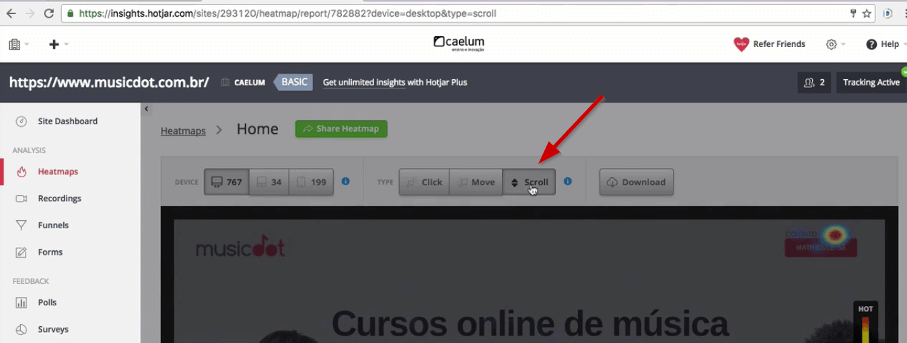

# Heatmaps

 

## Introdução

Este estudo tem como objetivo mostrar como identificar os pontos que podem ser melhorado na experiência do usuário, consumidor do seu produto/serviço. Se você melhora o seu produto, melhora a sua empresa e todos se beneficiarão.

Apresentaremos a Hotjar, uma ferramenta de monitoramento que analisa os mapas de calor do seu site, como o usuário se comporta ao preencher um formulário... Veremos também a relevância de pegar o feedback do usuário, por exemplo, a pontuação de um aplicativo. Por que é interessante ter esse tipo de informação? Trata-se apenas de um moda ou terá algum intuito? Veremos como tudo tem um intuito.

Falaremos também sobre teste de usabilidade. Por que é tão importante validarmos uma ideia? Será que como UXer, consigo pensar como um usuário?

No estudo, abordaremos ainda questões de acessibilidade e como fazer um bom aproveitamento de um orçamento enxuto.

 

## Heatmap Hotjar

Vamos dar uma olhadinha na plataforma da [MusicDot](https://musicdot.com.br), que oferece cursos como a Alura, porém voltadas para música. Encontraremos lá cursos de teclado, piano, violão e até de canto. A MusicDot será o nosso cliente.

O dono da empresa explicou que eles investiram alto em um vídeo institucional, mas ele não está sendo assistido pelos usuários. Primeiramente, vamos analisar em que lugar da página está o vídeo.

 

 

Para chegar até o vídeo, tivemos que dar um scroll na página (descer a barra de rolagem). Talvez, este seja um dos fatores que esteja dificultando a visualização. Será que o usuário está realizando a ação de descer a barra de rolagem? Ou será que ele acessa diretamente os links iniciais da home?

 

 

Existe uma maneira de descobrir como o usuário está navegando na nossa página. Uma forma bem trabalhosa seria contratar pessoas que observassem o acesso dos usuários em sua casas... Mas esta não é uma opção viável! Por isso, temos ferramentas de monitoramento como o [Hotjar](https://www.hotjar.com/).

 

 

Você consegue criar facilmente uma conta, sem grande burocracia. Após criarmos uma conta, faremos o login e acessaremos um painel de controle. Nosso objetivo com a ferramenta é identificar se o usuário está fazendo o scroll na página. Dentro do Hotjar, encontramos diversas ferramentas que irão nos auxiliar a ver o mapa de calor do site.

 

 

Começaremos clicando em "Heatmaps", e depois, em "View Heatmap", localizado na parte inferior da página. A análise do site do MusicDot começou no dia 22 de setembro de 2016. Na página seguinte, clicaremos na opção do menu "Scroll".

 

 

Agora, conseguimos ver o mapa de calor considerando o Scroll.

 

 

De acordo com o mapa, aproximadamente 3% dos usuários estão entrando no site sem rolar a página. Vamos ver o acesso até a parte em está o vídeo institucional:

 

 

Segundo o mapa, cerca de `70%` dos usuário estão saindo da página antes de chegarem no vídeo. Ou seja, só `30%` chegam até o ponto em que poderiam assisti-lo. Se nosso objetivo é fazer com o que o vídeo seja mais visualizado, uma solução é movê-lo mais para cima adicionando um bom destaque.

 

 

A parte do "Heatmap do Hotjar", indica os pontos em que os usuários deixam a página da MusicDot, por exemplo, vamos ver a porcentagem de usuários que chegam até o rodapé:

 

 

Aproximadamente `10% dos usuários chegam até o rodapé e uma porcentagem semelhante chega aos depoimentos. Parece óbvio disponibilizar os itens mais importantes logo no começo da página. É comum termos dificuldade em disponibilizar o conteúdo de acordo com sua prioridade e a parte de arquitetura de informação - levando em consideração o objetivo do usuário e do negócio - acaba sendo descuidada.

 

## Como criar o heatmap no Hotjar

Como criaremos o mapa de calor utilizando o Hotjar? Como instalaremos o Hotjar no nosso site? Se você já trabalha com Front-end ou Back-end, vai achar a tarefa bem simples. Mesmo se não lidar com código, também achará simples.

Começaremos clicando em "Heatmaps" e depois no botão "Tracking Active", localizado na parte superior à direita.

 

 

Em uma nova janela, vamos visualizar o código de rastreamento que devemos incluir.

 

 

Após copiá-lo, devemos colar o código no <head> da nossa página. Veremos onde colocamos o trecho referente no código da página do MusicDot:

 

 

Dentro do código-fonte do MusicDot, encontraremos a tag <head>, nesta adicionamos o trecho do hotjar. Geralmente, no JavaScript, é uma boa prática adicionar no fim. Mas o Hotjar nos recomenda adicionar na parte superior. Após a inclusão, veremos como criar o mapa de calor.

 

 

Na seção "Heatmaps", clicaremos no botão verde "New Heatmap", bastante chamativo.

 

 

Em seguida, selecionaremos a conta **Basic**. Com ela, o Hotjar usará 1000 visualizações para gerar o mapa de calor. No nosso caso, criaremos o mapa de calor da página de "Contato". Escolheremos um nome para o mapa, além de adicionarmos a URL exata do link. Teremos ainda a possibilidade de acessarmos as opções avançadas, nas quais podemos definir os elementos que não devem ser incluídos na análise, por exemplo, o rodapé. Entretanto, nosso desejo é que o mapa inclua todos. No fim, clicaremos no botão "Create Heatmap", no canto inferior.

 

 

Um pop-up será exibido, nos informando que o mapa foi criado. Assim, nós já conseguiremos ver o mapa "Contato" listado na seção "Heatmaps".

 

 

Quando o número de PageViews chegar a 1000, ele irá parar a análise por ter atingido o limite da conta. Note como foi simples criar um heatmap. Outra ferramenta interessante que o Hotjar oferece é a análise do mapa de calor pelos **cliques** do usuário.

 

 

Vemos que o mapa nos indica uma grande incidência no botão de "login". Se ele é clicado com tanta frequência, para melhorar a experiência do usuário, seria interessante aumentar o tamanho do botão. Poderíamos pensar também que devemos dar destaque para o botão "Matricule-se". Mas será que vale a pena dar tanta atenção para esse botão *call to action*?

Observe que os usuários clicam bastante nos links das categorias dos cursos.

 

 

Vemos que os radio buttons também foram clicados, por isso, poderíamos aumentar o seu tamanho.

 

 

Percebemos também que a parte do telefone tem sido muito clicada, mas não temos um link nele associado que abra o aplicativo para ligações. O que poderia ser útil para quem está acessando o site de um celular. O Hotjar nos permite também criar um mapa de calor que analisa os movimentos do usuário na página.

 

 

O mapa nos confirma como os botões do canto superior direito são bastante utilizados. Existe a vantagem também de selecionar o tipo de dispositivo que queremos analisar: computador, tablet ou celular.

 

 

Caso seja preciso enviar os dados para alguém, temos a opção de fazer o download de um arquivo de imagem com todas as análises.

 

 

Vimos como é simples trabalhar com o Hotjar para verificar as ações realizadas pelo usuário em uma página.

 

## Hotjar e outras ferramentas

Vimos em aula que o Hotjar pode ser uma excelente ferramenta de monitoração.

Uma lista de outras ferramentas:

+ Fullstory
+ Inspeclet
+ Smartlook
 
+ Lucky Orange
+ Jaco
+ MouseStats
+ Crazy Egg
+ UserTrack

Para mais ferramentas e para comparação, existe o [UXTools](https://uxtools.co/tools/monitoring).

 

## [Exercício] Mapas de calor

Os heatmaps, ou mapas de calor, podem nos ensinar diversas coisas sobre o comportamento de nossos usuários.

Qual das alternativas abaixo os heatmaps **NÃO** ajudam com relação ao usuário?

- [ ] A) quais imagens atraem sua atenção 
    com o *move heatmap podemos ver onde o usuário deixa mais o mouse

- [x] B) quanto tempo ele fica em uma página 
    existem outras ferramentas dentro do Hotjar para nos ajudar nisso

- [ ] C) onde ele clica mais 
    com o click *heatmap* podemos ver onde o usuário clica

- [ ] D) o que pode estar distraindo-o do conteúdo principal 
    com uma análise geral dos heatmaps podemos ter uma noção do que atrai a atenção do usuário e reestruturar algo na página

Podemos usar os *heatmaps* para descobrir diversas informações sobre o usuário.

 

## [Artigos] Blogs de ferramentas de UX

Ferramentas como o Hotjar e o Invision normalmente possuem blogs sobre usabilidade e UX em geral:

[Hotjar - 8 Heatmap Tests that reveal visitor behavior](https://www.hotjar.com/heatmaps)

[UXPin - How to Use Atomic Design to Improve A/B Testing](https://www.uxpin.com/studio/blog/use-atomic-design-improve-ab-testing/)

[Marvelapp - How to Validate Your Next Big Idea](https://blog.marvelapp.com/minimum-viable-product-launch/)

[Invision - Inside Design Blog | Thoughts on users, experience, and design](https://www.invisionapp.com/inside-design/)

