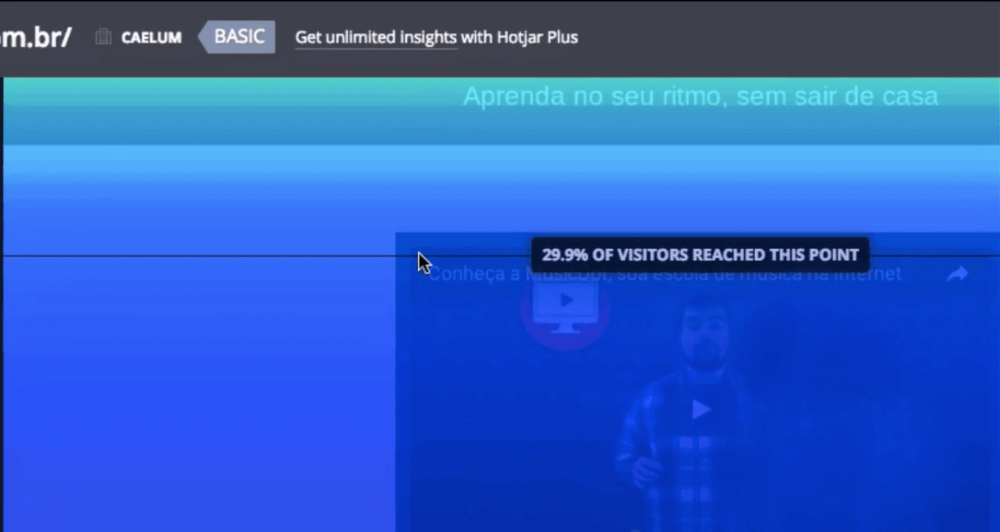

# Heatmaps

 

## Introdução

Este estudo tem como objetivo mostrar como identificar os pontos que podem ser melhorado na experiência do usuário, consumidor do seu produto/serviço. Se você melhora o seu produto, melhora a sua empresa e todos se beneficiarão.

Apresentaremos a Hotjar, uma ferramenta de monitoramento que analisa os mapas de calor do seu site, como o usuário se comporta ao preencher um formulário... Veremos também a relevância de pegar o feedback do usuário, por exemplo, a pontuação de um aplicativo. Por que é interessante ter esse tipo de informação? Trata-se apenas de um moda ou terá algum intuito? Veremos como tudo tem um intuito.

Falaremos também sobre teste de usabilidade. Por que é tão importante validarmos uma ideia? Será que como UXer, consigo pensar como um usuário?

No estudo, abordaremos ainda questões de acessibilidade e como fazer um bom aproveitamento de um orçamento enxuto.

 

## Heatmap Hotjar

Vamos dar uma olhadinha na plataforma da [MusicDot](https://musicdot.com.br), que oferece cursos como a Alura, porém voltadas para música. Encontraremos lá cursos de teclado, piano, violão e até de canto. A MusicDot será o nosso cliente.

O dono da empresa explicou que eles investiram alto em um vídeo institucional, mas ele não está sendo assistido pelos usuários. Primeiramente, vamos analisar em que lugar da página está o vídeo.

 

 

Para chegar até o vídeo, tivemos que dar um scroll na página (descer a barra de rolagem). Talvez, este seja um dos fatores que esteja dificultando a visualização. Será que o usuário está realizando a ação de descer a barra de rolagem? Ou será que ele acessa diretamente os links iniciais da home?

 

 

Existe uma maneira de descobrir como o usuário está navegando na nossa página. Uma forma bem trabalhosa seria contratar pessoas que observassem o acesso dos usuários em sua casas... Mas esta não é uma opção viável! Por isso, temos ferramentas de monitoramento como o [Hotjar](https://www.hotjar.com/).

 

 

Você consegue criar facilmente uma conta, sem grande burocracia. Após criarmos uma conta, faremos o login e acessaremos um painel de controle. Nosso objetivo com a ferramenta é identificar se o usuário está fazendo o scroll na página. Dentro do Hotjar, encontramos diversas ferramentas que irão nos auxiliar a ver o mapa de calor do site.

 

 

Começaremos clicando em "Heatmaps", e depois, em "View Heatmap", localizado na parte inferior da página. A análise do site do MusicDot começou no dia 22 de setembro de 2016. Na página seguinte, clicaremos na opção do menu "Scroll".

 

 

Agora, conseguimos ver o mapa de calor considerando o Scroll.

 

 

De acordo com o mapa, aproximadamente 3% dos usuários estão entrando no site sem rolar a página. Vamos ver o acesso até a parte em está o vídeo institucional:

 

 

Segundo o mapa, cerca de `70%` dos usuário estão saindo da página antes de chegarem no vídeo. Ou seja, só `30%` chegam até o ponto em que poderiam assisti-lo. Se nosso objetivo é fazer com o que o vídeo seja mais visualizado, uma solução é movê-lo mais para cima adicionando um bom destaque.

 

 

A parte do "Heatmap do Hotjar", indica os pontos em que os usuários deixam a página da MusicDot, por exemplo, vamos ver a porcentagem de usuários que chegam até o rodapé:

 

 

Aproximadamente `10% dos usuários chegam até o rodapé e uma porcentagem semelhante chega aos depoimentos. Parece óbvio disponibilizar os itens mais importantes logo no começo da página. É comum termos dificuldade em disponibilizar o conteúdo de acordo com sua prioridade e a parte de arquitetura de informação - levando em consideração o objetivo do usuário e do negócio - acaba sendo descuidada.