

# Orçamento apertado

 

## Call Center, acessibilidade e card sorting

Veremos outros pontos que nos ajudarão a melhorar a nossa empresa. O usuário costuma entrar em contato por meio de e-mails ou telefone. Então, o Call Center também é um boa fonte de informação. A equipe do atendimento certamente conhece as d'ores do usuário. Experimente um dia ficar junto com a equipe de atendimento, conversando com os cliente. Isto certamente aumentará sua empatia com o usuário.

Outro ponto é pensar na **acessibilidade** da interface. De acordo com a legislação, todo banco ou site governamental, é obrigatório que o nosso projeto seja 100% acessível, ou seja, deve estar focado no usuário com deficiências visuais, motoras ou aditivas.

 

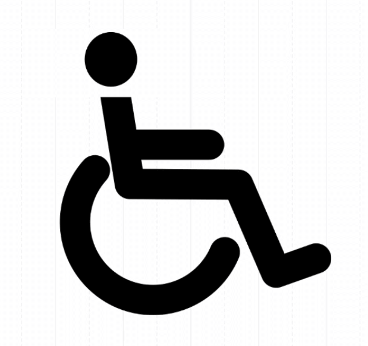

 

Usamos a imagem do PCD (Pessoa com deficiência), porém, quais ferramentas possuímos para conseguir testar a acessibilidade do site. Por exemplo, os deficientes visuais costumam utilizar um leitor de tela. Trata-se de um software que consegue ler o que está escrito na tela - inclusive a parte de código. Por exemplo, se na página existe um tab entre um texto e outro, ele citará a presença do mesmo. Algumas ferramentas existentes são:

+ [NVDA](https://www.nvaccess.org/) - Gratuito
+ [Jaws Screen Reader](https://www.freedomscientific.com/Products/software/JAWS/)
+ [Dosvox](http://intervox.nce.ufrj.br/dosvox/)

O DosVox é uma iniciativa brasileira. Eu sugiro que você experimente instalar uma dessa ferramentas e realize a navegação no seu site utilizando apenas apenas o seu teclado.

Lembrando que quando pensamos em acessibilidade não falamos apenas em deficiência visual. Devemos pensar em outros tipos de deficiência, inclusive as passageiras. No caso em que seu usuário não tenha disponível os óculos, ele precisará da opção de aumento da fonte exibida na tela. Ou você está com a mão imobilizada e está com limitações motoras, sem poder utilizar o mouse. Todas estas situações devem ser levadas em consideração quando falamos de acessibilidade. Uma outra recomendação é que tal característica deva ser introduzida desde o início do projeto.

As pessoas ligam na MusicDot reclamando que não estão encontrando um curso de violão básico. No entanto, nós consideramos que é muito simples encontrá-lo na plataforma.

 

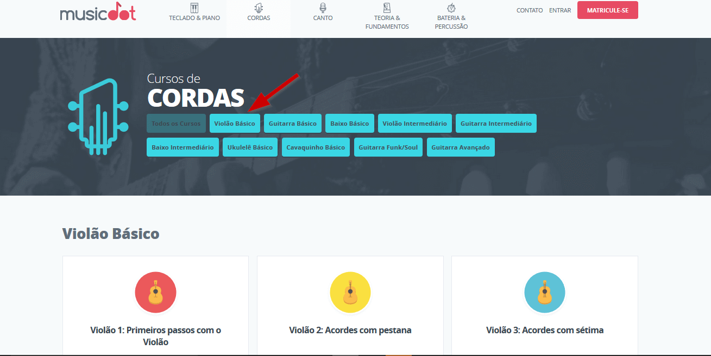

 

Temos vários cursos de violão, inclusive o básico. O que pode estar acontecendo? Se o usuário está tendo dificuldades, quais recursos temos disponíveis para reorganizar o conteúdo das categorias? No estudo de UX Experiência do Usuário, nós conhecemos a ferramenta card sorting.

 

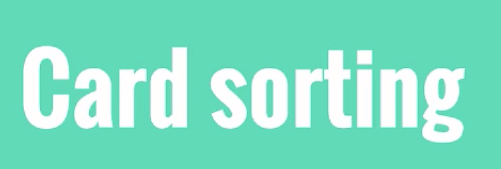

 

Com esta técnica, nós organizamos cartões. Outra ferramenta que vimos anteriormente foi o Board Thing. Com ela, criamos pequenos post-its virtuais e testamos a melhor organização das categorias.

 

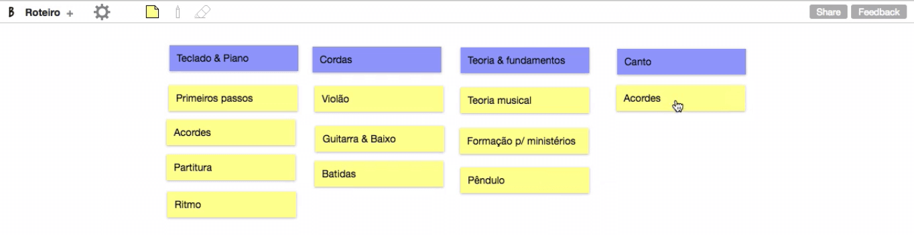

 

Você pode fazer com que o seu usuário organize da maneira que ele considerar mais prática. Chamamos isto de **card sorting fechado**, porque já determinamos quais seriam as categorias utilizadas. O **card sorting aberto** dá liberdade para o usuário trabalhar com as categorias que ele escolher. Estas são ótimas técnicas que podem melhorar a arquitetura do seu site. No nosso caso, pode ser útil avaliar se as categorias criadas são realmente úteis.

Na criação da plataforma da Alura, nós usamos a técnica do card sorting e dois alunos realizaram os testes.

Você pode ler mais a respeito no blog da Alura no seguinte post: [Por trás do novo visual da Alura](https://www.alura.com.br/artigos/por-tras-do-novo-visual-do-alura)

 

## [Exercício] Orçamento apertado

Você é o principal responsável por fazer os testes de usabilidade na sua empresa.

Acontece que o orçamento está muito apertado, o que poderia ser feito?

- [x] A) Tentar negociar um budget maior justificando as economias de se testar algo antes de sair desenvolvendo 
    O “não” você já tem, realmente não vai custar tentar dar uma “chorada” por um orçamento maior

- [x] B) Tentar puxar algum colega de trabalho e fazer algo mesmo que informal 
    Desde que a pessoa não esteja ligada ao projeto, é válido

- [ ] C) Testar você mesmo 
    Perigo! Quando estamos envolvidos em um projeto podemos ficar tão acostumados com a interface que pode ser difícil encontrar problemas de usabilidade

- [x] D) Utilizar algum serviço online de testes de usabilidade como o [UserTesting](https://www.usertesting.com/) 
    Também existia a Testr até 2019, mas encerraram as operações.

 

## User Onboarding

A equipe de atendimento do MusicDot recebeu uma mensagem de reclamação:

> Olá,

> Gostaria de ter meu dinheiro de volta! Não consegui achar os cursos que eu queria e nem sei por onde começar! Grato, Nelson

 

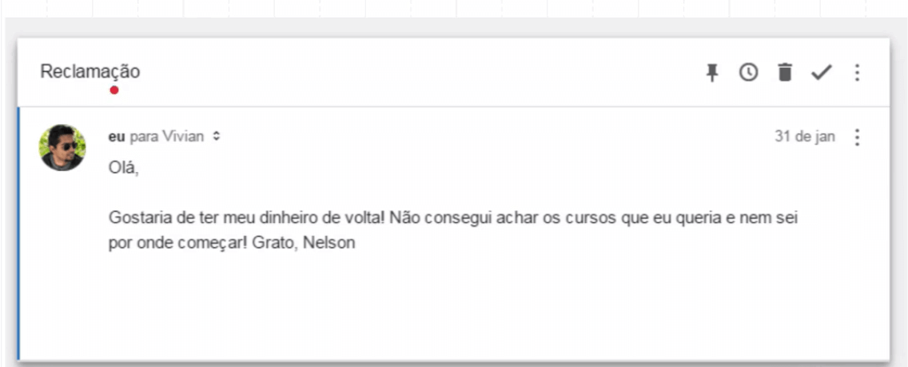

 

Perdemos um cliente... A dificuldade em encontrar os cursos é possível ser melhorada com a técnica do card sorting, mas a parte "nem sei por onde começar" da mensagem nos indica outro ponto que precisa ser trabalhado. Até o momento, quando um aluno acessa pela primeira vez a plataforma, ele vê a seguinte tela:

 

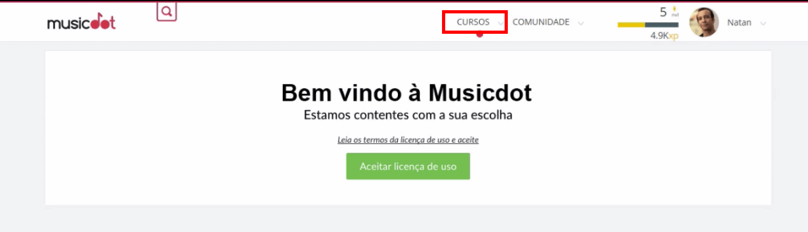

 

Porém, observe que esta tela não é nada convidativa e não nos demonstra quais são os benefícios oferecidos pela MusicDot. Ela não nos indica prontamente as categorias dos cursos, e para descobri-los, precisamos clicar no link "Cursos". Uma abordagem interessante seria disponibilizar quais são as categorias dos cursos.

 

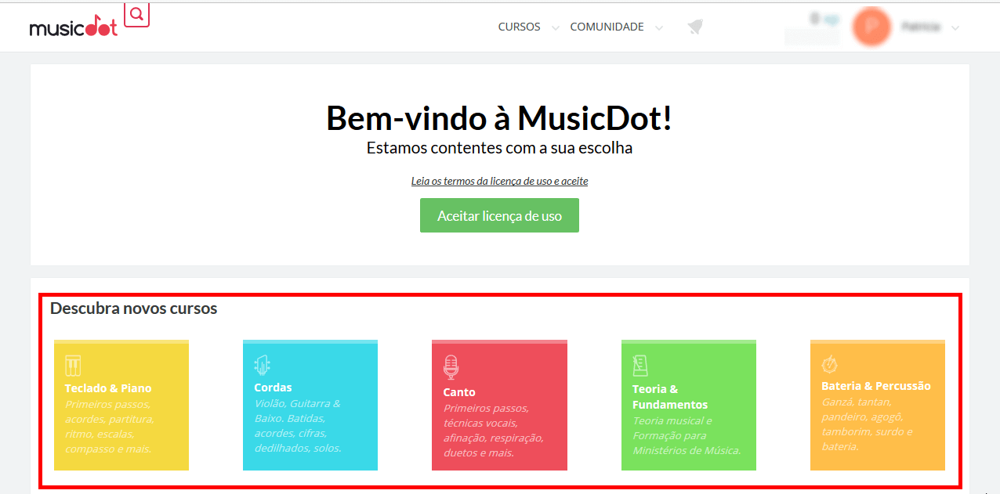

 

Agora vemos o que o site oferece. Todo o conteúdo já estava disponível no site, mas encontramos uma forma de tornar os cursos mais visíveis e melhorar a experiência do usuário. Em sua mensagem, ele disse que não sabia por onde começar e nós desde o início oferecemos cinco opções. Mas conforme a **Lei de Hick**, quanto mais opções, maior é o tempo de tomada de decisão. Um recurso que poderíamos utilizar é descobrir o curso de maior demanda, e sugeri-lo para o usuário:

 

 

No caso, sugerimos o curso de violão, com a seguinte mensagem: "Está com dúvida por qual curso começar? Já sabe tocar violão?". Observe que também adicionamos o link para o curso. Esta abordagem *User Onboarding* assim que o usuário começa a usar a plataforma pode mudar a visão de como ele percebe o produto. A primeira impressão é a que fica, então, tenha o cuidado de deixar uma visão positiva.

> Você pode encontrar boas referências sobre o assunto no site [User on Board](https://www.useronboard.com/). Nele, encontramos algumas interfaces analisadas pelos profissionais, avaliando o que funciona ou não bem.

 

## [Nota] Medir tudo

Um ponto interessante é que muitas pessoas saem fazendo testes mas se esquecem de medir para saber se os problemas na interface diminuíram e os usuários estão mais satisfeitos.

Uma boa fonte de problemas corriqueiros que os usuários passam é com o setor de atendimento/call-center.

**Lembre de mensurar tudo!**

Como ganho adicional, melhorar os indicadores da empresa podem aumentar sua visibilidade e credibilidade na empresa.

 

## [Exercício] Leitores de tela

Existem diversos softwares que, literalmente, leem a tela do usuário, como o NVDA ou o DosVox.

Quais são as vantagens de se pensar em acessibilidade quando estamos desenvolvendo algum produto?

- [ ] A) O projeto fica mais fácil de ser desenvolvido e validado 
    Como é mais uma coisa a ser pensada, isso aumenta um pouco a complexidade

- [x] B) Público altamente interessado que carece de soluções realmente boas 
    Levando em consideração situações temporárias como esquecer o óculos ou uma mão fraturada

- [ ] C) O site fica mais performático 
    Acessibilidade e performance não estão diretamente relacionadas

- [x] D) Se o site for governamental ou de banco, é **lei** 
    O governo federal e o Bancen exigem que os sites relacionados sejam acessíveis

O iOS possui o VoiceOver, e o Android, o TalkBack.

Algumas referências brasileiras sobre esse assunto:

[Reinaldo Ferraz](https://twitter.com/reinaldoferraz)

[Talita Pagani](https://twitter.com/talitapagani)

 

## Resumo do Estudo

Vamos rever os principais pontos vistos no estudo: começamos apresentando a ferramenta de mapa de calor.

 

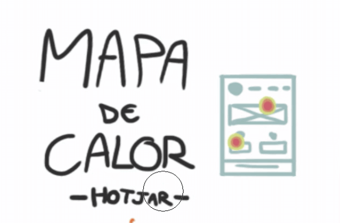

 

O mapa de calor é um recurso interessante para compreendermos qual é o comportamento do usuário. No curso, mostramos como utilizar o Hotjar - mas existem outras ferramentas que você pode conferir no UX Tools.

Vimos também como melhorar os formulários do seu site e qual a melhor abordagem para cada campo.

 

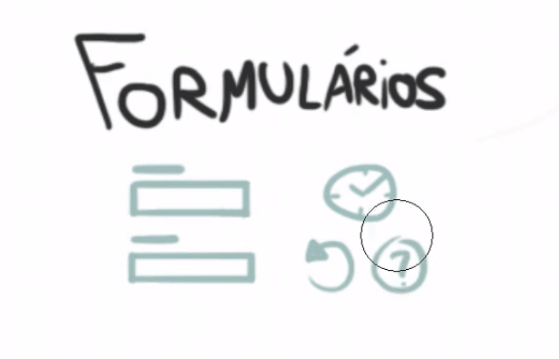

 

O Hotjar oferece um recurso que nos permite identificar quanto tempo foi gasto em cada campo, se o usuário voltou em algum deles para refazê-los ou se preferiu deixá-lo em branco. Ter este tipo de informação é interessante para identificarmos certos padrões de comportamento.

Depois, falamos sobre a relevância de recebermos um feedback do usuário.

 

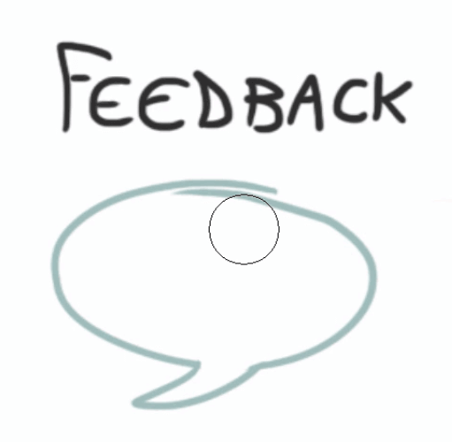

 

É importante oferecer em sua interface um canal que permita o envio de **feedbacks** do usuário, um meio de comunicação em que este possa fazer reclamações ou dar sugestões/elogios. É uma forma de descobrir o que ele está sentindo, tanto as experiências tristes ou felizes. Apresentamos também o conceito de **NPS**, utilizado para compreender a opinião do usuário sobre o produto ou serviço.

No curso, abordamos também a importância de validarmos nossas ideias com o **teste de usabilidade**.

 

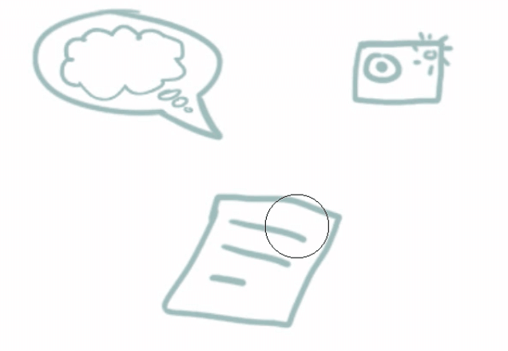

 

Apontamos diversas questões que devem ser consideradas durante a realização do teste. Se você ainda não tem o produto final, vale **usar um protótipo** criado com ferramentas como o Marvel ou o Invision. Esta é uma forma de validarmos nossas ideias, sem desperdiçarmos o tempo de diversas equipes na criação do produto.

Tratamos ainda alguns aspectos do momento do teste, muitas vezes realizado em **salas especiais** com uma janela espelhada - igual as salas de interrogatório policial - que permitem a presença da equipe do projeto. Mas atualmente, já existem ferramentas remotos com as quais podemos realizar os testes de maneira **mais econômica**. Fizemos algumas orientações para o moderador do teste, explicando que ele deve continuamente perguntar o que está passando na mente do tester, ou seja, "**pensar em voz alta**".

Nos casos em que a equipe não pode estar presente durante o teste de usabilidade, podemos adotar a opção de **gravá-lo**. Podemos utilizar uma webcam ou uma GoPro - além de anotar por precaução as suas observações.

 

 

Vimos ainda possíveis soluções para situações em que trabalhamos com o orçamento apertado.

 

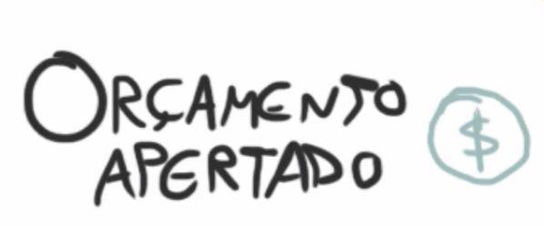

 

Nossa principal sugestões foi: **dê um jeito**. Encontre usuários dispostos a participar gratuitamente, que façam parte da sua equipe, mas não do projeto. Mas é **muito importante** realizar os testes. No gráfico criado por Jakob Nielsen, mostramos que sem os teste é improvável identificar os problemas da sua interface - antes de ser utilizada pelo usuário final. Com a experiência, profissionais da área podem imaginar quais problemas são recorrentes de usabilidade, mesmo assim, o ideal é ter a opinião de quem utilizará a interface. Pense na frase "eu não sou o meu usuário". Lembre-se disso e evite problemas.

Também recomendamos que você encontre formas de mensurar os resultados do seu trabalho.

 

 

Pode ser trabalhoso o processo de elaborar um plano de usabilidade, realizar os testes, implantar melhorias, para no fim, não termos como analisar os resultados. Precisamos levantar dados como aumentou o número de vendas ou a taxa de conversão? O ideal é que o levantamento seja feito antes, durante e depois das suas ações.

Comentamos um pouco sobre as questões de acessibilidade - muitas vezes, descuidada por desenvolvedores e designers.

 

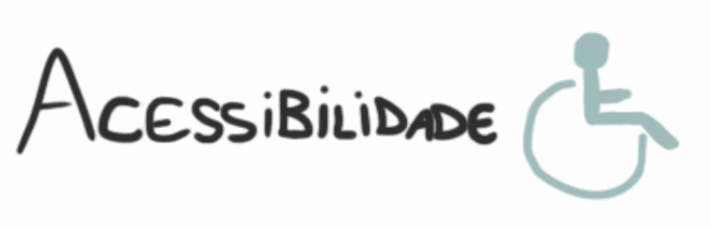

 

Usabilidade é facilidade de uso, se o seu site não está acessível, se ele não está usável.

Vimos tudo isso no nosso estudo...

 

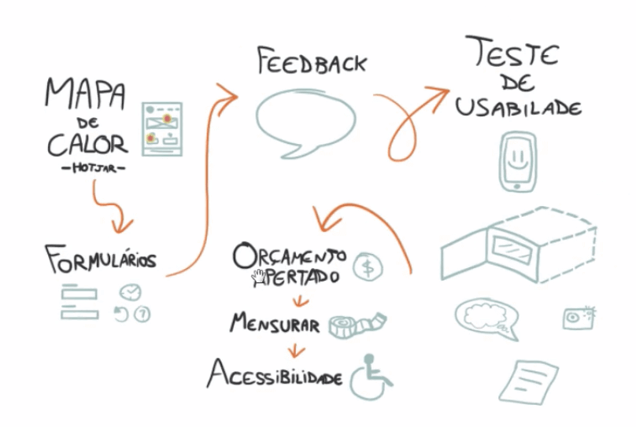

 
