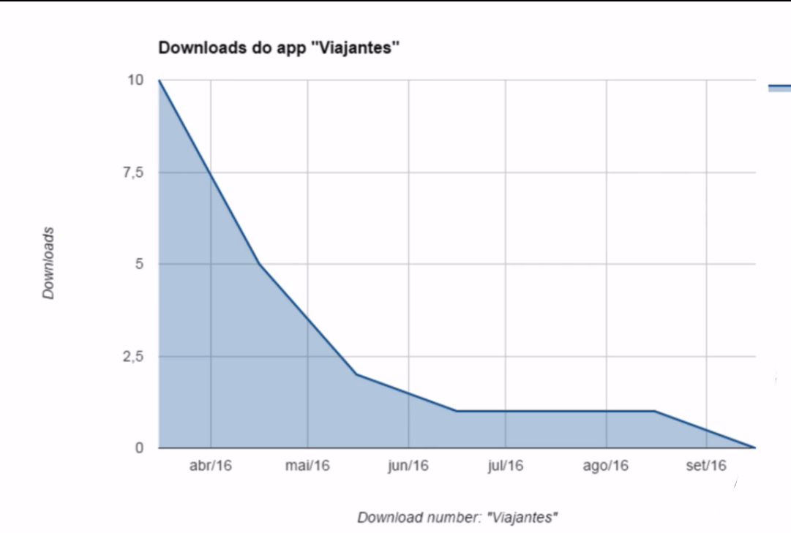

# Tendo uma estratégia

Será abordado um pouco da estratégia de UX: como temos ideias?

 Em resumo, descobriremos como melhorar nossas escolhas na hora de criar um aplicativo, site, produto ou serviço

 Nosso objetivo principal será criar um aplicativo que ajude viajantes a encontrarem companhia, independente do destino da viagem. Algumas funcionalidades previamente pensadas são:

+ menu para logar;
+ destinos em destaque;
+ campo de busca;
+ localizar viajantes próximos
+ criar grupo de viagem;

A partir destes pontos já é possível esboçar alguns sketches. Acrescentaremos um logo, um campo de busca, botões, e assim por diante. Planejamos três telas:

+ Inicial; 
+ Perfil do viajante;
+ Chat.

Agora, além de criarmos os esboços nós também já montamos as telas utilizando o **Photoshop**, já contratamos um desenvolvedor, criamos uma propaganda para o aplicativo, lançaremos ele na App Store.

Diante de todas essas circunstâncias observe o que aconteceu:

Nosso aplicativo teve um pico de usuários de dez pessoas e, depois, esse número reduziu até zerar. Por que isso aconteceu com o aplicativo de viajantes?

Isso aconteceu porque às vezes o processo de UX é ignorado, e os profissionais seguem diretamente para o Design.

Outra abordagem para lidar com aplicativos é pensar mais e melhor na estratégia, assim, em vez de começarmos a elaborar diversas funcionalidades, vamos refletir: **realmente faz sentido implementar todas elas?**

Pensar mais antes de agir é interessante, pois nos tornamos mais assertivos! A estratégia nos direciona a entender com mais clareza sobre **quais são os nossos reais objetivos.**

Neste curso de UX Strategy, falaremos sobre **estratégia voltada para experiência dos usuários**, veremos diversos ferramentas como: persona, proto persona, value propositions canvas, 360 view, pesquisas e exercícios. Esse curso será focado na parte mais abstrata da **UX Strategy**, como em levantamento de requisitos, priorização e organização de ideias!

**Não** abordaremos os assuntos Design, prototipação ou testes de usabilidade.