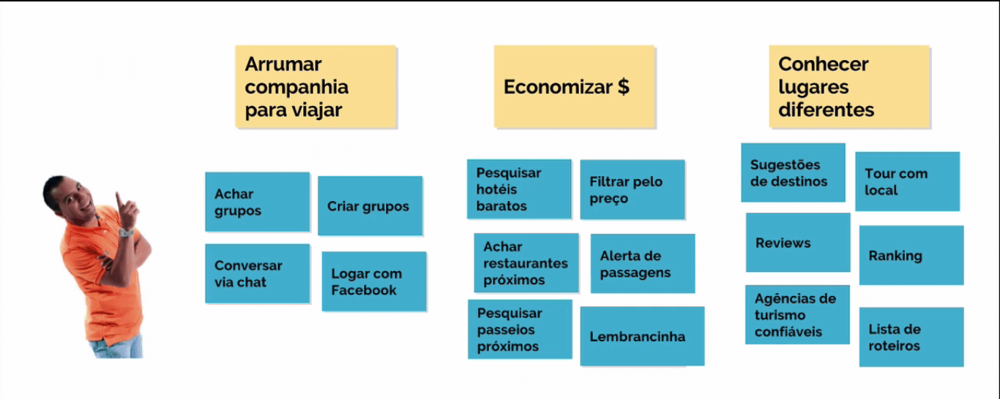
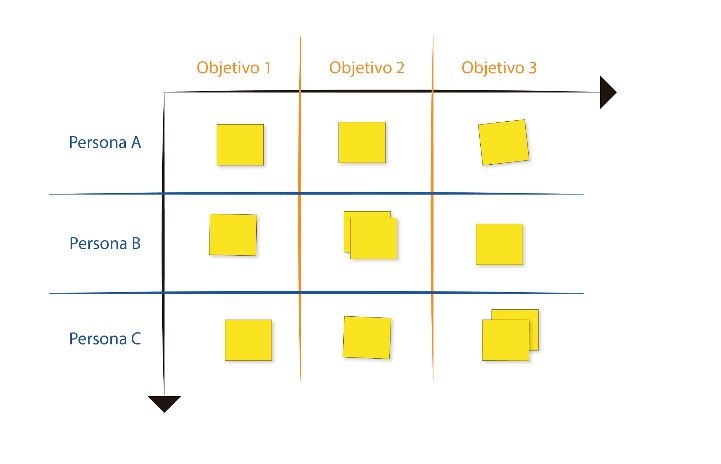
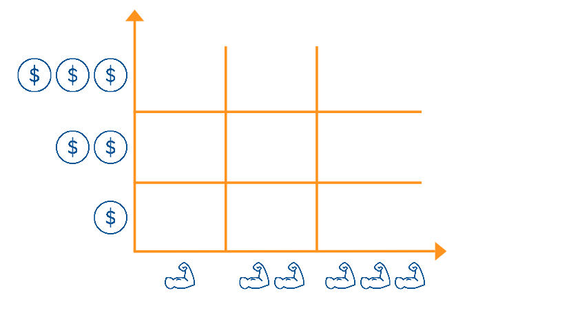

  
  # Features
  

 

## Pensando nas funcionalidades

Vimos que existe o MVP e o MLP. Quais as *features* que devemos realizar, e como priorizá-las? Uma funcionalidade bacana que existe no site da Alura, por exemplo, é o campo de busca:

 

 

As *features* estão diretamente relacionadas ao usuário, e as funcionalidades deveriam estar ligadas a algum objetivo ou necessidade das pessoas que utilizarão nosso aplicativo. Como já materializamos a persona, já temos os objetivos do usuário, mas se você não criou isso pode explorar a narrativa que construímos para obter essas informações.

Separamos três objetivos daqueles que tínhamos construído para a persona: arrumar companhia para viajar, economizar dinheiro e conhecer lugares diferentes. Nosso produto deve ter alguma funcionalidade (ou um conjunto de deles) que atenda a cada um desses objetivos.

A descrição das funcionalidades devem ser breves e simples, como "achar grupos". E para que nosso usuário os encontre, é preciso inicialmente, criá-los. Sendo assim, "criar grupos" também é feature! Teremos o seguinte:

 

 

Outros exemplos seriam "Conversar via chat" e "Logar com Facebook".

Por que conversar via chat? Faz sentido para o nosso usuário, Fabiano Gusmão? Lembra-se da ideia de segurança? Às vezes o Fabiano pode não confiar em conectar-se usando o login do Facebook, conclusão a que chegamos através de pesquisas realizadas.

Outro objetivo consiste em economizar dinheiro! Como fazemos isso? Por meio da funcionalidade de pesquisa de hotéis baratos e filtrar pelo preço, ou "localizar restaurantes próximos" e "pesquisar passeios que não estejam muito longe". Outras opções são "alerta de passagens com descontos" e "localizar lugares para comprar lembrancinhas legais e baratas".

Vamos partir para o terceiro objetivo, de conhecer lugares diferentes. Você consegue pensar em algo que possa auxiliar Fabiano Gusmão a alcançar esse objetivo? Podem haver sugestões de destinos quando a pessoa abre o aplicativo, a possibilidade de fazer tour pela cidade. Outras funcionalidades seriam *Reviews, Ranking*, recomendações de agências de turismo confiáveis e lista de roteiros.

É possível montar esse **Kanban** utilizando a foto do nosso usuário.

 

 

Seu projeto tem diversas personas e *proto-personas*? Você pode usar a mesma construção do *Kanban*, relacionando os objetivos com as funcionalidades específicas para elas. Porém, se as pessoas não têm objetivos em comum, não tem jeito mesmo - será necessário traçar objetivos separados. Neste caso, simplificaremos o esquema:

 

 

Na primeira coluna há as distintas personas, e na primeira linha os diferentes objetivos. E nos lugares onde estão os post its, preencheremos com as funcionalidades pensadas coletivamente. Uma dica é colocar de 3 a 4 objetivos, e a mesma quantidade para personas, caso contrário acabam sendo informações demais, tornando o esquema confuso.

Feito isto, dentre as features que colocamos, qual será a mais importante, a ser priorizada para o usuário? Lembra-se que o problema principal era "Arrumar companhia para viajar"? Dessa maneira, priorizaremos esse objetivo, relacionando-o a três funcionalidades.

Para auxiliar na tomada de decisões, utilizaremos a técnica que vimos em Fundamentos da Experiência do Usuário, a **Zen voting**. Para essa estratégia cada membro do time ganha três etiquetas, a serem distribuídas em cima das funcionalidades que julga que devam ser priorizadas.

Além disto, você pode utilizar etiquetas de cores diferentes para indicar o que achamos que não é importante para o usuário. Colocar um adesivo de uma segunda cor com essa estratégia é algo opcional.

 

 

Agora, para praticar, vamos pensar nas features do negócio:

+ Tempo: máximo de 20 minutos.
+ Ambiente: flip-chart, canetas, post its, personas e etiquetas.
+ Objetivo: organizar as features de acordo com as personas e seus objetivos.

 

## Esforço e valor

Já vimos como decidir as prioridades de *features*. Agora, imagine a situação do cliente observando o que fizemos e dizendo que a prioridade deveria ser a lembrancinha, justamente o que contém a etiqueta que sinaliza quando algo não é bom para o usuário.

Por que será que o cliente pede que justamente essa funcionalidade seja priorizada? O cliente possui uma visão que é diferente da nossa, normalmente mais voltada para os negócios em si. Podemos questionar o cliente de uma maneira diferente, dizendo por exemplo: "Entre a funcionalidade, criar grupos ou pesquisar hotéis, qual é a mais importante?"

Dessa maneira vamos nos aproximando de um denominador comum junto ao cliente, o qual pode achar que "criar grupos" e "achar restaurantes próximos" são as funcionalidades mais importantes. Diante disso, qual será a prioridade, pensando nos negócios?

Podemos propor ao cliente que ele pense nas features em termos de alta, muito alta e altíssima prioridade. Deste modo, o cliente deverá pensar nesses termos de prioridade para gerar valor ao produto.

O ideal é que pensemos em termos de experiência do usuário, e nesse momento de priorização, precisaremos defender o usuário e o que é importante para ele. Além do usuário, também levaremos em conta os custos e a capacidade de realizar determinadas tarefas. Lembrou-se de algo?

Tem a ver com o **360 View** e o **Triângulo de Keeley** - precisaremos pensar no usuário em termos de desejabilidade, na economia que será gerada pelas features e, ainda, no tempo despendido para elaborar cada item priorizado. O tempo gasto deve ser decidido em time, bem como a definição do esforço técnico de cada funcionalidade.

Pensamos em tudo isso para desenvolver o MVP.

 

 

Ou, se preferirmos, o MLP.

 

 

Com isso o usuário ficará feliz, nós ganharemos dinheiro e tudo será feito no menor espaço de tempo possível. Então, é preciso priorizar o que for feito de acordo com os desejos do usuário, em relação ao negócio e também com o esforço técnico. E já que para essa etapa não é necessário pensar nos objetivos, podemos retirá-los.

Vamos nos preocupar primeiramente com o negócio: qual é a importância dessas features em relação a ele?

Podemos colocar uma escala de importância das *features* para o negócio, e outra para o esforço técnico. Montaremos um gráfico e distribuiremos as *features* nele, de acordo com a prioridade:

 

 

Caso esteja realizando essa dinâmica em grupo, uma pessoa pegará uma feature, posicionando-a onde achar mais adequado. Feito isso pode ocorrer uma discussão para ver se este será seu lugar definitivo.

Tendo estabelecida a relação prática entre usuário, o valor do negócio e a capacidade, lembra-se de que tínhamos sugerido o gráfico como mecanismo de priorização? Neste gráfico nossa equipe colocou diversos post its:

 

 

E pensando no valor do negócio, bem como do esforço técnico, vamos fazer um gamestorming:

+ Tempo: 30 minutos.
+ Ambiente: flip-chart, canetas, features criadas anteriormente.
+ Objetivo: categorizar features levando em consideração o esforço técnico e valor para negócio.