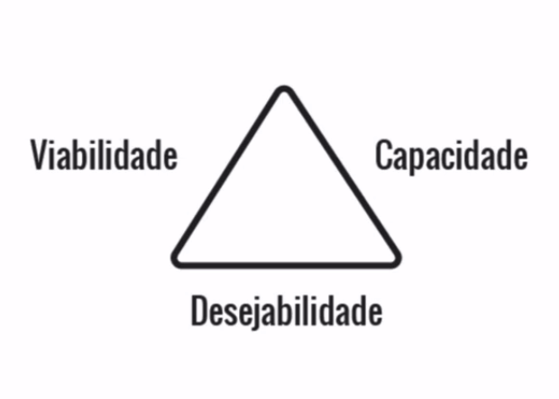
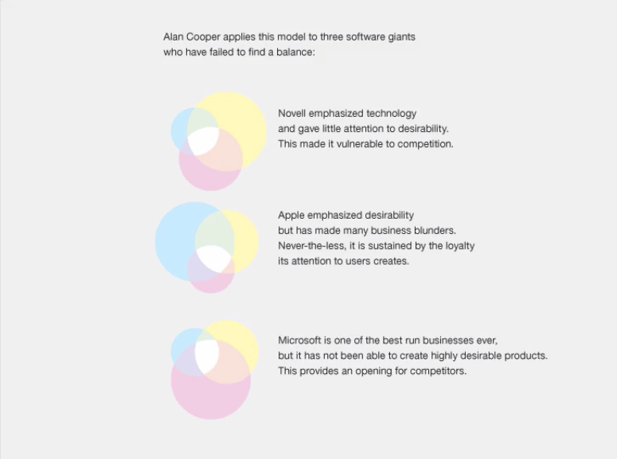
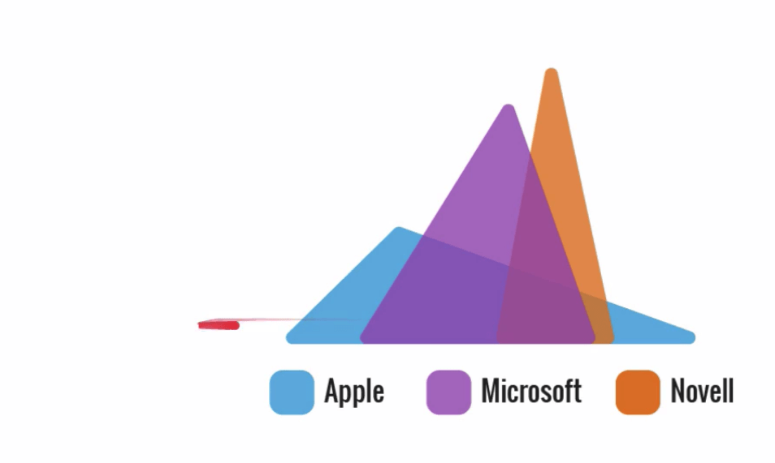
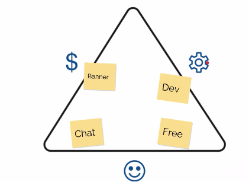
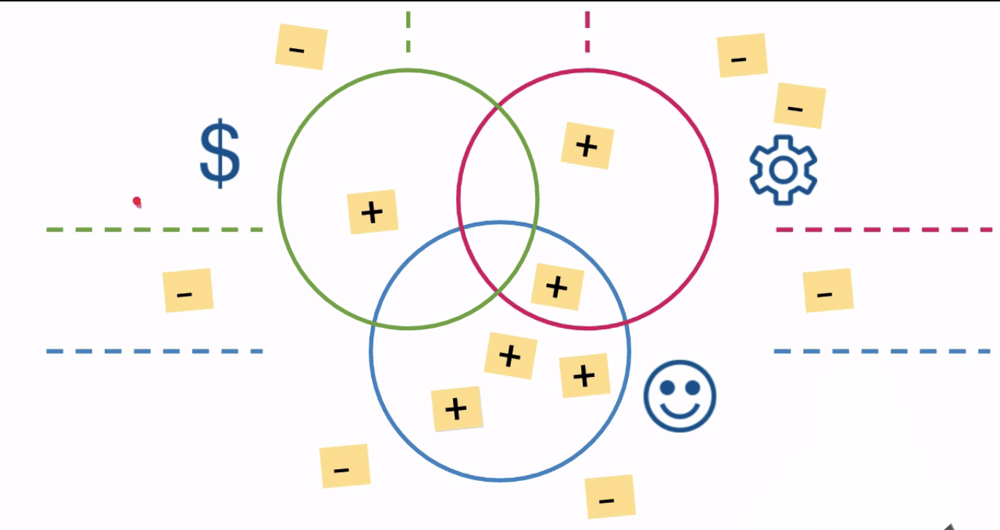

  
  # Divergindo Ideias
  

 

## Viabilidade, Capacidade e Desejabilidade

Já pensamos em diversas ideias e funcionalidades para a nossa aplicação. Lembra-se que pensamos em todas elas como se estivessem escritas em um post it?

 

  

Vamos pensar inicialmente na funcionalidade do **chat**: o que é necessário para criar um chat? Um layout no **Photoshop**, desenvolvido pelo front-end e pelo back-end. Caso não tenhamos na equipe pessoas capazes de desenvolver essas etapas, será preciso contratar alguém, um desenvolvedor que saiba lidar com a linguagem de programação necessária. Mas para contratar alguém, é preciso despender certa quantia de dinheiro.

Assim, um dos aspectos necessários de serem refletidos no momento em que um projeto estiver sendo executado é a questão monetária; é preciso pensar na rentabilidade do aplicativo. Quando pensamos em criar banners, em construir parcerias com hotéis ou sites, nós estamos pensando em **viabilidade**.

Em relação à parceria com hotéis, por exemplo, a comissão é interessante, trata-se de um valor pré determinado para o aplicativo quando seus usuários se hospedarem em um hotel parceiro. Outra estratégia é o acréscimo de banners na aplicação, o que é ótimo para viabilizar um projeto.

Sobre essa questão, é importante nos perguntarmos o porquê da existência de uma extensão do **Chrome** e do **Firefox** para bloqueá-los. Se essa opção existe, significa que o excesso de banners pode ser ruim ao usuário.

Temos que pensar sempre no usuário, e não apenas nas regras do negócio ou no que o cliente deseja. O papel de um **UX designer** é realmente refletir e defender o usuário no dia a dia e na empresa. É importante que ele entre na loja e deseje possuir o aplicativo de verdade, não importando se este deverá ser pago ou não, ou se terá banner, ou não.

Um exemplo é o **Waze**, aplicativo muito utilizado para escapar do trânsito. Por que será que ele acabou fazendo tanto sucesso? Ele correspondeu às necessidades do usuário. Ninguém aguenta mais trânsito! O **Waze** possui diversas parcerias, banners, pop ups que, inclusive, podem incomodar alguns usuários. Entretanto, nós ainda somos dependentes dele.

 

Qual era mesmo o mote do nosso aplicativo?

> Encontrar companhia para viajar

 

Para uma pessoa que viaja, o que será que é necessário que o aplicativo tenha? O que realmente irá ajudar nesse problema? Se o problema é arrumar companhia, podemos pensar em pessoas, na internet... Que tal uma rede social? Uma espécie de **Facebook** dentro do nosso aplicativo...?

Outro ponto que podemos pensar é que o aplicativo será de graça. E que além disso ele também seja multiplataforma. Não queremos excluir um usuário devido a seu Windows Phone simplesmente por seu mercado ser mais restrito. Portanto, a ideia de termos um aplicativo que seja multiplataforma, serve para abarcarmos todos os usuários e plataformas.

Queremos que o aplicativo tenha algum tipo de interação com um relógio inteligente, resultando em um **smartwatch**. Outro fator interessante seria a criação de um chat, para que o usuário consiga conversar com outros, uma vez que, já que pensamos em rede social, é preciso pensar que os usuários irão de fato conversar entre si.

Como o usuário do aplicativo está em busca de companhia para viajar, podemos pensar onde ele irá salvar os dados das pessoas com quem conversa - poderia ser na nuvem, o que é interessante, pois o usuário pode acabar perdendo seu celular e, nesse caso, seus dados continuariam existindo.

 

1. Opção de sugerir um curso

  

2. Opção de sugerir funcionalidades para o curso

  

Essas são estratégias que irão gerar valor para o usuário de acordo com o que ele necessita. Essa questão de realmente pensarmos no que o usuário quer ou gostaria, implica em **desejabilidade**. Esse mecanismo de sugestões que se adotou é um meio de verificar os desejos do usuário e tornar o serviço oferecido realmente mais desejável.

Na Alura não temos um servidor próprio, e nesse caso temos que hospedá-lo em algum lugar. Vamos pensar em um caso hipotético, digamos que temos uma determinada plataforma em nosso aplicativo e que ela comece a crescer, tanto que isso ocasiona em um gargalo de performance. Isso acaba fazendo com que nosso aplicativo caia para todos os usuários devido ao pico de acesso. Nessa situação é como se nós estivéssemos utilizando o plano com 256 MB de memória e 10 GB de espaço para o site.

 

  
  

 

Como o aplicativo está crescendo, é preciso usar um servidor maior, com mais memória. Para isto, sabemos que precisaremos gastar mais dinheiro. Devido ao crescimento da demanda, é preciso contratar um servidor um pouco maior e melhor. Outra questão - se desejamos contratar um *brand designer*, responsável por nosso marketing, será que ele já possui os equipamentos ou dispositivos necessário para o trabalho?

É necessário certa previsão do que pode ser necessário. Por exemplo, tendo em nosso time desenvolvedores *front-end*, será que existe a quantidade suficiente de computadores? Será que mais computadores são necessários? É preciso pensar em tudo o que necessitamos, e isso se alonga para cadeiras, mesas...

Sendo assim, estamos pensando em termos de **capacidade**, ou seja, se somos capazes de fazer aquilo ao qual nos propusemos, e é necessário pensar tanto nos objetos físicos quanto na equipe. Lembrando que recursos não são a mesma coisa que pessoas!

 

### O que vimos?

+ **Viabilidade**, o dinheiro que ganharemos para realizar nosso projeto e também aquele necessário para a execução de um determinado projeto;

+ **Capacidade**, se temos os recursos e pessoas para realizar determinada ação;

+ **Desejabilidade**, o que o usuário espera e deseja do aplicativo;

 

  

 

## Triângulo de Ouro ou Triângulo de Keeley

A Viabilidade, Capacidade e Desejabilidade são conceitos criados por **Larry Keeley**, que se especializou nessa parte do business. A ideia é pensar que um mesmo aplicativo deve conter essas três características, ou seja, os três lados do triângulo. Essa fórmula é conhecida como **Triângulo de Keeley** ou **Triângulo de Ouro**.

Vamos analisar um bom exemplo para falar disso; observaremos o imagem abaixo:

 

  

 

Os gráficos refletem dados de três empresas: a **Novell**, a **Apple** e a **Microsoft**, e mostram os níveis de viabilidade, capacidade e desejabilidade dessas marcas. Observe o gráfico que traz os dados da Apple, cuja parte em azul piscina reflete a desejabilidade, a parte em rosa a viabilidade, que está bem menor.

A Microsoft lidou bem com a questão de viabilidade por ter uma T.I. forte. Já a Novell, uma empresa que vende softwares, tem sua capacidade bastante apurada.

Vamos observar outro infográfico que traz os dados comparados das três empresas:

 

  

 

Imagine que esses triângulos representados no gráfico correspondem ao Triângulo de Ouro, e que cada lado do triângulo equivale a um conceito - capacidade à direita, viabilidade à esquerda e desejabilidade como sendo a base.

 

  

 

Se analisarmos, notaremos no infográfico que a Apple soube trabalhar bastante com desejabilidade, mas viabilidade nem tanto. A Microsoft tem uma desejabilidade razoável, mas os pontos fortes são a capacidade e viabilidade. E a Novel possui uma desejabilidade mais baixa que as demais.

Nas explicações, é comum trocarmos os lados por ícones que os representam, porém este não é o padrão. Neste caso, a viabilidade seria trocada por um cifrão, $, a capacidade por uma engrenagem, e a desejabilidade por um smile, ☺:

 

  

 

Bom, então já apresentamos o Triângulo de Ouro ou Triângulo de Keeley. Vamos pensar no que pode tornar o aplicativo desejável para o usuário:

1. ser gratuito;
2. funcionalidade de chat;

Podemos incluir o banner nessa lista? Na verdade, ele não é tão desejável para o usuário, e sim para quem está desenvolvendo. Imagine um aplicativo cheio de banners; seria meio irritante, não é mesmo? Sendo assim, ele se encaixa melhor na parte de viabilidade. E os desenvolvedores *(devs)* que irão executar um projeto? Isso cabe na capacidade, pois temos que pensar nisto como se fosse um braço, aquilo que nos ajuda na execução de algo. Nosso triângulo está da seguinte maneira:

 

  

 

Distribuído desta maneira, o triângulo fica confuso. Assim, nós da Caelum/Alura resolvemos traçar as seguintes linhas:

 

  

 

O triângulo é uma ferramenta, e qualquer ferramenta é moldável ao negócio que estamos realizando. Por isso, achamos necessário criar linhas para separá-lo. Ademais, já que nos questionamos se o banner é algo bom ou ruim para o usuário, podemos pensar em colocar o post it equivalente a isso do lado de fora da desejabilidade. É como se nosso triângulo tivesse o seguinte aspecto:

 

  

 

O interior do triângulo terá apenas as coisas boas, e do lado de fora os aspectos negativos. Chegaremos em um momento em que teremos diversas boas ideias e, do lado de fora, colocaremos as que são ruins:

 

  

 

O uso dos post-its como ferramenta é interessante pois as pessoas que estão participando desse exercício podem simplesmente colocá-los sem a necessidade de fazerem discussões prévias. O uso do triângulo e dos post-its deixa os conceitos do projeto mais visíveis, lembrando que eles devem ser elaborados, preferencialmente, com o time, ou seja, coletivamente.

Bom, e se tivermos algo que gostaríamos que estivesse presente tanto em um lado do triângulo quanto em outro? Onde colocamos o post it nesse caso? Veremos uma ferramenta que pode nos auxiliar na sequência.

  

## 360 View 

Vamos solucionar o problema de querermos introduzir um mesmo post it em dois lados do triângulo. Para isso, aprenderemos uma nova ferramenta.

Em vez de um triângulo, vamos utilizar três círculos. A base do triângulo era desejabilidade, então colocaremos na primeira circunferência a representação desse conceito, no caso, o *smile*. O segundo círculo deve equivaler à viabilidade, portanto sua representação será o cifrão ($). Por fim, adicionamos o terceiro e último círculo, a capacidade, indicada pelo símbolo da engrenagem.

Repare que há intersecções entre os círculos e, em especial, na que existe entre os três círculos - é nesse ponto que ocorrem as oportunidades. Nossa nova ferramenta ficará com o seguinte aspecto:

 

  

 

É no ponto da intersecção entre os três círculos que mora o coração da ferramenta. Os post its positivos estarão dentro do círculo, e aquilo que é bom e cabe em duas categorias, desejabilidade e capacidade, por exemplo, deverá ficar na intersecção das respectivas circunferências.

E os pontos negativos? Nós deixaremos do lado de fora da imagem, pois eles deverão cercear o círculo que corresponde ao seu conceito. Sendo assim, algo que é ruim para desejabilidade deve ficar do lado de fora do círculo que corresponde a essa categoria.

Para melhorar a disposição dos post its, é possível traçar linhas verticais e horizontais para dividir as categorias da estrutura. Assim, poderemos colocar o que é tido como ruim abaixo, acima ou entre essas linhas.

 

  

 

Observe o ponto que está assinalado na imagem - é algo ruim para viabilidade e também para desejabilidade e por isso ele se encontra no meio. Por meio da separação em quadrantes, fica fácil observar quando eles são ruins para cada um dos conceitos.

Vamos pensar em outra situação: alguém do seu time teve uma ideia, entretanto ela não é boa em nenhum dos três aspectos mencionados. Não é o suficiente para viabilidade, tampouco funciona para capacidade e, ainda, não acrescenta na desejabilidade... Diante dessa situação, entenderemos que essa ideia não é adequada para o projeto, pois ela não agrega em nada!

Mas se você quiser manter um *backlog*, uma lista de tudo o que foi jogado fora, você pode adaptar a estrutura:

 

  

 

Usamos uma cripta para indicar e depositar as ideias que não servem. Esse é um meio de lembrar, inclusive para novos membros da equipe, de todas as ideias que foram tidas e como algumas já foram julgadas não tão boas.

A ideia por traz dessa ferramenta é fornecer um panorama de toda a idealização do projeto e, assim, oferecer uma visão de 360º graus; por este motivo, a chamamos de **360 View**.

## Duolingo e exercício

Uma empresa que soube explorar as oportunidades por meio da ferramenta de 360° View foi o **Duolingo**. Trata-se de uma plataforma de ensino de idiomas, que disponibiliza diversas opções: alemão, italiano, francês, inglês, entre outros. Se observarmos o site da plataforma, podemos analisar que não existem banners nele:

Sem a existência de banners no site, como será que a empresa viabilizou a plataforma?

Quando a plataforma foi pensada se fez necessário pensar em sua viabilidade, assim, uma das alternativas para financiamento foi a tradução de textos, ótimo exemplo de aproveitamento de uma oportunidade.

Um banco pode contratar a plataforma para traduzir um documento, e o aluno que traduz está aprendendo com isso, então, ele acaba ficando satisfeito. É como se o usuário estivesse trabalhando para a empresa, sem pagar pelo curso que está realizando.

Para o usuário é interessante realizar a tradução de textos, pois assim ele adquire conhecimento sobre um idioma novo. Às vezes, quando o aluno está utilizando o **Duolingo**, chega algum exercício com um texto aleatório para ser traduzido. Esse texto que pode ser estranho é o reflexo de alguma tradução pedida pelo cliente. São os próprios usuários que traduzem o texto, e com isto os milhares de usuários da plataforma acabam realizando a tradução e gerando, ao final, uma documentação.

Até esse momento duas ferramentas foram apresentadas, o **Triângulo de Ouro** ou **Triângulo de Keeley** e o **360° View**. Não existe nenhuma recomendação de uso de uma ou de outra, isso vai depender do que você e sua equipe desejam. Lembre-se que estamos falando de ferramentas, e elas são moldáveis ao negócio.

É interessante usar essas ferramentas em grupo, pois o time pode discutir e trocar impressões. Além do mais, utilizar post its é ótimo pois torna as ideias mais visíveis, ou seja, estamos fazendo uso do Visual Thinking.

Agora, é hora de fazer um **gamestorming**!

O gamestorming é basicamente uma dinâmica que possui regras e objetivos. E isso foi explicado em um curso anterior, o de UX Fundamentos. No gamestorming que propusemos pode-se realizar o triângulo ou o 360 View. Se quiser optar pelos dois não há problema, entretanto pode ser um tanto redundante.

Ao finalizar o vídeo, pense que você terá de **20 a 30 minutos para elaborar o Triângulo ou o 360°** para resolver algum problema - seja encontrar um guitarrista para sua banda, ou encontrar companhia para viajar. Não é necessário resolver o problema que é proposto no curso, e pode-se utilizar diversos materiais, como flipchart, canetas, post its, folhas A3, A4, e por aí vai.

> Quando for escrever nos post its utilize canetinhas, pois as canetas normais dificultam a leitura. O objetivo desse exercício é identificar os pontos positivos e negativos do projeto, separando-os entre a desejabilidade, capacidade e viabilidade.