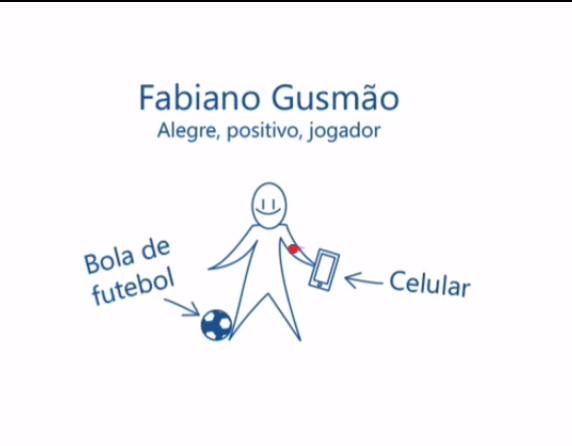

  
  # Entendendo o usuário
  

 

Nas últimas aulas abordamos o Triângulo de Keeley ou Triângulo de Ouro. Lembra-se que preenchemos essa ferramenta e também o 360º View com post its? Fizemos isso pensando no usuário, mas quem exatamente é o usuário?

Temos que continuar nossa investigação para aprimorarmos a estratégia de UX. Por enquanto construímos uma visão geral, portanto é como se continuássemos navegando em um mar de possibilidades. Conseguimos nos direcionar utilizando as ferramentas já apresentadas, mas ainda temos muito o que fazer.

A pergunta agora é: quem é o usuário do aplicativo?

Nós podemos não saber quem exatamente é o usuário, mas provavelmente algum setor da nossa empresa, como o setor de marketing, *Call Center*, ou setores relacionados ao cliente, deve ter informações que nos ajudem a mapear esse perfil. É preciso perguntar: o que esse usuário deseja? Do que ele gosta? Quais são os seus objetivos?

Dessa forma, o que vamos fazer é uma espécie de "chute" ou, em termos técnicos, elaborar uma hipótese. Passaremos a construir a hipótese de quem é nosso usuário, imaginando que ele se chame Fabiano Gusmão. Ele é alegre, positivo, e é jogador de futebol. E como é sua aparência física? Uma pessoa magra, que gosta de esportes e está sempre com o celular em mãos. A partir dessas características faremos um desenho do hipotético Fabiano Gusmão:

 

 

Nesse desenho iremos agregar elementos que representem o usuário, como um celular. Qual é o comportamento de Fabiano? Bom, ele joga futebol nos finais de semana e é viciado em redes sociais. Podemos pensar também em outros características, por exemplo, estar sempre atrasado e amar viajar. Todas essas informações serão anotadas junto ao esquema.

  

## Comportamentos

+ Joga futebol no fim de semana
+ Viciado em redes sociais
+ Sempre está atrasado
+ Ama viajar

Outro aspecto interessante que pode estar presente na hipótese são as informações demográficas do usuário: idade, ocupação, onde vive, se já fez intercâmbio, graduação, e afins.