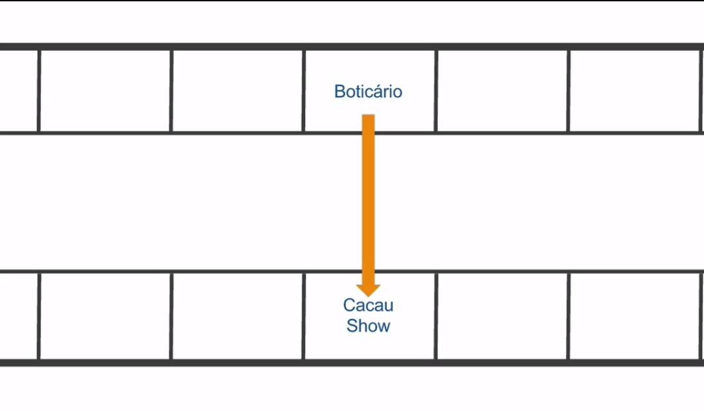

  
  # Definindo o Roteiro
  

 

## 

## Pesquisas e tipos de pesquisas

Já vimos como utilizar diversas ferramentas, mas será que estamos sendo assertivos na construção do perfil do nosso usuário?

Primeiramente, quem é o alvo de tudo isso? Como estamos tentando pré-definir informações acerca do usuário, é necessário pensarmos em realizar uma pesquisa e, para exemplificar a importância disto vamos contar um case do **Boticário**.

Em determinada época a empresa notou um decréscimo nos lucros, e para tentar reverter essa situação, eles começaram a pesquisar sobre o público-alvo da marca, e foi assim que perceberam que este era composto de pessoas de idade mais avançada.

Houve uma tentativa da empresa de realizar campanhas para atrair um público mais jovem. Entretanto, elas poderiam ser prejudiciais, pois o público mais idoso poderia deixar de se identificar com a marca. Assim, a solução encontrada foi a criação de uma nova marca: **quem disse, berenice?**, relacionada a uma identidade colorida, buscando atrair um público mais jovem. E a decisão de criar uma nova marca foi baseada nas pesquisas realizadas.

A grande questão é: onde a Boticário encontrou o seu usuário?

Para saber quem é o usuário, é necessário pensar nele. Ainda que utilizar o Triângulo de Keeley, o 360 View e proto-personas demonstre que pensamos no usuário, para se ter certeza do que ele necessita, é preciso realizar pesquisas. Isto envolve UX e é bacana, pois acabamos saindo um pouco da esfera do "achismo" e das hipóteses para um caminho que ajudará a eliminar ou minimizar as chances de falha.

Partimos para a pesquisa quando estamos com dúvidas ou questionamentos para tomar decisões, e ela pode nos ajudar bastante; existem diversos tipos de pesquisas disponíveis.

 

## Método de pesquisa: Observação

A **Kopenhagen** é uma marca de chocolates que passou por uma situação similar a do **Boticário**: seus lucros também estavam decaindo. No caso deles, porém, havia outro motivo, um novo competidor no mercado, a **Cacau Show**. A diferença entre uma marca e a outra é que a mesma trufa que custa R$ 7,00 em uma loja da Kopenhagen custa R$ 1,00 na Cacau Show.

A ideia inicial da **Kopenhagen** foi equivaler os preços das suas trufas com as do concorrente, mas o consumidor opta pela **Kopenhagen** por conta da marca forte que possui. Assim, para não prejudicar o produto nem o consumidor, decidiu-se pela criação de outra marca: a **Brasil Cacau**. Essa nova empresa, que faz parte do grupo da **Kopenhagen**, poderia vender trufas com preços equivalentes as da **Cacau Show**.

O próximo passo consistia em vender em shoppings, e o desafio foi encontrar um ponto de venda dos produtos, sendo necessário utilizar uma empresa de consultoria para encontrar o melhor local. Essa consultoria começou a observar a **Cacau Show** e, a partir da análise dos usuários, percebeu-se que eles entravam, compravam uma lembrança e iam embora.

No entanto isso não era muito esclarecedor, então eles começaram a notar que os usuários saíam do Boticário e entravam na Cacau Show. A partir daí, eles compreenderam que o cliente que ia dar um presente de dia das mães, por exemplo, entrava primeiro no Boticário e, caso os preços estivessem um pouco acima do orçamento previsto, entravam na Cacau Show e compravam presentes com preços mais acessíveis.

Assim, chegaram à conclusão de que o melhor ponto para se colocar uma loja da Cacau Brasil era justamente em frente a uma loja da Boticário.

 

 

O mais interessante é que isso foi descoberto através da observação, um método de pesquisa. Foi necessário ir a campo e observar, não o próprio usuário ou cliente, pois este ainda não existia, mas o do concorrente. E essa é uma abordagem de início de projeto, quando ainda não existe um usuário próprio.

Uma das partes bacanas da observação é que não há espaço para mentiras. Veremos mais adiante a questão de como o usuário omite certas questões e como nós lidamos com isso. O ponto chave é que no método de observação, a margem para isso é mínima.

Você ainda pode estar com a impressão de que a pesquisa não influencia tanto no produto final, mas ela serve para medições prévias em relação a pontos relevantes. Ou seja, fazer uma pesquisa concede mais credibilidade e deixa o projeto com um rumo mais definido e, consequentemente, mais assertivo.