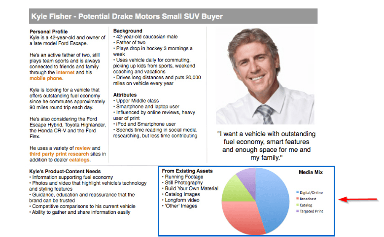
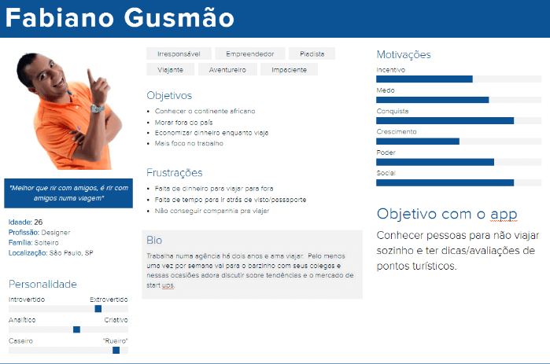
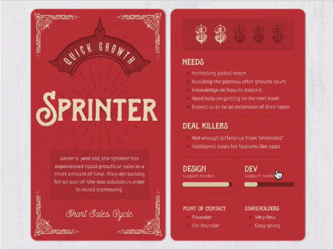

  
  # Materializando o usuário
  

## Identificando padrões

Até o presente momento temos a proto-persona, e também as pesquisas que foram realizadas, referentes a pessoas diferentes que possuem opiniões diversas. O ideal é juntar aquilo que é comum aos entrevistados, como se pegássemos o que foi repetido e jogássemos em um liquidificador. Dessa maneira teremos um: **mix de pesquisa**, que nos ajudará a identificarmos os **padrões**. Por exemplo, os padrões coletados a partir das entrevistas com o Caique, o Vicente e o Leandro são:

+ homens;

+ solteiros;

+ a maioria trabalha com tecnologia;

+ adoram viajar;

+ limitação financeira;

+ viajariam com pessoas conhecidas na internet;

A ideia é que você pare um pouco nesse ponto e observe suas pesquisas. Comece a levantar os pontos em comum entre os usuários, em relação ao comportamento, aspectos sociais, destinos de viagens, e outros. Selecione aproximadamente de 5 a 7 padrões.

 

## Persona

Observe os padrões que foram identificados nas nossas pesquisas com os entrevistados:

+ Homem, solteiro, 26 anos
 
+ Trabalha com tecnologia

+ Gosta de viajar

+ Sociável

 

Com isso, podemos validar as informações da proto-persona, ou evoluir para uma persona. A ***persona*** é uma ferramenta bastante utilizada em UX, e é também um pouco mais tradicional, sendo inclusive um dos entregáveis de UX. Basicamente, a diferença entre persona e proto-persona é que a primeira é validada e palpável, enquanto a proto-persona, pelo menos no início, é mais baseada em hipóteses.

Para construir a persona, nós, como equipe, precisaremos nos colocar no lugar da pessoa, trazendo à tona a empatia, de que tanto falamos. Iremos criar um nome para esse perfil a que chegamos e, da mesma maneira que nomeamos a proto-persona de "Fabiano Gusmão", batizaremos a persona. E, além de um nome, ligaremos a ideia dessa persona a uma foto, para que realmente fique memorável.

Selecionaremos três fotos de pessoas com aparência de viajantes, o que por vezes enriquece o contexto da persona. Na imagem abaixo temos a foto de um homem que parece estar localizado em algum lugar da Europa:

 

 

A segunda imagem traz uma menina desfrutando da paisagem do famoso *Stonehenge*.

 

 

A terceira foto é de um conhecido argentino que realmente desfruta viajar:

 

 

Pode-se utilizar também uma imagem que tenha relação com um cenário ligado ao seu projeto. Às vezes isso acaba reforçando a ideia de seu público-alvo, ou seja, de que as pessoas representadas nas fotos são realmente sociáveis e gostam de viajar.

Tudo isso ajuda a personificar o usuário, deixando claro para o time o público-alvo de nosso projeto, isto é, para quem estamos desenvolvendo o aplicativo. No entanto, é preciso tomar cuidado ao utilizarmos fotos de amigos, já que você pode acabar confundindo o seu amigo com a persona criada e acabar atribuindo a ela as qualidades e desejos de seu conhecido.

Outro ponto interessante é indicar a localização dessa persona, acrescentando informações demográficas. Ainda, é preciso esclarecer quem é, e como é a personalidade dessa persona. Outro ponto: em vez de simplesmente criarmos uma lista indicando que essa persona usa smartphone, toma café na empresa, é ativa em redes sociais, ocupada, e afins, é mais memorável criar uma narrativa, uma espécie de minibiografia de como é ser o Fabiano Gusmão por um dia.

Ainda, é importante especificar os interesses desse sujeito, se ele gosta de safári, se é baladeiro, se prefere ficar em casa assistindo a filmes, enfim. Quando mais informações, mais acabamos humanizando essa persona. Poderemos pensar também nos objetivos desse indivíduo, se ele deseja conhecer um lugar bacana, se ele só quer dividir custos de viagem, se é uma pessoa solitária ou não.

Sendo assim, é interessante acrescentar os **objetivos** da persona, tanto em relação ao aplicativo quanto à vida. A ideia de observar isso é para realmente enxergarmos essa persona como um ser humano. Todas as informações que vimos deixam a pessoa mais crível. Retomando algumas características que a persona deve possuir:

+ foto

+ informações demográficas

+ personalidade

+ narrativa/biografia

+ interesses

+ objetivos

+ nome

É importante frisar que usar nomes de pessoas famosas pode não ser uma ideia tão boa. E o mesmo vale para nomes de pessoas conhecidas suas. A persona é seu usuário, e ela não deve ser nenhum amigo, familiar ou pessoa famosa. Outra dica é não usar nomes tão comuns, como João da Silva. O nome deve ser simples, genérico, e poderia ser João das Neves, por exemplo.

 

## Quando personas mudam e outras ferramentas

Não é porque você definiu uma persona que você deve mantê-la para sempre. **Personas mudam**, assim como nossos objetivos pessoais, e é preciso revisá-las a cada seis meses ou um ano, e verificar se os objetivos criados para a persona original ainda fazem sentido.

Observe todas as informações que recolhemos:

Persona

+ Foto
+ Informações demográficas
+ Personalidade
+ Narrativa/biografia
+ Interesses
+ Objetivos
+ Nome

Devemos pensar em uma maneira de inspirar as pessoas a olharem para esse conjunto de informações e pensarem que estão projetando para esse indivíduo, da mesma forma que fizemos com a proto-persona. O uso de infográficos para a montagem da persona foi algo que adquiriu bastante adeptos de uns tempos para cá:

 

 

Essa pessoa se chama Kyle Fisher, e são exibidas diversas informações a seu respeito, um infográfico, uma frase que ele provavelmente diria, e afins. Outro exemplo é o de Fabiano Gusmão, cuja ficha criamos:

 

 

Uma ferramenta bacana para a criação destes infográficos é a [Xtensio](https://xtensio.com/), e para acessar a ferramenta basta criarmos uma conta com nome e senha. Encontramos várias funcionalidades interessantes para a criação de *personas*, como a *User Persona*, que seria a persona de Usuário.

Ao clicarmos no botão "Use Template", será aberto um formulário para preenchermos de acordo com os dados da persona. Ao final da página clicaremos em um botão "+ Add", para salvarmos as informações, com o qual poderemos incluir outras informações necessárias, como imagens, gráficos, e tags. Um dos pontos positivos dessa ferramenta é que ela é gratuita.

Como exemplos de *persona* desenvolvido em um curso presencial, o da Clara Liz Bittencourt tem diversas características, e sua narrativa é contada em primeira pessoa, como se o grupo que fez esse exercício fosse a própria Clara. 

 

 

Outro exemplo é o [Mailchimp](https://mailchimp.com/resources/), empresa que criou personas e as representou em pôsteres incríveis, que espalhou em paredes da firma:

 

 

Outro exemplo de persona é o da **Shopify**, em formato de cartão, onde constam todas as características da persona:

 

 

A ideia da persona é realmente alcançar o público-alvo e deixá-lo visível para a equipe.

Como nós estamos pensando em um público-alvo específico, podemos dizer que estamos pensando em uma ***persona primária***.