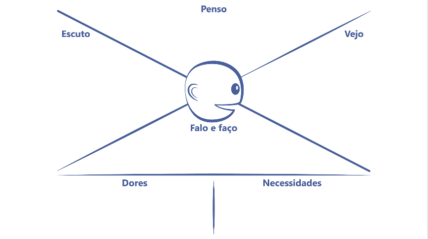
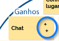
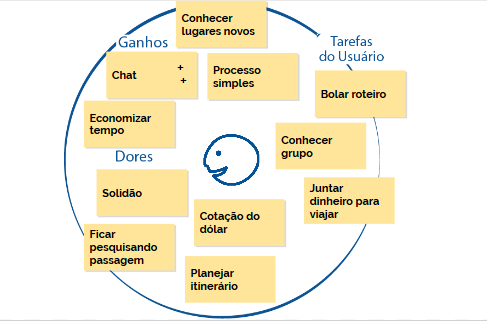

  
  # Mais Empatia e mais valor
  

 

## Empatia

Será que utilizar personas é o suficiente para criarmos empatia na equipe?

Às vezes, não, e existem outras ferramentas que podem nos auxiliar na indução de empatia. Para criar esse vínculo é preciso levar em conta o que a pessoa pensa, escuta, vê, fala, faz, suas dores e necessidades. Uma ferramenta que faz exatamente isso para nós é o **Mapa de Empatia**, que possui o seguinte aspecto:

 

 

É como se realmente estivéssemos mapeando tudo o que está relacionado aos sentimentos desse usuário. Porém, já fizemos algo bastante similar quando construímos a proto-persona, e depois a persona. Então, por que seria necessário utilizar essa ferramenta? Depende do caso - se a persona é o suficiente para você, não é necessário construir o Mapa de Empatia.

> Quem criou esta ferramenta foi a Xtension, e ela é bem fácil de se entender e manusear, tanto é que pessoas da área de UX passaram a utilizá-la bastante.

As informações necessárias para o preenchimento desses espaços vêm da proto-persona ou persona. Em "Vejo", completamos com o que o usuário utiliza diariamente:

**Vejo**

+ Amigos viajando com suas esposas
+ Review no Booking
+ Instagram com dicas de viagens
+ Promoções de passagem

 

Em "Penso" incluímos os sonhos e esperanças do usuário e, nesse momento, você começa a se colocar no lugar da outra pessoa, gerando a empatia.

**Penso**

+ "Odeio viajar sozinho"
+ "A Tunísia deve ser um lugar fantástico"
+ "Passagem de avião é muito caro"

 

No "Escuto" cabe aquilo que influencia o usuário:

**Escuto**

+ Opiniões de youtubers
+ "Nunca foi pra Machu Picchu?!"
+ Opiniões de amigos e parentes
+ Redes sociais

 

Outra parte bastante importante é o "Falo e faço", em que deve constar seu comportamento com pessoas de seu círculo social:

**Falo e faço**

+ "Desisto de chamar alguém para viajar"
+ "Mais um mês sem juntar $"
+ SkyScanner para achar passagens

 

Em "Dores", devem ser inscritos os obstáculos que o usuário encontra para ser feliz.

**Dores**

+ Ficar muito tempo sem viajar
+ Gastar muito
+ Ficar perdido
+ Depender do wifi público

 

Bom, se falta algo para ele ser feliz é porque ele possui uma necessidade...

**Necessidades**

+ Conhecer grupo antes de viajar
+ Sugestão de destinos
+ 4G decente

 

E este é o Mapa de Empatia pronto:

 

 

Tudo isso é feito para deixar o perfil hipotético do Fabiano o mais próximo de algo real. Entretanto, é difícil entender se a ausência de Wi-fi público é realmente uma dor para esse usuário, às vezes não é o caso. Novamente, retomaremos a ideia de empatia, de nos colocarmos no lugar de alguém, permitindo que as ideias acabem vindo espontaneamente.

É algo que pode condizer com a realidade ou não. E para que possamos preencher o Mapa de Empatia, é preciso entrar no **Modelo Mental** do usuário, e realizar o exercício de colocar-se no lugar da outra pessoa.

O **gamestorming** abaixo serve para para elaborarmos um Mapa de Empatia:

+ Tempo: 25 minutos

+ Ambiente: folhas, canetas e post its

+ Objetivo: sentir mais empatia pelo usuário

 

## Tarefas de usuários

Muitas vezes, enquanto indivíduos que executam determinada tarefa para o nosso próprio time, acabamos nos perguntando: qual é o valor gerado a partir dessa atividade? Esse desconhecimento acaba causando desmotivação no colaborador, resultando em um rendimento menor, um deadline apertado, perda de prazos de entrega, o chefe fica desapontado, e o usuário triste. Dessa maneira, todos perdem!

> Quais tarefas o usuário executa no dia a dia, que estão relacionadas ao aplicativo?

Essas atividades são as **Tarefas do usuário**, sejam elas felizes ou tristes.

Se o usuário gosta de viajar, uma de suas tarefas provavelmente é montar um roteiro, assim como conhecer um grupo e juntar dinheiro para viajar. Tais tarefas não estão em um formato de lista ou tópicos, e sim mais relacionadas a **esferas emocionais**.

Exemplificando: uma pessoa gosta de se vestir de determinada maneira pelo status, e isso é uma tarefa mais social. Outra quer se vestir para simplesmente não andar pelado, isso está na esfera funcional. E por fim, alguém que se veste para sentir-se bonito vincula essa tarefa a uma esfera emocional. Portanto, dentro das tarefas dos usuários pode-se incluir esses três eixos.

No nosso caso, o usuário possui as seguintes tarefas de usuário:

+ Bolar roteiro de viagem
+ Conhecer grupo interessado em viajar junto
+ Juntar dinheiro

Vamos explorar os obstáculos que nosso usuário enfrenta. Como Fabiano Gusmão quer conhecer um grupo, uma de suas "dores" seria a solidão, assim como a cotação do dólar que, quanto maior estiver, mais caro custará a viagem. Uma terceira dor seria pesquisar passagens, o que pode acabar sendo uma atividade monótona. Da mesma forma, a quarta seria planejar o itinerário.

Os ganhos, aquilo que é positivo e que acaba por amenizar um pouco essa situação, seriam:

+ Conhecer lugares novos
 
+ Processo simples, sem burocracia

+ Chat

+ Economia de tempo

 

Você ainda pode priorizar as anotações dos post its usando etiquetas diferentes, ou pode-se acrescentar um símbolo de + para demonstrar prioridade:

 

 

O que acabamos de fazer serve para reunirmos visualmente as características do usuário:

 

 

O que faremos na sequência é buscar minimizar as dores do nosso usuário.