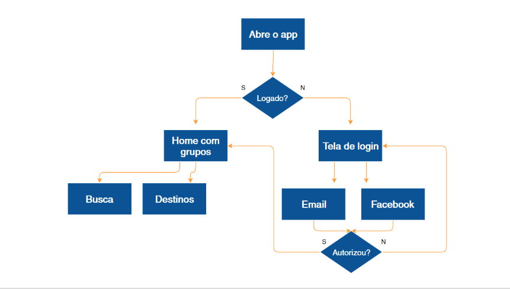

  
  # Cenários e Histórias
  

 

## Cenário

Já utilizamos diversas ferramentas para traçar o perfil do nosso usuário, mas de que forma o Fabiano Gusmão realmente utilizaria esse aplicativo?

Vamos imaginar que inicialmente ele abre o aplicativo, verifica se está logado, acessa a home com outros grupos. Caso não esteja logado, abre a tela de login. As opções para quem não está logado são acessar o aplicativo usando o e-mail ou o Facebook, e se isso for autorizado passa-se para a página inicial com grupos, ou volta para a tela de login.

Na home com os grupos, o usuário encontra outros, por meio do campo de busca ou dos destinos:

 

 

Essa é uma forma de mostrar como é a jornada do usuário usando o aplicativo. O problema é que esse esquema acaba caindo no esquecimento. Existe uma forma muito mais rápida e simples de fazermos isto. Sabendo que quem usará o app é o Fabiano Gusmão, para quê ele o utilizará, exatamente?

Lembrando que o Fabiano Gusmão tem os seguintes objetivos:

+ Conhecer o continente africano.

+ Morar fora do país.

+ Economizar dinheiro enquanto viaja.

+ Mais foco no trabalho.

 

Vamos focar em um desses objetivos, no caso, "Conhecer o continente africano".

**Como e onde o Fabiano Gusmão utilizaria o aplicativo? No trem? No bar? Em casa?**

Um contexto de uso mais usual do aplicativo seria em casa, com a internet boa, banda larga, tomada acessível, e tudo mais. Vamos listar o contexto de uso do aplicativo:

+ Ele utiliza o aplicativo em casa

+ Ele está praticamente de férias

+ Ele encontrou a passagem em promoção

+ Nenhum amigo dele está disponível para viajar

+ Ele busca a companhia de viagem em nosso aplicativo

Nesse caso, é mais fácil nos lembrarmos de todos os itens dessa lista se houverem conexões entre os fatos, como em uma história. Vamos criar um cenário, em um editor de texto, e escrever o seguinte:

> Fabiano está em casa, faltando 40 dias para entrar de férias. Em um blog de dicas de viagem, esbarra numa promoção de passagem para Moçambique e acaba comprando-a. Começa a postar em seu Facebook se alguém topa ir com ele, e até apela para o grupo da família no Whatsapp, mas sem sucesso. Um de seus primos indica o app.

> Fabiano baixa o app na App Store e o abre. Rapidamente loga e consegue achar um grupo que pretende ir para Moçambique também. Ele entra no grupo e os informa sobre a promoção que comprou mais cedo, e da data que irá. Todos o agradecem e a maior parte do grupo compra também, para a mesma data.

> Já até começaram a trocar umas ideias e marcam um bar para papear sobre a viagem.

Isso que acabamos de escrever é um **contexto de uso**. Perceba que em nenhum momento da construção desse texto é mencionado o layout, ou as funcionalidades do aplicativo. Para construirmos esse roteiro nos colocamos no lugar do próprio Fabiano e fomos pensando no que faria sentido para ele.

Por ora, estamos preocupados se ele chegará ao aplicativo e conseguirá interagir com ele. É isso que chamamos de **cenário**, e a ideia é juntar a regra de negócio com o que faz sentido para o usuário. Trata-se de uma narrativa rápida e direta para entendermos como o usuário vê o aplicativo.

E é isso que faremos para praticar, através de um gamestorming:

+ Tempo: 15 minutos

+ Ambiente: folhas, canetas, persona criada

+ Objetivo: criar cenário com base na persona. O cenário pode ser feito através de narrativa, storyboard, vídeo, e assim por diante

Às vezes queremos ser descritivos e acabamos entrando e abordando um pouco acerca das funcionalidades e layouts do nosso aplicativo, como saber que o Fabiano clicou em um botão que estava na tela inicial. Não é uma informação relevante no momento.

Se você for aplicar isso em sua empresa é interessante que cada membro de sua equipe elabore um roteiro e cada um faça um cenário individualmente. Depois, cada um deve ler o seu, explicar e, dentre todos, deve ser escolhido o melhor.