

# Ideias: da cabeça ao papel

 

## Crazy eights

Usabilidade é a facilidade de uso. Às vezes, os conceitos de UX e Usabilidade são considerados idênticos, mas na verdade a usabilidade está dentro da Experiência de Usuário.

O objetivo do nosso curso é mostrar como começamos a desenhar telas, quando já tivermos realizado a etapa de pensá-las e elaborado os conceitos no papel. Mas precisamos começaremos fazendo rascunhos à mão.

 

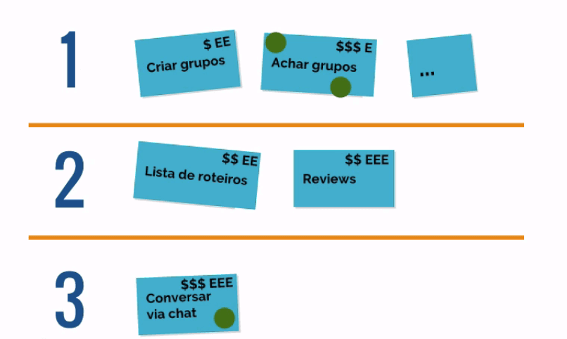

 

Escrevemos algumas funcionalidades que separamos pelos números 1,2 e 3. São versões de um produto mínimo que conseguimos lançar. Essa divisão das funcionalidades de cada versão tem a intenção de indicar que se elas estiverem presentes em um produto, ele pode ser lançado o mais breve possível.

O usuário ficará satisfeito, nós conseguiremos ter um retorno financeiro inicial e nós teremos capacidade técnica para realizá-lo. Isso é o que mercado chama de **MVP**, que significa produto mínimo viável.

O produto que criaremos irá resolver o problema de **encontrar uma companhia para viajar**. No fim do curso, queremos aproveitar todas essas funcionalidades.

 

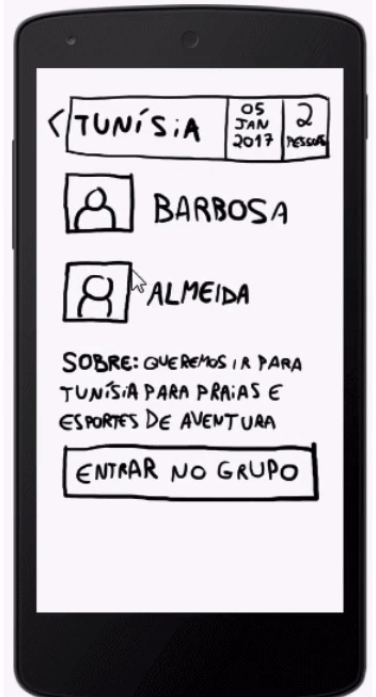

 

Observe que as telas não foram desenhadas de forma impecável. As linhas não estão retas... No entanto, não é necessário saber desenhar para realizar este curso. Não são necessárias várias horas de desenho para conseguir concluir o projeto. A ideia de rabiscar com lápis em um papel permitirá que qualquer um possa fazer isso - incluindo o seu cliente, chefe ou stakeholder do projeto.

Ainda temos diversas funcionalidades que gostaríamos de adicionar.

 

 

Temos várias opções: criar ou achar grupos de viagem, encontrar lista de roteiros, ler reviews, um chat para conversa entre os usuários. Vamos começar.

 

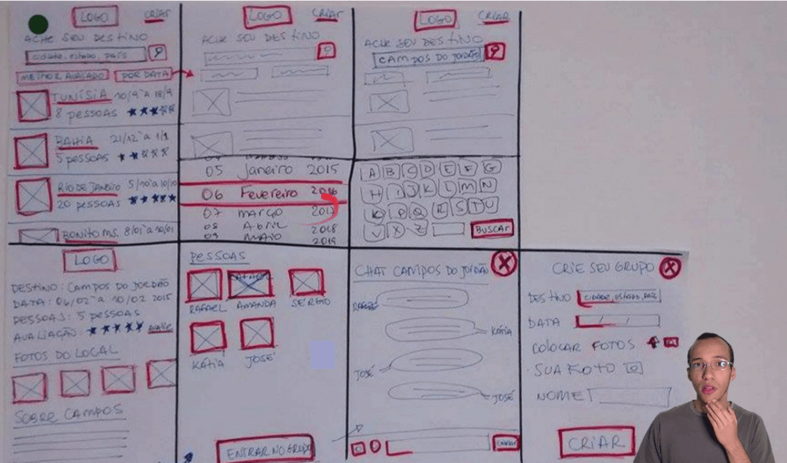

 

Observe que eu criei um monte de pequenas telas. Gastei um bom tempo, desenhando vários detalhes, inserindo ícones... Mas nesta fase de coletar ideias e colocá-las no papel, seria mais interessante elaborar um desenho rápido. Como o que fiz e segue abaixo:

 

 

Na segunda tela, queria criar uma funcionalidade de chat.

 

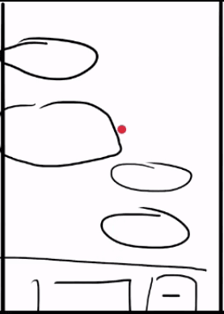

 

Quanto tempo será que eu levei para criar estas telas? Eu levei exatamente **cinco minutos**. Perceba que não existe um fluxo de navegação entre as telas. Eu desenhei a lista de roteiros na primeira tela, depois o chat, e na terceira, criei a função para imputar os dados com voz.

Na quarta tela, vemos uma funcionalidade para encontrar lugares específicos que estejam perto do usuário, como restaurantes e hotéis.

 

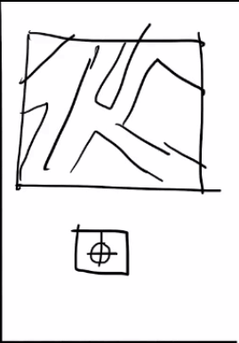

 

Temos também uma tela de review, em que você pode indicar se gostou ou não de um lugar.

 

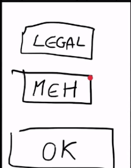

 

Eu desenhei uma tela exclusiva para restaurante, onde vemos que um restaurante foi avaliado como o terceiro melhor de 75 outros locais.

 

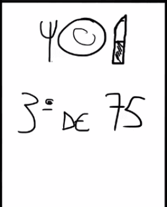

 

O usuário tem uma tela para encontrar grupos de viagem para o mesmo destino que queremos ir.

 

 

Veja que criei sete telas. Será que este número é o ideal? Não seria melhor criar um número muito maior, 20 ou 50 telas? A resposta é não. Seria difícil você parar várias pessoas de um time por um período de duas horas para ficar desenhando tela. O ideal é que esta parte do processo seja realizada rapidamente pelo time, sendo que cada membro irá rascunhar algumas telas.

Vamos ver outro exemplo: telas do Uber. Em que momentos solicitamos um motorista do Uber?

 

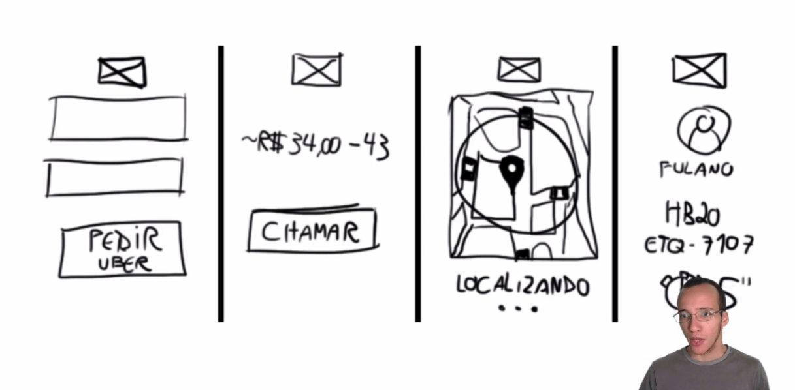

 

Na primeira tela, vemos dois campos. No de cima você coloca onde você está e no de baixo, coloca aonde quer ir.

 

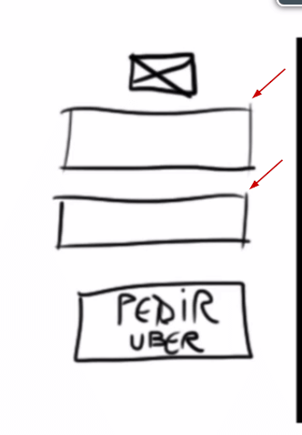

 

Na segunda tela, fazemos a estimativa de preço.

 

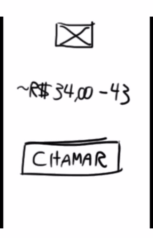

 

Depois que você concordou com o preço, você chama o Uber e ele começará a localizar motoristas próximos de você.

 

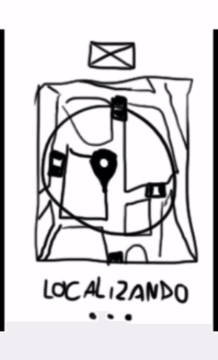

 

Então, começará a aparecer os dados do motorista, incluindo tempo de chegada até a sua localização inicial.

 

 

Se você já usou o Uber, sabe que existem outras telas, como a parte de ajuda para o usuário, histórico e outras. Não precisamos pensar nisto agora. Por enquanto, focaremos nos momentos-chave do aplicativo.

 

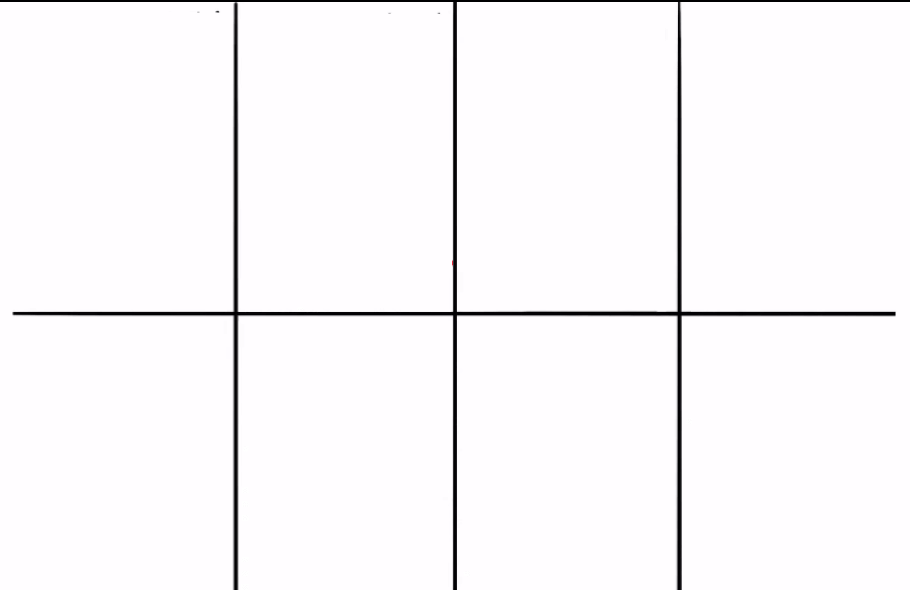

 

Observe que no primeiro exemplo nós trabalhamos com uma grid de **oito** partes. O **Google Ventures** (GV), uma pequena empresa dentro do Google, é o responsável por definir o número **8** como o valor ideal. Para o GV, oito passos seriam o limite para o usuário realizar alguma tarefa.

Mas não quero que você pense em fluxo agora. Pense nos momentos-chave do aplicativo. Se você se sentir travado na criação, pode trabalhar em versões diferentes da mesma tela. Se nem isso você conseguir, pense em como será a interação do usuário - vale desenhar um boneco de palitinho usando a sua aplicação. Isso pode te ajudar a destravar.

Esta técnica para colocar a sua ideia em oito parte recebeu o nome de **Crazy Eights**, que traduzido para o português seria os "oito loucos".

 

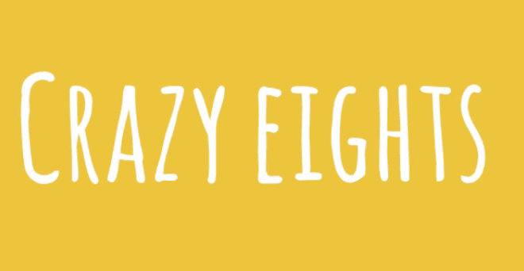

 

O termo "louco" faz referência à ideia de que o processo elaboração deve ser feito na "doideira" e deve ser finalizado em cinco minutos, ou seja, você terá **40 segundos** para gastar com cada tela. Você não terá tempo para pensar se a linha que você desenhou está reta ou apagar e refazer algo. Com isto, você estará perdendo tempo.
