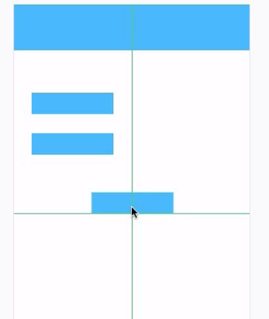
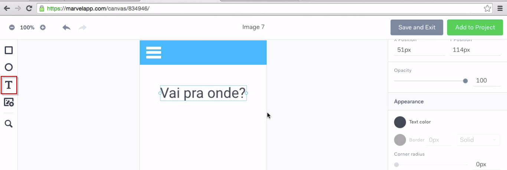
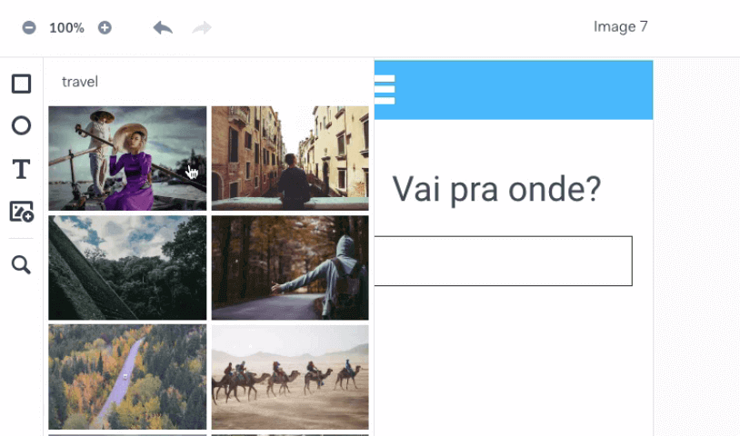
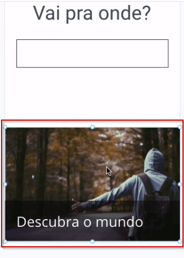
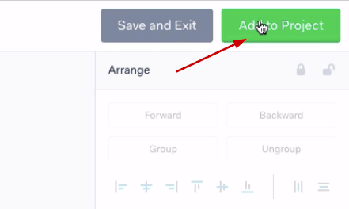
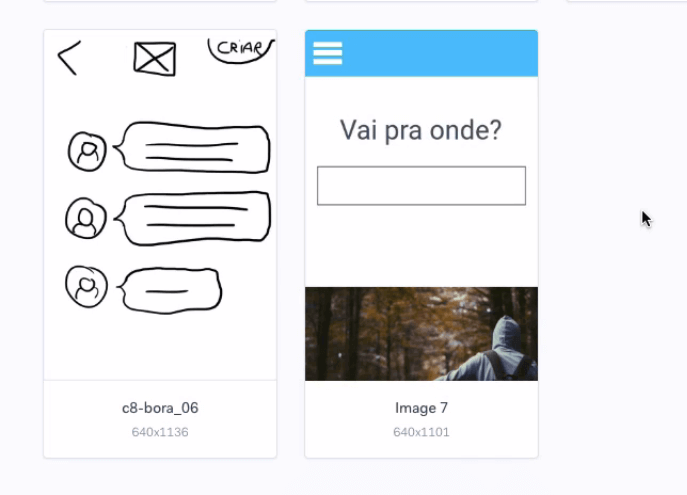
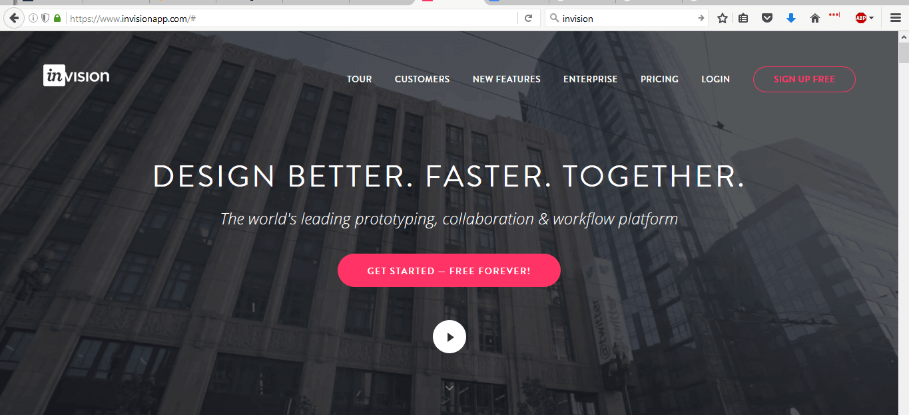
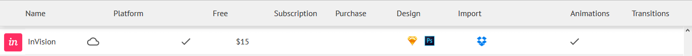
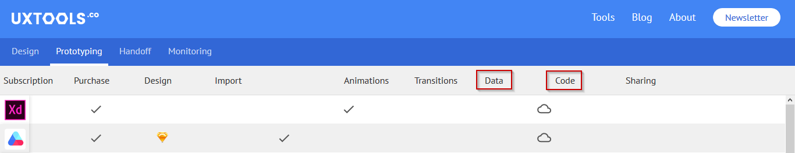

# Ferramentas de prototipação

 

## Introdução ao Marvelapp

Marvel app é uma ferramenta de criação de protótipos rápidos interativos com transições para validação com seu time de desenvolvimento. Você pode criar desde protótipos básicos de baixa fidelidade com imagens de rascunhos, até protótipos de alta fidelidade.

 

### Protótipo de baixa fidelidade com interações (POP app(Prototype on Paper) agora Marvel design)

 

 
 
 

## Marvel design

Conhecemos o Marvel. A seguir veremos uma ferramenta que ele possui, mas o POP não tem.

O Marvel oferece a opção de criar as telas diretamente no aplicativo, sem precisar tirar fotos ou usar o Photoshop. Ele possui uma barra lateral com formas geométricas e nos permite criar figuras. Por exemplo, vamos criar um header com o ícone de hambúrguer.

Ele possuiem guias semelhantes às *smart guides* do Photoshop.

 

 

Ajustamos o tamanho do menu e posicionamos no cabeçalho.

 

 

Temos também a ferramenta de texto. Adicionaremos a mensagem: "Vai pra onde?"

 

 

Depois, adicionaremos um retângulo para o campo de texto.

Observe que conseguimos criar as telas diretamente no aplicativo. Temos a opção de adicionar uma imagem, possuindo inclusive um próprio banco de imagem.

 

 

Vamos escolher uma imagem e criar uma montagem com o seguinte texto: "Descubra o mundo". Também adicionaremos um background para destacar a frase.

 

 

Quando finalizada a tela, podemos salvá-la e sair, ou adicioná-la diretamente no projeto.

 

 

E ela já será adicionada ao projeto:

 

 

> O Marvel possui inclusive uma integração com o Slack, uma espécie de chat - semelhante ao do UOL, porém, um pouco mais "hipster".

A seguir, conheceremos outras ferramentas para você usar na criação do seu protótipo.
<<<<<<< HEAD

 

## Mais Ferramentas

Conheceremos mais algumas ferramentas de prototipação:

+ Proto.io

+ Balsamiq

+ UXPin

+ CanvasFlip

+ InVision

+ Adobe XD

+ Figma

No estudo, nós utilizaremos principalmente no Marvel. Mas será que ele atenderá todas as necessidades de uma empresa? Pensando nisso, é que surgiu o UX Tools.

 

[UX Tools](https://uxtools.co/tools/prototyping)

Nele vemos o nome e o logo das ferramentas, e ir comparando o que tem e não tem nas mesmas e quais são as mais populares e utilizadas

O InVision é uma das ferramentas mais utilizadas.

 

 

Veremos na página do UX Tolls, quais recursos poderemos utilizar com o InVision.

 

 

Ver esta descrição das ferramentas nos faz ganhar tempo por não precisarmos testá-las. Pode ser que algumas colunas sejam menos relevantes.

 

 

Mesmo assim, você terá muitas informações organizadas.

O **Adobe XD** é uma ferramenta muito aguardada, e dependendo de quando você estiver assistindo, talvez ela já esteja disponpivel para todos os sistemas operacionais. O **UXPin** é uma ferramenta bastante completa. O **Balsamiq** tem para Windows e Mac. O **Proto.io** é uma ótima ferramenta, superior a muitas outras, mas a versão gratuita dura poucos dias.

Apresentamos algumas ferramentas, mas você está livre para usar a ferramenta que preferir. No curso, nós focaremos no Marvel.

Temos também a ferramenta chamada **Axure**, bastante conhecida pelos profissionais de Arquitetura de Informação. Com ele conseguimos criar um prototipo de alta-fidelidade - mas também é possível utilizá-lo para construir um de baixa.

 

## Ferramentas de UX

Existem diversas ferramentas relacionadas a prototipação que podem ajudar no desenvolvimento do seu projeto.

No estudo vimos o POP e o Marvel, duas ótimas ferramentas com propósitos iniciais diferentes.

O POP (prototyping on paper) é focado em protótipos de baixa fidelidade, pois ele é usado principalmente para criar protótipos com fotos de sketches. Sejam eles no papel ou mesmo em um quadrao branco.

Já o Marvel pode ser usado para prototipação tanto de baixa quanto de alta fidelidade, tendo como diferencial frente ao POP a possibilidade da criação de telas na própria ferramenta.

Tanto o Marvel quanto o POP podem não se adequar as suas necessidades

Podemos usar o [UX Tools](https://uxtools.co/tools/prototyping) para nos ajudar a filtrar as melhores opções de acordo com nossa necessidade.

Outras ferramentas citadas em aula:

+ Invision
+ Proto.io
+ Balsamiq
+ Canvas Flip
+ Adobe XD
+ UX Pin

 

Outra ferramenta bastante conhecida na área de UX e Arquitetura de Informação é o [Axure](https://www.axure.com/).

