

# Primeiras heurísticas de Nielsen

 

## Feedback

Agora, vamos focar um pouco mais em **Usabilidade**. O termo é bastante abrangente e mas possui algumas regras para que pudéssemos definir melhor o seu uso. **Jakob Nielsen** é considerado o "pai" da usabilidade, por ter começado na década de 1990 a se especializar em levantar dados de seus clientes e, com isso, propor melhorias para os produtos.

Ele criou boas-práticas sobre recomendações de usabilidade, que ficaram conhecidas como as "10 heurísticas de Nielsen".

Veremos as 10 heurísticas já em prática no prototipo do Bora.

Para criarmos um grupo, clicaremos no botão "Criar".

 

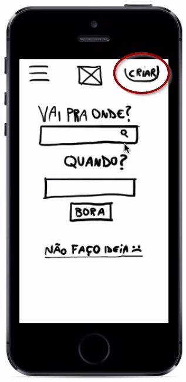

 

Depois, especificarei para onde eu vou:

 

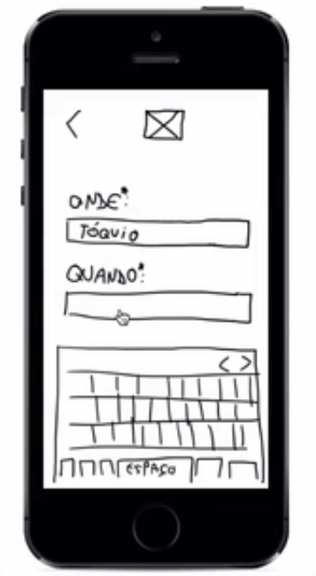

 

E a data... Depois pressionaremos "Criar Grupo".

 

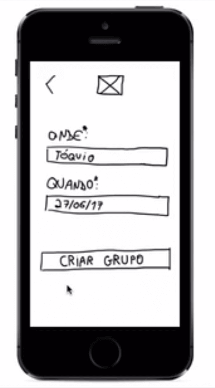

 

Seguiremos para a tela de compartilhar.

 

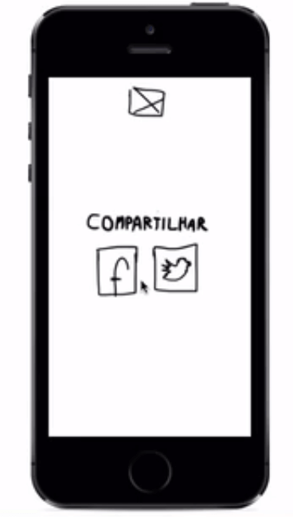

 

Mas senti falta que o app enviasse uma mensagem de "Foi" ou "Grupo criado com sucesso". Porque no caso, eu não sei "se não foi", o sistema precisa me informar sobre status. Temos que nos preocupar com a visualidade do sistema.

Essa é uma das heurísticas de Nielsen:

 

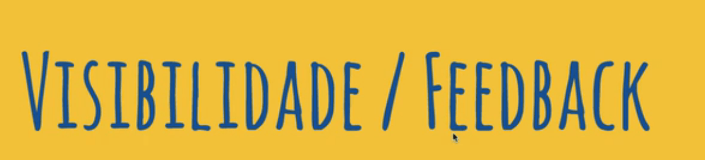

 

Temos um artigo publicado pela "Nielsen Norman Group",

 

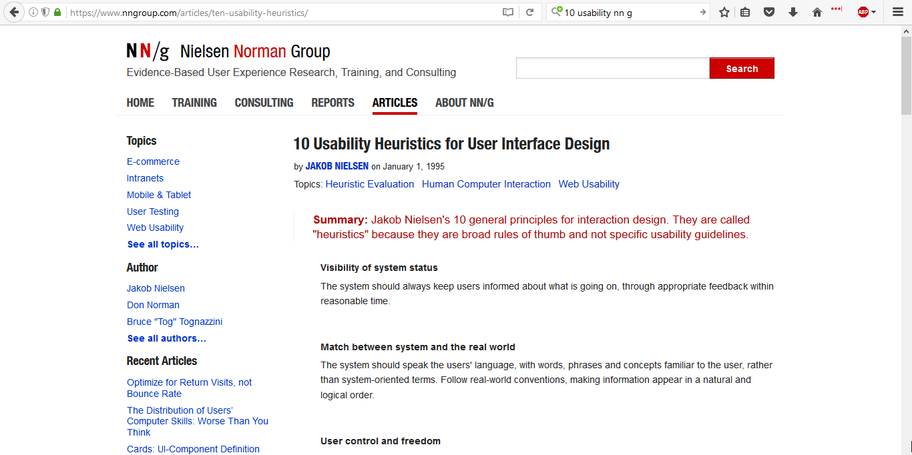

 

Como resolver a questão do feedback na nossa tela.

Agora, ao clicar no botão de "Criar Grupo", adicionaremos uma tela de transição em que o usuário receberá a mensagem "Criando Grupo".

 

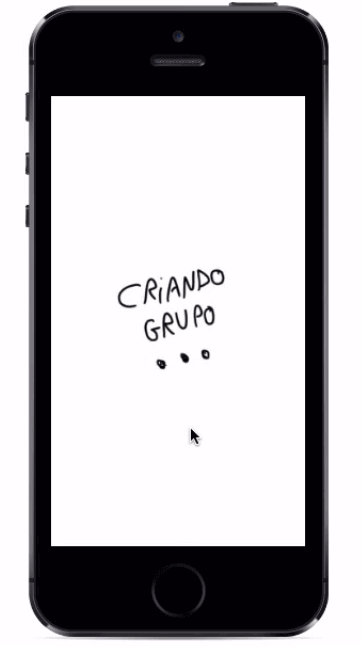

 

E depois, verá "Grupo Criado".

 

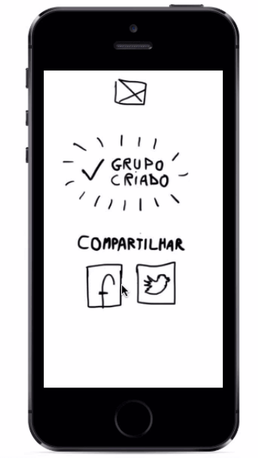

 

A ideia do feedback é muito importante quando pensamos em usabilidade.

Digamos que a pessoa não saiba para onde ela quer ir e qual grupo de viagem ela deva entrar em contato.

 

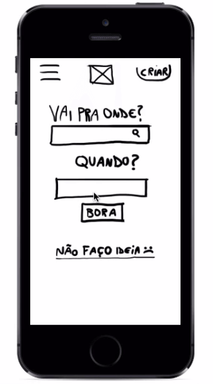

 

O usuário pode receber algumas opções de locais.

 

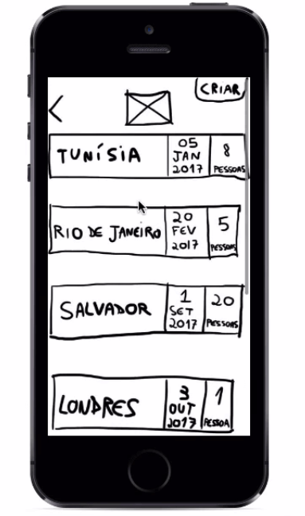

 

Selecionaremos a Tunísia. Poderemos entrar na página do grupo.

 

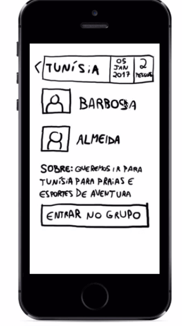

 

Depois, os botões vão mudar:

 

 

Nós que entendemos de tecnologia, sabemos que a pessoa entrou no grupo. Mas será que um usuário mais leigo compreenderia também? Para acabar com a dúvida, podemos adicionar uma notificação informando que o usuário entrou no grupo. O Marvel nos oferece a opção de que uma tela seja trocada sem que o usuário precise clicar em algum ponto do protótipo. Com o "Timer", é possível determinar por quanto tempo queremos que uma tela seja visualizada e qual será a próxima.

 

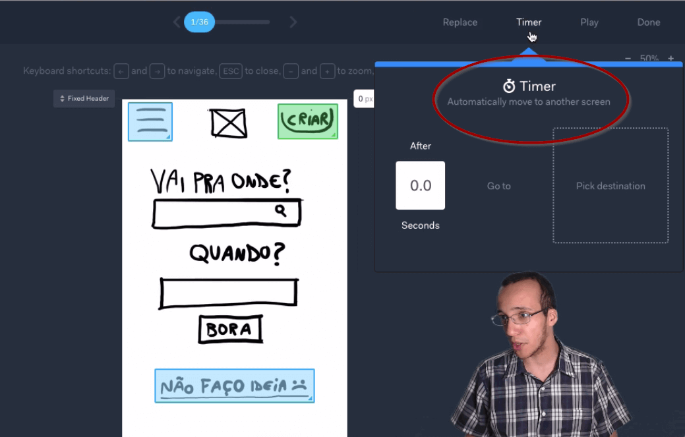

 

Trabalhamos com a ideia de dar um feedback para o usuário para que ele não fique perdido durante a navegação.