

# Mais heurísticas

 

## Memória limitada

Vamos começar a falar sobre outra heurística. Quando acessamos a parte de passeios do nosso aplicativo, selecionamos uma das opções, fomos levados para a próxima tela, clicamos em "Partiu!", depois em "Review". Decidimos retornar a página anterior, mas espera, qual foi o passeio selecionado?

 

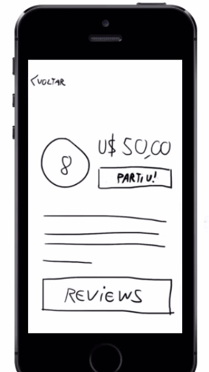

 

Quando o seu usuário precisa consultar a sua memória para lembrar de uma informação relevante que foi mostrada anteriormente, a sua tela tem um problema. Nós precisamos lembrar que o usuário tem memória limitada.

 

 

Esta é um heurística que nos diz para não dependermos da memória de quem utiliza o sistema. Vamos analisar como este conceito é aplicado no site da Americanas. Se quisermos comprar um mixer no site, podemos selecionar um categoria, depois teremos várias opções de produtos e podemos selecionar um em específico.

 

 

Ao abrirmos a página de um produto, podemos ver no canto superior qual foi o caminho seguido para chegarmos até onde estamos.

 

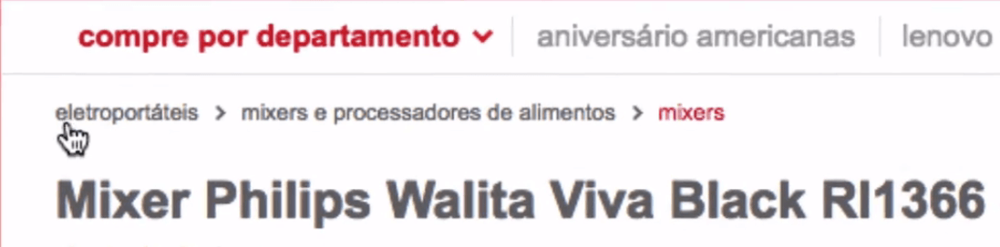

 

Podemos inclusive voltar aos passos anteriores e retornarmos às "categorias mães". O componente que nos permite visualizar os passos que segui recebe o nome de ***breadcrumb***, que traduzido para o português significa "migalha de pão".

Se fizermos uma pesquisa no Google, encontraremos outros exemplos:

 

 

O breadcrumb além de informar de onde viemos, nos informa onde estamos. No caso da Americas, ele sinalizou em vermelho que estávamos na seção de "mixers".

O breadcrumb costuma ser bastante utilizado em sites de e-commerce, para que os usuários saibam quais são os passos do produto até a finalização da compra.

 

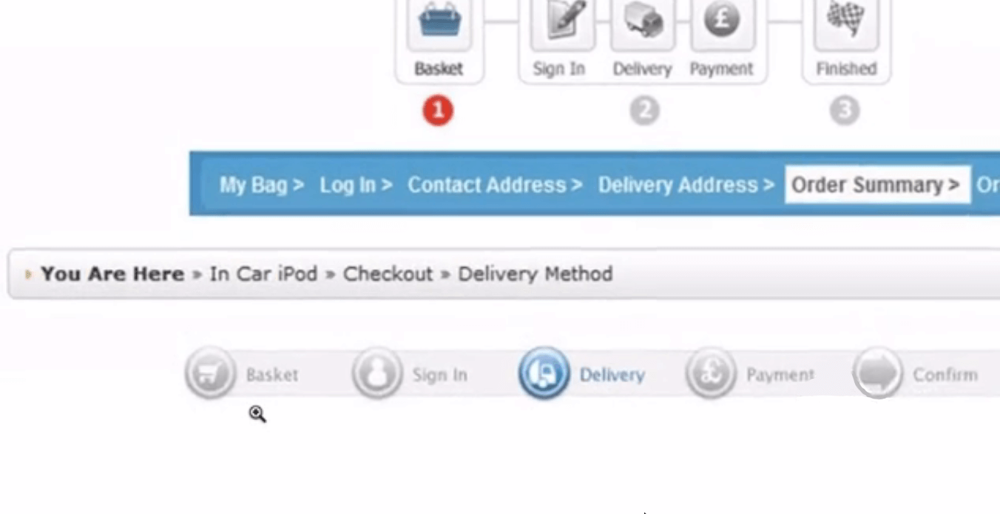

 

Ele nos sinaliza visualmente que estamos na parte de Delivery e nos indica aonde terminaremos. Este é um recurso que deixa o usuário mais confortável e o torna mais suscetível a concluir todo o processo de compra.

Trabalhando com a ideia de não dependermos da memória do usuário, adicionaremos na tela do aplicativo "Bora" o nome do destino logo no título.

 

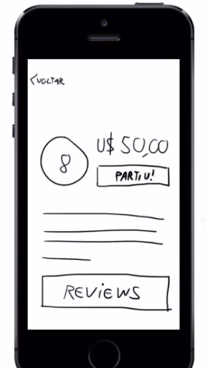

 

 

## Ajuda

Continuando a falar sobre heurística, vamos ver outras melhorias que podemos fazer no aplicativo.

Às vezes, o usuário pode ter algum tipo de dúvida, por isso, podemos disponibilizar um espécie de manual dentro do próprio aplicativo.

Por isso, adicionamos um espaço reservada para "ajuda" sinalizada com o ícone de interrogação no menu.

 

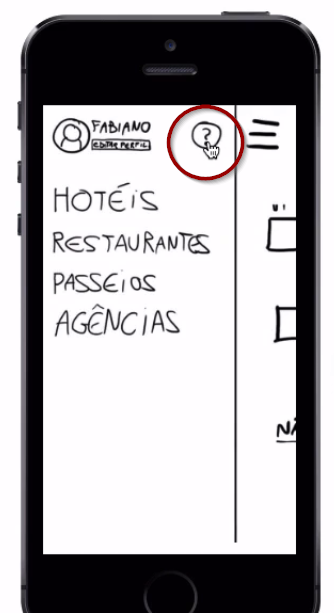

 

Ao clicarmos no ícone, somos levados para um página de FAC.

Esta ideia de disponibilizarmos algum tipo de documentação para a consulta do usuário é tratada na heurística sobre **Ajuda** ou **documentação online**.

Se o aplicativo não é intuitivo o suficiente para o usuário não precisar de um dica ou uma **help screen**.

 

 

São telas mostradas quando você começa a usar o app.

> Particularmente, prefiro que essas dicas sobre o uso comecem a surgir à medida que o usuário começa a interar com as ferramentas do app.

 

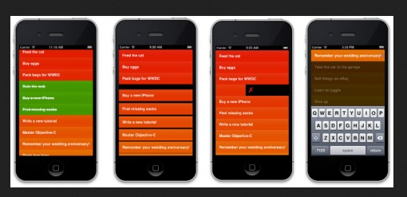

 

Neste exemplo, a help screen sugere uma navegação para o usuário e vai explicando as funcionalidade, em processo semelhante a um tutorial. Ele faz com que o usuário interaja com o app, tornando-o mais intuitivo.

 

## Minimalismo e flexibilidade

Faltam duas heurísticas, mas dessa vez, não conseguirei exemplificar com o aplicativo "Bora".

No blog da Caelum você encontrará um post com ótimo exemplo: [10 Heurísticas de Nielsen. Uma fórmula pra evitar erros básicos de usabilidade](https://blog.caelum.com.br/10-heuristicas-de-nielsen-uma-formula-pra-evitar-erros-basicos-de-usabilidade/), escrito por Marco Bruno

Primeiramente, falaremos sobre **Menos é mais**.

 

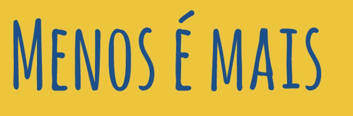

 

Todo designer já escutou essa frase pelo menos uma vez na vida.

Em vez de você poluir a tela com várias coisas, você exibe apenas o que for necessário no momento em que o usuário estiver interagindo com o aplicativo.

 

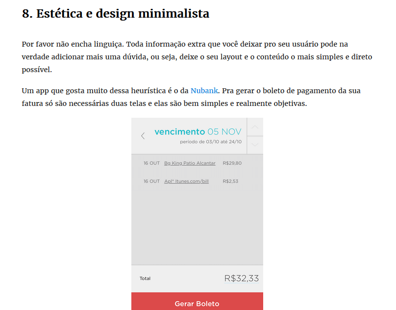

 

O artigo do blog da Caelum ressalta um ponto importante: **não encha linguiça**. Ele cita como um bom exemplo do uso desta heurística na prática o aplicativo do Nubank. Em contraste com o site da Americanas, o aplicativo tem um design leve para os olhos, oferecendo somente o necessário para o usuário.

 

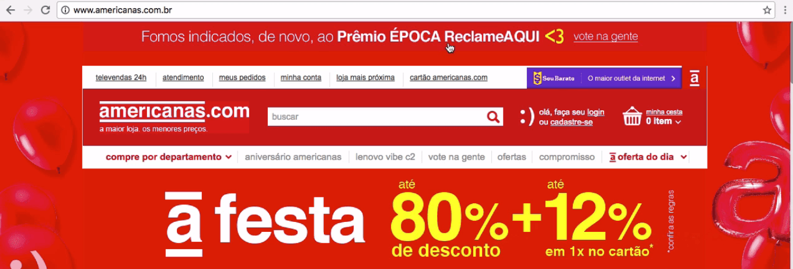

 

Preocupe-se em deixar o seu design mais **simples**.

Outra heurística que foi difícil de simular no aplicativo foi a **Flexibilidade de Atalhos**.

 

 

Um exemplo é a opção de darmos *play* em um vídeo do Youtube de duas formas: clicando no ícone da barra inferior ou no video.

 

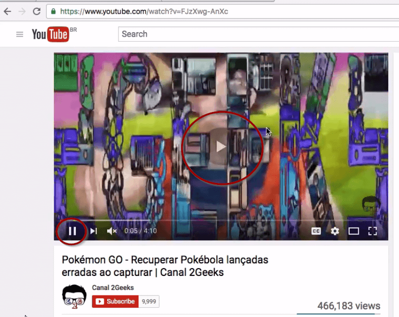

 

Além disso, o Youtube deu a opção para iniciarmos o vídeo com a barra de espaço e pausá-lo clicando em qualquer lugar do vídeo ou usando a tecla **k**.

> Existem outras opções de atalho no Youtube: com a tecla **j** você retrocede o vídeo de 10 em 10 segundos, enquanto com a **m**, você consegue ativar o mute..

Um outro exemplo de flexibilidade de atalho é no site 9gag, que nos permite descer de post em post com o atalho da tecla **j**.

Estas opções são um bônus para os seus usuários que interagem com o seu aplicativo há muito tempo. Como é o caso do comando "Control + S", usado em diversas ferramentas e que agiliza o processo de salvamento de um arquivo.

 

## Resumo

Vamos fazer um resumo da aula: vimos as quatro heurísticas que faltavam se explicadas.

Primeiramente, falamos sobre a **Memória limitada** do usuário e que devemos levar isto sempre em conta quando pensarmos nas telas do nosso aplicativo. Lembre-se de não sobrecarregá-lo, adicione um breadcrumb, encontre uma forma de avisar visualmente em que passo os eu usuário está.

Discutimos a heurística relacionada sobre **Ajuda**. Se o seu aplicativo não é suficientemente intuitivo para o usuário, disponibilize algum material de apoio ou uma documentação que o ajude na navegação. Uma opção é a adoção de um FAC, uma help screen ou um tutorial guiado.

Outro ponto trabalhado foi a ideia de estética e design minimalista, que eu gosto de chamar de **Menos é mais**. Quanto menos informações irrelevantes estiverem acessíveis para o usuário, mais foco este terá no que é relevante.

Comentamos também sobre a **Flexibilidade/atalhos**. Busque oferecer formas alternativas de usar as funcionalidades que funcionem como um bônus para os usuários antigos do seu aplicativo. O Youtube oferece isso e ajuda a quem interage bastante com a página.

 

## [Exercício] Qual era a música?

Algo muito comum hoje em dia é o recurso autocomplete, presente em e-commerces e em buscadores, como a Americanas e o Google, respectivamente.

Quando não lembramos de todo o verso de uma música e digitamos no Google, conforme digitamos, ele sugere termos para pesquisarmos, mesmo sem o trecho da música inteira!

Em quais heurísticas que podemos encaixar o *autocomplete*?

- [x] A ) Prevenção de erros  
    Por conta do auto-correct também presente no *autocomplete*

- [x] B ) Feedback  
    Conforme digito, o texto digitado fica em negrito e a lista vai mudando

- [ ] C ) Linguagem do usuário  
    Não casa muito com o exemplo dado anteriormente.

- [x] D ) Memória limitada  
    Ou "reconhecimento em vez de memorização".

A memória do usuário é limitada, se não lembro a música, o Google me ajuda a lembrar, mesmo digitando algo errado.

 

## [Nota] Breadcrumb

O componente conhecido como breadcrumb (migalha de pão, referenciando a história de João e Maria) é muito utilizado em e-commerces e em grandes formulários em geral.

Pensando-se na heurística sobre a memória limitada do usuário, o breadcrumb é um ótimo recurso de UI (user interface) para deixar claro para seu usuário em que ponto ele está, de onde ele veio, e até onde ele pode ir.

Algo como o presente, passado e futuro da jornada do seu usuário.

Alguns exemplos de breadcrumb:

 

 

 

 

 

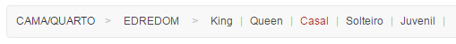

 

 

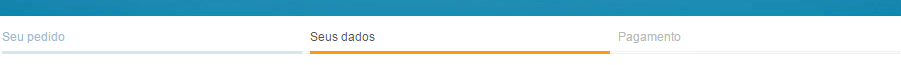

 

 

## [Exercício] Mais rápido

Depois de virar um expert no Visual Studio ou no Photoshop, saber de cabeça onde ficam a maioria das opções do menu, a tendência é que busquemos formas de agilizar o acesso a essas opções.

Qual das heurísticas de Nielsen trata esse assunto?

- [x] Flexibilidade
- [ ] Boas mensagens de erro
- [ ] Liberdade para o usuário
- [ ] Consistência/padrões
- [ ] Linguagem do usuário

Pode parecer óbvio que um sistema deve possuir atalhos a fim de agilizar o trabalho do usuário, mas comece a reparar que não é em todos os lugares que os encontramos.

Programas que possuem atalhos, podemos citar o Adobe Photoshop, possuem atalhos para todas as ferramentas de sua [vasta caixa de ferramentas](https://www.google.com.br/search?espv=2&biw=824&bih=893&tbm=isch&sa=1&q=photoshop+toolbox+cc&oq=photoshop+toolbox+cc&gs_l=img.3..0i8i30k1.2724.4353.0.4453.5.4.1.0.0.0.119.391.3j1.4.0....0...1c.1.64.img..0.5.390...0i19k1j0i30i19k1j0i5i30i19k1j0i8i30i19k1.vIf0DGziEdk). 

Tornar o uso mais eficiente, não importa se somos iniciantes ou experts, é disso que se trata essa heurística.