

# Facilitar o uso (Fitts, Hick, Thumb Zone)

 

## Lei de Fitts

Vamos continuar vendo coisas bacanas sobre usabilidade?

Imagine que eu quero ir para Suiça, no dia 23 de outubro de 2017 e adicionei estes dados na tela do "vai pra onde?".

 

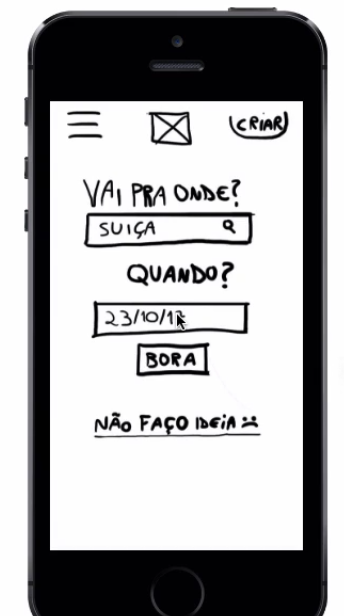

 

O próximo passo será clicar no botão de "Bora". Depois, seremos levado para a tela que informa quantos grupos foram encontrados.

 

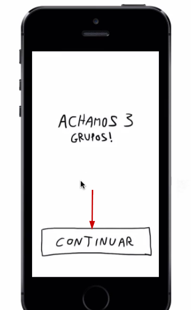

 

Neste caso a seta do mouse indicará onde eu clique com meu dedo na tela anterior, com o próximo passo eu terei que deslocar meu dedo até o "continuar". Pensando me facilitar a vida do usuário, seria mais interessante se o botão de continuar estivesse próximo do local onde clicamos na tela anterior, ou seja, mais acima.

 

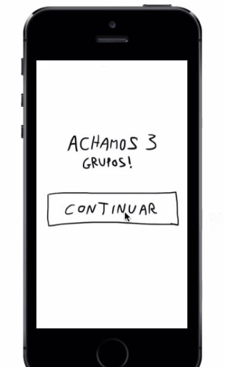

 

Existe uma fórmula matemática que pensa no tempo e no movimento gasto pelo usuário. Vamos ver um artigo da [Wikipedia](https://pt.wikipedia.org/wiki/Lei_de_Fitts) :

 

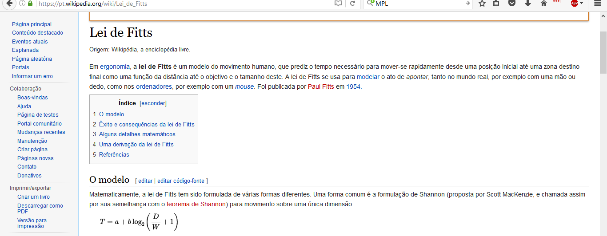

 

A lei de Fitts tenta predizer o tempo que levaremos para chegar de um ponto até o alvo que queremos acertar. Mas será que sempre que vamos fazer uma interface, usamos estes cálculos? Não. Mas ele foi utilizado para mostrar como funciona o clique do usuário.

 

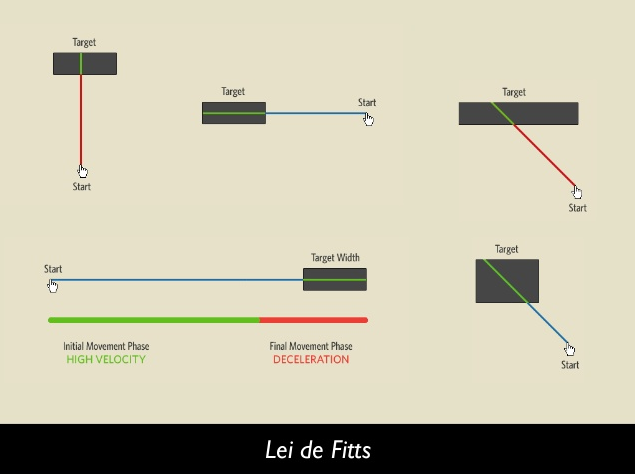

 

Vemos que em alguns casos, o usuário terá uma área de clique mais "confortável" e que exigirá menos esforços. Na imagem abaixo veremos com mais clareza a distancia entre o botão "Bora" e "Continuar".

Fiz uma pequena estimativa de quanto tempo podemos gastar para usar um player de música. Como a área de clique do botão de play é maior do que o ajuste do volume, o usuário gastará mais tempo com o segundo.

 

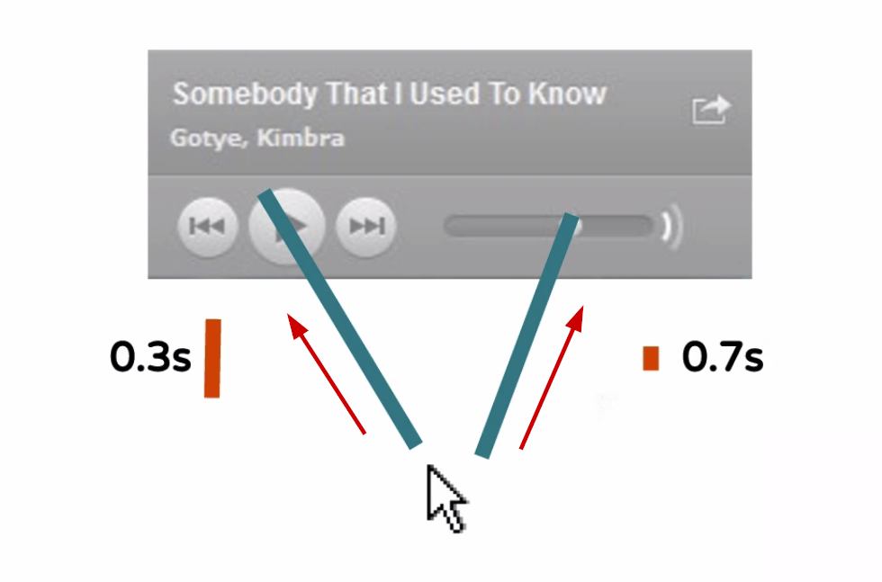

 

Outro exemplo é quando abrimos um menu e as opções mais utilizadas se encontram na parte superior da lista.

 

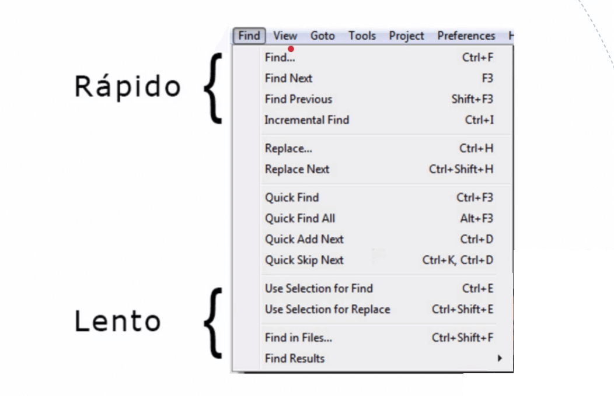

 

Podemos perceber isto claramente em ferramentas como o Photoshop que as opções mais usadas ficam na parte de cima, porque é mais fácil e rápido para acertá-las. Continuando com a ideia de que alvos pequenos são mais difíceis de acertar, é interessante aumentar a área clicável.

 

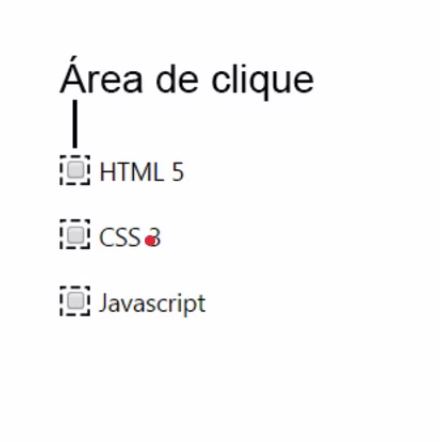

 

Vemos um *checkbox*. Minha recomendação é que a área de clique não seja apenas o input, mas tornar toda a label clicável.

 

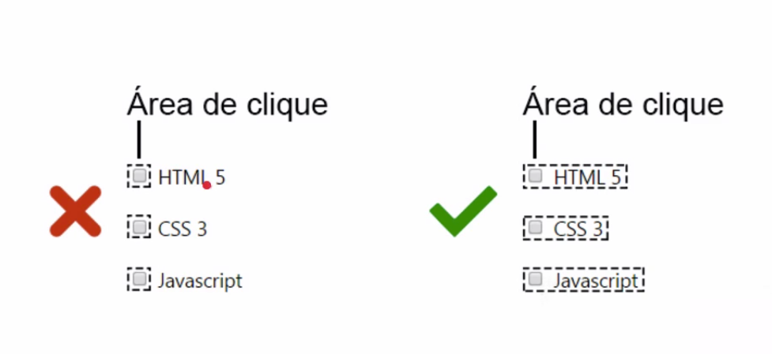

 

Como dissemos anteriormente, se a área de clique é maior, fica mais fácil para o usuário acertar o alvo. Leve isto em consideração sempre que estiver projetando suas interfaces.

 

## Sobre Hicks

Vamos ver outra característica interessante da usabilidade. Clicamos na primeira opção do menu que nos leva para as opções de hotéis disponíveis.

 

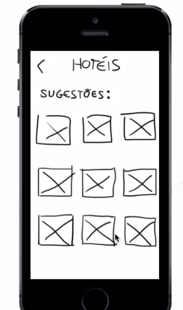

 

Temos nove sugestões de hotéis e o usuário pode levar muito tempo escolher em qual quer se hospedar. Seria melhor se apresentasse menos sugestões:

 

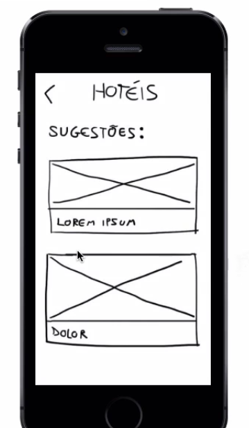

 

Observe que isso permite até adicionar uma imagem e um texto de apresentação do hotel. A relação de tempo e número de opções é bastante útil quando pensamos em usabilidade. Pensando no mundo offline, qual dos controles abaixo você iria preferir usar.

 

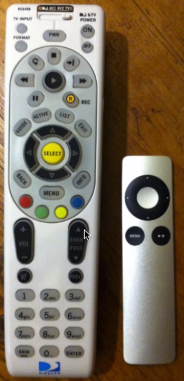

 

O usuário até poderia ficar em dúvida sobre qual as funcionalidades dos botões do controle da direita, mas observe que a quantidade de opções é menor do que o da esquerda. O tempo que levaremos para escolher uma das opções do controle com menos botões, será menor. Esta relação entre o número de opções e o tempo gasto é tratada pela **lei de Hicks**.

 

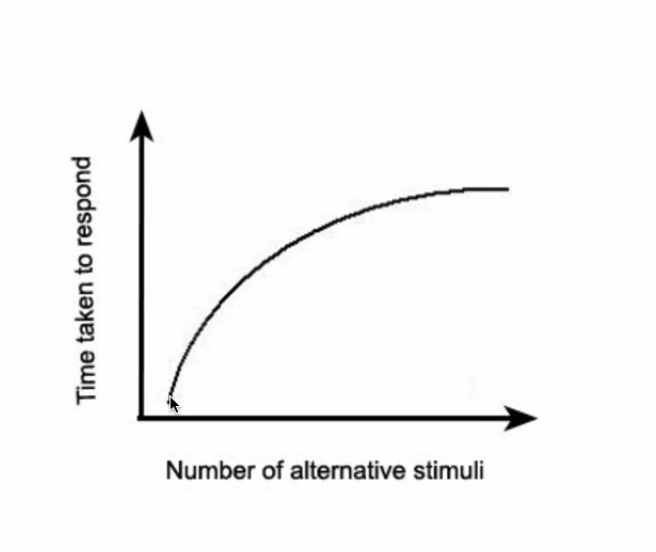

 

Foi feito uma pesquisa que quanto mais opções um usuário tiver, mais tempo ele levará para escolher. O mesmo acontece com um menu de restaurante, quanto maior o número de pratos disponíveis no cardápio, maior será o tempo de escolha do cliente.

Revise o seu Crazy Eights ou o seu aplicativo e veja se você não bombardeou o usuário como muitas opções. Isto entra dentro de uma das heurísticas que falamos anteriormente que fala sobre o design minimalista.

 

## Thumb zone

Vimos anteriormente as leis de Fitts e de Hicks. Levando em consideração estes conceitos, vamos pensar em como será a interação com o menu hambúrguer que usamos de forma bem recorrente.

 

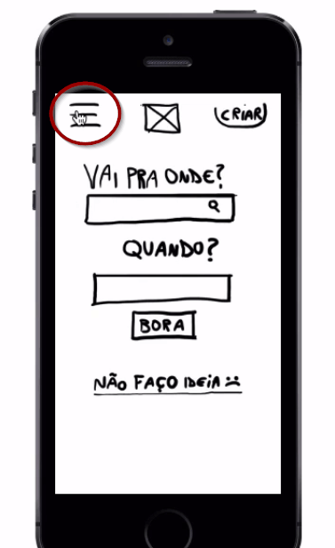

 

Se o usuário tiver uma mão pequena, para chegar no canto superior da tela, será preciso "esticar" o dedo ou até "escalar" o celular para alcançar o botão do menu. E se facilitassemos o acesso?

 

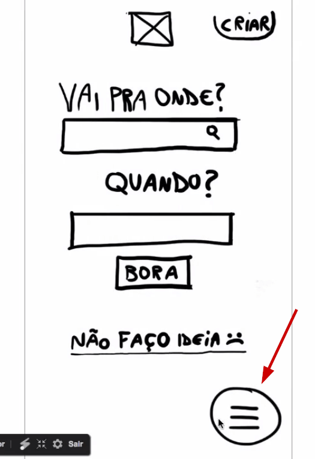

 

Se o botão do menu será usado com frequência, podemos aumentar a rapidez do clique colocando ícone de hambúrguer na parte de baixo.

Temos uma imagem que demonstra quais são as zonas mais e menos clicáveis:

 

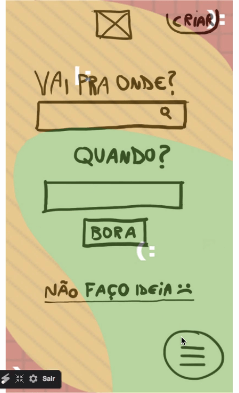

 

A região verde é a parte mais fácil de ser acessada. Com o seu polegar é simples acessar toda essa região e interagir com os elementos visuais da tela. Quando chegamos na região amarela, a interação começa a ficar mais complicada. Já as partes em vermelhas ficam bem inacessíveis.

Temos dois exemplos em que os estes conceitos foram aplicados:

O primeiro é do Material Design, que segue os padrões de interface do Google e o segundo, é o site da Alura. Observe que temos o botão no canto inferior da direita, justamente porque ele será bastante utilizado e por isso, deve estar mais disponível.

 

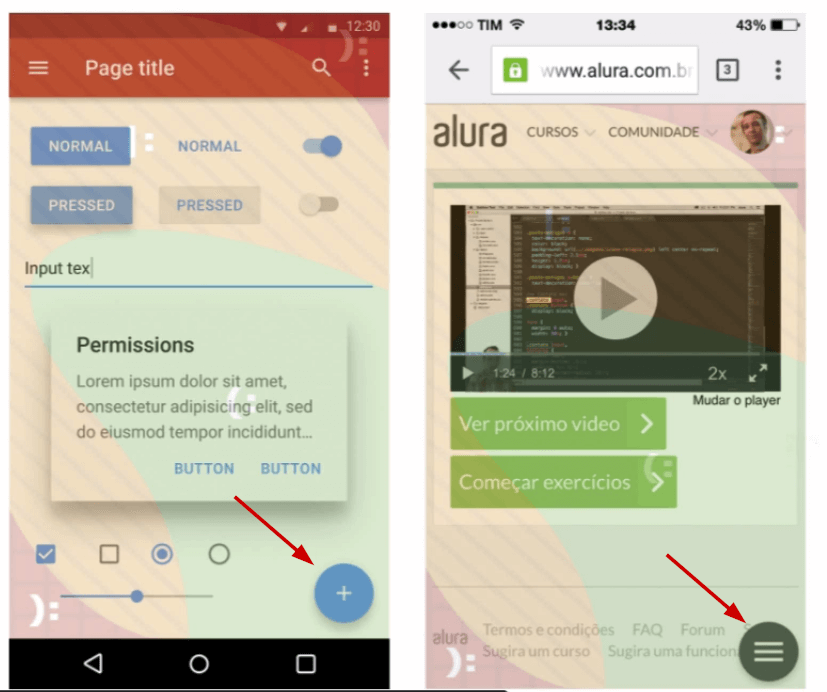

 

Foi pensando na Thumb zone que a Alura também colocou o menu na parte de baixo. Mas precisamos de um menu hambúrguer realmente?

O Facebook disponibiliza todas as ações já visíveis no menu de baixo, usando um componente de abas.

 

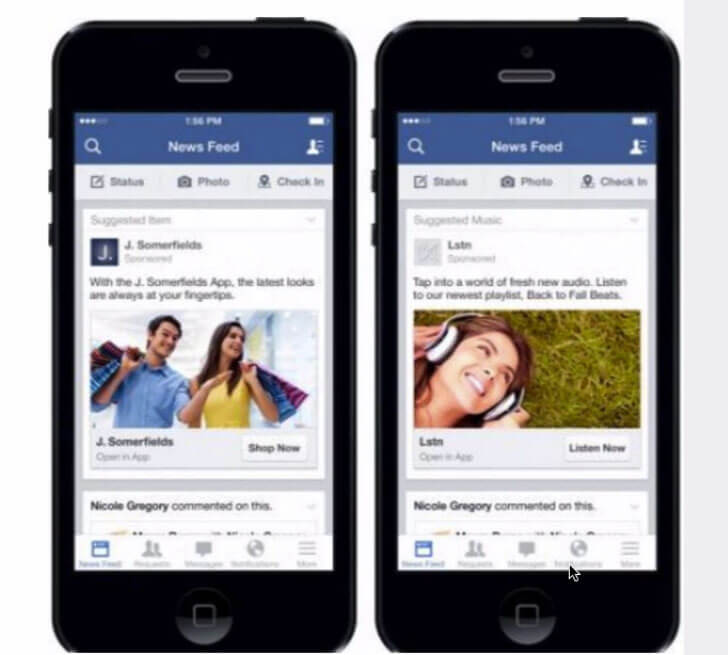

 

Observe que o Facebook também se preocupou em deixar o menu na parte mais confortável para o usuário. É mais fácil para um usuário acessar o menu usando apenas um polegar do que precisar ter que se mover até um ícone na parte de cima.

Então, sempre que for criar o seu aplicativo, trabalhe com a ideia de Thumb Zone.

 

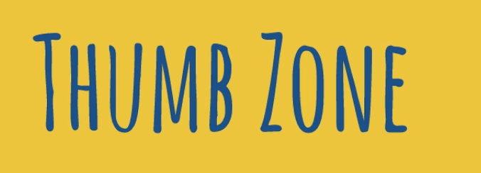

 

É possível encontrar vários templates na internet:

 

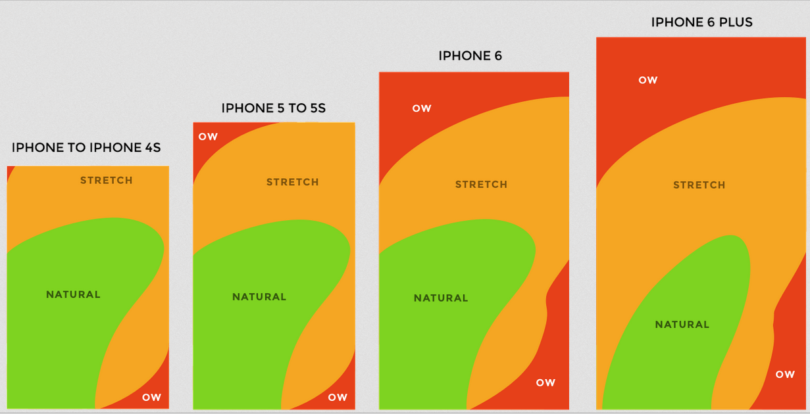

 

Você pode sobrepor os templates sobre as telas dos seus aplicativos.

Lembre-se que boa parte dos usuários interage usando apenas uma mão e o dedo mais ativo é o polegar.

Outro ponto interessante é que quando os usuários de aparelhos IPhones mais recentes dão dois toques no botão Home, toda a interface desce na tela ficando mais acessível para o polegar.

 

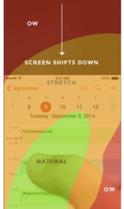

 

A Apple se preocupou com o tamanho dos celulares e começou a pensar como os usuários iriam interagir com o novo formato.

O Android fez algo parecido... quando o usuário ativa um atalho, toda a interface fica pequena e se move para um dos lados do celular.

Leve em consideração os conceitos que vimos na aula e veja se faz sentido o posicionamento dos elementos visuais do seu aplicativo.

 

## Microinteractions

Movemos o menu hambúrguer para o canto direito da tela, mas quando vamos para a tela com as opções, o usuário novamente precisa fazer um grande deslocamento para pode clicar no itens.

A intereação também está muito formal, clicamos em algo, vamos para outra tela... Vamos encontar uma forma de deixar o nosso aplicativo mais dinâmico e adequá-lo melhor à lei de Fitts. Para puxar mais a atenção para o canto direito inferior, vamos criar um nova forma de dispôr as opções do menu.

 

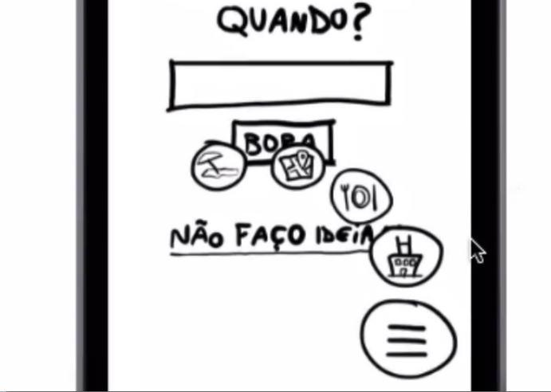

 

Aparecerá um animação simples, e que irá disponibilizar os ícones em formato de leque. Agora, a atenção do usuário ficará focada na parte de baixo.

 

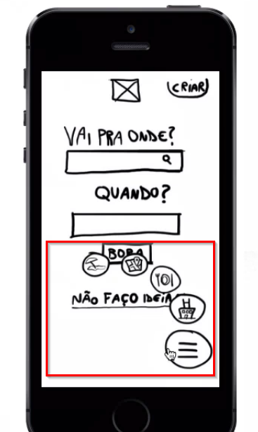

 

Essa ideia de facilitarmos a vida do usuário é a base da Usabilidade. A ação de chamar a atenção do usuário para algum ponto em específico é o que chamamos de **Microinteractions** (ou traduzido para o português, **microinterações)**.

 

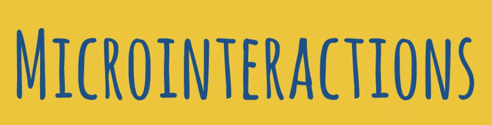

 

Como você sabe se o seu celular está no modo de vibração? Você aperta o botão e o celular vibra para confirmar que o modo está ligado. Esta ação usa a ideia de microinteração. O criador do termo foi Dan Saffer, autor do livro "Microinteractions" em que ele apresenta uma forma de guia de microinterações.

O primeiro passo será pensar no gatilho da microinteração. O que ativa o menu hamburguer mais tradicional? O usuário pode clicar no botão ou pode deslizar a tela para as opções.

Nós entendemos que clicar foi o gatilho, mas o que vai acontecer depois dessa ação? Teremos uma opacidade da tela ou os ícones serão disponibilizados em forma de leque? é importante definirmos as regras, ou seja, pensarmos no que vai acontecer e quando vai acontecer.

 

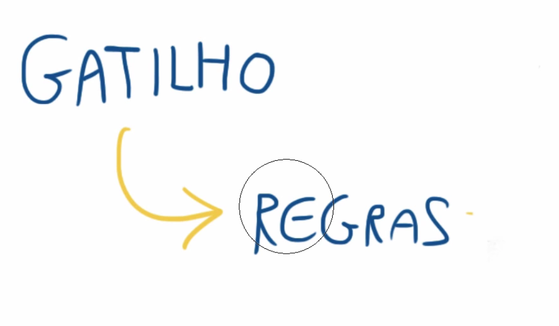

 

Não estamos falando para você adicionar animações, simplesmente porque ficará mais divertido para o usuário. Não é o meu objetivo. Já presenciei alguns casos em que os menus tinham uma animação em situações em que eu preferia a informação disponibilizada mais rapidamente. Cuidado para não irritar o usuário com o excesso de animações! Nos vamos usá-la no nosso app para chamar a atenção para um ponto específico e tentar dar mais dinamismo.

E quando fazemos uma microinteração, ela precisa dar algum feedback, seja visual ou sonoro. Isto entra no que falamos na heurística em que o usuário precisa ser informado sobre o que está acontecendo. Para indicar como fazer retornar o menu de leque, podemos adicionar ícone de "x" e o usuário teria a ideia de como fechá-lo. Então, outro ponto é você pensar em como dar o feedback para quem utiliza a aplicação.

 

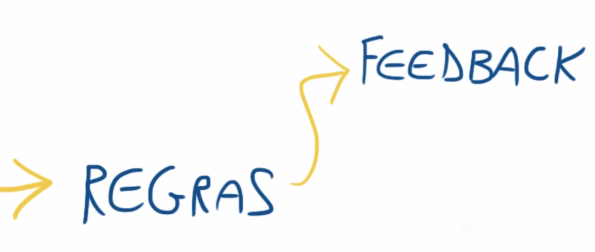

 

Quando o vídeo está carregando no Youtube, visualizamos um spinner girando que nos dá um feedback que de algo está acontecendo. E se demora muito para carregar, visualizamos uma mensagem de erro que nos oferece alguma solução ou nos diz o que pode estar acontecendo. Estamos falando dos **loops** e **modes** que nos dão a ideia de mudança com a microinteração.

 

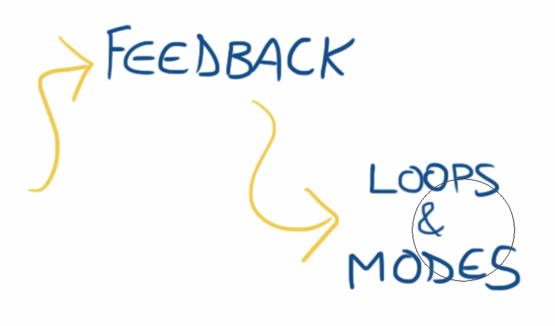

 

*Modes* se refere as pequenas interações - mas que não necessariamente acontecerão.

 

## Exemplos de microinteractions

Veremos alguns exemplos de microinterações e em seguida, faremos um resumo da aula.

Um exemplo que eu gosto é do Deezer. Ele é um serviço de música semelhante ao Spotify e dependendo da música, você pode acompanhar a letra da canção. Antes que a letra seja carregada por completo, vemos um snipper que nos informa a evolução do carregamento.

 

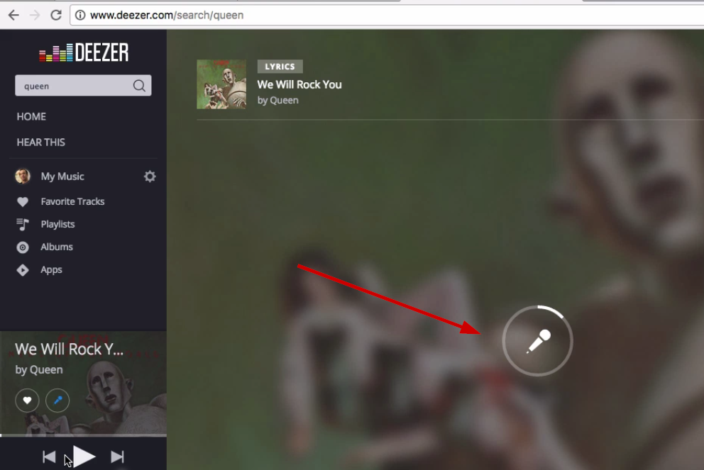

 

Às vezes o usuário não sabe quando a música começará, então, eles resolveram com esta microinteração. O gatilho é começo da canção, assim como o momento em que a pessoa clica no ícone do microfone que dispara as letras.

 

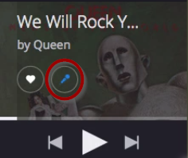

 

Se utilizarmos a mesma ideia para introduzirmos uma música em outro site, nós conseguiremos entender o que está acontecendo.

Outra exemplo ótimo de microinterações é o *pull-to-refresh*. Em vez do Twitter incluir um ícone para atualização, eles solucionaram a questão fazendo com que o usuário arrastasse a página para baixo para recarregá-la.

 

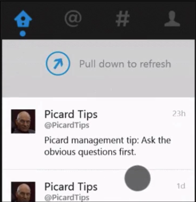

 

Em outro exemplo, adicionaram uma animação com um ônibus que se movimenta à medida que a página é recarregada.

 

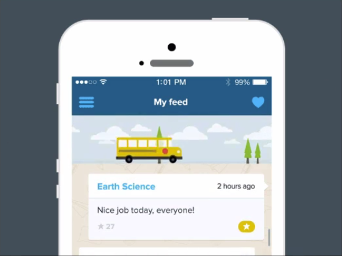

 

Esse padrão de microintereação durante o momento do recarregamento ficou tão conhecido que a Apple também adicionou em suas interfaces, como vemos que acontece no Safari.

 

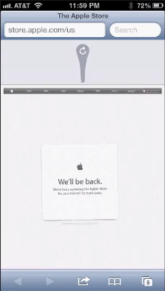

 

Essa é uma feature interessante, mas pode não ser tão intuitiva para o seu usuário, sendo interessante fazer uma demonstração inicial.

Vamos ver o caso da Casa do Código, após selecionarmos um produto e seguirmos para o carrinho, ele nos indicara a quantidade de produtos que iremos comprar:

 

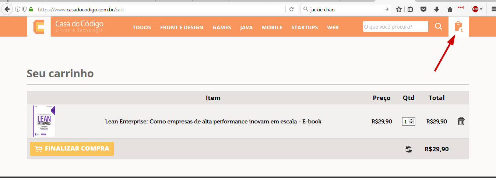

Este é um detalhe usado com frequência atualmente, mas que faz muita diferença. Lembrando que microinterações não necessariamente se refere a microanimações.

Quando indicamos para o usuário quantos produtos ele tem no carrinho, não dependemos da memória do mesmo - o que também entra nas heurísticas de Nielsen. Microinterações acontecem também sem que o usuário perceba.

 

## Resumo

 

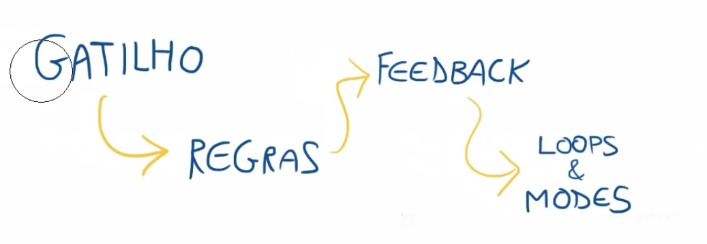

 

Toda microinteração precisa se preocupar com o inicio, ou seja, o **gatilho**. "Será com um single touch em um determinado botão ou será com um swipe?"

Já nas **regras** pensamos em exatamente o que acontecerá na microinteração, será uma animação ou outra informação na tela. Vimos também que o usuário precisa saber o que está acontecendo durante uma ação, podemos fazer isso por meio de um **feedback**. Não faça uma microinteração apenas pelo valor estético, ela tem a responsabilidade de informar.

E discutimos a parte de **loops** e **modes**. Trata-se de onde poderá ser interrompida a microinteração e se de fato ela precisar ser interrompida, por quanto tempo?

 

## [Exercício] Escolhendo rápido

Você foi encarregado, como UX Designer, de diminuir o tempo que os usuários de um aplicativo ficam escolhendo filtros para suas fotos.

Qual dos temas vistos em aula (relacionado a quantidade de opções) pode te ajudar nisso?

- [ ] A ) Micro interação  
    animação/feedback que guia o usuário

- [x] B ) Lei de Hick  
    +alternativas = +tempo

- [ ] C ) Thumb zone  
    áreas da tela confortáveis, ou não, para o toque

- [ ] D ) Lei de Fitts  
    +longe e pequeno = +tempo

Pensar na **Lei de Hick** é uma excelente forma de tentar diminuir o tempo que o usuário leva para tomar uma decisão baseada em opções.

A ideia é que quanto menos opções são apresentadas para ele, menos tempo ele levará para escolher uma delas.

 

## [Nota] Qual gravata escolher?

O e-commerce de gravatas [Skinny Ties](https://skinnyties.com/) mostra diversas categorias de gravatas em sua vitrine:

 

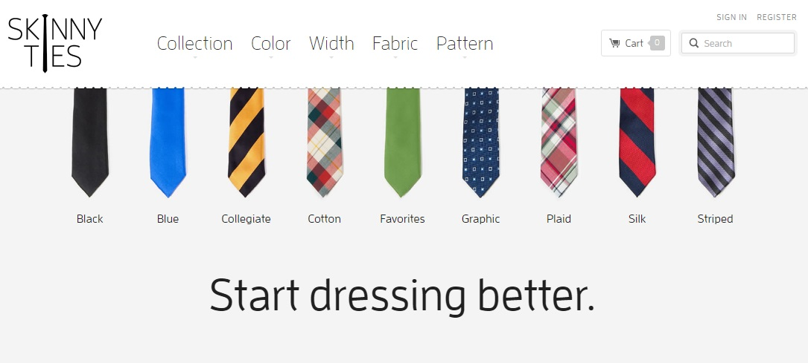

 

Com a **Lei de Hick** em mente, com o objetivo de diminuir o tempo que o usuário escolhe uma das opções, poderíamos simplesmente diminuí-las:

 

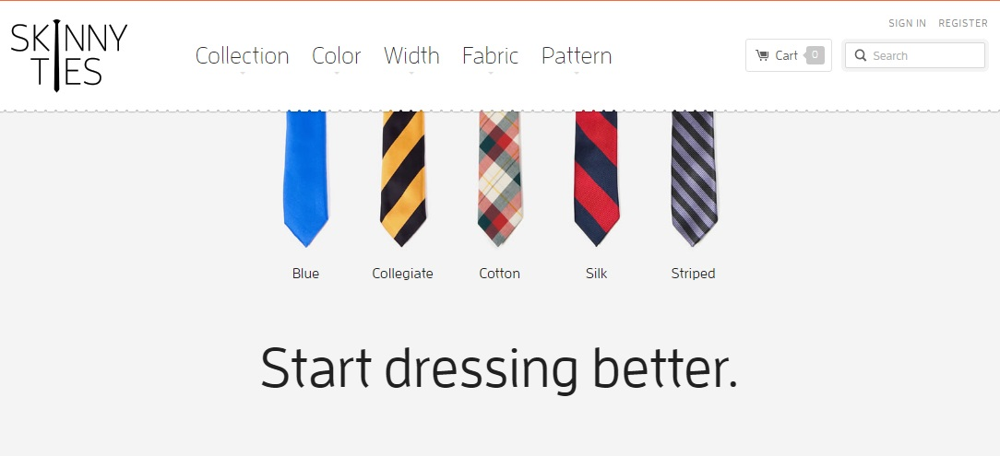

 

Treine seu olhar em sites e aplicações que já conhece, para melhor fixar a ideia da Lei de Hick.

 

## [Exercício] A até B

*O tempo para mover-se de um ponto A até um ponto final (B) possui relação com o tamanho e a distância do alvo.*

A frase acima é relacionada a qual tema visto em aula?

- [ ] A ) Lei de Hick
    +alternativas = +tempo

- [x] B ) Lei de Fitts
    +longe e pequeno = +tempo

- [ ] C ) Thumb zone
    áreas da tela confortáveis, ou não, para o toque

- [ ] D ) Micro interação
    animação/feedback que guia o usuário

Paul Fitts, inventor da Lei de Fitts, não a criou baseado em suposições, e sim ciência. Há uma fórmula matemática que pode ser encontrada na Wikipédia.

Na prática, é bem improvável que você use a equação e vá mais de *feeling* nessa questão, se preocupando mais com as consequências da Lei.

 

## Pensando na ergonomia

Pensando em **Thumb zone**, ou seja, as áreas em que o polegar consegue alcançar naturalmente e as áreas que ficam um pouco dificeis, como você melhoraria a interface abaixo?

 

 

- [x] A ) Abas com as funcionalidades mais usadas 
    Tudo disponível de maneira rápida e fácil do polegar do usuário

- [ ] B ) Menu na parte de baixo 
    Por convenção, cabeçalhos ficam na parte superior

- [ ] C ) Burguer icon no cabeçalho 
    A ideia de por o burguer icon na parte inferior é justamente facilitar o acesso

- [ ] D ) Logo na parte de baixo 
    Voltar para a home pode não ser algo que o usuário faça com frequência

Diversas soluções podem ser pensadas para melhorar a tela apresentada, mas focando em thumb zone, poderíamos usar o recurso de abas.

Uma proposta de solução que resolve isso:

 

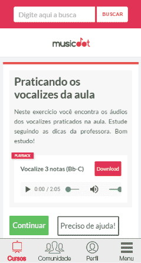

 

 

## [Nota] Foco e diferencial

A fim de deixar o fluxo de navegação mais diferenciado e único, com relação a outros aplicativos, podemos usar o recurso de microinteractions.

 

 

+ **Gatilho**: como que a microinteração se iniciará
+ **Regras**: o que deve acontecer
+ **Feedback**: qual feedback se apresentará, de acordo com as regras
+ **Loop**: como e em que ponto a microinteração se repetirá
+ **Modes**: modos diferentes da microinteração por variação do gatilho

[[Post] Enriquecendo seus sistemas com Microinteractions](https://blog.caelum.com.br/enriquecendo-seus-sistemas-com-microinteractions/)

Abra os aplicativos que você mais usa e repare nas microinterações presentes neles. E quando for fazer essas interações **seja ponderado no uso de animações para não acabar distraindo o usuário.**