

# Dicas Finais

 

## Affordance call to action

Vamos ver alguns conceitos de Usabilidade.

No site da consultoria [Indra](https://www.indracompany.com/pt-br/), o criar da página gostaria que o usuário fizesse quando pensou no seguinte projeto:

 

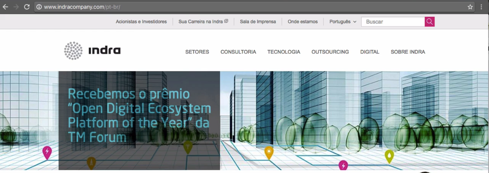

 

Temos um banner grande no início da página, que não tem uma utilidade explícita. Faltou um texto ou elemento visual que nos convidasse a clicar na imagem. Um texto que diga "venha conhecer", um link "clique aqui" ou um botão, algo que indique ao usuário o que ele precisa fazer aqui. No caso, o usuário vê apenas uma vitrine e não interage. O uso de um elemento visual que nos indique o que fazer é o que chamamos de **Affordance**. Trata-se da propriedade que um objeto, ou de um ambiente, de indicar qual é a sua utilidade e permite que um indivíduo realize uma ação.

Por exemplo, uma maçaneta de porta carro, ao observá-la você compreende o que precisa ser feito. Por exemplo, o site do Musicdot sugere que você faça a sua matrícula com um botão e o texto "matricule-se".

A Booking fez um teste sobre qual ícone de menu resultaria em mais engajamento:

 

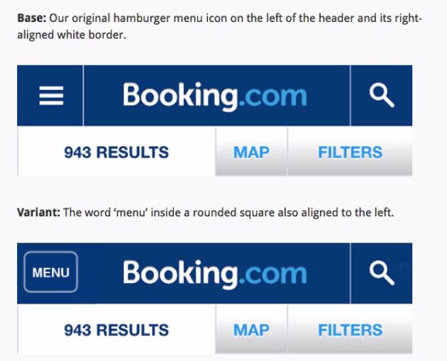

 

A variação continha um botão com borda e o texto "menu" e deixava bem claro qual era usa utilidade. Porém, o resultado do teste foi que para os usuários da empresa era irrelevante qual das opções era utilizada. Isto demonstra que não existe uma fórmula e que todo botão precise ter uma borda. É interessante que você conheça os conceitos, mas realize os testes. Isto também não significa que os resultados alcançados na Booking serão os mesmos com o seu site.

E o que o site do Musicdot espera que o usuário faça? Ele quer que o aluno se matricule. Existe um tentativa de guiar o usuário.

 

 

Esse conceito de **chamar** o usuário para fazer algo chamamos de *call to action*. O que a seguinte página do Deezer nos propõe fazer?

 

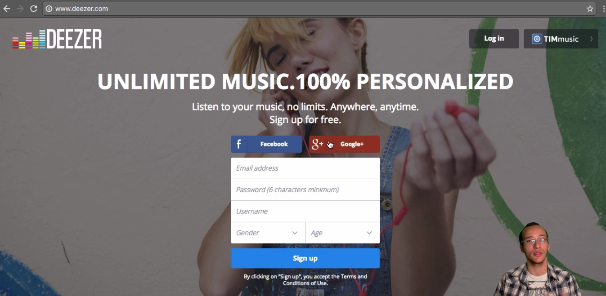

 

Ele quer que o usuário faça o login.

Mas "call to action" não é apenas um botão colorido e destacado, pode ser também um formulário (preferencialmente, pequeno) e que também ganhe relevância na disposição da página. Na página da Kindle, encontraremos outro exemplo:

 

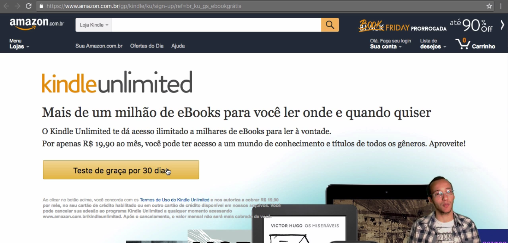

 

O site nos convida a fazer um teste gratuito por um mês. Podemos ver outro exemplo na plataforma da Alura:

 

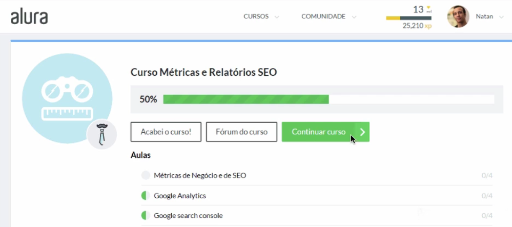

 

Ela destaca o botão de "continuar curso" e reforça a ideia com o uso da setinha.

E-commerces ou sites que vendem algum produto costumam usar esse recurso para incentivar o usuário a comprar e qualquer tipo de dúvida que o cliente tenha, por exemplo, onde clicar para adicionar o produto ao carrinho, poderá atrapalhar a taxa de conversão.

 

## Microtexto

Você já deve ter percebido que temos que nos preocupar com muitos pontos sobre a interface, quando pensamos em Usabilidade e queremos facilitar a experiência do usuário.

Vamos analisar o site do [Airbnb](https://www.airbnb.com.br/).

 

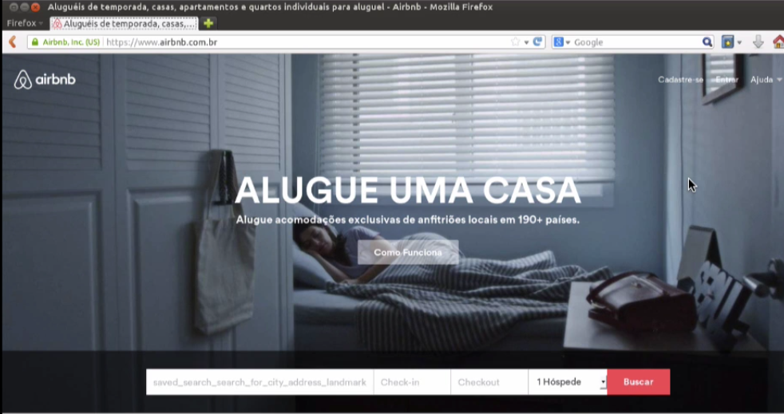

 

Veja que o texto diz "Alugue uma casa", mas se quisermos alugar um apartamento teremos que ir para outro site? O texto ainda tem um tom imperativo "mandando" o usuário alugar uma casa. Como poderíamos humanizar a frase? Se substituíssemos o texto pela frase **Sinta-se em casa**", a frase seria mais acolhedora. A ideia é pensar nos pequenos textos que fazem muita diferença no contexto geral e que chamamos de **microtexto**.

Um botão de "Registre-se" em um site de e-commerce causa pouco engajamento, porque os seus usuários não queriam criar um vínculo com a empresa.

 

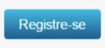

 

A empresa teve que encontrar uma forma de seguir com o processo de registro, sem que o usuário ficasse com a ideia de estar se comprometendo...

 

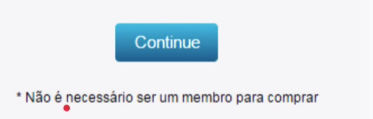

 

Eles trocaram o "Registre-se" pelo "Continue" e ainda, adicionaram a frase "Não é necessário ser um membro para comprar". Com essa mudança, ele aumentaram a taxa de conversão em **45%**. Microtexto trabalha com a ideia de trabalhar com esses pequenos textos que podem interferir na experiência do usuário.

Outro exemplo relacionado é quando encontramos no rodapé de alguns formulários em que precisamos fornecer o nosso e-mail, a seguinte frase:"Relaxa! Não enviaremos spam para o seu e-mail". Novamente, ele tocará as esferas emocionais do usuário e ao mesmo tempo, tranquiliza a pessoa.

Outro exemplo é o [Tumblr](https://www.tumblr.com/).

 

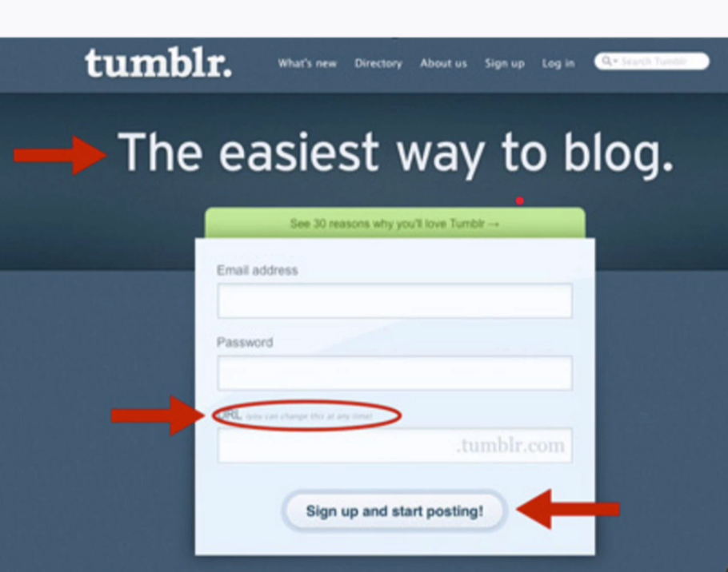

 

Veja como ele utiliza os microtexto: "O jeito mais fácil de blogar". Porém, a equipe do Tumblr começaram a observar que os usuários durante o cadastro demoravam muito no campo da URL, porque precisavam escolher um nome para blog e este pode ser um processo demorado. Por isso, decidiram adicionar uma frase entre parênteses "relaxa, você vai poder alterar isso". No fim, vemos a mensagem: "Registre-se e comece a postar". Com esses ajustes, eles conseguiram diminuir o tempo que o usuário gastava com essa tela.

Vamos ver o exemplo do site **Fueleconomy**.

 

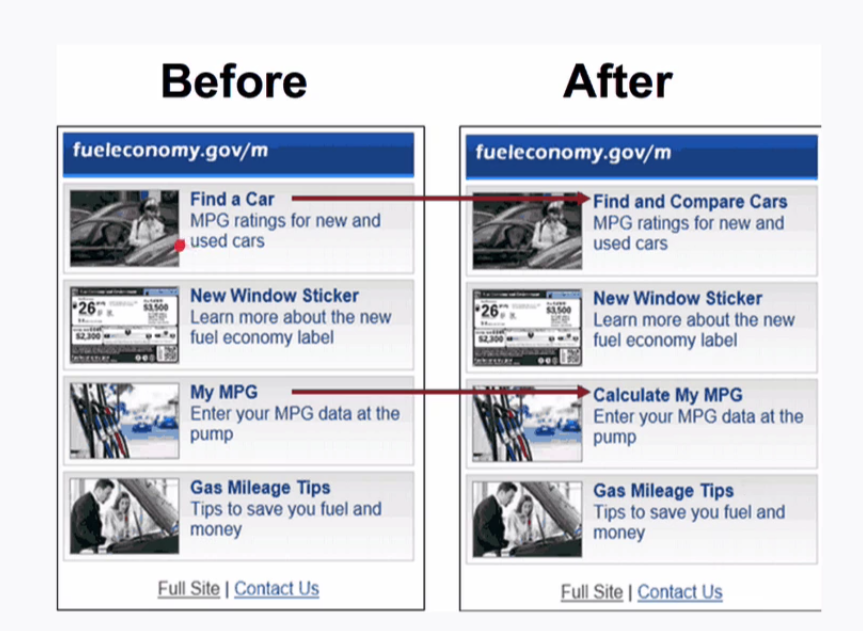

 

Ele fizeram alterações como podemos ver no **antes e depois**: Onde estava escrito "encontrar um carro", ele mudaram para "encontrar e comparar um carro".

 

## Campo de busca

Desafio você a encontrar em dois segundos a busca da seguinte página:

 

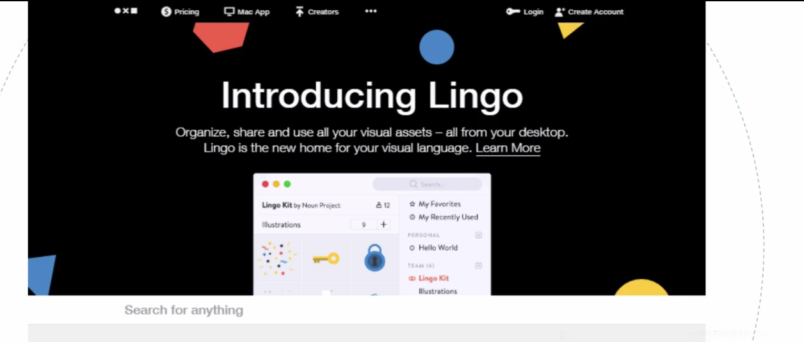

 

Este o site do Noun Project, um site para baixar ícones.

Se você ainda está procurando o campo de busca, ele está aqui:

 

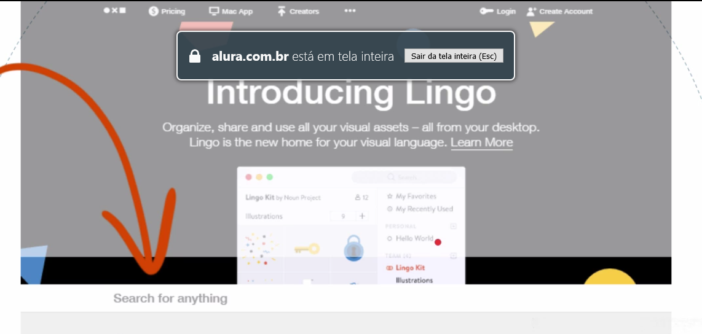

 

Ele está um pouco estranho... A maioria dos usuários está acostumado a encontrar o campo de busca no canto superior direito. Como é um padrão, criamos um modelo mental em que achamos certo que a busca esteja na parte superior.

Teremos dificuldade também para encontrar o campo de busca no site da Apple, porque ele **não** existe.

 

 

Não é interessante para ele ter uma busca já na página inicial, por isso, ele adicionaram dentro do menu. Essa decisão foi tomada após vários testes até se constatar que o usuário não precisa de um campo de busca. Já no caso da página do Google, a busca é a ferramenta fundamental, então o campo tem bastante destaque na página.

E na página da Steam, onde está o campo de busca?

 

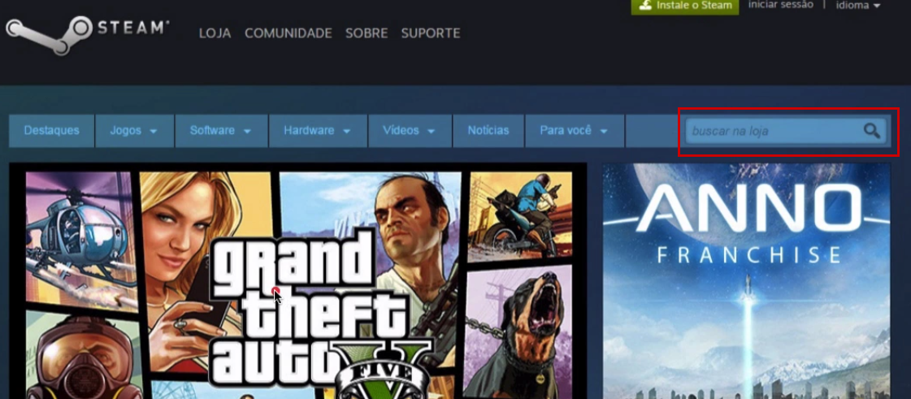

 

Está no canto direito, mas seria possível dar mais destaque para o campo. Aumentaríamos contraste com o restante do menu.

Veremos um exemplo de e-commerce:

 

 

Observe que o campo de busca da Netshow ocupa bastante espaço do cabeçalho e talvez, não fosse necessário par ao usuário ter tanto espaço para digitar. Mas tem estudos que dizem que ele se sentirá mais confortável para realizar uma busca se o campo for bastante espaçoso. Se o campo for pequeno, talvez ele se sinta mais inibido ou pelo menos desmotivado a digitar um termo extenso. Como administrador, eu tenho interesse de saber o que os usuários estão buscando no site - o Google Analytics é uma ótima ferramenta para isso.

Um exemplo de um ste que soube destacar o cambo de busca com o contraste de cor é o site da Intel.

 

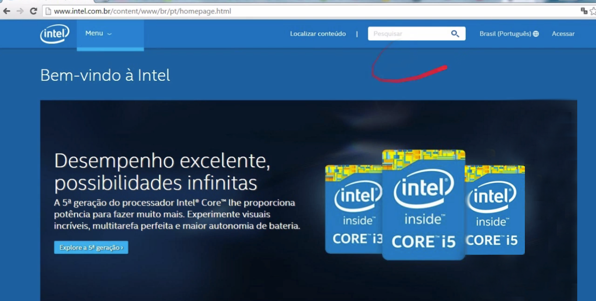

 

É bem fácil de identificarmos a busca na página.

No site da NNg da consultoria de Nielsen, veja como é colocado o campo de busca.

 

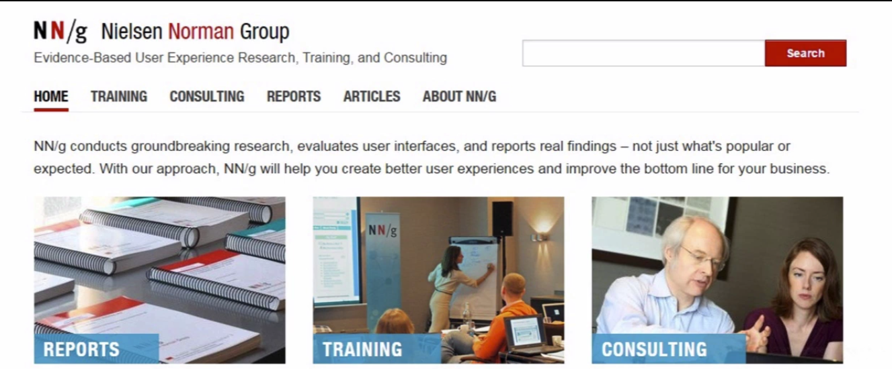

 

O design é bastante simples: apenas um campo em branco e o botão com o texto "Search", sem adicionar o placeholder. Contém apenas os elementos necessários para que o usuário reconheça o campo de busca como tal - o conceito de Affordance, mencionado anteriormente.

Vamos ver alguns exemplos **ruins** de campos de busca:

 

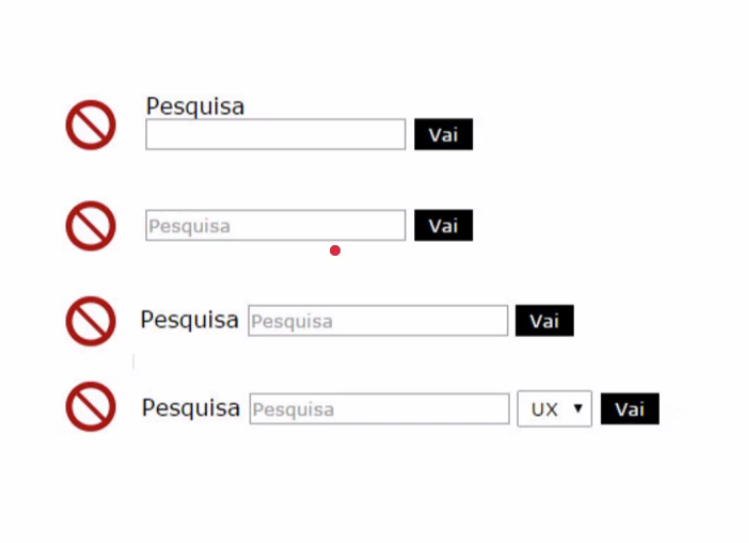

 

E exemplos **bons**:

 

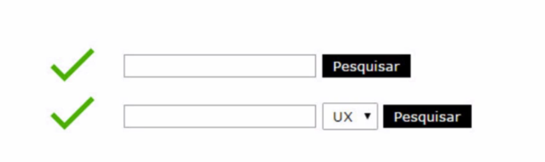

 

Então, elementos que ajudam a identificar o campo de busca é a posição (canto superior direito), tamanho grande para ser confortável para o usuário, aplicar o conceito de Affordance (ele precisa parecer um campo de busca) e o contraste cromático. Quanto mais simples, melhor.

Lembrando também que em alguns casos, não é necessário deixar o campo de busca em evidência.

E principalmente, permita-se testar as opções, vejo o que funciona e não funciona para as necessidades do negócio.

 

## Tipografia

Você perceba a diferença entre a letra A da esquerda e a da direita?

 

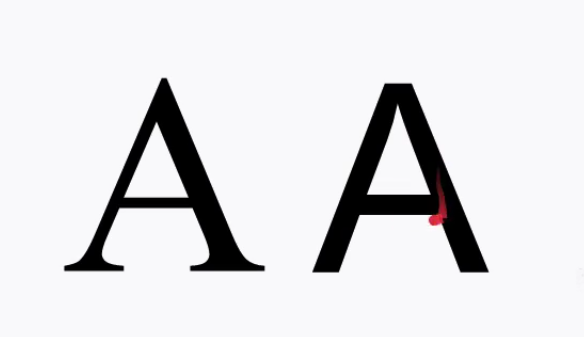

 

Observe que a letra da esquerda, na base, vemos que ela possui alguns ornamentos que recebem o nome de **serifa**.

 

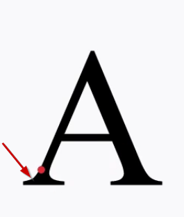

 

Os grupos de fontes que costumamos trabalhar são as serifadas e as não serifada.

 

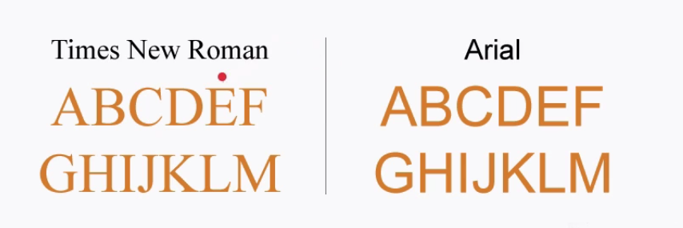

 

No exemplo, uma fonte usada foi a Times New Roman e a outra foi Arial.

E quando usamos uma fonte com ou sem serifa? Antes, existia uma regra em que **materiais impressos** usávamos fontes serifadas e em conteúdos para **mídias digitais**, fonte não serifadas. Atualmente, essa regra mudou um pouco, devido à boa resolução das telas que se aproximam dos materiais impressos.

Antes, existia uma teoria de que o fontes **não serifadas** cansavam mais os olhos dos leitores. Mas atualmente, já esta teoria não é seguida.

Uma opção é realizar testes de usabilidade para identificar qual é a mais agradável para o usuário. Se tiver uma grande quantidade de texto, experimente usar uma fonte serifada. As serifas formam uma linha entre as letras, isto teoricamente agiliza a leitura. Por isso, inclusive meios digitais como o Kindle, por exemplo, utilizam fontes padrões com serifa.

Já com textos curtos, você pode usar fontes sem serifas. Mas isso **não** é uma regra. Em UX, não confie em "balas de prata", a solução mágica que deve ser usada sempre. O ideal é você pesquisar o contexto do seu usuário e ver qual caso é melhor.

Geralmente, recomenda-se que logos não levem serifas. Mas que impressão passa um texto com serifa?

 

 

No exemplo, uma fonte usada foi a Times New Roman e a outra foi Arial.

E quando usamos uma fonte com ou sem serifa? Antes, existia uma regra em que materiais impressos usávamos fontes serifadas e em conteúdos para mídias digitais, fonte não serifadas. Atualmente, essa regra mudou um pouco, devido à boa resolução das telas que se aproximam dos materiais impressos.

Antes, existia uma teoria de que o fontes não serifadas cansavam mais os olhos dos leitores. Mas atualmente, já esta teoria não é seguida.

Uma opção é realizar testes de usabilidade para identificar qual é a mais agradável para o usuário. Se tiver uma grande quantidade de texto, experimente usar uma fonte serifada. As serifas formam uma linha entre as letras, isto teoricamente agiliza a leitura. Por isso, inclusive meios digitais como o Kindle, por exemplo, utilizam fontes padrões com serifa.

Já com textos curtos, você pode usar fontes sem serifas. Mas isso não é uma regra. Em UX, não confie em "balas de prata", a solução mágica que deve ser usada sempre. O ideal é você pesquisar o contexto do seu usuário e ver qual caso é melhor.

Geralmente, recomenda-se que logos não levem serifas. Mas que impressão passa um texto com serifa?

 

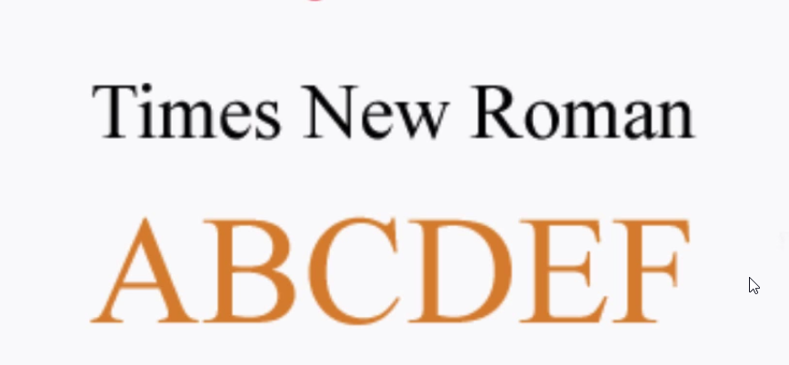

 

Enquanto a fonte Ariel parece ser mais dinâmica e moderna.

 

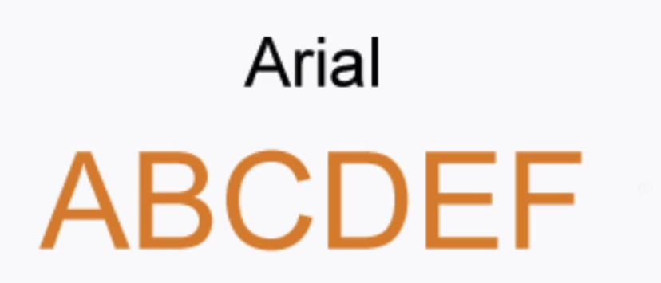

 

Essa é uma das principais diferenças entre os grupos, é a sensação que as fontes passam, este é um fator interessante quando lidamos com marcas.

O jornal [The New York Times](https://www.nytimes.com/) usa uma fonte serifada em seu logo e passa um ar bem tradicional.

 

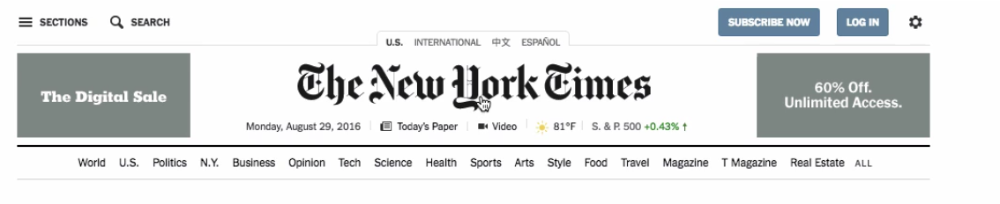

 

E não é apenas no logo. No restante do site, ele usa a fonte Times New Roman.

 

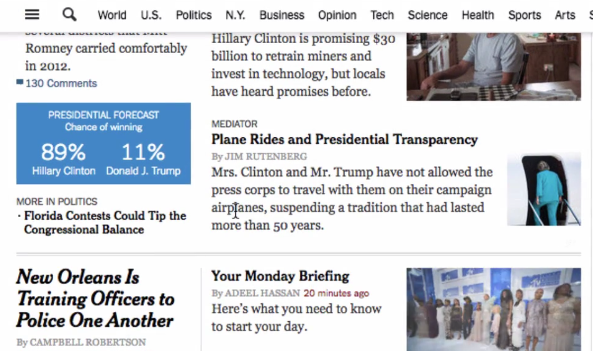

 

Eles quiseram transportar a sensação que o leitor do jornal impresso tem para o formato digital.

Já o site do Musicdot utiliza fontes sem serifa.

 

 

A proposta é passar uma imagem mais moderna e dinâmica. Observe que os texto são mais curtos também.

Vamos analisar outros exemplos. Você consegue identificar os problemas do caso abaixo?

 

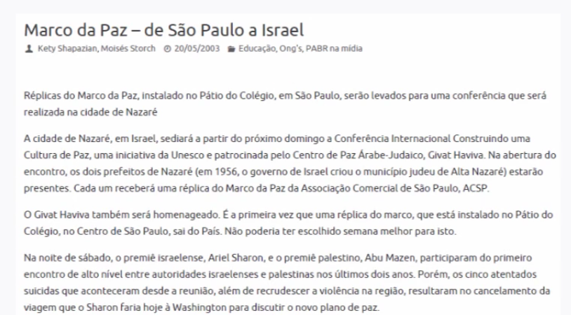

 

O texto é longo e a fonte é não serifada. Como o texto é muito longo, poderíamos adicionar **subtítulos** para dar uma quebrada no grandes blocos de texto. Isto auxilia o leitor a escanear a informação. Outro recurso é priorizar as informações mais relevante, colocando-as no início e ir afunilando para as informações menos importantes. Esta é a teoria da **pirâmide invertida**.

 

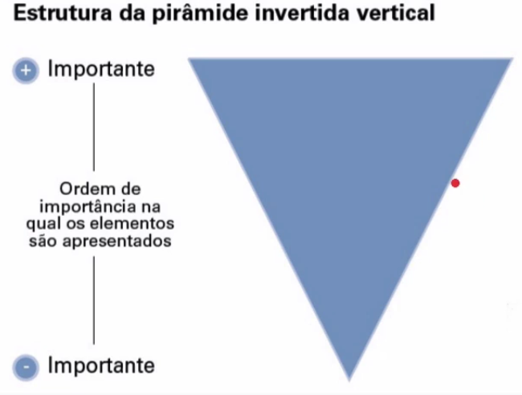

 

O objetivo é prender a atenção do usuário e oferecer a ele uma experiência boa com a leitura.

E neste segundo texto, você vê algum problema?

 

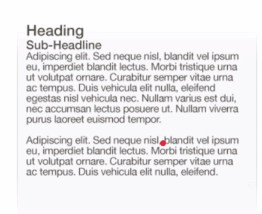

 

As letras estão muito próximas, uma solução seria aumentar o espaçamento entre as letras.

 

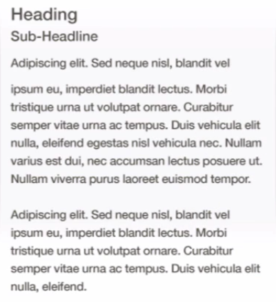

 

Você que tem conhecimentos de CSS, existe a propriedade line-height. O ideal é usar `1.2` o tamanho da fonte para o espaçamento. Então se a fonte tem `10px`, usar um espaçamento de `12px` ficará ótimo.

Falamos anteriormente sobre microtexto e vimos agora a parte de texto, com cuidados que não servem apenas para Web, mas para Mobile também.

Livro citado no vídeo:

**Como escrever para a web - Guillermo Franco**

 

## Overview do curso

Para colocar as ideias no papel, vimos que uma das ferramentas que podemos utilizar é o Crazy Eights.

 

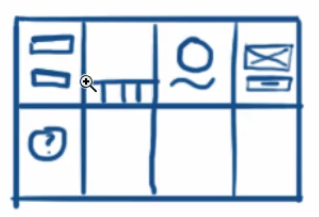

 

A ferramenta inventada pelo Google consiste em desenhar as telas em uma superfície dividida em oito partes. Você deve desenhar momentos-chave do aplicativo, ou seja, os momentos relevantes da interação do usuário. O tempo reservado para esta dinâmica é de **5 minutos** no total, isto é, **40 segundos** por tela. Depois de passar para o papel as ideias mais óbvias, deve-se repetir o processo por cerca de 15 minutos. Na segunda rodada, você já pode começar a pensar no fluxo de tela dos usuários.

Após a fase dos Crazy Eights, uma ferramenta bastante utilizada para decidir quais telas serão incluídas no aplicativo é Zen Voting. Nela, os membros da equipe podem votar utilizando etiquetas e sem fazer "boca de urna".

 

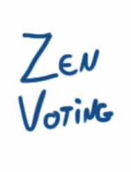

 

Conhecemos também algumas ferramentas de prototipação. As que mais nos aprofundamos foi o POP e o Marvel.

 

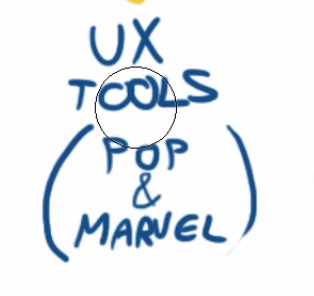

 

E se os dois aplicativos não suprirem a sua necessidade, você pode consultar o site [uxtools.co](https://uxtools.co/tools) e encontrar a ferramenta mais apropriada.

Comentamos ainda as **10 Heurísticas de Nielsen**, também conhecidas como "regras de usabilidade".

 

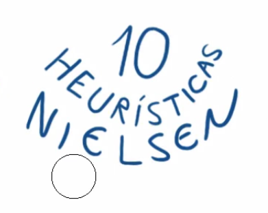

 

Resumidamente, elas contam com:

+ feedback;

+ linguagem adequada;

+ liberdade para o usuário;

+ consistência entre elementos semelhantes;

+ prevenção de erros;

+ "menos é mais", design minimalista.

Vamos ressaltar que, apesar de serem conhecidas como tal, as 10 Heurísticas de Nielsen **não são regras**, e mesmo se fossem, sempre existe a possibilidade de quebrá-las. Mas para isto é preciso conhecê-las bem.

Além das Heurísticas de Nielsen, existem ainda as Heurísticas de Krug, elaboradas pelo autor do livro "Não me faça pensar", Steve Krug.

Vimos sobre a **Lei de Fitts**, que fala sobre o tempo que o dedo do usuário levará para alcançar o alvo (target) do aplicativo.

 

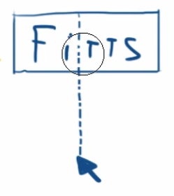

 

Quanto menos tempo o usuário levar para clicar em um botão almejado, melhor será a experiência.

Vimos também a **Lei de Hick**, que diz que quanto maior for o número de opções oferecidas para o usuário, mais tempo ele irá demorar para a execução da ação.

 

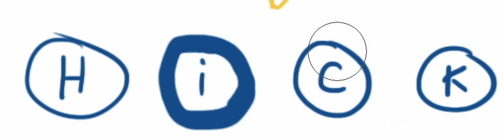

 

Falamos sobre a Thumb Zone e a importância de nos preocuparmos com o alcance dos polegares em aplicações mobile.

 

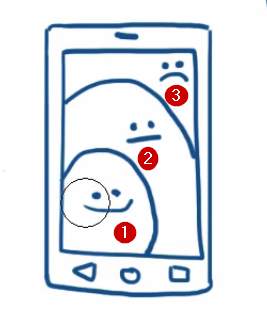

 

Vimos que as áreas cujo alcance do polegar é mais confortável, devem ser destinadas para funcionalidades que serão bastante utilizadas. Quando o usuário decide usar o celular com as duas mãos é porque ele desistiu de usar o polegar.

Outro ponto trabalhado foram as **microinterações**.

 

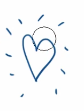

 

O Twitter, em 2015 mais ou menos, trouxe o símbolo de coração no lugar da estrela para os "likes", com intenção de chamar a atenção do usuário oferecendo algum recurso visual. Geralmente, as microinterações (ou microinteractions) são associadas à animações, justamente porque elas são boas em atrair a atenção do usuário, sendo um diferencial em relação a outras interfaces.

Vimos o conceito de **Affordance**, a propriedade de um objeto que oferece uma dica de como ela funciona. Um exemplo é um link que deixe claro que é clicável (como no caso de uma Call to Action).

 

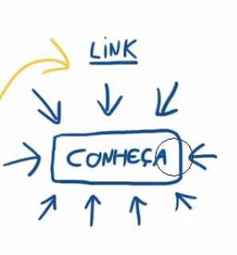

 

Abordamos o conceito de **microtexto**, que são pequenos textos que apelam para as esferas emocionais de quem lê, com um caráter de **informação**, e não de enrolação.

 

 

E sobre **campos de busca**, vimos que quanto mais simples ele for, melhor. No site da consultoria de Nielsen, a Nielsen Norman Group, o campo de busca tem apenas as características necessárias para que seja identificada pelo usuário.

 

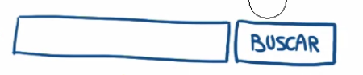

 

O último assunto abordado foi Tipografia. Vimos a importância de saber com qual grupo de fonte iremos trabalhar: serifada ou não serifada.

 

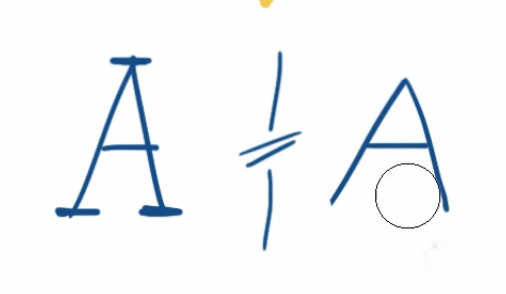

 

Estas foram as etapas básicas vistas no estudo.

 

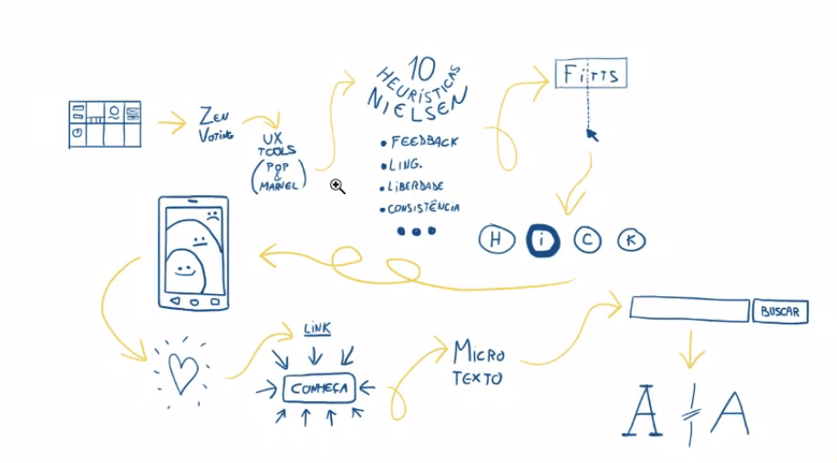

 

 

## [Nota] Affordance

Quais objetos que você conhece e interage no seu dia-a-dia que possuem um *affordance* interessante?

Um exemplo são maçanetas, pois a forma que elas são construídas dão ideia de como funcionam.

**Affordance é a propriedade de um objeto que permite identificar intuitivamente sua função.**

+ um link deve parecer um link (azul? Underline?)
+ um botão deve parecer um botão (bom espaço interno? Hover com background diferente?)
+ um mouse deve parecer um mouse (como que as pessoas usam um mouse?)

Ainda se tratando da maçaneta, pense em como resolver aquele problema de portas que não devem ser puxadas, mas sim **empurradas**. Como resolver isso?

Don Norman cita esse exemplo e muitos outros no livro **Design of Everyday Things**.

 

## [Exercício] Guiando o usuário

Das opções abaixo, o que poderia ser feito para guiar o usuário para que conheça os cursos do Galandra?

 

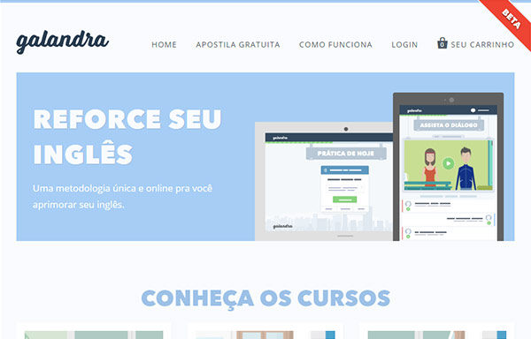

 

- [x] A ) CTA com cor contrastante 
    Outra forma usada atualmente é o "ghost button", um botão com fundo transparente que possui somente texto e borda

- [x] B ) Diminuir o destaque na faixa "beta" 
    A contraste cromática da faixa está chamando muito atenção, poderíamos fazer uma melhoraria e direcionar a atenção do usuário colocando a cor em um CTA

- [ ] C ) Começar a tocar um jingle sem intervenção do usuário 
    Por favor, não faça isso, nunca

- [ ] D ) Banner animado 
    Acredito que já passamos dessa fase na internet

 

Uma sugestão de melhoria seria colocar um CTA chamativo para induzir o usuário a clicar, para que ele conheça os cursos e **talvez** convertê-lo (fazer com que ele cumpra com nosso objetivo principal: comprar um curso) com mais facilidade.

Sugestão:

 

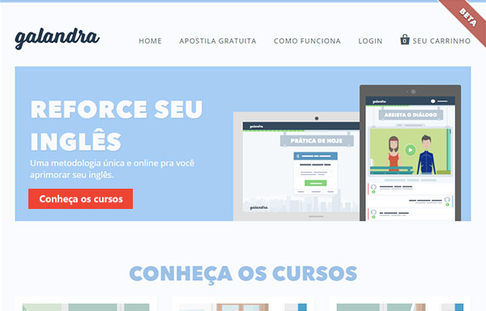

 

## [Nota] Grupos de tipos

Existem mais grupos tipográficos que apenas os relacionados à presença (ou à ausência) de serifas.

Há também outros diversos grupos, como por exemplo:

+ Mono-espaçadas (todos os tipos com a mesma largura);
+ Fantasias (normalmente usadas em logotipos);
+ Cursivas (que simulam a chamada "letra de mão", ou letra manuscrita).

Alguns sites para se adquirir fontes, legalmente:

Grátis (para uso pessoal): [Google Fonts](https://fonts.google.com/), [Abduzeedo Friday Fresh Free Fronts](https://abduzeedo.com/tags/ffff), [Dafont](https://www.dafont.com/pt/), [Befonts](https://befonts.com/)

Pagos: Adobe Typekit, Font Squirrel

Se conhecer algum outro site bacana, sugira uma correção aqui nesse texto e adicione-o na lista.

