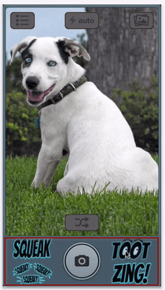

## O que significa o termo UX?

O termo se refere a "User Experience", que traduzido para o português significa **"Experiência do Usuário"**. É comum encontrá-lo em descrições de vagas de emprego. É um conceito recorrente, que todo designer deve conhecer.

> User eXperience - Experiência de Usuário 

Mas, vamos nos aprofundar no quê queremos dizer com **experiência**. Quando pensamos nessa palavra, associamos seu significado a:

+ **Vivência:** o que foi vivido;

+ **Acontecimento:** viagens, eventos;

+ **Conhecimento:** domínio sobre o uso de alguma ferramenta ou em algum cargo;

+ **Sentimento:** referência a um acontecimento e ao que você sentiu no momento.

Você provavelmente pensou em palavras parecidas. Mesmo não sendo sinônimos de experiência, estão interligadas conceitualmente, como demonstrado acima.

 

### E o termo "usuário"?

 

Vinculamos "usuário" a uma pessoa que **usa** determinado produto ou serviço. No entanto, também podemos pensar em um **sistema**. É possível desenvolver um programa que funciona como uma ponte entre dois sistemas com linguagens diferentes, comunicação entre Java e dotNET, por exemplo.

Até um **pet** pode ser considerado um usuário. Mas antes que você fique chocado com a ideia de que um animalzinho possa ser considerado um usuário, vamos conhecer o caso do aplicativo "Pose a Pet".

Para conseguir tirar boas fotos de animais de estimação, precisamos chamar a atenção deles. Pensando nisso, o aplicativo oferece opções de sons, que são emitidos próximo ao botão da câmera para que a foto possa ser batida, assim que tiver a atenção do mascote.

Somos nós que o usamos o aplicativo, mas o foco da experiência de usuário está no animal de estimação. Portanto, de certa forma, ele também é um usuário. Ainda para os mascotes, existe uma capinha de celular que vem acompanhada de um suporte para bolinha, que fica próximo à câmera e também atrai a atenção do animal. Independente do usuário, quando pensamos na solução de um problema, estamos pensando na experiência.

É importante ter conhecimento da experiência do usuário, pois se o seu site não tiver um conteúdo de qualidade, quem irá acessá-lo? Se o seu aplicativo não fornece alguma solução para o problema do usuário, ou se ele tem uma roupagem diferente, mas não oferece nenhuma funcionalidade nova, por que o usuário baixará a sua app? Por isso, pequenas e grandes empresas começaram a fazer perguntas como: quem vai usar o site ou aplicativo? Pensando no usuário, vem a importância da UX.

Imagine um usuário que acessa o seu site e-commerce e não consegue encontrar os produtos nos quais está interessado. Ou seja, a pessoa está disposta a comprar os seus produtos, mas você não disponibilizou os itens de uma forma que facilite o fluxo de navegação do usuário na efetuação da compra.

Pensar em UX envolve o atendimento às expectativas do usuário e o fornecimento de um serviço ou produto de qualidade, preferencialmente, de uma forma simples e direta. Dessa forma, espera-se que o usuário consiga finalizar a ação que veio realizar no seu aplicativo, com satisfação.

## Case Clear RX

**ClearRX** é um sistema de embalagem para quem usa medicamentos com receita, que torna mais fácil as pessoas saberem como tomar seus remédios. Ele é um exemplo de como UX pode influenciar toda uma estratégia de negócio.

Após sua avó ter tomado o remédio de seu avô por engano, a estudante de design Deborah Adler decidiu desenvolver esse sistema como sua tese de mestrado.

Suas características:

+ contém a prescrição e posologia no frasco para que não haja enganos;

+ o nome do medicamento está escrito não só na face lateral como no topo;

+ na outra das faces há importantes informações pessoais e relativas ao medicamento;

+ tem faces planas para que a informação seja lida com mais facilidade;

+ se, mesmo assim, ainda for difícil perceber o que está escrito, o frasco vem com um "cartão-lupa" para ler o texto;

+ existem anéis de diferentes cores para que, no caso de existir mais que um frasco em casa, se possa diferenciar que frasco pertence a quem;

+ o frasco para líquidos está adaptado à entrada de seringas orais para uma medição mais fácil.

Depois de concluir sua tese, Deborah levou a ideia à Target, e juntos criaram o sistema completo.

Soluções simples podem mudar a vida do seu usuário.
