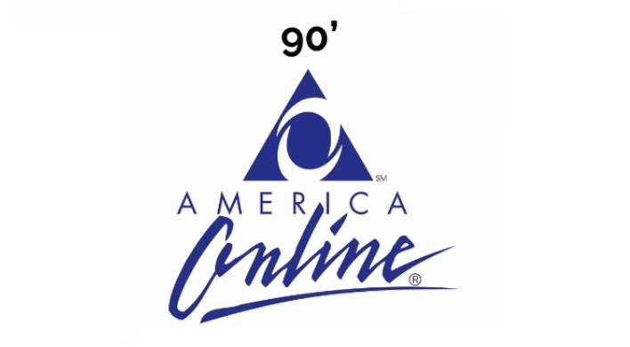
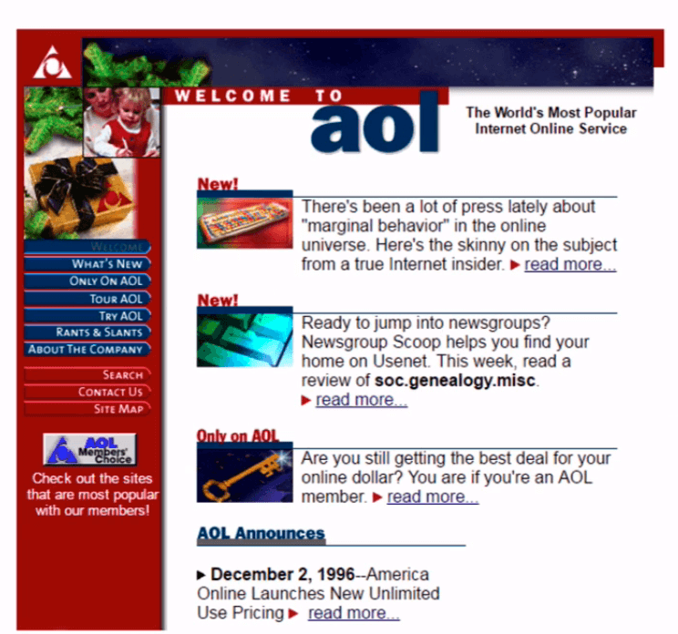

## História rápida

Anteriormente, percebemos que fazer uma análise do usuário, apesar de trabalhoso, é possível. Devemos focar em características interessantes para o produto. Por exemplo, uma aplicação sobre transporte público deve ter foco na localização de quem utiliza. Para criar uma app relacionada à viagens, podemos levar em consideração o perfil psicológico do usuário.

Sabemos que o termo "UX" foi criado por Don Norman, em 1993. A seguir, conheceremos um pouco mais sobre a **história** de "User Experience" e como surgiram as ideias sobre a usabilidade.

Na década de 1980, ocorreu a grande explosão dos jogos, incluindo o lançamento do famoso [Atari](https://www.atari.com/).

Nesta época, para que um jogo fosse comercializado, bastava ele **funcionar**. Não havia preocupação em identificar o interesse do usuário pelo jogo. No entanto, vivemos novos tempos e os programadores que usam o argumento "se está funcionando, está bom" precisaram se adaptar às mudanças.

Na década de 1990, surgiram várias empresas com o boom da web. Uma delas foi a América Online, que enviava um CD com um grande número de horas de internet discada para a casa das pessoas.

Neste período, as pessoas começaram a entender o potencial da internet e procuraram formas de ganhar dinheiro na rede. Com isso, surgia uma nova preocupação. Além de funcionar, os produtos precisavam ser rentáveis.

Se analisarmos o antigo site da América Online, notaremos que não havia preocupação com a usabilidade. O site funcionava e dava retorno financeiro e, na época, isso era o mais importante.

Vários sites surgiram e muitos começaram a ganhar dinheiro com a internet. Com o surgimento da concorrência entre eles, os desenvolvedores também passaram a procurar formas de tornar as páginas esteticamente mais agradáveis e de fácil utilização para os usuários. Assim, no início dos anos 2000, a usabilidade passou a ser um diferencial.

Passou a ser perceptível nos sites, as melhorias que facilitavam o sistema — considerando os padrões da época — para o uso dos usuários. Veja as mudanças no site da América Online:

A partir destas ideias, surgiu o "guru" da usabilidade, [Jakob Nielsen](https://pt.wikipedia.org/wiki/Jakob_Nielsen), um cientista da Computação que fundou a [NN Group](https://www.nngroup.com/). Trata-se de uma consultoria focada em fornecer soluções e melhorar produtos, inclusive apontando os produtos com poucas chances de sucesso no mercado.

Desde o início da década de 1990, a NN Group coleta dados sobre experiência do usuário, fazendo descobertas que são utilizadas até hoje. A partir destes estudos, Jakob Nielsen criou regras que ficaram conhecidas como as [10 Heurísticas de Nielsen](https://blog.caelum.com.br/10-heuristicas-de-nielsen-uma-formula-pra-evitar-erros-basicos-de-usabilidade/). É um assunto que vale a pena ser aprofundado por quem possui interesse em usabilidade.

> Nesse contexto, fica a pergunta: **UX é igual a usabilidade**?

A resposta é **não**. A usabilidade está dentro de UX, mas não são sinônimos. O termo UX se refere à Experiência de Usuário, enquanto a usabilidade se refere a facilidade de uso. Se o foco está em **como** o usuário se sente ao usar o site, falamos da **experiência**. Agora, se nos preocupamos com a **facilidade ou dificuldade** de manipulação, falamos de **usabilidade**.

Outro engano seria concluir que **usuário** é o mesmo que **cliente**. Dependendo do caso, o usuário pode ser também o cliente. Por exemplo, o usuário do caixa eletrônico, geralmente, também é cliente do banco. Mas, quando pensamos em um site, o usuário é a pessoa que irá acessá-lo; enquanto o cliente será o responsável pelo aporte para o projeto, ou seja, quem encomendou o site.

Essa diferenciação pode ser utilizada como base, caso precise **defender** o **usuário**, quando o cliente tiver uma visão mais voltada para os interesses do negócio. É necessário se adequar ao projeto, pensando sempre no usuário final.

 

## Usabilidade

Usabilidade é **facilidade de uso**.

Se algo é simples o suficiente para que o usuário não precise ler um manual ou perguntar como funciona, temos uma usabilidade consideravelmente boa.

 

## Usuário e cliente

**Usuário** é quem vai de fato usar seu site/aplicativo. Já o **cliente** é quem te banca, seja seu chefe ou seu investidor anjo.

 

## Guru da usabilidade

Na época que o termo usabilidade começou a ficar conhecido, um senhor dinamarquês chamado Jakob Nielsen começou a ficar bem famoso. Inclusive, mais tarde, seria chamado de Guru da Usabilidade.

[**Jakob Nielsen**](https://pt.wikipedia.org/wiki/Jakob_Nielsen) trabalhou na Sun na década de 90, e desde essa época fez diversos estudos sobre como deixar sites mais fáceis de serem usados.

PhD em HCI (Human Computer Interface), é bastante respeitado na área e publicou diversos [livros](https://www.nngroup.com/books/) como os recomendadíssimos Usabilidade na Web e Usabilidade Móvel.

