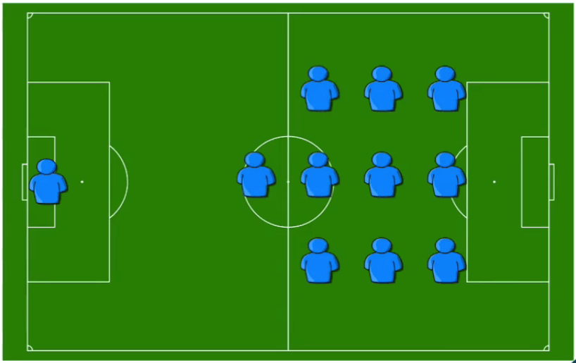
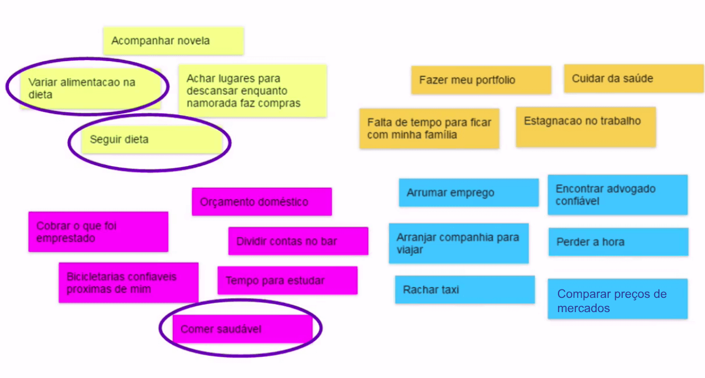
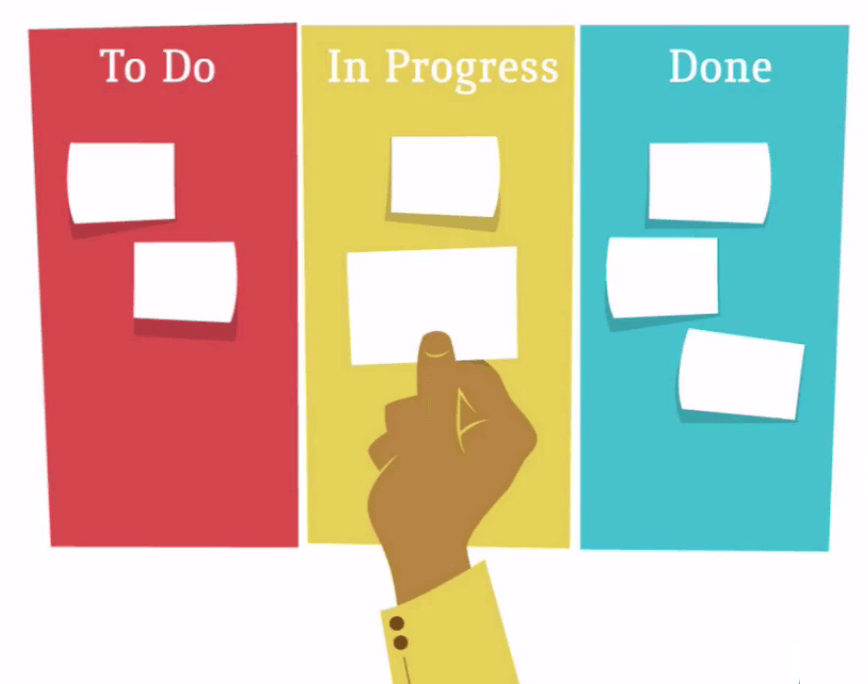
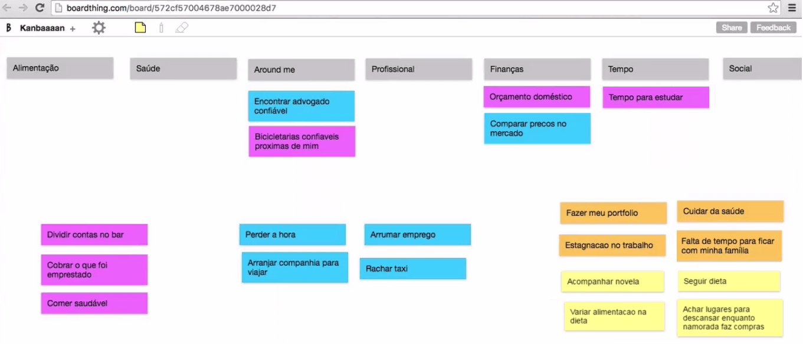

# Time e Kanban

Percebemos como é interessante ter opiniões diferentes, em vez de focar somente no nosso próprio ponto de vista, quando procuramos a solução de um problema. Por exemplo, ao criar uma aplicação, para que ela tenha sucesso, é importante pensar se ela será útil para a resolução do problema de diversos usuários ou se será útil somente para quem criou.

A seguir, trabalharemos a ideia de **time**, no qual os membros se ajudam. Suponhamos que você trabalha como desenvolvedor Java e se junta a três desenvolvedores especializados na mesma área. Após reunir os membros para pensar, por cinco minutos, em problemas que podem ser solucionados por meio de uma aplicação mobile, o resultado foi o seguinte:

 

 

Mas, o quê acontece quando quem desenvolve conversa somente com quem desenvolve? Ou designers que conversam apenas com designers? Ou quando um time é formado **com membros da mesma especialidade**? Quando falamos em time, quais imagens mentais surgem para você? Para muitas pessoas, poderão surgir palavras como equipe, união, objetivos em comum, entre outras. Algumas pensarão, também, em um time de futebol.

 

 

No meu time de futebol ideal, há um goleiro e o restante dos jogadores são atacantes. Mas o que aconteceria se o time inteiro estivesse no ataque? Faltariam jogadores na defesa. Um time realmente **ideal** deve considerar **múltiplas especialidades**. O que nós chamamos de time **heterogêneo**.

Um time que tenha, por exemplo, um designer e um desenvolvedor, é mais interessante e melhor sucedido do que um formado apenas por designers, ou apenas por desenvolvedores. Pessoas com diferentes conhecimentos conseguem fazer melhores estimativas do tempo que será gasto no projeto, considerando as diversas etapas que o compõem.

Voltando ao nosso quadro (board, em inglês) de problemas, podemos perceber que os cartões ficaram desorganizados. Existem temas semelhantes, que poderiam ser resumidos em um único cartão.

 

 

Para reordenar o quadro, podemos sinalizar de forma visual, utilizando **Kanban**. O termo, de origem japonesa, significa “cartão” ou “sinalização”. Na UX, existem diversas formas de utilizá-lo.

 

 

A organização com Kanban consiste na divisão das tarefas em três colunas: **Fazer**(To Do), **Fazendo** (In Progress) e **Feito** (Done). Esse método é bastante intuitivo e ficou muito famoso por ser utilizado em empresas de desenvolvimento de software, que usam conceitos de Métodos Ágeis. Basta escrever um tarefa no cartão e movê-lo de uma coluna para outra.

Para ressaltar a importância da comunicação visual, segue um teste para adivinhar o significado das imagens, em **dois segundos**:

 

 

Não precisamos compreender o que está escrito nas placas para saber o significado delas, no caso "Pare". Compreendemos o que as placas querem nos comunicar, visualmente. Nós podemos considerar que as sinalizações de trânsito são um tipo de Kanban. O semáforo é outro exemplo de kanban e de comunicação visual.

 

 

Aprendemos os significados e compreendemos o que deve ser feito, de acordo com as cores das luzes. Na Caelum, também é utilizado um kanban. A organização dos professores que ministram cursos e os períodos em que as aulas acontecem é feita com post-it em uma **lousa**.

 

 

Mesmo que você não consiga compreendê-lo rapidamente, após uma breve explicação, é possível entender as informações expostas. Agora, vamos voltar aos problemas que estão desordenados no quadro. Iremos reorganizá-los no formato mais conhecido de Kanban, criando categorias para os temas, como:

+ Alimentação;
+ Saúde;
+ Around me;
+ Profissional;
+ Finanças;
+ Tempo;
+ Social.

O objetivo é que o quadro fique compreensível para qualquer pessoa. Para isto, ordenaremos os cartões de acordo com cada categoria.

 

 

Essa é a utilidade do Kanban. Pegar uma série de informações desorganizadas e organizá-las visualmente, de forma que sejam rapidamente compreendidas pelo time e por outras pessoas.
