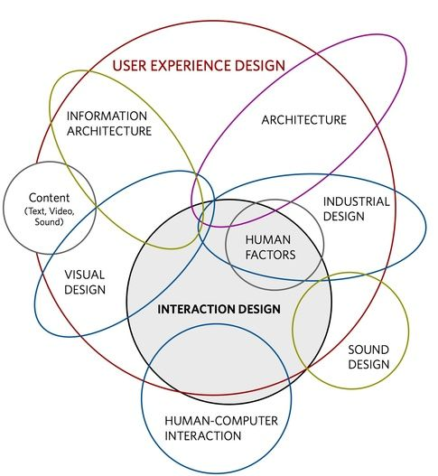
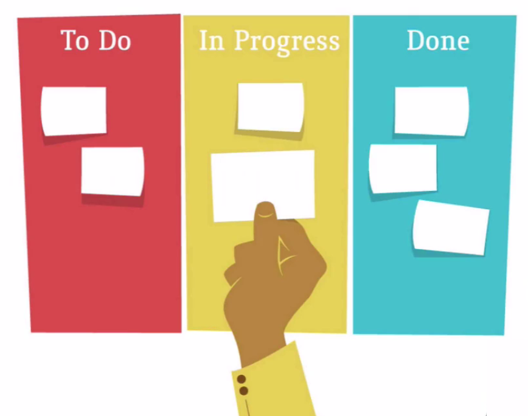

## Resumo

Conhecemos o que é UX, comentamos como surgiu o termo User Experience e apresentamos nomes importantes na área, como Don Norman e Jakob Nielsen.

Esclarecemos os significados de palavras bastante usadas no curso: **experiência e usuário**. Comentamos sobre as áreas englobadas pela UX e vimos o exemplo do infográfico de Dan Saffer.

 

 

Mostramos também que precisamos desenvolver as **soluções pensando no usuário** e ir além da nossa experiência individual. Analisamos os desafios de analisar os usuários e quais características devemos levar em conta — considerando pontos como o perfil psicológico, o ambiente, o humor, entre outros. É trabalhoso, mas é possível.

Comentamos sobre a **história** da UX e como ela começou a se tornar uma preocupação das empresas. Ela surgiu como um "tempero a mais", um diferencial entre o grande número de sites que surgiram a partir do meio no da década de 1990 e teve sua explosão nos anos seguintes. Percebeu-se que os sites mais lucrativos eram os mais fáceis de serem usados. Surge aí o termo **"usabilidade"**.

Mas comentamos que UX é **diferente** de usabilidade. A UX é um contexto maior que inclui outras áreas. Vimos também que o usuário é diferente de **cliente**. Este último se refere a quem irá bancar o seu projeto, como seu chefe ou o investidor. Já o usuário será quem, efetivamente, utilizará o seu produto.

O tema **Brainstorming** foi visto no curso e entendemos como as técnicas do Gamestorming** tornavam as reuniões mais produtivas, ao transformá-las em jogos, considerando:

+ o tempo;
+ o ambiente;
+ objetivo.

Mas, antes de pensar em soluções, temos que pensar em problemas, necessidades que fazem parte do cotidiano das pessoas. E depois, tentar encontrar uma forma de solucioná-las. Vimos como criar um quadro de problemas e como organizá-lo por categorias. O ideal é que você trabalhe com um time e diferentes pessoas possam opinar.

Falamos sobre **Kanban** e como organizar visualmente as informações, para que elas sejam compreendidas por todos. O Kanban mais conhecido é o modelo dividido em colunas, mas existem outros.

 

 

Exploramos técnicas de organização, como o **Card Sorting**, e como apresentar o resultado final para outras pessoas, criando os **entregáveis**. Conhecemos alguns dos tipos usados na UX: Wireframe, Protótipo, Sitemap, Storyboards e outros.

Vimos algumas **ferramentas** utilizadas para fazer os entregáveis, como o Photoshop, o Sketch, Adobe XD e o Axure. Lembrando da recomendação de não subestimar o uso do lápis e papel.

Falamos sobre metodologias para a escolhas dos problemas que serão trabalhados pelo time, que deve ser o responsável pela decisão. Para decidir, podemos usar o **Zen Voting**, técnica que torna as decisões mais democráticas e as escolhas mais justas.

Vimos também que quando temos um problema, começamos a ter várias ideias, mas como saber quais são proveitosas e quais não são. Assim, finalizamos a parte introdutória em UX
